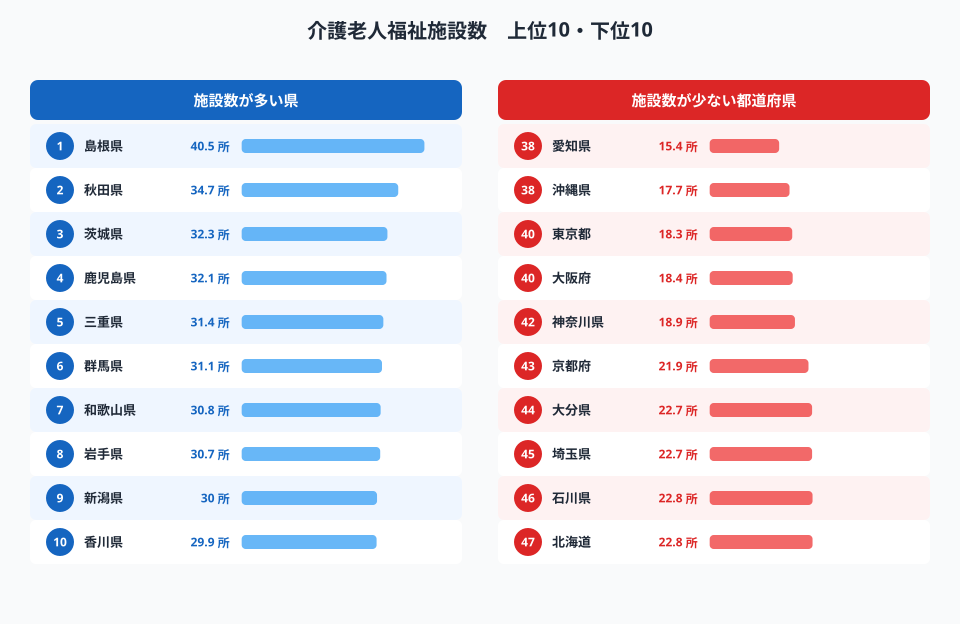
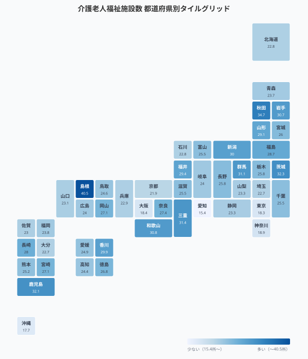
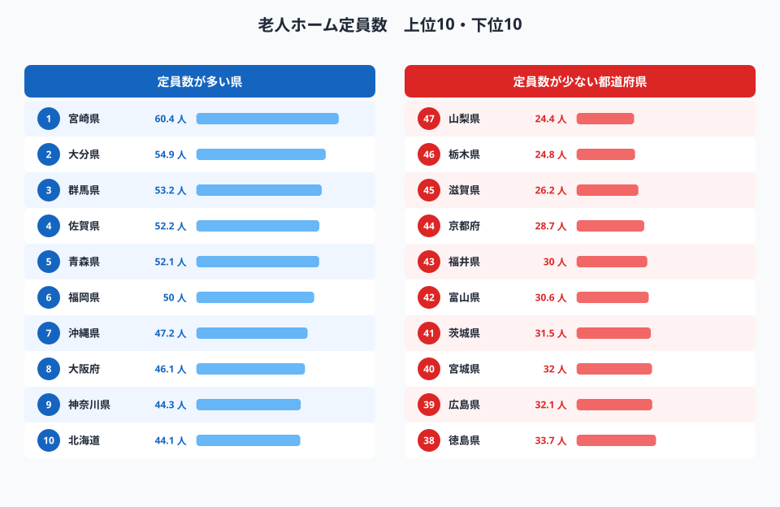
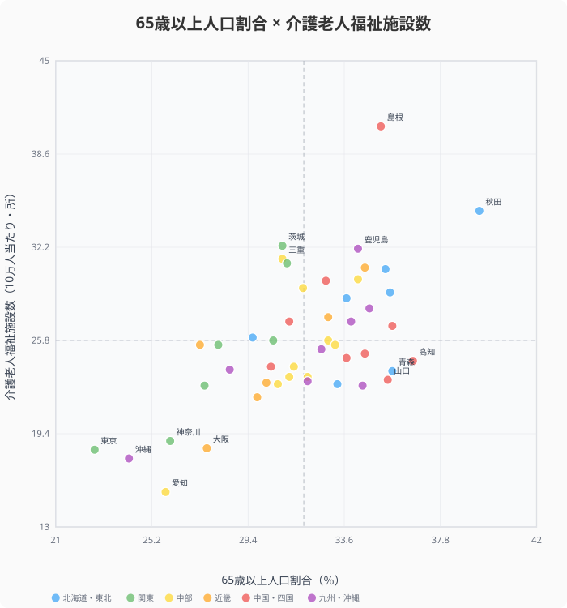
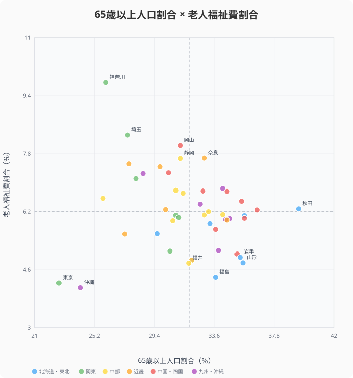
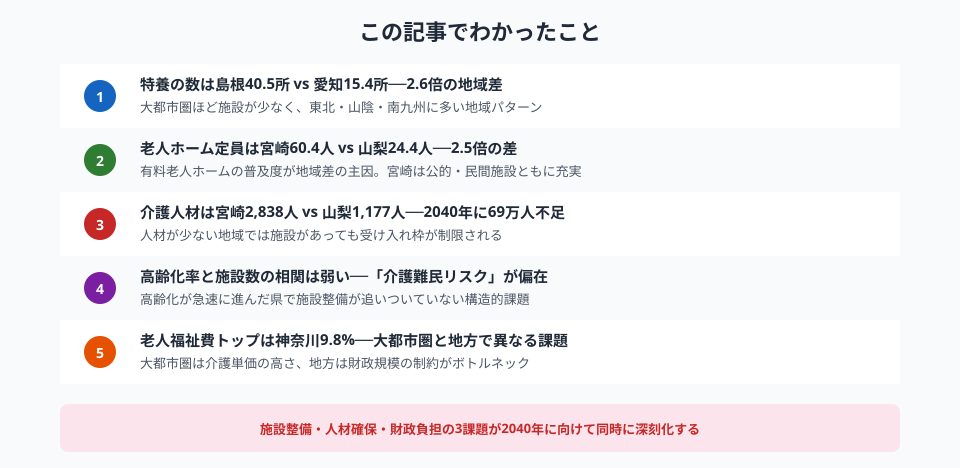

「2025年問題」──団塊の世代が75歳以上の後期高齢者となり、日本の高齢化は新たなフェーズに入りました。介護を必要とする人は今後も増え続ける一方で、施設の整備や人材の確保は追いついているのでしょうか？

この記事では、e-Stat（政府統計の総合窓口）のデータを用いて、47都道府県の**介護インフラ充実度**を4つの指標で比較します。施設数・定員数・従事者数に加え、高齢化率との相関から「介護難民リスク」の高い県まで、データで読み解いていきます。

## 介護老人福祉施設数ランキング──「特養」は足りているか？

介護老人福祉施設（特別養護老人ホーム＝特養）は、在宅での生活が困難になった要介護者を受け入れる公的施設です。入所費用が比較的安価なため入所希望者が多く、「特養待ち」が社会問題になっています。

> [!NOTE]
> 本データは65歳以上人口10万人あたりの施設数・定員・従事者数です。高齢者の絶対数が多い大都市圏と、高齢化率が高い地方圏とでは「数が多い＝余裕がある」とは限りません。絶対数ではなく高齢者人口当たりの比率で見ることで、地域間の整備水準の比較が可能になります。

65歳以上の高齢者10万人あたりの施設数で、都道府県を比較してみましょう。

<data-source url="https://www.e-stat.go.jp/dbview?sid=0000010210" label="e-Stat 社会生活統計指標"></data-source>

使用指標: [介護老人福祉施設数（65歳以上人口10万人当たり）](/ranking/nursing-welfare-facility-count-per-100k-65plus)

1位の島根県（40.5所）と最下位の愛知県（15.4所）では、**2.6倍の開き**があります。上位には島根県、秋田県、茨城県、鹿児島県といった地方圏の県が並び、下位には東京都（18.3所）、大阪府（18.4所）、愛知県（15.4所）と三大都市圏が集中しています。

次に、全国の分布を地図で俯瞰してみましょう。

<data-source url="https://www.e-stat.go.jp/dbview?sid=0000010210" label="e-Stat 社会生活統計指標"></data-source>

地図から明確な**地域パターン**が見えてきます。東北・山陰・南九州に施設数の多い県が集中し、太平洋ベルト上の大都市圏は総じて少ない。人口が集中する大都市圏では高齢者の絶対数が多く、施設整備が追いついていないことが示唆されます。

一方、地方で施設が多い背景には、高齢化が早くから進んだことで施設整備が先行したという側面もあります。数が多い＝余裕がある、とは限らず、入所待機者数との関係も重要です。

<source-link href="/ranking/nursing-welfare-facility-count-per-100k-65plus">介護老人福祉施設数ランキングをもっと見る</source-link>

## 老人ホーム定員数と有料老人ホーム──公的施設と民間施設の地域差

特養だけでは介護インフラの全体像は見えません。有料老人ホームやグループホームなど民間施設を含めた**老人ホーム全体の定員数**を見てみましょう。

<data-source url="https://www.e-stat.go.jp/dbview?sid=0000010210" label="e-Stat 社会生活統計指標"></data-source>

使用指標: [老人ホーム定員数（65歳以上人口千人当たり）](/ranking/nursing-home-capacity-per-1000-65plus)

1位の宮崎県（60.4人）と最下位の山梨県（24.4人）では**2.5倍の差**があります。宮崎県・大分県・群馬県・佐賀県が上位に並ぶ一方、下位には山梨県（24.4人）、栃木県（24.8人）、滋賀県（26.2人）と、意外にも地方圏の県も含まれています。

ここで注目すべきは、特養ランキング（前セクション）と老人ホーム定員数ランキングでは**顔ぶれが異なる**点です。これは有料老人ホームの普及度が地域によって大きく違うためです。

データを確認すると、有料老人ホーム数（65歳以上人口10万人当たり）は1位の宮崎県（140.7所）に対し、最下位の滋賀県（12.4所）と**11倍以上の格差**があります。宮崎県は公的施設・民間施設の双方が充実している一方、滋賀県は公的施設・民間施設ともに少ないことがわかります。

定員数が多い＝充実している、と単純に評価することはできませんが、選択肢の幅という意味では、定員数の少ない県の高齢者はより厳しい状況に置かれていると言えるでしょう。

<ad-slot></ad-slot>

## 介護人材の地域格差──「人手がいない」県はどこか？

施設があっても、そこで働く人がいなければ介護は成り立ちません。老人ホーム従事者数（65歳以上人口10万人当たり）で、介護人材の充実度を比較します。

<data-source url="https://www.e-stat.go.jp/dbview?sid=0000010210" label="e-Stat 社会生活統計指標"></data-source>

使用指標: [老人ホーム従事者数（65歳以上人口10万人当たり）](/ranking/nursing-home-staff-per-100k-65plus)

1位の宮崎県（2,838人）と最下位の山梨県（1,177人）では**2.4倍の差**。全国平均は1,724人で、大都市圏を含む多くの県がこの水準を下回っています。

介護人材不足は全国共通の課題ですが、その深刻さには地域差があります。従事者数の多い県は、施設定員数も多い傾向があり、介護インフラ全体が充実しています。逆に、従事者数の少ない県では施設があっても受け入れ枠が制限され、結果として「入所待ち」が長期化するリスクがあります。

厚生労働省の推計では、2040年には全国で約69万人の介護人材が不足するとされています。すでに人材が少ない地域では、さらに深刻な状況になる可能性があります。

> [!WARNING]
> 2040年・69万人不足という数字は厚生労働省の将来推計（2023年公表）に基づく予測値です。介護サービス需要の変化・業務効率化・外国人労働者の活用等によって実際の不足数は変動します。都道府県別の不足数については各都道府県の介護保険事業支援計画に詳細が示されています。

## 高齢化率×介護施設数──「介護難民リスク」を可視化する

ここからは2つのデータを掛け合わせた分析です。65歳以上人口割合（高齢化率）と介護老人福祉施設数の関係を散布図で見てみましょう。

<data-source url="https://www.e-stat.go.jp/dbview?sid=0000010210" label="e-Stat 社会生活統計指標 / 社会・人口統計体系"></data-source>

使用指標: [65歳以上人口割合](/ranking/ratio-65-plus) × [介護老人福祉施設数（65歳以上人口10万人当たり）](/ranking/nursing-welfare-facility-count-per-100k-65plus)

<source-link href="/correlation?x=ratio-65-plus&y=nursing-welfare-facility-count-per-100k-65plus">高齢化率×介護施設数の相関をもっと見る</source-link>

この散布図で最も注目すべきは、**右下の象限**（高齢化率が高いのに施設数が少ない）に位置する都道府県です。これらの県は「介護難民」を生み出すリスクが相対的に高いと言えます。

一方、左上の象限（高齢化率が比較的低く施設が多い）に位置する茨城県や群馬県のような県は、現時点では余裕がある状態です。ただし、高齢化は全国で進行するため、今後の需要増に対する備えが重要になります。

### 興味深いのは「相関が弱い」こと

散布図を見ると、高齢化率と施設数には明確な正の相関が見られません。これは、施設整備が高齢化の進行度合いに比例して行われているわけではないことを示しています。つまり、高齢化が急速に進んだ県では、施設整備が追いつかなかった可能性があるのです。

<ad-slot></ad-slot>

## 老人福祉費の自治体負担──財政から見える「持続可能性」

最後に、視点を変えて自治体の財政面から介護を見てみましょう。都道府県の歳出に占める老人福祉費の割合と高齢化率の関係です。

<data-source url="https://www.e-stat.go.jp/dbview?sid=0000010204" label="e-Stat 社会生活統計指標"></data-source>

使用指標: [65歳以上人口割合](/ranking/ratio-65-plus) × [老人福祉費割合（都道府県財政）](/ranking/elderly-welfare-expenditure-ratio-pref-finance)

<source-link href="/correlation?x=ratio-65-plus&y=elderly-welfare-expenditure-ratio-pref-finance">高齢化率×老人福祉費割合の相関をもっと見る</source-link>

興味深い点がいくつかあります。

まず、老人福祉費割合のトップは**神奈川県**（9.8%）と**埼玉県**（8.3%）という首都圏の県です。高齢化率はそこまで高くないのに福祉費の割合が大きいのは、高齢者の絶対数が多く、かつ介護サービスの単価（人件費・土地代）が高い大都市圏ならではの事情と考えられます。

一方、高齢化率が全国1位の秋田県（39.5%）は老人福祉費割合が5.6%と、全国平均（6.2%）に近い水準にとどまっています。これは自治体の財政規模が小さいため、高齢化率が高くても福祉に回せる予算自体が限られているという、構造的な問題を示しているかもしれません。

高齢化がさらに進めば、自治体の福祉費負担はますます増大します。国と地方の財政負担のあり方は、介護インフラの持続可能性を考える上で避けて通れない課題です。

## まとめ：データが語る介護インフラの現在地

介護施設数・定員・人材・財政の4つの切り口で、47都道府県の介護インフラを分析しました。

高齢化がさらに進む2040年に向けて、施設整備・人材確保・財政負担の3つの課題が同時に深刻化します。大都市圏では介護単価の高さが、地方では財政規模の制約が、それぞれ異なるかたちで介護インフラの持続可能性を脅かしています。

## データ出典

本記事のデータはe-Stat（政府統計の総合窓口）を基に作成しています。
