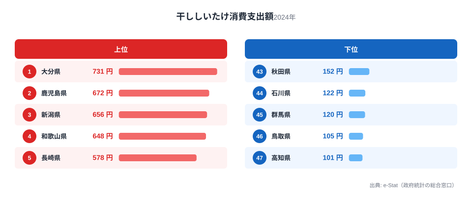
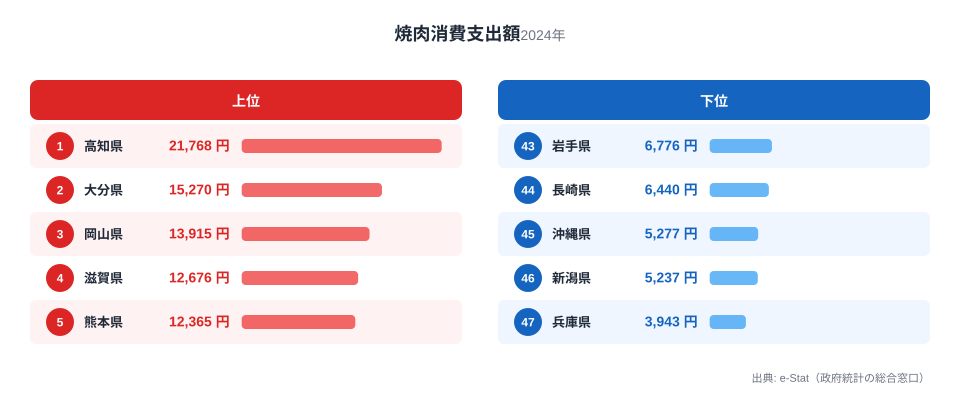
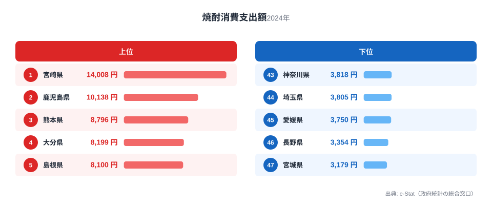
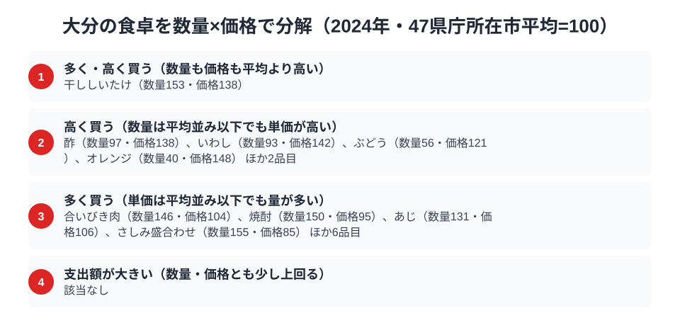

大分県の食卓を数字で覗くと、まず目に飛び込んでくるのが干ししいたけです。総務省の家計調査（品目別）によると、大分県庁所在市の二人以上世帯が1年間に干ししいたけへ使う金額は731円で、全国47都道府県のうち堂々の1位です。乾物という地味な品目で全国トップに立つ県は珍しく、これは偶然ではありません。

さらに目を引くのが焼肉です。焼肉の支出額は全国2位の15,270円で、1位の[高知県](/areas/39000)の21,768円に次ぐ水準となっており、全国平均を大きく上回ります。そして麦焼酎の本場らしく、焼酎の支出額も全国4位（8,199円）につけています。乾物・炭火焼き・蒸留酒という一見バラバラな3品目をつなぐと、大分の食卓には「豊後の山と海の恵みを、じっくり乾かし、じっくり焼き、じっくり醸す」という一本の軸が浮かび上がります。この記事では、家計調査の実データから大分の食文化を3つの角度で読み解きます。

> [!NOTE]
> この記事のデータは総務省統計局「家計調査（品目別）」2024年、都道府県庁所在市（大分県は大分市）の二人以上世帯の年間支出額です。世帯単位の平均支出であり、県民1人あたりの消費量そのものではありません。

## 干ししいたけ — 全国1位731円、乾物大国の底力

<source-link href="/ranking/dried-shiitake-consumption-expenditure">干ししいたけ消費支出額ランキングをもっと見る</source-link>

大分県は干ししいたけ消費支出額で全国1位（731円）です。2位の[鹿児島県](/areas/46000)は672円、3位の[新潟県](/areas/15000)は656円で、大分県はこの2県を抑えての首位です。最下位の[高知県](/areas/39000)は全国47位の101円で、大分県とは実に7.2倍の開きがあります。

この背景には、大分県が乾しいたけ生産量で全国トップクラスを誇る産地であるという事実があります。県の中山間部、とくに大分市・佐伯市・豊後大野市などの原木林ではクヌギやコナラを使ったほだ木栽培が盛んで、冬場の乾燥した空気と寒暖差が良質な干ししいたけを育てます。産地であることは「消費量が多い」ことと直結しませんが、生産地の近くでは流通量が多く価格も手頃になりやすいうえ、椎茸を煮しめや雑煮の具として日常的に使う調理文化が根付いています。地元で採れたものを地元で食べる、というシンプルな構図が支出額の首位を支えていると考えられます。

## 焼肉 — 全国2位15,270円、豊後牛が支える炭火文化

<source-link href="/ranking/yakiniku-consumption-expenditure">焼肉消費支出額ランキングをもっと見る</source-link>

焼肉の支出額で大分県は全国2位（15,270円）です。首位の[高知県](/areas/39000)は全国1位の21,768円には及びませんが、3位の[岡山県](/areas/33000)の13,915円を上回る水準で、全国平均を大きく引き離しています。最下位の[兵庫県](/areas/28000)は全国47位の3,943円で、大分県とは3.9倍の差がついています。

大分県には「豊後牛」というブランド和牛があり、県内では焼肉店や精肉店で地元産牛肉が手に入りやすい環境が整っています。また大分市を中心に焼肉店の店舗密度が高いとされ、家族での外食や自宅での焼肉パーティーが日常的な食習慣として定着していることがうかがえます。九州は全体的に焼肉文化が強い地域ですが、大分はその中でも突出した支出額を記録しており、干ししいたけと同様に「地元の食材を、地元の調理法で楽しむ」志向が焼肉にも表れていると読み取れます。

## 焼酎 — 全国4位8,199円、麦焼酎発祥地のプライド

<source-link href="/ranking/shochu-consumption-expenditure">焼酎消費支出額ランキングをもっと見る</source-link>

焼酎の支出額は大分県が全国4位（8,199円）です。首位の[宮崎県](/areas/45000)は全国1位の14,008円、2位の[鹿児島県](/areas/46000)は10,138円、3位の[熊本県](/areas/43000)は8,796円と九州勢が上位を独占するなかで、大分もそれに続く一角を占めています。最下位の[宮城県](/areas/04000)は全国47位の3,179円で、大分県とは2.6倍の差です。

大分県は麦焼酎発祥の地として知られ、日田市の三隈川流域や県内各地に歴史ある蒸留所が点在します。米や芋の焼酎が主流の他の九州県とは異なり、大分は麦焼酎という独自のポジションを持ちながらも、九州全体の「焼酎を日常的に飲む」文化圏にしっかり組み込まれています。焼肉に合わせて焼酎を飲む、という食卓の組み合わせも想像に難くありません。

> [!WARNING]
> この記事の数値は「支出額」であり「消費量」ではないため、単価が高い商品を少量買う県と、単価が安い商品を多く買う県を同列に比較できない点に注意してください。また、大分名産として知られる「かぼす」や「関あじ・関さば」は家計調査の個別品目として集計されていないため、この記事では扱っていません。

## 大分の食卓を貫くもの

干ししいたけ・焼肉・焼酎という3つの品目に共通するのは、「素材をそのまま活かす、手をかけた食文化」という軸です。乾物としてじっくり乾燥させた椎茸、炭火でじっくり焼く豊後牛、じっくり蒸留した麦焼酎——いずれも時間をかけて素材の味を引き出す調理・加工法が根底にあります。派手さはなくとも、地元の恵みを丁寧に扱う姿勢が、家計調査という淡々とした数字の中にも滲み出ています。

同じように県固有の食文化を数字で読み解いた記事として、麦焼酎文化圏の隣県[熊本の食卓](/blog/kumamoto-food-culture)や、焼酎首位県[宮崎の食卓](/blog/miyazaki-food-culture)もあわせてご覧ください。九州各県の違いを比べると、大分の「乾物と炭火」という個性がより際立ちます。

> [!TIP]
> 大分の3品目のうち、干ししいたけだけが唯一の全国1位です。焼肉・焼酎は僅差の2位・4位にとどまっており、「首位は乾物、準位は肉と酒」という並びは、大分の食文化が派手な嗜好品より地道な保存食・加工食品に強みを持つことを示唆しています。乾しいたけの生産地としての厚みが、消費行動にもそのまま表れている点が興味深い発見です。

## 数量×価格で分解する大分市の食卓

<source-link href="/ranking/dried-shiitake-consumption-quantity">干ししいたけ消費量ランキングをもっと見る</source-link>

大分市の支出額が高い理由が「単価が高い」からなのか、それとも「たくさん買う」からなのかを、家計調査の数量データで分解してみます。品目ごとに47都道府県庁所在市の平均を100とした指数に置き換えると、大分市の対象125品目のうち、数量指数・価格指数がともに120を超える「多く・高く買う」に分類されるのは干ししいたけだけです。干ししいたけ消費量は57gで数量指数は153、支出額は731円で支出指数は211、そこから算出した価格指数は138です。大分市は47都市平均より5割以上多く干ししいたけを買っているだけでなく、1グラムあたりの単価も平均より4割近く高く支払っていることになります。[仮説] 「産地に近いから安く手に入る」という単純な図式ではなく、冬場に採れる肉厚な上級グレードを選んで買う傾向がある可能性がありますが、購入している等級までは本データからは確認できません。

一方、焼酎は「多く買うが単価は平均並み」の区分に入ります。焼酎の消費量は11,440mlで数量指数は150と干ししいたけと同水準に多いものの、支出額から算出した価格指数は95で47都市平均をわずかに下回ります。焼酎の支出額が全国4位に入っている主因は、高い銘柄を選んでいることではなく、単価を抑えたまま量を多く飲んでいることにあると分かります。合いびき肉は数量指数146・価格指数104、あじは数量指数131・価格指数106で、いずれも同じ「多く買う」区分に入っており、大分市の食卓は総じて量が支出額を押し上げる品目が目立ちます。逆に価格指数が120を超え数量指数は120未満の「高く買う」区分に入るのは酢やいわしなど6品目にとどまり、少量をこだわって買う消費スタイルは限られた品目にしか見られません。

> [!NOTE]
> ここでの指数は47都道府県庁所在市（二人以上世帯）の年間データを単純平均し100とした相対値で、総務省が公表する全国平均そのものではありません。価格指数も「支出額÷数量」から算出した単価の相対値のため、品種やブランドの違いによる価格差を含みます。対象は大分市の年間データです。

> [!TIP]
> 干ししいたけは大分県の特産品だけに「地元産だから安い」と思われがちですが、指数で見ると量も単価も平均より高く、割安さよりも上質さを重視して買われている可能性を示しています。一方の焼酎は量は多いが単価は平均並みという逆の構図で、同じ大分の食卓でも品目によって消費スタイルが一様ではないことが分かります。

## まとめ

- 干ししいたけ消費支出額は大分県が全国1位（731円）、最下位の高知県は101円で7.2倍差
- 焼肉消費支出額は大分県が全国2位（15,270円）、1位の高知県の21,768円に次ぐ水準
- 焼酎消費支出額は大分県が全国4位（8,199円）、九州勢が上位を占める中での一角
- 3品目に共通するのは「素材をじっくり手をかけて活かす」大分の食文化の軸
- [経済カテゴリ一覧](/category/economy)では大分以外の都道府県の家計調査データも比較できる

## データ出典

総務省統計局「家計調査（品目別）」2024年、都道府県庁所在市（二人以上世帯）。e-Stat（政府統計の総合窓口）経由で取得。
