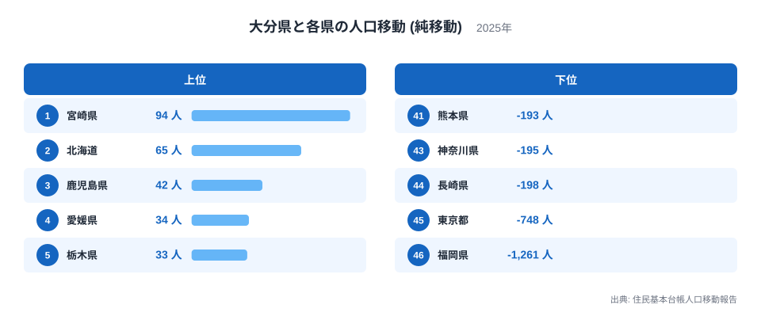
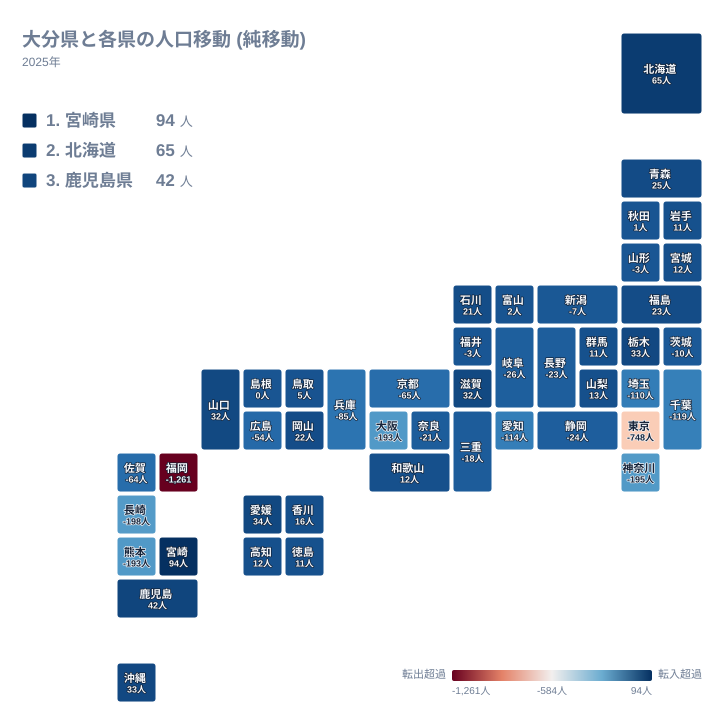
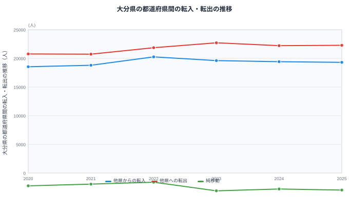

大分県から人が出ていく先というと、多くの人がまず東京都を思い浮かべるかもしれません。しかし2025年の住民基本台帳人口移動報告を都道府県別の純移動でみると、大分県からもっとも多くの人が流出している相手は東京都ではなく、隣接する福岡県です。福岡県への転出超過は1,261人にのぼり、東京都の748人を上回っています。

一方で大分県は、隣接県の宮崎県からは94人の転入超過を得ており、四国の4県からもそろって人を集めています。同じ「隣接県」でありながら、福岡県と宮崎県では大分県との関係がまったく逆向きです。この記事では、大分県がどこへ人を送り出し、どこから人を集めているのかを、相手県ごとの純移動の向きから読み解きます。詳しい県のデータは[大分県のデータ](/areas/44000)にまとまっています。

## 大分県からもっとも人が出ていく先はどこか

> [!NOTE]
> ここでいう「純移動」は、大分県とその相手県との間で、大分県への転入者数から大分県からの転出者数を引いた差を指します。プラスの値は大分県がその県との関係で人を得ていることを、マイナスの値は大分県がその県へ人を送り出していることを意味します。数字の大きさは転入・転出そのものの規模ではなく、あくまで差し引きの結果である点に注意してください。

<source-link href="/ranking/moving-in-excess-rate">転入超過率ランキング</source-link>

上の図は、大分県と各都道府県との間の純移動のうち、転入超過が大きい上位5県と転出超過が大きい下位5県を示したものです。転入超過がもっとも大きいのは1位の宮崎県で、94人です。2位は北海道で65人、3位は鹿児島県で42人、4位は愛媛県で34人、5位は栃木県で33人となっています。北海道のように大分県から遠く離れた道県が上位に入る一方、隣県の宮崎県や同じ九州の鹿児島県も転入超過の上位に名を連ねています。

反対に転出超過がもっとも大きいのは46位の福岡県で、1,261人です。次に大きいのは45位の東京都で、748人です。以下、44位の長崎県が198人、43位の神奈川県が195人、42位の熊本県が193人と続きます。上位5県と下位5県だけを見ても、大分県が近い県からも遠い県からも人を集める一方で、特定の大都市圏へは大きく人を送り出していることが分かります。大分県における転入超過率も含めた詳しい年次データは、転入超過率ランキングのページで確認できます。

## 純移動を地理でみると、九州の中でも方向が分かれている

地図で全体像を確認すると、大分県との人の移動には地方ごとにはっきりとした向きの違いがあることが分かります。四国4県（愛媛県・香川県・高知県・徳島県）はいずれも大分県への転入超過となっており、愛媛県が34人、香川県が16人、高知県が12人、徳島県が11人です。瀬戸内海を挟んで大分県と結びつきの強い地域だといえます。

中国地方でも、鳥取県が5人、岡山県が22人、山口県が32人の転入超過となっており、島根県は0人で転入と転出がちょうど釣り合っています。中国地方のなかで唯一転出超過となっているのは広島県で、54人です。

大分県が属する九州の内部でも、方向は一枚岩ではありません。鹿児島県は42人の転入超過ですが、佐賀県は64人、長崎県は198人の転出超過となっています。地理的に近い県どうしでも、大分県との人の流れは同じ向きにそろっているわけではありません。人口に関する他の指標もあわせて確認したい場合は、[人口カテゴリの統計一覧](/category/population)を参照してください。

## 東京圏よりも隣接県への転出が上回る大分県の実像

大分県ととくに人の移動が多いのは、東京圏の4都県と、隣接する3県です。東京圏をみると、東京都は748人、神奈川県は195人、埼玉県は110人、千葉県は119人と、いずれも大分県からの転出超過になっています。[仮説] 進学や就職を機に東京圏へ移る人が多いことが背景にあると考えられますが、住民基本台帳の集計だけでは移動の理由までは分かりません。

これに対して、隣接する福岡県、熊本県、宮崎県の関係は一様ではありません。福岡県は1,261人の転出超過で、46県のなかでもっとも大きな転出超過先です。熊本県は193人の転出超過で42位となっており、41位の大阪府と同じ水準です。ところが宮崎県だけは94人の転入超過で、大分県が九州のなかでもっとも人を集めている相手県になっています。

つまり、大分県から見て最大の転出超過先も最大の転入超過先も、ともに隣接する九州の県のなかにあります。東京都のような遠方の大都市よりも隣県の福岡県への転出のほうが規模が大きいという点は、純移動の数字だけを見ていると見落としやすい構造です。

> [!WARNING]
> 住民基本台帳人口移動報告の移動者数は、住民票を移した人だけを数えています。進学先の寮に住民票を移さないまま暮らしている学生や、単身赴任で住民票を元の住所に残したまま働いている人などは、この統計には反映されません。純移動の向きだけで、実際の人の行き来の全体量を判断しないよう注意してください。

## 大分県の転入・転出はどう推移してきたか

上のグラフは、大分県における他県からの転入者数、他県への転出者数、そしてその差にあたる純移動の推移を示しています。転入者数は2020年に18,533人、2021年に18,796人と緩やかに増え、2022年には20,258人まで伸びました。その後は2023年に19,604人、2024年に19,420人、2025年に19,302人と、2022年をピークにゆるやかな減少が続いています。

転出者数は2020年の20,766人から2021年の20,731人までほぼ横ばいでしたが、2022年に21,859人へ増え、2023年には22,712人まで達しました。2024年は22,210人、2025年は22,274人と、2023年以降は高い水準のまま推移しています。

純移動は2020年が2,233人の転出超過、2021年が1,935人の転出超過で、2022年には1,601人の転出超過までいったん縮小しました。しかし2023年には3,108人の転出超過へと急に拡大し、2024年は2,790人、2025年は2,972人の転出超過となっています。転入が減る一方で転出が高い水準のまま続いていることが、2022年以降の転出超過の拡大につながっています。[仮説] ただしこの要因を特定するには、年齢構成や移動理由など、住民基本台帳以外のデータとあわせた検証が必要です。人口動態を県ごとに横断してみたい場合は、[人口動態のテーマ](/themes/population-dynamics)にまとまっています。

> [!TIP]
> 純移動の数字だけを見ると小さな変化に見えても、転入・転出の推移のグラフをあわせて確認すると、その何倍もの人数が転入・転出を繰り返していることが分かります。差し引きの数字の裏にある転入・転出それぞれの規模もあわせて読むと、大分県の人口移動の実態がつかみやすくなります。

## まとめ

- もっとも転出超過が大きい相手は福岡県で、1,261人です。
- もっとも転入超過が大きい相手は宮崎県で、94人です。
- 福岡県と宮崎県はどちらも大分県の隣接県であり、隣接県だからといって同じ向きに動いているわけではありません。
- 四国4県（愛媛県・香川県・高知県・徳島県）はいずれも大分県への転入超過です。
- 東京都・神奈川県・埼玉県・千葉県の東京圏4都県は、いずれも大分県からの転出超過です。
- 純移動でみると2023年は3,108人の転出超過で、2020年から2025年のなかでもっとも大きな転出超過でした。
- 県ごとの人口動態を横断して見る場合は、[人口動態のテーマ](/themes/population-dynamics)もあわせてご覧ください。

## データ出典

- 総務省 住民基本台帳人口移動報告（2025年）
