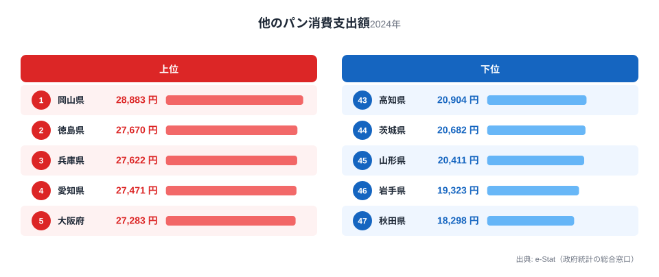
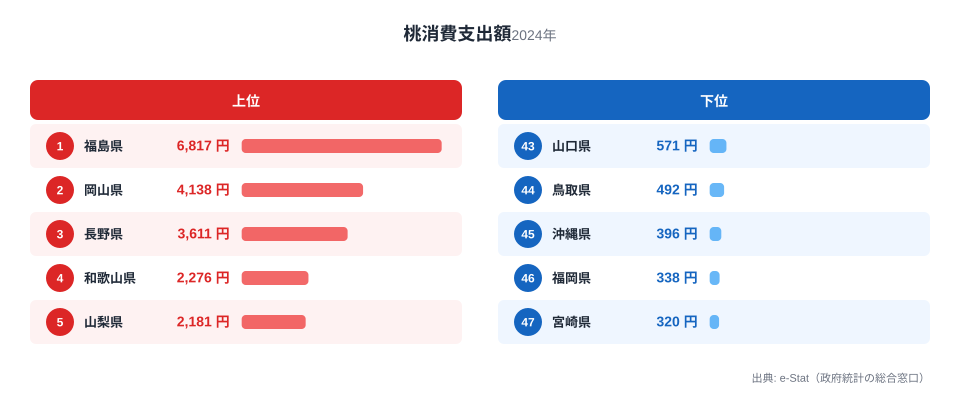
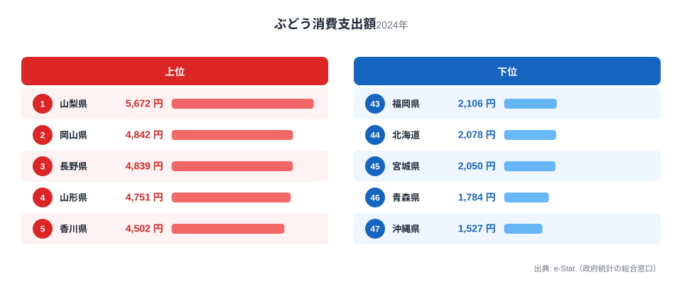
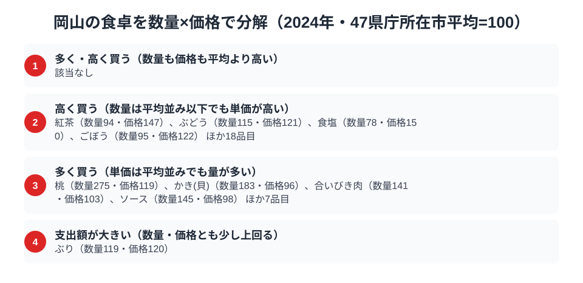

「うどん県」香川、「粉もん」の大阪ほど岡山の食文化は語られません。しかし総務省「家計調査」の品目別データを見ると、岡山県はその他パン消費支出額が全国1位という、意外な素顔を持っています。しかも桃・ぶどうという名産フルーツも、消費支出額でともに全国2位につけているのです。

岡山と聞いて多くの人が思い浮かべるのは「白桃」や「マスカット」といった果物のイメージでしょう。ところが家計調査を掘り下げると、岡山の食卓を実際に支えているのはパン食の突出した強さでした。この記事では、パン・桃・ぶどうという3品目のデータから、岡山県民の食卓に流れる一本の軸を探ります。

> [!NOTE]
> 本記事のデータは総務省統計局「家計調査（品目別）」2024年の**都道府県庁所在市・二人以上世帯**の1世帯あたり年間支出額です。岡山県の数値は岡山市の世帯が対象で、県内の県北・県南など地域差までは反映されません。

## パン消費支出額 — 全国1位28,883円、パン食文化の中心地

<source-link href="/ranking/other-bread-consumption-expenditure">他のパン消費支出額ランキングをもっと見る</source-link>

岡山県のその他パン消費支出額は28,883円で全国1位です。2位の徳島県は27,670円、3位の兵庫県は27,622円で、瀬戸内エリアが軒並み上位に並ぶ中でも岡山が頭ひとつ抜けています。「その他パン」は食パン以外の菓子パン・調理パン・惣菜パンを指す区分で、コンビニや街のパン屋で日常的に消費されるカテゴリです。

なぜ岡山がパン王国なのでしょうか。背景には瀬戸内海式気候による小麦栽培の歴史と、岡山市・倉敷市を中心に古くから製パン業が根付いてきた地域性があります。岡山はもともと小麦の産地であり、うどん・そうめんといった麺文化とともにパン食も発達してきました。最下位は秋田県で全国47位・18,298円となっており、岡山とは1.6倍の開きがあり、東北の米食中心の食文化とは対照的です。

## 桃消費支出額 — 全国2位4,138円、名産フルーツの実力

<source-link href="/ranking/peach-consumption-expenditure">桃消費支出額ランキングをもっと見る</source-link>

岡山の名産といえば「白桃」です。桃消費支出額は4,138円で全国2位に位置します。首位の福島県は全国1位・6,817円で岡山はこれに及びませんが、3位の長野県は全国3位・3,611円で岡山がこれを上回っており、桃の名産地として確かな存在感を示しています。最下位は宮崎県で全国47位・320円となっており、岡山とは実に13倍近い差があり、産地とそれ以外の地域で消費量が大きく分かれる品目です。

岡山が桃の名産地になった背景には、日照時間が長く雨が少ない瀬戸内式気候が桃の栽培に適していたことがあります。江戸時代から桃の栽培が始まり、明治期に「白桃」の品種改良が進んだことで、岡山は全国有数の桃産地としての地位を確立しました。地元での消費が多いのは、贈答用だけでなく家庭用としても桃が日常的に食卓に上る文化があるためと考えられます。

## ぶどう消費支出額 — 全国2位4,842円、マスカットの産地

<source-link href="/ranking/grape-consumption-expenditure">ぶどう消費支出額ランキングをもっと見る</source-link>

もうひとつの名産フルーツ、ぶどうも岡山県は4,842円で全国2位です。首位の山梨県は全国1位・5,672円で、岡山はこれに次ぐ水準にあります。3位の長野県は全国3位・4,839円で、岡山とはわずか3円差という僅差で並んでいます。最下位は沖縄県で全国47位・1,527円となっており、岡山とは約3.2倍の開きがあります。

岡山のぶどうといえば「マスカット・オブ・アレキサンドリア」に代表される高級品種の産地として知られています。桃と同じく瀬戸内式気候の恩恵を受け、明治時代から温室栽培による高品質なぶどう生産が発展してきました。桃とぶどうがともに全国2位という結果は、岡山が「フルーツ王国」を自称するだけの実力を、家計調査という生活実感のデータでも裏付けている形です。

> [!WARNING]
> 家計調査の消費支出額はあくまで世帯が実際に「購入した」金額であり、贈答品として県外へ送られた分や、自家消費・観光客が現地で消費した分は含まれません。桃・ぶどうの生産量ランキングでは岡山がさらに上位に来る可能性がありますが、本記事は購入者側の支出額に基づくデータです。

## 岡山の食卓を貫くもの

パン・桃・ぶどうという3品目に共通するのは、いずれも瀬戸内式気候という土地の条件が育んだ食文化だという点です。日照時間が長く温暖少雨な気候は、小麦の栽培とパン食文化の土壌を作り、同時に桃・ぶどうという糖度の高い果物の名産地としての地位も築きました。米どころの東北勢が下位に沈むパン消費と、名産フルーツの上位という、一見別々に見える2つの強みが、実は同じ気候風土から生まれている点が岡山の食卓の面白さです。

[福島県](/blog/fukushima-food-culture)も桃の消費支出額で全国1位を誇りますが、あちらは「フルーツライン」と呼ばれる果樹地帯で産地と消費地が一致していることが桃の消費を支えている一方、岡山は瀬戸内式気候による安定した高品質生産という別の背景を持っています。名産フルーツ大国が東西に分かれて存在する構図も、日本の食文化の地域差を映す好例といえるでしょう。

> [!TIP]
> 岡山のパン消費が全国1位という事実は、うどん県として知られる隣県・香川の存在によって見えにくくなっていました。同じ瀬戸内の小麦文化圏でも、香川はうどんに、岡山はパンに発展した点は、県境を挟んだ食文化の分岐として興味深いデータです。

## 数量×価格で分解する岡山市の食卓

<source-link href="/ranking/peach-consumption-quantity">桃消費量ランキングをもっと見る</source-link>

「支出額の順位」は、数量と単価という2つの要素が掛け合わさって生まれる結果です。同じ支出額1位でも、たくさん買っているから多いのか、単価が高いから多いのかでは、地域が持つ食文化の姿はまったく違って見えます。そこでここまで見てきたパン・桃・ぶどうの支出額を、家計調査の消費量データと突き合わせ、支出額を数量×単価に分解してみます。岡山市を含む47都道府県庁所在市の1世帯あたり平均を100とした指数を品目ごとに算出し、数量指数と価格指数がともに平均を上回る品目、単価の高さだけが目立つ品目、購入量の多さだけが目立つ品目、支出額そのものが平均をやや上回る品目の4区分に分けて岡山市の位置を確かめました。その結果、対象となった食料125品目のうち、数量も単価もともに平均を上回る品目はひとつもなく、単価の高さが目立つ品目が22、購入量の多さが目立つ品目が11、支出額そのものが際立つ品目が1つという内訳になりました。つまり岡山の食卓は、量で支出額を稼ぐ品目と単価で支出額を稼ぐ品目がはっきり分かれているのです。この見方でパン・桃・ぶどうを見直すと、それぞれの支出額が全国上位になった理由がまったく違うことが見えてきます。

全国1位だったパンは、数量指数122・価格指数100とほぼ平均並みの単価にとどまり、量を多く買っていることが支出額を押し上げています。なお「他のパン」は家計調査の分類上「他の〜」という残余品目にあたるため、単純な多く買う品目の内訳（11品目）には数えられていませんが、支出額28,883円は残余品目を含めた「多く買う」区分13品目のなかでも最大で、量の多さが支出額を強く押し上げている実態がうかがえます。対照的に桃消費量は数量指数275と全品目のなかで突出して高く、価格指数は119と平均をやや上回るものの、高単価と判定する基準（120）には届かない水準にとどまります。桃の支出額が全国上位になったのも、単価の高さではなく購入量の多さが主な理由といえます。同じ「多く買う」区分の上位には、かき(貝)（数量指数183）や合いびき肉（数量指数141）、料理に使うソース（数量指数145）も並んでおり、地元で日常的に量を消費する食材の層が岡山の食卓にあることがうかがえます。パンも桃も、瀬戸内の産地に近く年間を通じて手に入りやすい食材だからこそ、特別な日ではなく日々の食卓に量として登場しているのではないでしょうか。支出額の順位だけを見ていては、この「量で買っている」という実態には気づけません。

一方でぶどうは様相が異なります。数量指数は115と平均をやや上回る程度にとどまるのに対し、価格指数は121と平均を明確に上回ります。ぶどうの支出額が全国上位になったのは、量ではなく単価の高さによって支えられているのです。マスカット・オブ・アレキサンドリアのような高級品種を選んで買う家庭が多いことが、平均並みの購入量でも単価を押し上げていると考えられます。同じ「高く買う」区分には紅茶（価格指数147）や食塩（価格指数150）、ごぼう（価格指数122）も入っており、量ではなく品質・品種・輸送コストの違いが単価に表れる品目が全体で22にのぼります。桃とぶどうはともに支出額の全国順位が2位という近い結果でありながら、その中身は量で稼ぐ品目と単価で稼ぐ品目にはっきり分かれているわけです。パンと桃が「量の文化」、ぶどうが「単価の文化」という対比は、同じ岡山県の食卓の中でも、品目によって支出額の生まれ方がまったく違うことを示しています。岡山が「フルーツ王国」を自称するとき、桃とぶどうでは異なる理由でその看板を支えているのです。

> [!TIP]
> 支出額の順位だけを見ると、パン・桃・ぶどうはどれも「よく買われている」という同じ結論に見えます。しかし数量指数と価格指数に分解すると、パンと桃は量、ぶどうは単価という別々の理由で支出額を押し上げていることが分かります。

> [!NOTE]
> この分解の基準は家計調査の全国値ではなく、47都道府県庁所在市の単純平均を100とした指数です。価格指数は支出額÷数量から算出した相対値のため、同じ品目でも購入する銘柄・品種・グレードの違いも含んだ数値になります。対象は2024年・二人以上世帯の岡山市データで、他の品目と同様に県全体ではなく岡山市の消費傾向を示しています。

## まとめ

- その他パン消費支出額は岡山県が28,883円で全国1位、最下位の秋田県は18,298円で1.6倍差
- 桃消費支出額は岡山県が4,138円で全国2位、首位の福島県は6,817円
- ぶどう消費支出額は岡山県が4,842円で全国2位、3位長野県4,839円とはわずか3円差
- 瀬戸内式気候の温暖少雨な環境が、パン食文化と2つの名産フルーツの両方を育んでいる

3品目とも[経済カテゴリ一覧](/category/economy)に含まれる家計調査データで、県ごとの食文化の違いを数値で確かめられます。岡山県の統計をさらに詳しく見たい場合は[岡山県の地域プロフィール](/areas/33000)もあわせてご覧ください。

## データ出典

総務省統計局「家計調査（品目別）」2024年、都道府県庁所在市・二人以上世帯。e-Stat（政府統計の総合窓口）経由で取得。
