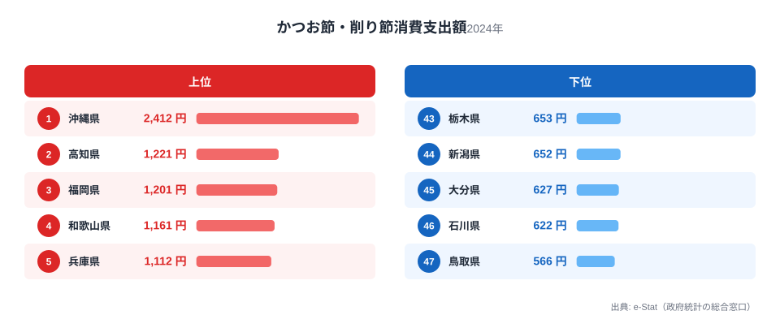
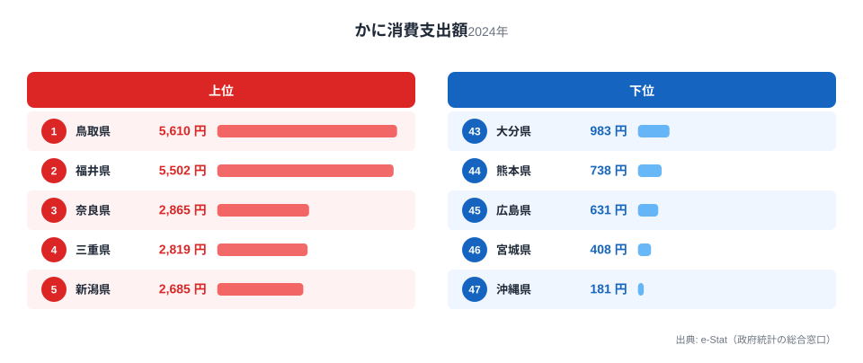
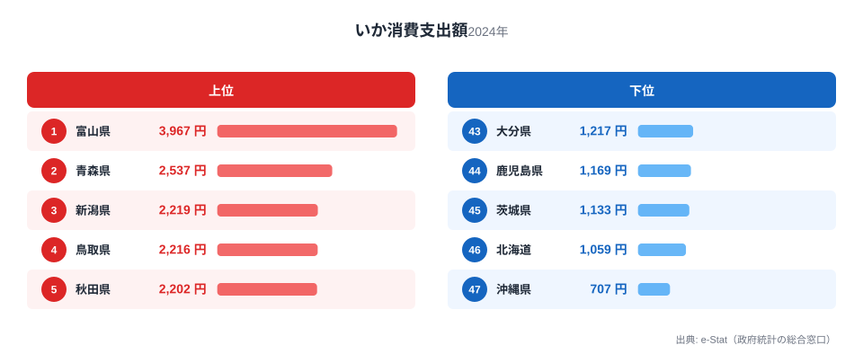
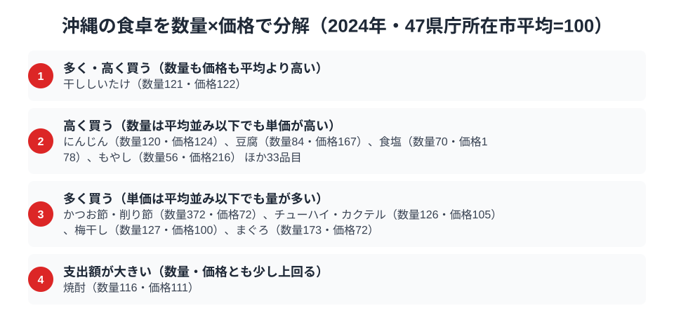

沖縄県の食卓には、本土とはっきり違う「かたより」があります。総務省の家計調査（品目別）で那覇市の二人以上世帯を見ると、2024年のかつお節・削り節の消費支出額は2,412円で全国1位。2位の高知県1,221円の約2倍という圧倒的な独走です。

ところが同じ沖縄が、かにでは181円、いかでは707円と、どちらも全国47位の最下位に沈みます。かつお節に日本一お金を使う県なのに、魚介そのものでは最下位が並びます。この一見ちぐはぐな数字の組み合わせにこそ、琉球料理の伝統と沖縄の地理条件が凝縮されています。

> [!NOTE]
> 家計調査の都道府県データは、県庁所在市（沖縄県は那覇市）の二人以上世帯を対象にした年間支出額です。県全体ではなく那覇市在住世帯の家計簿から見た傾向であり、支出「金額」であって消費「量」そのものではない点にご注意ください。

## かつお節 — 2位の2倍、出汁の島の日本一

<source-link href="/ranking/katsuobushi-consumption-expenditure">かつお節消費支出額ランキングをもっと見る</source-link>

沖縄県のかつお節消費支出額は2,412円で全国1位。2位の高知県1,221円のほぼ2倍、最下位の鳥取県566円の4.3倍という突出ぶりです。かつおの本場・高知を倍近く引き離して沖縄が首位に立つ構図は、この品目ならではの光景です。

背景にあるのは、琉球料理の出汁文化です。沖縄そばの出汁、ソーキ汁や中身汁などの汁物、チャンプルーの味付けまで、沖縄の家庭料理はかつお出汁を惜しみなく使います。本土の「削り節を少量ずつ」という使い方と違い、沖縄では厚削りや大容量パックを常備して日常的に大量消費するスタイルが根づいています。明治期以降、鰹節製造が沖縄・奄美で盛んだった歴史も、この食文化の土台になっています。かつお節が東西どちらの食文化圏でも使われるなかで沖縄だけが突出する構図は、[かつお節支出の記事](/blog/katsuobushi-expenditure-ranking)でも詳しく取り上げています。

## かに — 全国最下位181円、冬の味覚が届かない島

<source-link href="/ranking/crab-consumption-expenditure">かに消費支出額ランキングをもっと見る</source-link>

対照的に、かにの消費支出額は181円で全国最下位です。1位の鳥取県5,610円と比べると31倍もの開きがあります。ズワイガニやタラバガニは寒い海の生き物で、亜熱帯の沖縄近海では獲れません。日本海側で正月やハレの日の食材として根づいた「冬のかに文化」は、雪の降らない沖縄には持ち込まれなかったのです。

産地からの距離、輸送コスト、そして「かにを囲む冬」という季節感の不在。この三つが重なって、かには沖縄の食卓にほとんど登場しない食材になっています。日本海側の産地県が上位を独占する構図は[かに消費支出の記事](/blog/crab-expenditure-ranking)で詳しく解説しています。

## いか — こちらも最下位707円、本土と違う魚食

<source-link href="/ranking/squid-consumption-expenditure">いか消費支出額ランキングをもっと見る</source-link>

いかの消費支出額も707円で全国最下位です。1位の富山県3,967円の2割にも届きません。いかの主産地は青森・北海道・日本海側といった寒流域で、沖縄は地理的に遠い上に、そもそも県内の魚食文化の重心が本土と異なります。

沖縄の近海魚といえばグルクン（タカサゴ）やイラブチャー（ブダイ類）、マグロなど、本土のスーパーにはあまり並ばない魚たちです。つまり沖縄の「いか最下位」は魚を食べないことを意味せず、本土の大衆魚とは別の魚種で食卓が構成されていることの表れです。家計調査の品目リストが本土の食生活を基準に作られているため、沖縄独自の魚食は「その他」に隠れてしまうのです。

> [!WARNING]
> 家計調査は支出金額の調査であり、消費量そのものではありません。また品目区分は全国共通のため、グルクンなど沖縄固有の魚は個別品目として集計されず、沖縄の魚食の実態は「いか」「さば」など本土型品目の順位だけでは測れない点にご注意ください。

## 沖縄の食卓を貫くもの

沖縄県民の食卓を貫くのは、「琉球料理の体系がいまも現役である」ということです。かつお出汁を大量に使う汁物文化が日本一のかつお節支出を生み、寒流の魚介（かに・いか）は文化にも流通にも組み込まれずに最下位が並びます。1位と47位が同居する極端な凸凹は、沖縄の食卓が本土の縮小版ではなく、独自の体系として成立していることの証明です。

高知の「黒潮特化」、青森の「北の海と雪国の多面型」と並べると、沖縄は「琉球という独立した食文化圏」。県民の食卓シリーズの中でも、本土との違いが最も鮮明な県と言えます。

> [!TIP]
> 家計調査で沖縄を見るときは、「1位の品目」と「最下位の品目」の落差に注目してください。かつお節1位・かに最下位のように振れ幅が大きいほど、その県の食文化が全国標準から独立している証拠です。沖縄はこの落差が47都道府県で最も大きい部類に入ります。

## 数量×価格で分解する那覇市の食卓

<source-link href="/ranking/katsuobushi-consumption-quantity">かつお節・削り節消費量ランキングをもっと見る</source-link>

家計調査は品目ごとの購入数量も公表しており、支出額を「数量×価格」に分解できます。47都道府県庁所在市の平均を100とした指数で見ると、沖縄のかつお節・削り節消費量が全国1位になった理由がはっきりします。年間の購入量は681gにのぼり、47市平均に対する数量指数は372に達し、平均のおよそ3.7倍を買っていることになります。一方で1グラムあたりの単価を示す価格指数は72にとどまり、平均より3割近く安く仕入れています。つまり、かつお節・削り節の支出額日本一は「高い品を買っている」からではなく、「圧倒的な量を安く買っている」から生まれているのです。

上の図には、この4区分に沿って沖縄が平均から外れて買っている品目が並んでいます。「多く買う」区分にはかつお節・削り節のほかにチューハイ・カクテル（数量126・価格105）、梅干し（数量127・価格100）、まぐろ（数量173・価格72）が入り、いずれも単価は平均並みかそれ以下に抑えつつ購入量で支出額を押し上げるタイプです。「多く・高く買う」区分の干ししいたけ（数量121・価格122）と、「支出額が大きい」区分の焼酎（数量116・価格111）は、量・単価とも小幅に平均を上回ります。一方「高く買う」区分のにんじん（数量120・価格124）、豆腐（数量84・価格167）、食塩（数量70・価格178）、もやし（数量56・価格216）は、購入量こそ平均以下ながら単価指数が突出して高く、平均より少ない量をより高い単価で買っている品目です。

同じ枠組みでいかを見ると、購入量は463gで数量指数は55、価格指数も76と、量・単価とも平均を下回ります。支出額が全国最下位になっている理由は、量（数量指数55）も単価（価格指数76）もともに平均以下であることにあります。かにについては家計調査の支出額に181円が計上されている一方、同じ2024年の購入数量はグラム単位で0として記録されており、数量×価格には分解できません。統計の目盛りに乗らないほど購入実績が乏しい品目であることが、この一点からもうかがえます。

> [!TIP]
> かつお節・削り節のように「支出額1位」でも、量で稼いだ1位なのか単価で稼いだ1位なのかは分解しないと分かりません。沖縄の場合は前者にあたり、単価自体は全国平均より安く抑えられています。

> [!NOTE]
> 数量指数・価格指数は47都道府県庁所在市（沖縄県は那覇市）の平均を100とした相対値で、家計調査の全国平均や那覇市単体の絶対水準とは別の見方です。価格指数は品種・銘柄の違いも含み、対象は二人以上世帯の年間値です。

## まとめ

- かつお節消費支出額は沖縄県が全国1位（2,412円）、2位高知県1,221円の約2倍
- かには181円で全国最下位、1位鳥取県との差は31倍
- いかも707円で全国最下位、寒流域の魚介は文化・流通ともに縁が薄い
- 琉球料理の出汁文化が1位を、亜熱帯の地理と独自の魚食が最下位を生む
- 「1位と47位の同居」は、沖縄の食卓が本土と独立した体系であることの表れ

沖縄県の他の統計は[沖縄県の地域プロフィール](/areas/47000)、食品・家計消費の地域差は[経済カテゴリ一覧](/category/economy)からご覧いただけます。

## データ出典

総務省統計局「家計調査（品目別）」（2024年、都道府県庁所在市 二人以上世帯）をもとに、e-Stat（政府統計の総合窓口）経由で整備したデータを使用しています。
