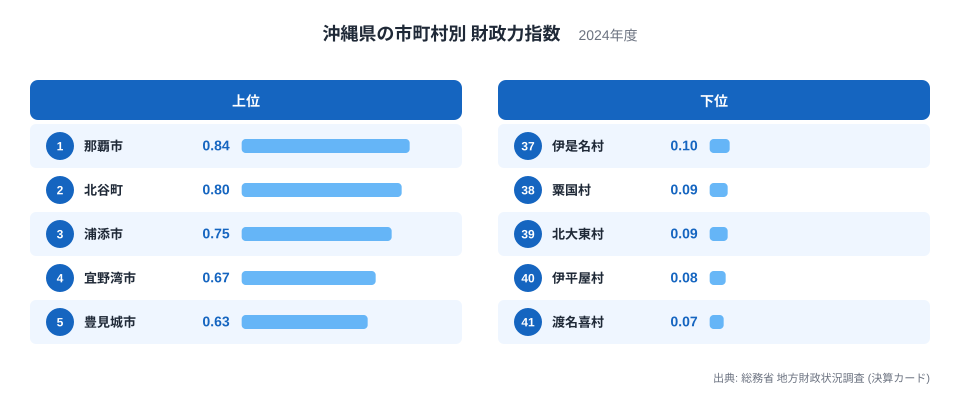
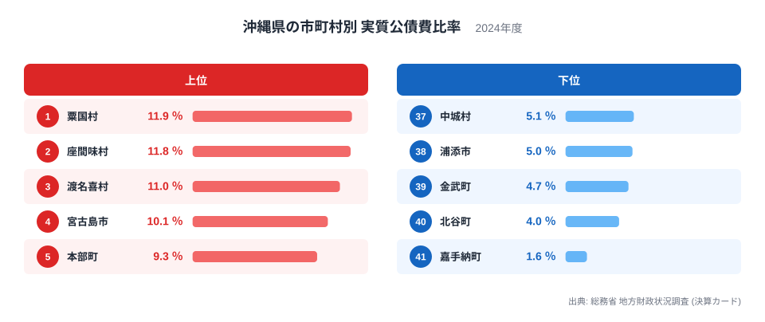
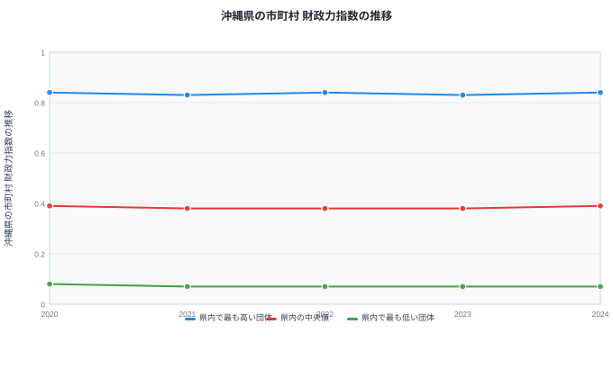

## 沖縄県の41市町村を財政の面から見る

沖縄県には41の市町村があります。同じ県内にあっても、那覇市のように多くの企業や人口が集まる都市部と、離島にある人口の少ない村では、財政の姿がまったく異なります。ここでは総務省の地方財政状況調査から、財政力指数と実質公債費比率という2つの指標を使い、県内41市町村のあいだにある差を見ていきます。

財政力指数は、自分の力でどれだけの行政需要をまかなえるかを示す指標です。実質公債費比率は、借入金の返済がどれだけ財政の重荷になっているかを示す指標です。この2つを重ねて見ることで、単に「豊かかどうか」だけでは分からない、市町村ごとの財政の実像が見えてきます。

沖縄県は本島の都市部と、多くの離島や小さな村からなる県です。地形も産業も市町村ごとに大きく異なるため、41の市町村を1本のものさしで比べると、上位と下位のあいだにかなりの開きが生まれます。この記事では、単に順位を並べるだけでなく、なぜその開きが生まれるのかを、人口の規模や地理的な条件から読み解いていきます。

## 財政力指数で見る那覇市と離島の村の差

財政力指数の1位は那覇市で、0.84です。県庁所在地として行政機能や商業施設が集まり、税収の基盤が県内でもっとも厚い自治体になっています。2位は北谷町で0.8、3位は浦添市で0.75と、那覇市の周辺に位置する都市部の自治体が上位を占めています。

一方、下位に目を向けると、渡名喜村が0.07でもっとも低く、伊平屋村が0.08、北大東村と粟国村がともに0.09と続きます。これらはいずれも離島にある小さな村で、人口が少なく産業の基盤も限られているため、自分の力でまかなえる財政需要の割合がどうしても小さくなります。財政力指数が低いこと自体は、地方交付税によって全国の自治体の財政運営を支える仕組みの中で織り込まれている姿であり、その村の財政運営が破綻しているという意味ではありません。

上位と下位を並べると、都市部の自治体と離島の小さな村のあいだに大きな開きがあることが分かります。この開きを生む大きな要因は人口の規模です。那覇市や北谷町、浦添市はいずれも人口や事業所が集まる都市部の自治体である一方、下位に並ぶ渡名喜村や伊平屋村、北大東村、粟国村は人口が少なく、税収の基盤となる産業や事業所も限られています。財政力指数は基準財政収入額を基準財政需要額で割って算出する指数のため、人口規模が小さく税源が乏しい自治体ほど数値が低く出やすい仕組みになっています。沖縄県だけに固有の事情というより、人口規模の小さい自治体に共通して見られる財政の構造が、離島の多い沖縄県では順位差としてとりわけはっきり表れているといえます。

## 実質公債費比率で見る借金返済の重さ

実質公債費比率がもっとも高いのは粟国村で、11.9％です。次いで座間味村が11.8％、渡名喜村が11％と、財政力指数では下位だった離島の村が、実質公債費比率では上位に並びます。人口が少なく税収の基盤が限られている一方で、島内の生活を支える道路や港湾、上下水道といった基盤整備には一定の投資が必要であり、過去の借入金の返済負担が財政に占める割合が大きくなっていると考えられます。

もっとも低いのは嘉手納町で、1.6％です。次いで北谷町が4％、金武町が4.7％と続き、この3つの町はいずれも県内で借金返済の負担がとりわけ軽い自治体になっています。財政力指数では北谷町が2位、嘉手納町が11位とどちらも上位に入っており、財政力が強い自治体が同時に借金の負担も軽いという分かりやすい組み合わせになっています。

ただし、この2つの指標はつねに同じ順位で動くわけではありません。財政力指数では那覇市が1位ですが、実質公債費比率では那覇市は8.1％で16位にとどまり、粟国村や座間味村のような小さな村より低い順位です。財政力が強い自治体だからといって、借金返済の負担がもっとも軽いとは限らないことが、この2つの図を並べることで見えてきます。

同じことは豊見城市にも当てはまります。財政力指数は0.63で5位と上位に入っていますが、実質公債費比率も8.9％で8位と、こちらも上位に位置しています。財政力指数が高い自治体が実質公債費比率でも低い側に入るとは限らないことが、ここでも確かめられます。財政力指数だけを見て自治体の財政を「安心できる」と判断するのではなく、実質公債費比率もあわせて確認することが大切です。

## 財政力指数の推移から見える変化の少なさ

2020年から2024年までの5年間で、県内でもっとも高い団体の財政力指数は0.84と0.83のあいだで推移し、2024年は0.84です。中央値は0.39と0.38のあいだをほぼ横ばいで推移し、もっとも低い団体は0.08から0.07のあいだで動いています。5年間で県内の順位構造は大きく変わっていないことが分かります。

財政力指数は基準財政収入額と基準財政需要額から算出される指数で、単年度の景気変動だけでなく人口や産業構造といった長期的な要因に左右されます。そのため短期間で大きく変わることは少なく、今回の5年間もほぼ横ばいの推移にとどまっています。急に順位が入れ替わることがない分、上位と下位の差そのものが長く続く構造でもあります。

## 沖縄県の財政をさらに見るには

この記事で見てきたように、41の市町村を財政力指数と実質公債費比率の2つの軸で見ると、単純に「豊かな自治体」「厳しい自治体」と1本のものさしで並べるだけでは見えない姿が浮かび上がります。同じ自治体でも指標によって順位が大きく入れ替わることがあり、どちらか一方だけを見て自治体の財政状況を判断するのは避けたいところです。

沖縄県全体の財政や他の指標については[沖縄県のデータ](/areas/47000)で確認できます。市町村を横断した地方財政のテーマは[地方財政のテーマ](/themes/local-finance)にまとまっており、行財政に関する他の統計は[行財政の統計一覧](/category/administrativefinancial)から探せます。都道府県単位での財政力の違いを見たい場合は[都道府県別の財政力指数](/ranking/fiscal-strength-index-prefecture)も参考になります。

> [!NOTE]
> 財政力指数は、自分の力でまかなえる行政需要の割合を示す指数で、1に近いほど独自の財源が豊かなことを意味します。1を下回っても財政が破綻しているわけではなく、地方交付税によって不足分が補われる仕組みが前提になっています。

> [!WARNING]
> 実質公債費比率は借入金の返済負担の重さを示す指標であり、財政力指数とは別の軸を測っています。財政力指数が低い自治体が実質公債費比率でも高いとは限らず、この記事の粟国村や渡名喜村のように、財政力は弱くても借金の負担は特に重いという組み合わせも見られます。

> [!TIP]
> 41の市町村を比べるときは、那覇市のような都市部の自治体と、離島にある人口の少ない村を同じ物差しで単純比較しないことが大切です。同じ人口規模の自治体どうしで比べると、離島の村が抱える事情がより見えやすくなります。

## データ出典

総務省 地方財政状況調査（決算カード）、2024年度
