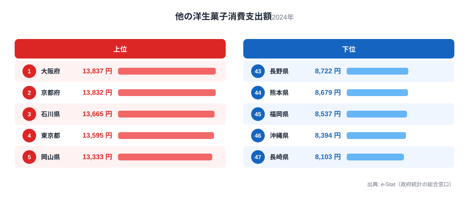
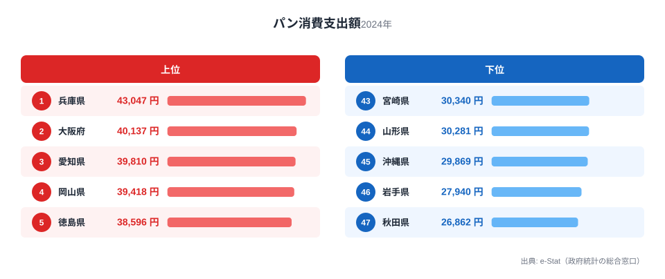
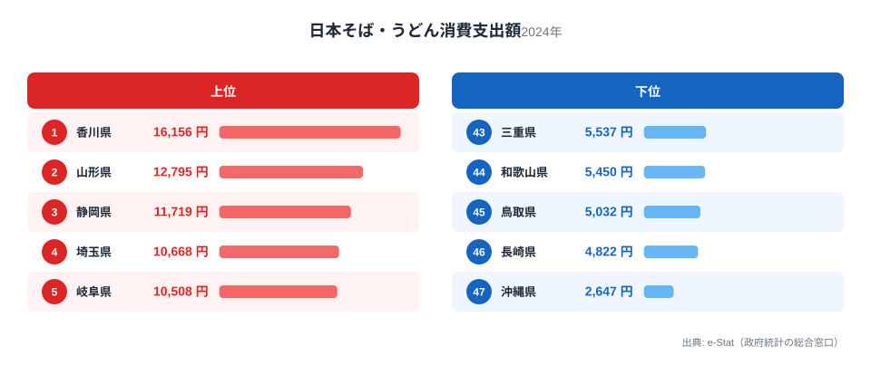
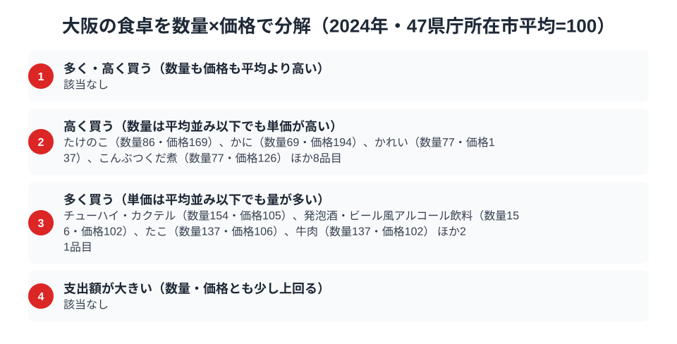

「食い倒れの街」大阪。その名にふさわしく、総務省の家計調査（品目別）で大阪市の二人以上世帯を見ると、洋生菓子（ケーキやシュークリームなど、パッケージ商品を除く「他の洋生菓子」）の消費支出額は13,837円で全国1位。パンの消費支出額も40,137円で全国2位と、粉ものとスイーツに強いことがはっきり数字に表れています。

ところが、意外な弱点もあります。日本そば・うどんの消費支出額は5,786円で全国40位。うどん県として知られる香川県は全国1位で16,156円、大阪の3分の1程度しかありません。粉もんの街のはずの大阪が、なぜそば・うどんでは下位に沈むのか。この記事では洋菓子・パン・そば・うどんという3つの品目を横断しながら、大阪の食卓の意外な構図を読み解きます。

> [!NOTE]
> 家計調査の都道府県データは、県庁所在市（大阪府は大阪市）の二人以上世帯を対象にした年間支出額です。府全体ではなく大阪市在住世帯の家計簿から見た傾向であり、支出「金額」であって消費「量」そのものではない点にご注意ください。たこ焼き・お好み焼きなど大阪の代表的な「粉もん」は、家計調査の主要品目として個別に集計されていません。

## 洋菓子 — 全国1位13,837円、僅差の京都を抑える

<source-link href="/ranking/other-western-sweets-consumption-expenditure">他の洋生菓子消費支出額ランキングをもっと見る</source-link>

大阪府の洋生菓子消費支出額は13,837円で全国1位です。2位の京都府は13,832円で、両府の差はわずかであり、近畿圏全体で洋菓子への支出が突出して高いことがわかります。3位は石川県で13,665円、こちらも老舗和洋菓子店の多い土地柄です。

大阪が1位に立つ背景には、都市部特有の商業集積があります。梅田・心斎橋・北新地といった繁華街には百貨店の銘菓売り場や有名パティスリーが集中し、手土産文化・贈答文化が根強く残っています。近畿圏で上位が固まっているのは、京都・大阪という消費力の高い都市圏が隣接し、互いに高品質な洋菓子を求める客層を共有しているためと考えられます。

## パン — 全国2位40,137円、兵庫に次ぐパン王国

<source-link href="/ranking/bread-consumption-expenditure">パン消費支出額ランキングをもっと見る</source-link>

パンの消費支出額でも大阪は全国2位（40,137円）と、上位に食い込んでいます。首位は兵庫県で全国1位・43,047円、神戸を擁する兵庫がわずかにリードする形です。3位は愛知県で39,810円、大阪を含む上位県は関西・中京圏の大都市に集中しています。

関西では米飯よりもパン食が定着している家庭が多いとされ、朝食にパンを選ぶ都市部の生活習慣がこの数字に反映されています。神戸から広がった洋食文化の影響圏に大阪も含まれ、兵庫と競うようにパン支出額を押し上げていると考えられます。大阪と兵庫が1位・2位を分け合う構図は、洋菓子の大阪・京都の関係と似た、近畿圏内での消費力の高さを映しています。

## 日本そば・うどん — 全国40位5,786円、粉もんの街の意外な低順位

<source-link href="/ranking/soba-udon-dining-consumption-expenditure">日本そば・うどん消費支出額ランキングをもっと見る</source-link>

一方で、日本そば・うどんの消費支出額は5,786円と、全国47都道府県中40位にとどまります。首位の香川県は全国1位で16,156円と2.8倍もの差があり、うどん県・香川の突出ぶりが際立つ結果です。2位は山形県で12,795円、3位は静岡県で11,719円と、いずれも大阪の2倍以上の支出額です。

たこ焼きやお好み焼きに代表される「粉もん文化」のイメージが強い大阪ですが、家計調査が集計する「日本そば・うどん」という品目には、それらの粉もんは含まれません。外食産業の発達した大都市では、うどんも含めた麺類全般を外食や持ち帰りで済ませる機会が多く、家庭内購入としての支出額が伸びにくい可能性があります。また讃岐うどんのように地域固有の食文化として家庭に根づいている香川・山形とは異なり、大阪の「粉もん」は主に外食・屋台的な消費形態が中心と考えられ、家計調査の品目区分では捉えきれていない側面があります。

> [!WARNING]
> 日本そば・うどんの順位だけで大阪の「粉もん文化」の実態を測ることはできません。たこ焼き・お好み焼きは麺類とは別の統計品目であり、麺類の消費が少ないことが粉もん人気の低さを意味するわけではない点にご注意ください。

## 大阪の食卓を貫くもの

大阪府民の食卓を貫くのは、「都市型の贅沢消費」と「家庭内調理からの距離」という二面性です。洋菓子・パンという嗜好品・加工食品には全国トップクラスの支出を見せる一方、そば・うどんのような伝統的な麺類の家庭内購入は下位にとどまります。これは大阪が持つ強力な外食・中食文化の裏返しとも読めます。

粉もんの本場として知られながら麺類品目で下位という構図は、うどん県として麺類支出が全国1位に突出する香川県とは対照的です。[そば・うどん消費の都道府県地図](/blog/udon-soba-food-culture-prefecture-map)で見たように、香川は家庭で作り食べる文化、大阪は街で食べ歩く文化という違いが、家計調査の品目別支出額の差に表れていると考えられます。

> [!TIP]
> ある県の名物料理（大阪ならたこ焼き・お好み焼き）が、必ずしも家計調査の品目別ランキングに直接反映されるとは限りません。粉もんのように外食・屋台文化として定着した食は、家庭内購入の統計では見えにくくなります。ランキングを読むときは、その品目が「家で作って食べるものか」「外で食べるものか」という消費形態の違いも合わせて考えると、数字の裏側が見えてきます。

## 数量×価格で分解する大阪市の食卓

<source-link href="/ranking/beef-consumption-quantity">牛肉消費量ランキングをもっと見る</source-link>

洋菓子・パン・そば/うどんの支出額ランキングだけを見ていると、「大阪はこの品目にお金をかけている」という順位しか分かりません。支出額は数量×単価の掛け算なので、順位の裏側には「たくさん買っている」のか「高いものを選んで買っている」のかという、まったく別の理由が隠れています。家計調査のうち数量と支出額の両方を集計できる125品目について、47都道府県庁所在市の単純平均を100とした指数で大阪市の位置を分解すると（「他の生鮮肉」「他のパン」のように分類の残り物をまとめた残余品目を除く、以下同じ）、「単価が高い」品目が12、「量が多い」品目が25ある一方、「量も単価も両方高い」「単価は平均並みでも支出額自体が大きい」に当てはまる品目は1つもありません。大阪市の食卓で支出額が上位に来る品目は、量で稼ぐか単価で稼ぐかのどちらかにはっきり分かれる傾向があるのです。

「単価が高い」品目の代表はたけのこ（数量指数86・価格指数169）、かに（数量指数69・価格指数194）、かれい（数量指数77・価格指数137）、こんぶつくだ煮（数量指数77・価格指数126）です。いずれも買う量そのものは平均以下なのに、単価が平均より3〜9割も高いために支出額が押し上げられています。旬の高級食材や質の良い乾物・佃煮を少量ずつ選んで買う消費行動が、価格指数の高さとして表れていると考えられます。

一方「量が多い」品目の代表はチューハイ・カクテル（数量指数154・価格指数105）、発泡酒・ビール風アルコール飲料（数量指数156・価格指数102）、たこ（数量指数137・価格指数106）、牛肉（数量指数137・価格指数102）で、単価は平均並みかそれ以下なのに購入量が5割前後多いのが特徴です。家庭で飲む酒類がそろって上位に来るのは家飲み文化の厚さを、たこの数量の多さはたこ焼き以外の家庭料理も含めて「たこをよく食べる」食文化の裏付けになっている可能性があります。牛肉消費量が47市平均より高めなのも、贈答用の高級和牛だけでなく日常の食卓でも牛肉をよく使う近畿圏らしい傾向として読み取れます。

> [!TIP]
> 支出額ランキングの順位だけでは、「たくさん食べている」のか「高いものを買っている」のかは区別できません。同じ支出額1位でも、数量指数と価格指数に分解すると背景がまったく違って見えることがあります。気になる品目があれば、その品目の消費量ランキングと消費支出額ランキングを両方確認すると、消費行動の実態がより立体的に見えてきます。

> [!NOTE]
> この指数は家計調査の全国平均ではなく、47都道府県庁所在市の単純平均を100とした相対値です。価格指数は支出額÷数量から逆算した値なので、同じ品目でも購入する品種・ブランド・グレードの違いが反映されており、純粋な店頭価格の高さだけを示すものではありません。対象は二人以上世帯の年間支出（2024年）です。

## まとめ

- 洋生菓子消費支出額は大阪府が全国1位で13,837円、2位京都府の13,832円にわずかに差をつける
- パンも全国2位（40,137円）、1位兵庫県に次ぐ近畿圏のパン王国
- 日本そば・うどんは全国40位（5,786円）、1位香川県の3分の1程度と麺類は下位
- 洋菓子・パンなど嗜好品は上位、伝統的な麺類の家庭内購入は下位という都市型消費の二面性
- 支出額を数量×価格に分解すると、単価の高さで稼ぐ品目（たけのこ・かに等12品目）と購入量の多さで稼ぐ品目（酒類・牛肉等25品目）に分かれ、量も単価も両方高い品目は一つもない

大阪府の他の統計は[大阪府の地域プロフィール](/areas/27000)、食品・家計消費の地域差は[経済カテゴリ一覧](/category/economy)からご覧いただけます。近畿圏の食文化の違いは[和歌山県の食卓](/blog/wakayama-food-culture)の記事もあわせてご覧ください。

## データ出典

総務省統計局「家計調査（品目別）」2024年、都道府県庁所在市 二人以上世帯（e-Stat 経由で整備）
