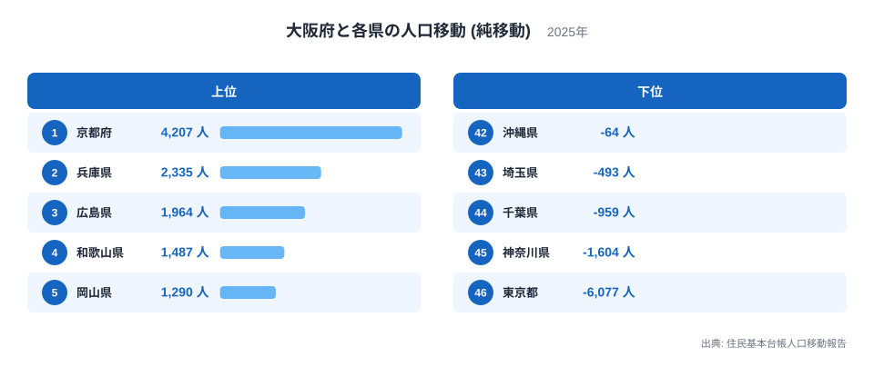
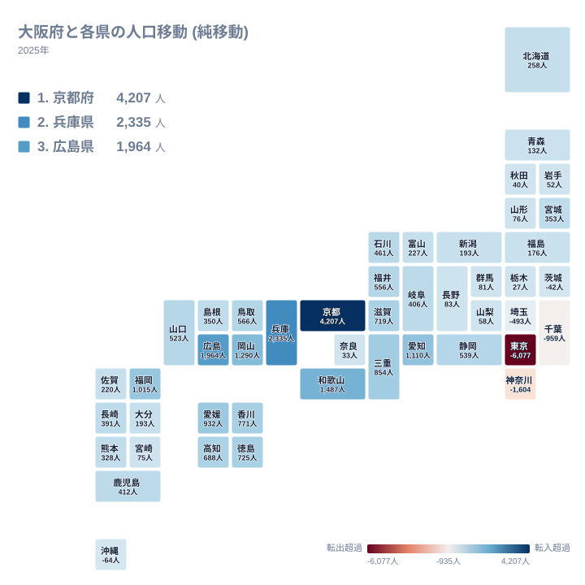
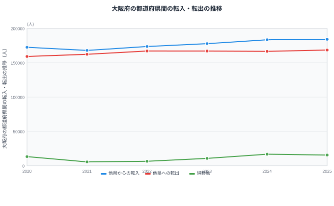

大阪府は2025年の1年間で、他の都道府県との間で18万人を超える人が転入し、16万人を超える人が転出しています。差し引きの純移動だけを見ると「大阪府は人口を集めている」という単純な話に見えますが、相手県ごとに向きを分けて読むと、実際にはまったく違う顔が見えてきます。近隣県や西日本の各県からは人を集めている一方で、東京都や神奈川県へは人を送り出しているのです。この記事では、大阪府と各県のあいだの人口移動を県ごとに分解し、どこから来てどこへ去っていくのかを見ていきます。

## 大阪府がどの県から人を集めているか

まず、大阪府にとって純移動がプラスになっている県、つまり大阪府への転入がその県への転出を上回っている県から見ていきます。

もっとも純移動が大きいのは京都府で、4,207人です。2位は兵庫県で2,335人、3位は広島県で1,964人、4位は和歌山県で1,487人、5位は岡山県で1,290人となっています。上位5県の顔ぶれを見ると、京都府・兵庫県・和歌山県は大阪府に隣接する近畿地方の県で、広島県・岡山県は瀬戸内海を挟んだ中国地方の県です。近畿地方の中心である大阪府が、通勤や通学の圏内にある隣接県から人を集めるのは自然な形と言えます。

もう一段下を見ると、6位の愛知県が1,110人、7位の福岡県が1,015人と、大都市を抱える県も上位に入っています。8位の愛媛県は932人、9位の三重県は854人、10位の香川県は771人、11位の徳島県は725人、13位の高知県は688人となっており、四国地方の4県（愛媛県・香川県・徳島県・高知県）がそろって大阪府への純移動でプラスの順位に入っています。九州地方に目を移すと、7位の福岡県に続いて19位の鹿児島県、21位の長崎県、24位の熊本県、27位の佐賀県、29位の大分県、35位の宮崎県までの7県がすべてプラスとなっており、西日本の広い範囲にわたって大阪府が人を集める側にまわっていることが分かります。

順位表の下のほうに目を移すと、15位の福井県が556人、18位の石川県が461人、26位の富山県が227人と続き、北陸地方の3県もそろって大阪府への純移動がプラスです。中国地方の残りである14位の鳥取県、17位の山口県、23位の島根県も同じ傾向にあります。東北地方では22位の宮城県、30位の福島県、31位の青森県、34位の山形県、37位の岩手県、38位の秋田県がプラスとなっており、値は小さくなるものの、地理的に離れた地域からも大阪府への純移動が続いていることが分かります。

<source-link href="/ranking/moving-in-excess-rate">転入超過率ランキング</source-link>

この上位・下位の構図をもう少し広い視点で捉えるために、地理的な分布を地図で確認します。

## 純移動を地図で見ると分かること

地図にすると、プラスの純移動が西日本を中心に広く分布し、マイナスの純移動が関東地方に集中していることが一目で分かります。特に近畿地方の隣接県（京都府・兵庫県・和歌山県）は色の濃いタイルとして目立ち、大阪府がこの地域の中心として機能していることを示しています。滋賀県も12位で719人のプラスとなっており、近畿地方の京都府・兵庫県・和歌山県・滋賀県はいずれも大阪府への純移動が大きくプラスです。同じ近畿地方でも39位の奈良県は33人ととても小さなプラスにとどまっており、他の近畿の県ほど大阪府との結びつきの強さは数字に表れていません。

一方で、マイナスの純移動が出ている県は数が少なく、茨城県、沖縄県、埼玉県、千葉県、神奈川県、東京都の6県だけです。このうち埼玉県、千葉県、神奈川県、東京都は東京圏の4都県にあたり、いずれもマイナスとなっています。つまり大阪府は、近畿地方や西日本の各県との関係では人を集める側に立ちながら、東京圏との関係では人を送り出す側に立つという、方向の異なる二つの流れを同時に抱えていることになります。

> [!NOTE]
> ここでの純移動は、相手県から大阪府への転入者数から、大阪府から相手県への転出者数を差し引いた値です。プラスであれば大阪府がその県から人を集めている状態を、マイナスであれば大阪府がその県へ人を送り出している状態を表します。大阪府自身は移動の相手にならないため、集計対象は46都道府県です。

## 東京圏との関係だけがマイナスになっている

大阪府にとって純移動がマイナスになっている6県のうち、下位に並ぶのがまさに東京圏です。42位の沖縄県が64人、43位の埼玉県が493人、44位の千葉県が959人、45位の神奈川県が1,604人、46位の東京都が6,077人のマイナスとなっており、東京圏に近いほど、そして規模が大きいほどマイナス幅も広がる傾向が見えます。

この並びは、大阪府が近畿・中国・四国・九州の各地方に対しては人口を集める中心地でありながら、東京圏に対してはより大きな中心地に人を送り出す側にまわっていることを示しています。地方から大阪府、大阪府から東京圏という二段階の流れが、同じ大阪府というひとつの都道府県の中に同居しているわけです。41位の茨城県が42人のマイナスとなっている点も、東京圏に隣接する県として同じ傾向に含まれると見ることができます。

> [!WARNING]
> ここで示した数値は住民基本台帳人口移動報告に基づくもので、住民票を移した人だけを対象にしています。進学や単身赴任などで住民票を移さずに生活の拠点を移す人は集計に含まれません。また、この統計は総人口の増減そのものではなく、都道府県間の転出入だけを扱っており、出生や死亡による自然増減は含まれていない点にも注意が必要です。

## 転入・転出の推移で見る大阪府の勢いの変化

大阪府と各県との純移動を合計した推移を見ると、単年の数字だけでは分からない変化が見えてきます。

他県からの転入は、2020年の172,563人から2021年にいったん168,009人へ減り、その後は2022年に173,710人、2023年に177,874人、2024年に183,472人、2025年に184,232人と、毎年増え続けています。他県への転出も同様に増加傾向にあり、2020年の159,207人から2025年には168,565人まで伸びています。転入・転出の両方が拡大しているという点で、大阪府に出入りする人の総量そのものが増えていることが分かります。

純移動で見ると、2020年は13,356人でしたが、2021年には5,622人まで縮小し、その後2022年に6,539人、2023年に10,792人、2024年に16,848人と回復・拡大を続け、2025年は15,667人とわずかに縮小しています。2020年から2021年にかけての縮小と、その後の回復という動きは、この期間に人の移動そのものが抑えられていた事情があった可能性があります。ただしこれは記事内のデータだけからは確認できないため、[仮説]として留めておきます。2024年をピークに2025年がわずかに縮小している点も、今後の推移を見なければ一時的な変動か傾向の転換かは判断できません。

> [!TIP]
> 純移動の数字だけを追うと、大阪府に出入りする人の実際の規模を見落とします。転入と転出がそれぞれどれだけ増えているかも合わせて確認すると、純移動が拡大しているのか、それとも転入・転出の総量が縮んだ結果として純移動の比率だけが目立っているのかを見分けやすくなります。

## まとめ

- 大阪府にとって純移動がもっとも大きいのは京都府で4,207人、次いで兵庫県2,335人、広島県1,964人と続きます。
- 近畿地方の隣接県（京都府・兵庫県・和歌山県）と、中国・四国・九州地方を中心とした西日本の各県は、大阪府への純移動がプラスになっています。
- 大阪府にとって純移動がマイナスになっているのは茨城県、沖縄県、埼玉県、千葉県、神奈川県、東京都の6県で、このうち4県は東京圏です。
- 東京都への純移動はマイナス6,077人ともっとも大きく、東京圏に近いほどマイナス幅が広がる傾向があります。
- 大阪府への転入・転出はいずれも2020年から2025年にかけて増加傾向にあり、純移動は2021年を底に拡大したのち、2025年はわずかに縮小しました。

大阪府の人口移動をより広い視点で確認したい場合は、[大阪府のデータ](/areas/27000)で他の指標もあわせて見ることができます。人口の増減や高齢化など、人口動態全体の傾向は[人口動態のテーマ](/themes/population-dynamics)にまとまっています。人口に関する他の統計を探す場合は、[人口カテゴリの統計一覧](/category/population)からたどれます。

## データ出典

住民基本台帳人口移動報告（2025年）を出典としています。
