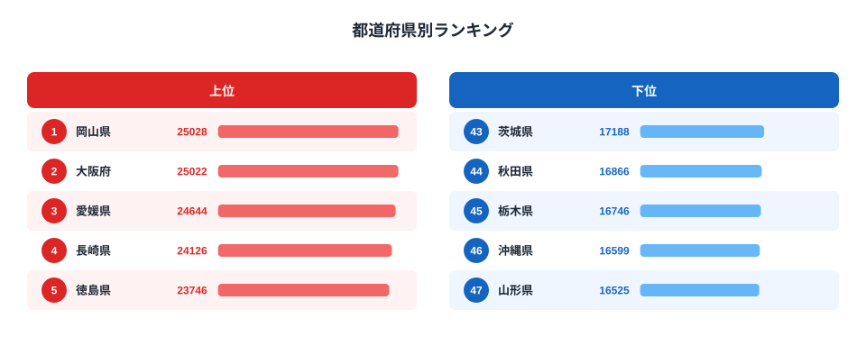

「パンをよく食べる地域」といえば何県を思い浮かべるでしょうか。「京都・大阪などの関西圏」「首都圏」と答える方が多いかもしれませんが、家計調査（2024年）の「他のパン消費量」では岡山県が全国1位（25,028g）という意外な結果になっています。しかも2位は大阪府（25,022g）とわずか6gの僅差です。

「他のパン」とは食パン以外のすべてのパン、つまりロールパン・菓子パン・惣菜パン・フランスパン・クロワッサンなどを指します。2024年調査では1位の岡山県と最下位の山形県（16,525g）の消費量に1.5倍の差があります。東北各県が軒並み下位に集中する一方、西日本の各県が上位を占める地域構造が浮かび上がります。

この記事では、都道府県別の他のパン消費量の実態と、なぜ地域差が生まれるのかを解説します。

## 全国ランキング：岡山が大阪を僅差で上回り1位

2024年の都道府県別「他のパン消費量」ランキングでは、岡山県（25,028g）が大阪府（25,022g）をわずか6gの差で抑えて1位となっています。3位以降も愛媛県（24,644g）、長崎県（24,126g）、徳島県（23,746g）と西日本が続きます。

> [!NOTE]
> 「他のパン」は総務省の家計調査における品目分類で、食パンを除いたすべてのパンを指します。ロールパン・菓子パン・惣菜パン・フランスパン・クロワッサン・バゲットなどが含まれます。調査対象は都道府県庁所在市の二人以上世帯の年間消費量（単位：g）です。

<source-link href="/ranking/other-bread-consumption-quantity">他のパン消費量ランキングをすべて見る</source-link>

上位10位を見ると、岡山・大阪・愛媛・長崎・徳島・岐阜・滋賀・愛知・三重・新潟という顔ぶれです。九州・四国・中部・近畿が入り混じる形ですが、全体として東日本の都市部よりも西日本・中部の県が上位を占める傾向が明確です。首都圏の東京都は27位（19,660g）にとどまっており、「大都市＝パンが多い」という先入観とは異なる実態があります。

岡山が1位という結果は、過去のデータと照らすと実は連続したものではありません。2024年に初めて全国首位になったわけではなく、2016年・2019年・2020年にも1位を獲得していますが、年によって順位の変動が大きい指標でもあります。2024年は長く上位に君臨してきた京都府が20位（21,660g）まで後退しており、1年単位でのブレが大きいことに注意が必要です。

## 最下位グループ：東北が固める下位

下位5県は山形県（47位・16,525g）、沖縄県（46位・16,599g）、栃木県（45位・16,746g）、秋田県（44位・16,866g）、茨城県（43位・17,188g）です。山形・秋田は東北の代表格で、この2県が最下位グループに入ります。

東北全体を見ると、福島県（30位・19,047g）を除いた5県が40位以下に集まっています。

- 40位：岩手県（17,665g）
- 41位：青森県（17,474g）
- 42位：宮城県（17,360g）
- 44位：秋田県（16,866g）
- 47位：山形県（16,525g）

> [!WARNING]
> 家計調査は二人以上世帯の都道府県庁所在市のデータです。単身世帯や地方中小都市の消費傾向は反映されておらず、県全体の平均とは異なります。また、年ごとのサンプル変動があるため、単年の順位変動を過大解釈しないことが重要です。山形県は2022年・2023年も47位でしたが、2009年には41位まで浮上した年もあります。

東北が下位に集中する背景には、米食文化の強固な継続が考えられます。東北各県は米の主要産地であり、コシヒカリ・あきたこまち・はえぬきなど各県を代表するブランド米を持ちます。米の自給的な文化圏では、パン（特に食パン以外の多様なパン）を日常的に購入する機会が相対的に少ない可能性があります。

また、沖縄県が46位に入っていることは興味深い点です。沖縄は独自の食文化を持ち、米と独自の食材を中心とした食生活が続いています。パン自体は普及していますが、「他のパン」に分類されるような惣菜パンや菓子パンよりも、ちゃんぽんやそば等の独自食が優先される傾向があるのかもしれません。

## なぜ岡山・大阪が上位なのか：西日本パン文化の地域背景

上位に西日本の県が多い構造には、歴史的・産業的な背景があります。

関西圏、特に大阪・京都・兵庫（神戸）は明治以降、西洋文化の受け入れ窓口として機能してきました。神戸は幕末から続く国際貿易港であり、洋菓子・パン・洋食の文化が早くから定着しました。神戸メリケンパーカーや老舗パン屋の歴史は100年以上に及ぶものもあり、西日本には早期からパン食文化が根付いています。

岡山については、近年の高順位に加えて岡山市が「パンのまちおかやま」をキャッチフレーズに掲げるほどパン文化が盛んです。岡山市内には多くの個性的なパン屋が集積しており、市民のパンへの親しみが消費量に直結していると考えられます。

> [!TIP]
> 「他のパン消費量」ランキングと食パン消費量のランキングを合わせて見ると、パン食全体の地域差がより鮮明になります。食パン消費と惣菜パン系消費の組み合わせで、各県の「パン食の深さ」を多角的に把握できます。[小麦粉消費量のランキング](/ranking/wheat-flour-consumption-prefecture)も参考になります。

四国では愛媛（3位）・徳島（5位）が高順位で、香川（14位）は中位です。四国も西日本パン文化圏に属しており、特に愛媛・徳島が突出して高い値を示しています。地元の老舗パンメーカーが存在し、家庭への普及が進んでいることが影響していると見られます。

[大阪府のエリアページ](/areas/27000)でも食生活関連の各種データを確認できます。

## 京都の急落と年ごとの変動：単年データの読み方

注目すべき点は京都府の順位変動です。京都府は2007年から長年にわたり全国首位を維持することが多く、「パン消費量の王者」といえる存在でした。しかし2024年調査では20位（21,660g）まで後退しています。

過去の順位推移をみると、2007年に最多を記録（29,829g）し、その後も上位を保ってきましたが、直近では2023年に上位グループ（24,510g）にいたものの、2024年は中位の20位に落ちています。

2024年の急落は1年で17位分という大幅な落ち込みで、これはサンプル変動の影響が大きいと考えられます。家計調査は抽出調査（サンプル調査）であり、1年単位では統計的なブレが生じます。都道府県庁所在市単位の調査のため、その年のサンプル世帯の構成によって数値が変動しやすい性質があります。

同様に岡山県も年ごとの変動が大きく、2022年に8位（23,005g）、2023年に15位（21,415g）まで下がってから2024年に1位へ返り咲いています。「今年が何位か」よりも「複数年平均でどの水準か」を見ることが、実態把握には有効です。

[パスタ消費量のランキング](/ranking/pasta-consumption-quantity)も合わせて見ると、小麦系食品全体の消費パターンとの比較ができます。

## 地域差の構造：西高東低・東北低の食文化マップ

2024年のデータ全体を俯瞰すると、「西高東低・東北低」という構造が浮かび上がります。

**上位帯（22,000g以上）**：岡山・大阪・愛媛・長崎・徳島・岐阜・滋賀・愛知・三重・新潟の10県。西日本・中部が中心。

**中位帯（19,000〜22,000g）**：鳥取・佐賀・群馬・香川・千葉・広島・兵庫・福井・石川・京都・熊本・奈良・富山・大分・山梨・福岡・東京・神奈川・和歌山・福島の20県。

**下位帯（19,000g未満）**：埼玉・宮崎・山口・長野・北海道・静岡・島根・鹿児島・高知・岩手・青森・宮城・茨城・秋田・栃木・沖縄・山形の17県。東北・関東内陸・北海道が多い。

[消費・経済カテゴリ](/category/economy)では、他のパン以外の消費関連指標をまとめて比較できます。[岡山県のエリアページ](/areas/33000)でも食生活関連の各種データを確認できます。

東北地方と北海道が下位に集まる一方、中部・近畿・九州北部が上位を占める傾向は、米食中心の食文化圏と洋食・パン食が浸透した食文化圏の境界線に近いものがあります。ただし、これはあくまで「他のパン消費量」という単一指標の解釈であり、複数の要因が複合的に絡み合っています。

> [!NOTE]
> 首都圏（東京27位・神奈川28位・埼玉31位）が中〜下位に位置することは注目に値します。都市部では食の選択肢が多様で、パン以外の選択肢（コンビニ食・外食等）も充実しているため、「他のパン」を自宅で消費する量が必ずしも高くない可能性があります。「パンが好きな都市」と「他のパンを家庭で多く買う都市」は必ずしも一致しないのです。

## まとめ

- **1位は岡山県（25,028g）**：2024年調査で僅差（6g）で大阪府を上回り全国最多
- **最下位は山形県（16,525g）**：3年連続47位で、東北は全体的に下位に集中
- **倍率は1.5倍**：最上位と最下位の消費量差は約8,500g
- **「西高東低・東北低」の構造**：西日本・中部が上位、東北・北海道が下位という地域パターンが明確
- **年ごとの変動が大きい**：京都府が上位グループから2024年調査で20位まで後退するなど、単年データの解釈には注意が必要

## データ出典

総務省統計局「家計調査」（都道府県庁所在市別・二人以上世帯）2024年。e-Stat経由で整備。対象品目「他のパン（食パンを除くすべてのパン）」の年間購入量（g）を使用。
