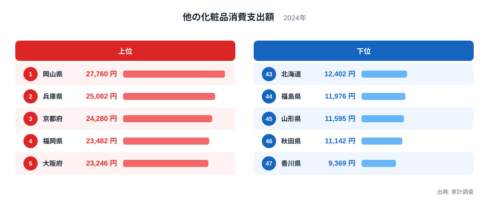
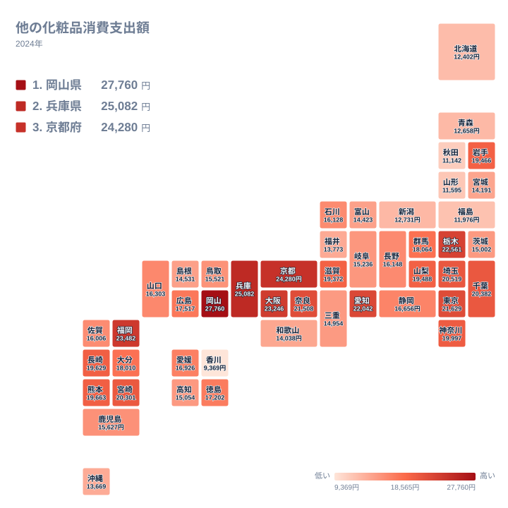

「他の化粧品」という聞き慣れない項目に、都道府県ごとに大きな差があります。家計調査が集計する2024年の他の化粧品消費支出額を見ると、1位の岡山県は27,760円、最下位の香川県は9,369円で、支出額には大きな開きが見られます。同じ日本の消費者でも、住んでいる県によって化粧品にかける金額はこれほど違うのです。

この記事では、47都道府県の他の化粧品消費支出額を上位と下位の両面から確認し、地理的にどのような広がりを見せているのかをタイルマップで可視化します。そのうえで、消費額の差が都市の規模や消費文化とどう結びついているのかを考えていきます。

## 全国ランキングで見る他の化粧品消費支出額

<source-link href="/ranking/other-cosmetics-consumption-expenditure">他の化粧品消費支出額ランキングをもっと見る</source-link>

上位を見ると、岡山県が27,760円で1位となり、兵庫県が25,082円で2位、京都府が24,280円で3位と続きます。4位は福岡県で23,482円、5位は大阪府で23,246円です。上位5県のうち兵庫県、京都府、大阪府の3県は近畿地方に位置しており、近畿地方の県が上位に集まっています。岡山県は中国地方、福岡県は九州地方に位置する県です。

一方、下位を見ると、最下位は香川県で9,369円、46位は秋田県で11,142円、45位は山形県で11,595円、44位は福島県で11,976円、43位は北海道で12,402円です。下位5県のうち秋田県、山形県、福島県の3県は東北地方に位置しており、東北地方の県が下位に集まっています。香川県は四国地方に、北海道は他のどの地方にも属さない独自の区分として扱われています。

1位の岡山県と最下位の香川県を比べると、支出額は約3倍の開きがあります。上位10位以内には兵庫県、京都府、大阪府、奈良県と近畿地方の県が複数含まれており、他の化粧品という項目が地域によって支出のばらつきが出やすい費目であることがうかがえます。

> [!NOTE]
> 「他の化粧品」は家計調査の化粧品費目のうち、化粧水や口紅などの主要な品目に区分されていない支出をまとめた項目です。特定の商品を示す数値ではなく、化粧品全体の中でも主要品目以外への支出傾向を表している点に注意してください。

## 地理的な広がりをタイルマップで確認する

タイルマップで見ると、近畿地方から中国地方、九州地方にかけての西日本で支出額が高い県が目立ちます。1位の岡山県、2位の兵庫県、3位の京都府、5位の大阪府はいずれも近畿地方かその隣接地域に位置しており、西日本側にまとまって高い数値が並んでいる様子が確認できます。

一方、東北地方は秋田県、山形県、福島県がそろって下位に入っており、東北地方全体で支出額が低い傾向が見られます。ただし同じ東北地方の岩手県は19,466円で17位となっており、東北地方の中でも県によって順位に幅があります。このため、東北地方全体を一様に「支出額が低い地域」と単純化することはできません。

> [!WARNING]
> 家計調査の都道府県別データは、原則として都道府県庁所在市の世帯を対象にした調査結果です。県内のほかの地域を含めた県全体の実態とは異なる可能性がある点に注意してください。

## なぜ都市部で消費額が高くなるのか

上位に入っている岡山県、兵庫県、京都府、福岡県、大阪府はいずれも、県庁所在市が人口規模の大きい都市です。[岡山県のデータ](/areas/33000)を見ると岡山市、[兵庫県のデータ](/areas/28000)を見ると神戸市がそれぞれの県庁所在市であり、いずれも百貨店や化粧品専門店、大型商業施設が集積する都市です。家計調査のデータが県庁所在市の世帯を対象にしていることを踏まえると、[仮説]化粧品を扱う店舗や売り場が豊富な都市ほど支出額が高く出やすい可能性があります。

一方で、下位に入っている秋田県、山形県、福島県、香川県の県庁所在市は、岡山市や神戸市と比べて人口規模が小さい都市です。ただし北海道の県庁所在市にあたる札幌市は、全国でも有数の人口を抱える大都市であり、それでも12,402円で43位という低い順位に位置しています。この点から、[仮説]都市の人口規模だけで消費額の高低を説明することはできず、地域ごとの消費習慣や店舗の分布など、ほかの要因も関係していると考えられます。この仮説を検証するには、店舗数や年齢構成といった追加のデータでの確認が必要です。

> [!TIP]
> このランキングは1世帯あたりの支出額であるため、世帯の人数構成や年齢層の違いも数値に影響している可能性があります。県ごとの人口構成もあわせて確認すると、地域差の見え方がより立体的になります。

## 関連する化粧品支出との違い

家計調査の化粧品費目は、「他の化粧品」のほかにも化粧水や乳液、口紅などいくつかの品目に分かれています。今回取り上げた他の化粧品消費支出額は、これらの主要品目に区分されない支出をまとめた項目であるため、化粧品全体の消費傾向をそのまま表しているわけではありません。他の化粧品の支出額が高い県が、化粧水や口紅といった別の品目でも同じ順位になるとは限らない点に注意が必要です。

化粧品に限らず、地域ごとの消費支出の違いをより広く確認したい場合は、[同じカテゴリの統計一覧](/category/economy)から関連する家計調査の各種ランキングをあわせて見ることができます。他の品目のランキングと突き合わせることで、他の化粧品という項目に特有の地域差なのか、化粧品消費全体に共通する傾向なのかを見極める手がかりになります。

## まとめ

- 他の化粧品消費支出額の1位は岡山県で27,760円、最下位は香川県で9,369円です。
- 上位5県のうち兵庫県、京都府、大阪府の3県は近畿地方に位置しています。
- 下位5県のうち秋田県、山形県、福島県の3県は東北地方に位置しています。
- 北海道は県庁所在市が大都市の札幌市であるにもかかわらず43位と低く、都市規模だけでは説明できない要因があります。
- データは県庁所在市の世帯を対象にした調査結果であり、県全体の実態とは異なる可能性があります。

## データ出典

出典は家計調査で、対象年は2024年です。
