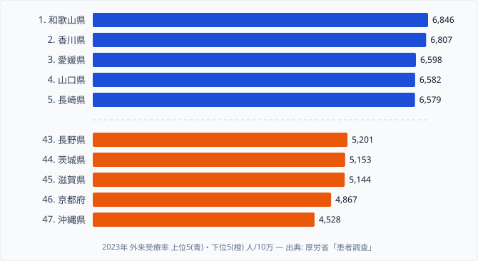

「同じ日本でも、住む県によって通院する人の多さが変わる」――そう聞くと意外に感じるかもしれません。厚生労働省「患者調査」(2023年) の外来受療率を見ると、上位と下位ではっきりとした地域差が出ています。トップの和歌山県と最下位の沖縄県では、人口10万人あたりの外来受療率に **1.5倍** もの開きがあるのです。

「外来受療率」とは、調査日に **病院・診療所に通院した人の割合** を人口10万人あたりで示した指標です。厚生労働省「患者調査」(3年に一度) で集計され、地域の **通院しやすさ・医療機関アクセス・受診行動** を反映する代表的な医療指標とされています。

そして本記事の核心は、もう一つの問いにあります。同じ患者調査で集計される **入院受療率** のトップは高知県ですが、外来受療率のトップは和歌山県です。なぜ「外来が多い県」と「入院が多い県」が一致しないのか。この地理のズレこそが、医療の地域差を読み解く鍵になります。

## 外来受療率の上位と下位はどこか (2023年)

外来受療率は **和歌山県 (6,846人/10万)** がトップです。続いて香川・愛媛・山口・長崎と、**西日本** が上位を占めます。一方で最下位は **沖縄県 (4,528人/10万)** で、トップ和歌山のおよそ **66%** にとどまります。

上位5県の顔ぶれは、近畿の和歌山、四国の香川・愛媛、中国の山口、九州の長崎と、いずれも西日本に固まっています。さらに範囲を [外来受療率ランキング](/ranking/outpatient-rate-per-100k) の上位10県まで広げると、九州・中国・四国・近畿が9県を占め、唯一の例外が東海の **愛知県 (8位)** です。北海道・東北・関東の県は1つも上位10に入っていません。西日本では高齢化率が高く、高血圧や糖尿病、整形外科系といった「通院で管理する慢性疾患」を抱える層が厚いことに加え、診療所が地域に密に分布して通院しやすい環境が整っていることが、外来受療率を押し上げている可能性があります。

下位に目を向けると、沖縄・京都・滋賀・茨城・長野と、性質の異なる県が並びます。最下位の沖縄県は **若年人口比率が全国でも高い** ため、通院頻度の高い高齢層が相対的に少ないことが受療率を低くしている可能性があります。長野・滋賀・京都・茨城が下位に入る点は意外に見えますが、長野は男女とも健康寿命が長い県として知られ、京都は大学病院に医療資源が集約される構造を持つなど、外来通院の絶対量が抑えられやすい背景がそれぞれにあると考えられます。下位グループは「医療が乏しい県」というより「通院という形で医療を使う量が少ない県」と読むほうが実態に近いでしょう。

> [!NOTE]
> 外来受療率は「調査日に外来を受けた推計患者数」を人口10万あたりに換算した値です。健康な人が少ない=不健康という意味ではなく、**慢性疾患を通院で管理する人がどれだけいるか**を映します。受診行動・医療機関の分布・年齢構成が複合して効くため、「数字が高い県ほど病人が多い」とは単純に読めません。

<source-link href="/ranking/outpatient-rate-per-100k">外来受療率ランキングをもっと見る</source-link>

## なぜ外来トップの和歌山と入院トップの高知が一致しないのか

ここからが本題です。同じ患者調査の [入院受療率](/ranking/inpatient-rate-per-100k) と比べると、上位の顔ぶれが大きく入れ替わります。入院受療率のトップは **高知県 (1,785人/10万)** です。次いで鹿児島県 (1,743人/10万)、長崎県 (1,651人/10万) と続きます。

外来トップの和歌山県は、入院受療率では上位の常連ではありません。逆に入院トップの高知県は、外来では中位 (5,500人台) にとどまります。入院で上位の鹿児島は外来では10位、長崎は外来5位と、外来と入院で上位がぴったり重なるわけではないのです。「外来が多い県」と「入院が多い県」は、別々の地図を描いています。

なぜこのズレが生まれるのか。データ単体では断定できませんが、以下のような構造が考えられます。

- **[仮説] 病床数と医療提供体制の違い** — 高知県は人口あたり病床数が全国トップクラスで、入院という形での医療提供が多い構造です。一方の和歌山県は診療所が県内に密に分布しており、外来通院で医療を受けやすい環境が整っている可能性があります。検証には県別の病床数・診療所数との突き合わせが必要です。
- **[仮説] 慢性疾患と重症疾患の構成の違い** — 通院で管理する疾患 (高血圧・糖尿病・整形外科) が多い県と、入院で扱う重症疾患の発生率が高い県とで、受療の形が分かれている可能性があります。
- **[仮説] 高齢化と医療資源集約の度合い** — 和歌山・香川・愛媛はいずれも高齢化率が高い県ですが、入院トップの高知ほど医療資源が入院側に集約されてはいないと見られます。

外来と入院は、「医療を必要とする人の数」というより「**どこで医療を受けるか**」という提供体制の差を映しています。だからこそ、外来のランキングを見るときと入院のランキングを見るときでは、上位県を読み解く視点も変える必要があります。

> [!WARNING]
> 外来受療率の高低を「医療の充実度」とそのまま結びつけるのは危険です。下位の沖縄・長野・京都は医療が乏しいわけではなく、年齢構成や入院中心の提供体制によって外来という形での受療が少ないだけのケースを含みます。順位の上下を「良し悪し」で読まないよう注意が必要です。

<source-link href="/ranking/inpatient-rate-per-100k">入院受療率ランキングをもっと見る</source-link>

## 受療率の地域差をどう読むか

外来受療率は、その県の「病人の多さ」を測る物差しではありません。慢性疾患を通院で管理する層の厚さ、診療所の分布、年齢構成、そして入院との役割分担――これらが重なって決まる、医療の使われ方の地図です。西日本が外来で上位に並び、入院では高知や鹿児島が前に出る。この二つの地図を重ねて初めて、各県の医療提供体制の輪郭が見えてきます。

健康指標とあわせて見ると、もう一段深く読めます。たとえば外来受療率が下位の長野県は [健康寿命](/ranking/healthy-life-expectancy-male) が長い県として知られており、「通院が少ない=不健康」とは限らないことがよく分かります。入院側の地理を詳しく追った [入院受療率の地域差](/blog/inpatient-rate-prefecture-gap) とあわせて読むと、各県の医療提供体制の輪郭がさらに見えてきます。受療率の数字を、健康寿命や病床数といった隣接指標と並べて読むのが、地域差を誤読しないコツです。

> [!TIP]
> 外来受療率を見たら、必ず**入院受療率と健康寿命**をセットで確認してください。外来が低くても入院が高い県、外来が高いのに健康寿命も長い県があり、3つを並べると「医療が手厚い県/通院が多いだけの県」を切り分けられます。1つの指標だけで「医療が充実/不足」と判断しないことが大切です。

<source-link href="/ranking/healthy-life-expectancy-male">男性 健康寿命ランキングをもっと見る</source-link>

## まとめ

- トップは **和歌山県 (6,846人/10万)**、最下位は **沖縄県 (4,528人/10万)** で **1.5倍** の地域差があります
- 上位10県のうち9県が **九州・中国・四国・近畿** に集中し、唯一の大都市圏は愛知 (8位) です
- 最下位グループは **沖縄・京都・滋賀・茨城・長野** と、都市部と健康長寿県が混在します
- **入院受療率のトップは高知県** で、外来トップの和歌山とは県が異なり、地理パターンが大きくズレています
- 患者調査は **3年に一度** の集計のため、2023年値が現時点で最新の確定値です

## データ出典

- 厚生労働省「患者調査」(2023年・人口10万対外来受療率)
- e-Stat 経由で都道府県別に整備
