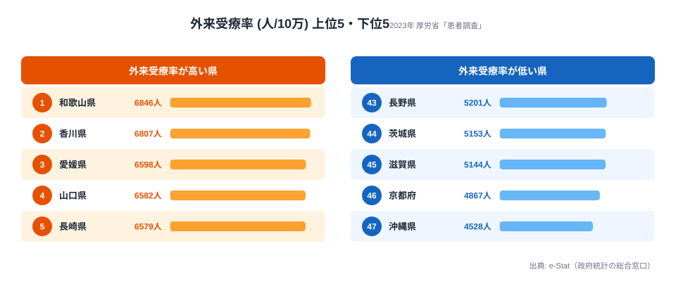
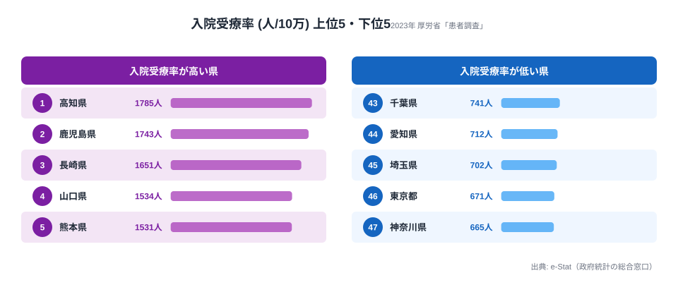

「同じ日本でも、住む県によって通院する人の割合が 1.5 倍も違う」──厚生労働省「患者調査」2023 年の外来受療率を都道府県別に並べると、はっきりとした地理の偏りが見えてきます。**1 位は和歌山県 (6,846 人/10 万)**、最下位は **沖縄県 (4,528 人/10 万)**。その差は約 1.5 倍です。

「外来受療率」とは、調査日に **病院・診療所に通院した人の数** を人口 10 万人あたりで示した指標で、地域の通院しやすさ・医療機関アクセス・受診行動を映す代表的な医療指標とされています。本記事の核心は、**上位を西日本が独占し、大都市圏や健康長寿県が下位に沈む**という構図、そして **同じ患者調査でも入院受療率では 1 位が高知県と入れ替わる**という「外来と入院で地理が違う」現象です。なぜそうなるのかを、データに即して読み解いていきます。

> [!NOTE]
> 受療率は「医療を必要とする人の総数」ではなく、調査日 1 日に**実際に受診した人の割合**を示す推計値です。受診のしやすさ (診療所の密度・交通) や受診慣習に左右されるため、高い=不健康、低い=健康とは単純に読めません。

## 外来受療率が高い県・低い県 (2023年)

外来受療率の最上位は **和歌山県 (6,846 人)**、僅差で **香川県 (6,807 人)** が続きます。3 位以下も愛媛・山口・長崎と並び、**上位 5 県はすべて中国・四国・近畿・九州の西日本**で占められます。対する下位は沖縄・京都・滋賀と、地理も性質も異なる県が並びます。

<source-link href="/ranking/outpatient-rate-per-100k">外来受療率ランキング (47都道府県) をもっと見る</source-link>

上位 10 県のうち、実に 9 県が **九州・中国・四国・近畿**に集中しています。唯一の例外が東海の **愛知県 (8 位・6,504 人)** で、大都市圏で唯一上位入りした県です。北海道・東北・関東の県は 1 つも TOP10 に入っていません。

なぜ西日本が高いのでしょうか。背景には、これらの地域に共通する 2 つの構造があると考えられます。第一に、**高齢化率の高さ**です。和歌山・山口・愛媛・長崎はいずれも全国でも高齢化が進んだ県で、高血圧・糖尿病・整形外科疾患など「通院で継続管理する慢性疾患」を抱える人が多くなります。第二に、**診療所 (クリニック) の密度**です。西日本の県は人口あたりの一般診療所が比較的多く、自宅近くで気軽に通院できる環境が、外来受療率を押し上げる方向に働いている可能性があります。

> [!TIP]
> 上位県の多くは高齢化率も高い県です。外来受療率を読むときは、人口構成 (とくに 65 歳以上の比率) を合わせて見ると「通院が多いのは医療体制か、それとも年齢構成か」を切り分けやすくなります。

## 最下位グループ - 都市部と健康長寿県が混在

下位 5 県は **長野 (43位・5,201人)・茨城 (44位)・滋賀 (45位)・京都 (46位)・沖縄 (47位)** と、上位とは対照的に「都市部」と「健康長寿県」が混ざり合っています。最下位の沖縄県 (4,528 人) は、1 位和歌山のわずか **66%** にとどまります。

沖縄が最下位になる最大の要因は、**若年人口比率が全国 1 位**である点です。外来受療率は高齢層ほど高くなるため、高齢者が相対的に少ない沖縄では、人口あたりの通院者数が構造的に低く出ます。これは「医療アクセスが悪い」のではなく、**年齢構成の違いが数字に現れている**と読むのが妥当です。

一方、長野・滋賀・京都・茨城が下位に入るのは一見すると意外です。長野は男女とも健康寿命が全国トップクラスの「健康長寿県」として知られ、通院を要する人がそもそも少ない可能性があります。また京都・滋賀のような都市部では、**大学病院など大規模医療機関への集約**が進み、近隣のクリニック外来に分散しにくい医療構造を持つことも、外来受療率を抑える方向に働くと考えられます。

> [!WARNING]
> 下位=医療が手薄、とは限りません。沖縄は若年人口、長野は健康長寿、京都は医療集約と、**同じ「低い」でも理由がまったく異なります**。順位の数字だけで地域の医療水準を評価しないよう注意が必要です。

## 入院1位の高知が、外来では32位に沈む理由

ここからが本記事の核心です。同じ患者調査の **入院受療率** を並べると、外来とは地理パターンが大きくズレます。入院受療率は **1 位高知 (1,785 人)・2 位鹿児島 (1,743 人)・3 位長崎 (1,651 人)** で、こちらも西日本が上位ですが、顔ぶれは外来と一致しません。

<source-link href="/ranking/inpatient-rate-per-100k">入院受療率ランキング (47都道府県) をもっと見る</source-link>

最も象徴的なのが高知県です。**入院受療率では堂々の 1 位なのに、外来受療率では 47 都道府県中 32 位 (5,548 人) と中位**に沈みます。逆に外来 1 位の和歌山は、入院では上位には来ません。入院 2 位の鹿児島は外来でも 10 位、入院 3 位の長崎は外来 5 位と、上位の重なりは限定的です。さらに入院受療率の最下位は神奈川 (665 人)・東京 (671 人) と大都市圏で、最大最小の差は **約 2.7 倍**と、外来の 1.5 倍よりも地域差が大きくなっています。

なぜ「入院は多いが外来は中位」という県が生まれるのか。データ単体では断定できませんが、次のような構造が考えられます。

- **[仮説] 病床数と医療提供体制の違い** — 高知県は人口あたり病床数が全国トップクラスで、入院での医療提供が厚い構造です。一方の和歌山県は診療所が県内に密に分布し、外来通院で完結しやすい環境が整っている可能性があります。検証には病床数・診療所数の都道府県別データとの突合が必要です。
- **[仮説] 慢性疾患と重症疾患の構成差** — 通院で管理する疾患 (高血圧・糖尿病・整形外科) が多い県と、入院で扱う重症・長期療養の発生率が高い県とで、受療の「場所」が分かれている可能性があります。
- **[仮説] 大都市圏での入院抑制** — 入院受療率の下位を神奈川・東京が占めるのは、平均在院日数の短さや在宅医療への移行など、都市部特有の医療提供スタイルを反映している可能性があります。

つまり外来と入院は、「医療を必要とする人の数」というより **「どこで医療を受けるか」という提供体制の構造差**を映しています。同じ西日本の高齢県でも、和歌山は外来型、高知は入院型と性格が分かれるわけです。受療率ランキングを読むときは、外来・入院を別々に見る視点が欠かせません。

## まとめ

- 外来受療率は 1 位 **和歌山県 (6,846 人/10 万)**、最下位 **沖縄県 (4,528 人/10 万)** で **約 1.5 倍**の地域差
- 上位 10 県のうち 9 県が **九州・中国・四国・近畿**に集中。唯一の大都市圏は愛知 (8 位)。背景に高齢化率の高さと診療所密度
- 最下位グループは **沖縄・京都・滋賀・茨城・長野**。沖縄は若年人口、長野は健康長寿、京都は医療集約と、低い理由がそれぞれ異なる
- 同じ患者調査でも **入院受療率は 1 位高知**で、外来 1 位の和歌山とは入れ替わる。高知は外来では 32 位の中位
- 入院は最大最小で約 2.7 倍と外来 (1.5 倍) より地域差が大きく、外来と入院は「どこで医療を受けるか」の構造差を映す
- 患者調査は **3 年に一度**の集計のため、2023 年値が現時点で最新の確定値

健康寿命など他の医療・健康指標とあわせて読むと、地域の医療構造がより立体的に見えてきます。詳しくは [男性 健康寿命ランキング](https://stats47.jp/ranking/healthy-life-expectancy-male) や、姉妹記事の [入院受療率1位は高知1,785人](https://stats47.jp/blog/inpatient-rate-prefecture-gap)、医療・年金など [社会保障カテゴリの指標一覧](https://stats47.jp/category/socialsecurity) もあわせてご覧ください。

## データ出典

- 厚生労働省「患者調査」(2023 年・人口 10 万対 外来受療率 / 入院受療率)
- e-Stat (政府統計の総合窓口) 経由で都道府県別に整備
