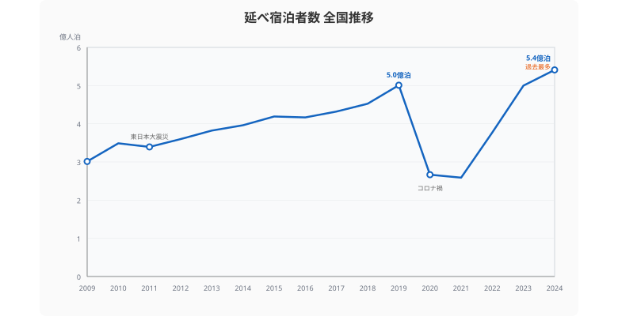
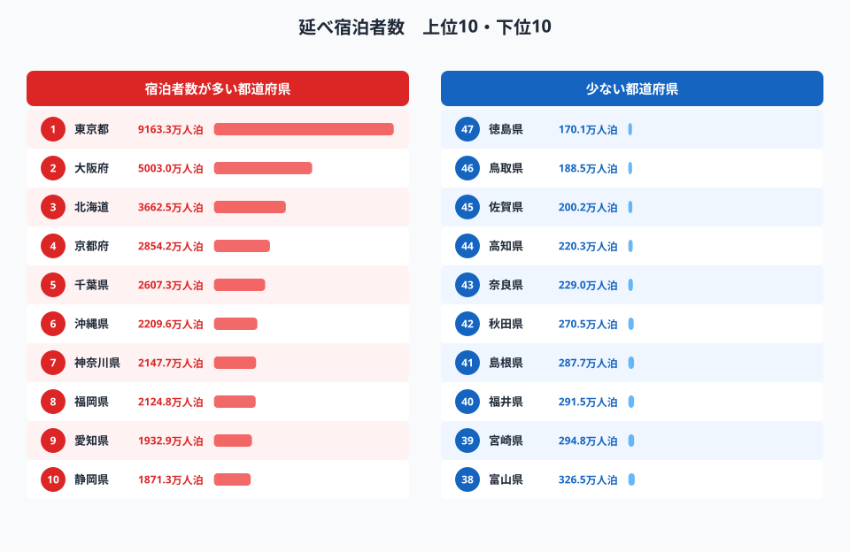
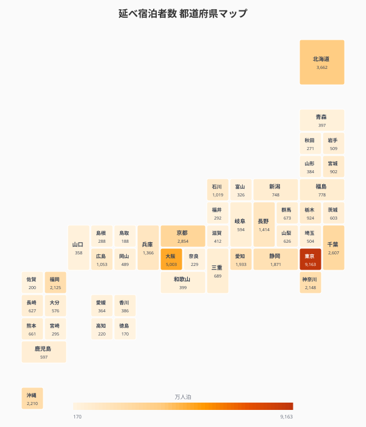
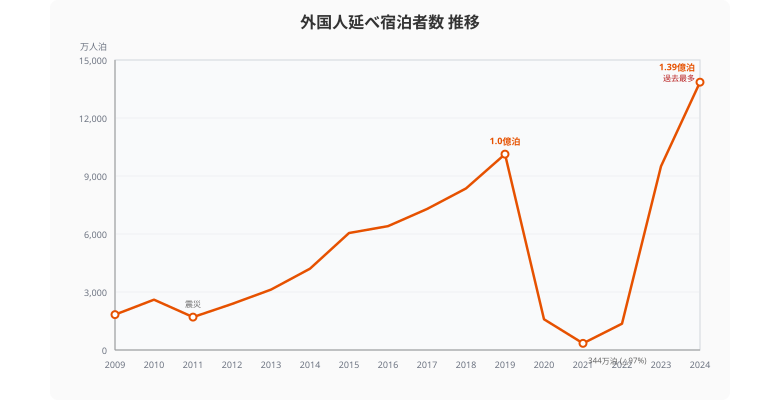
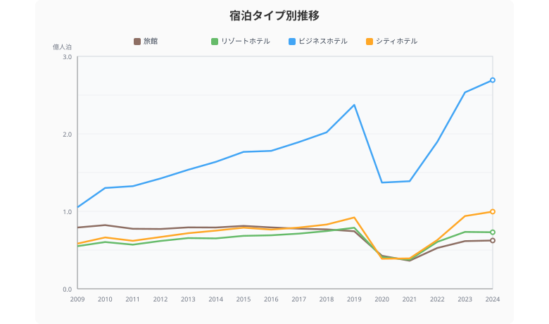
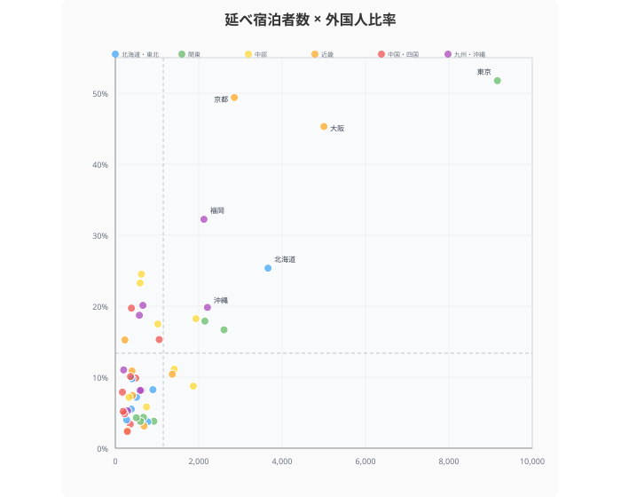
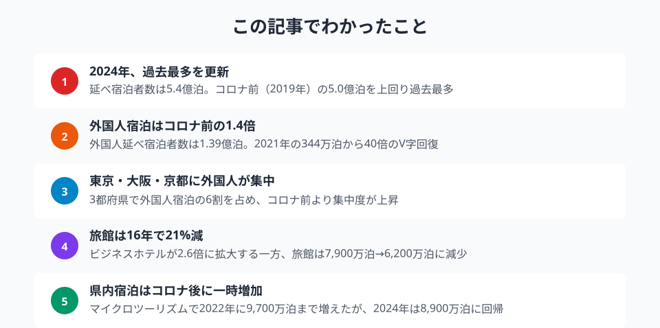

2019年に**5.0億泊**を突破した日本の宿泊市場は、翌2020年にわずか**2.7億泊**まで急落しました。そこからわずか4年で**5.4億泊**の過去最多を記録──この15年間の宿泊データを47都道府県で追います。

> [!NOTE]
> 本記事のデータは観光庁「宿泊旅行統計調査」に基づく延べ宿泊者数（人泊）です。1人が2泊すれば「2人泊」とカウントされます。データ出典は e-Stat 社会・人口統計体系（2009〜2024年）。

## 15年間の宿泊者数推移──3つの断層

<data-source url="https://www.e-stat.go.jp/dbview?sid=0000010107" label="e-Stat 社会・人口統計体系"></data-source>

日本の宿泊市場は、この15年間で**3つの断層**を経験しています。

**第1期：インバウンド成長期**（2009〜2019年）。2009年の3.0億泊から2019年の5.0億泊へ、10年間で**66%増加**しました。特に2013年以降の伸びが大きく、訪日外国人の爆発的増加が牽引しています。

**第2期：コロナ壊滅期**（2020〜2021年）。2020年は前年比 **−47%の2.7億泊** に急落。外国人宿泊はほぼ消滅し、国内旅行も大幅に縮小しました。2021年は**2.6億泊**でさらに底を打ちます。

**第3期：V字回復期**（2022年〜）。2022年に3.8億泊、2023年に5.0億泊とコロナ前水準に戻り、2024年は**5.4億泊で過去最多を更新**しました。底値からわずか3年で2倍以上に回復した計算です。

> [!TIP]
> 2024年の5.4億泊は、コロナ前ピーク（2019年）を**8%上回る**水準です。インバウンドの急拡大が回復を牽引しており、国内宿泊だけで見ると2019年比でほぼ同水準にとどまっています。

## 宿泊者数ランキング──東京9,163万泊で圧倒

<data-source url="https://www.e-stat.go.jp/dbview?sid=0000010107" label="e-Stat 社会・人口統計体系"></data-source>

**1位は[東京都](/areas/13000)の9,163万泊**。2位の大阪府に約4,000万泊の大差をつけ、北海道・京都府と続きます。上位4都道府県だけで全国の**3分の1**を占めます。

下位を見ると、**47位は[徳島県](/areas/36000)の170万泊**、46位は鳥取県の189万泊。1位の東京と47位の徳島では**約54倍**の格差があります。

### 全国マップ

<data-source url="https://www.e-stat.go.jp/dbview?sid=0000010107" label="e-Stat 社会・人口統計体系"></data-source>

マップで俯瞰すると、宿泊需要の集中パターンが見えてきます。

**大都市圏**（東京・大阪・愛知・福岡）は、ビジネス需要とインバウンドが重なり宿泊者数が多い。**リゾート圏**（北海道・沖縄・長野・静岡）は、観光目的の宿泊が中心です。

一方、**四国4県と北東北**は全体的に色が薄い。とくに徳島・鳥取・佐賀・高知は200万泊前後で、大都市圏の数十分の一にとどまります。

<source-link href="/ranking/total-overnight-guests">47都道府県の延べ宿泊者数ランキングをもっと見る</source-link>

<ad-slot></ad-slot>

## 外国人宿泊の激変──97%消滅から過去最多へ

<data-source url="https://www.e-stat.go.jp/dbview?sid=0000010107" label="e-Stat 社会・人口統計体系"></data-source>

外国人宿泊者のグラフは、全体以上にドラマチックです。

2009年の**1,830万泊**から2019年の**1.01億泊**まで、わずか10年で**5.5倍**に急増。しかし2021年には**344万泊**まで激減し、ピーク時の**97%が消滅**しました。

そこからの回復は劇的でした。2022年に1,361万泊、2023年に9,503万泊、そして2024年は**1.39億泊**と、コロナ前を**37%上回る過去最多**を記録しています。

### 国籍別の回復パターン

2024年の国籍別宿泊者数を見ると：

| 国籍 | 2024年（万泊） | 2019年比 |
|---|---:|---|
| 中国 | 2,519 | −15%（未完全回復） |
| 台湾 | 1,841 | +37% |
| 韓国 | 1,800 | +85% |
| 米国 | 1,449 | +99%（ほぼ倍増） |

**韓国と米国の伸びが突出**しています。韓国は日韓関係の改善と円安効果で2019年の1.9倍に急増。米国は2019年比でほぼ倍増し、欧米からの訪日需要の広がりを示しています。

一方、**中国は2019年比でまだ−15%** と唯一回復しきれていません。団体旅行の回復が遅れていることが要因です。

> [!WARNING]
> 外国人宿泊者数は2024年時点で全体の**25.6%** を占めます。2019年は20.2%でした。インバウンド依存度は着実に高まっており、国際情勢や為替変動の影響を受けやすい構造になっています。

<source-link href="/ranking/total-overnight-guests-foreign">47都道府県の外国人延べ宿泊者数ランキングをもっと見る</source-link>

## 宿泊タイプ別の構造変化──旅館からビジネスホテルへ

<data-source url="https://www.e-stat.go.jp/dbview?sid=0000010107" label="e-Stat 社会・人口統計体系"></data-source>

15年間で最も大きな構造変化は、**宿泊タイプの逆転**です。

| タイプ | 2009年 | 2024年 | 変化率 |
|---|---:|---:|---|
| ビジネスホテル | 1.05億泊 | 2.69億泊 | **+156%** |
| シティホテル | 0.58億泊 | 1.00億泊 | +71% |
| リゾートホテル | 0.55億泊 | 0.73億泊 | +33% |
| 旅館 | 0.79億泊 | 0.62億泊 | **−21%** |

**ビジネスホテルは15年で2.6倍**に膨張し、全宿泊者数の約半分を占めるまでに成長しました。出張需要だけでなく、インバウンド客の宿泊先としても選ばれるようになったことが大きい。

対照的に、**旅館は唯一の減少**です。2009年の7,908万泊から2024年の6,231万泊へ、約21%減少しました。コロナ前の2019年時点ですでに7,426万泊と減少傾向にあり、コロナがこの流れを加速させた形です。

> [!NOTE]
> ビジネスホテルはコロナ禍でも比較的底堅く、2021年の1.39億泊は旅館（0.36億泊）の約4倍。出張需要の消失をテレワーカーの一時的利用などが部分的に補ったとみられます。

<ad-slot></ad-slot>

## インバウンドの地域集中──東京・大阪・京都で6割

<data-source url="https://www.e-stat.go.jp/dbview?sid=0000010107" label="e-Stat 社会・人口統計体系"></data-source>

散布図で「宿泊者数の多さ」と「外国人比率」の関係を見ると、インバウンドの**極端な偏り**が浮かび上がります。

**東京都は外国人比率51.8%** ──宿泊者の過半数が外国人です。大阪府は45.3%、京都府は49.4%と、この3都府県は宿泊の半分近くがインバウンドで構成されています。

上位3都府県の外国人宿泊者数を合計すると**8,419万泊**。全国の外国人宿泊者1.39億泊の**約61%** がこの3地域に集中しています。

一方、右下に位置する**北海道・沖縄・千葉は国内観光型**。宿泊者数は多いが外国人比率は20%前後で、国内旅行客が主体です。

左下に集まる地方県の多くは、外国人比率が10%未満。宿泊者数自体が少なく、インバウンドの恩恵もほとんど受けていません。「観光の地方分散」が長年の政策課題とされる理由が、このグラフに凝縮されています。

<source-link href="/correlation?x=total-overnight-guests&y=total-overnight-guests-foreign">宿泊者数と外国人宿泊者数の相関を都道府県別に確認する</source-link>

## まとめ

日本の宿泊市場は15年間で激変しました。コロナという「断層」を挟んで、何が変わり何が変わらなかったのかを整理します。

データから見えた構造は次の3点です。

1. **V字回復の主役はインバウンド**。外国人宿泊者は2019年比で37%増加し、全体の25.6%を占める。特に韓国・米国・台湾からの伸びが著しい
2. **宿泊タイプの逆転**。ビジネスホテルが15年で2.6倍に拡大する一方、旅館は21%減少。日本の「泊まり方」そのものが変わっている
3. **インバウンドの一極集中**。外国人宿泊の61%が東京・大阪・京都に集中。地方への分散は進んでいない

旅行先を選ぶとき、「混雑を避けたい」なら宿泊者数が少なく外国人比率も低い地方県が穴場です。逆に「インバウンドの活気を楽しみたい」なら、東京・大阪の外国人比率50%超の環境はもはや海外旅行に近い非日常と言えるかもしれません。

## データ出典

本記事のデータはe-Stat（政府統計の総合窓口）を基に作成しています。

本記事の対象データ: [関連カテゴリ](/category/tourism)
