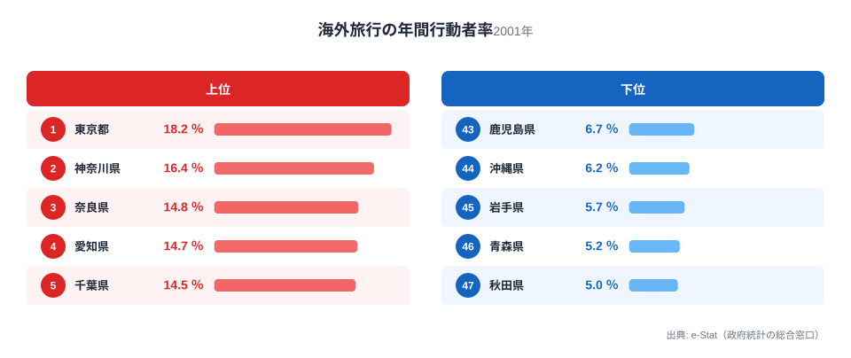
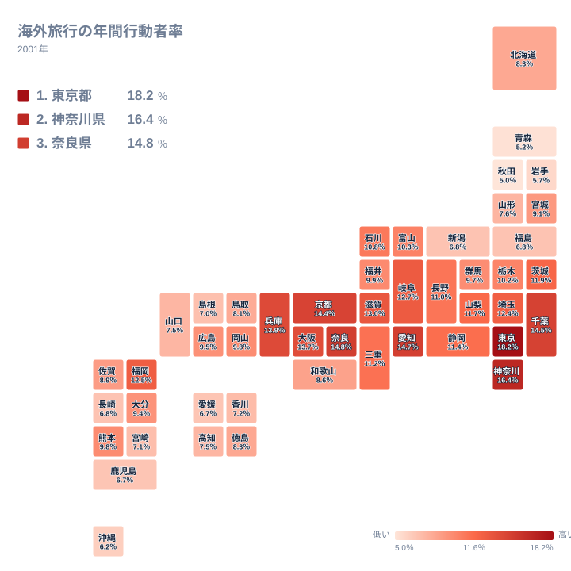
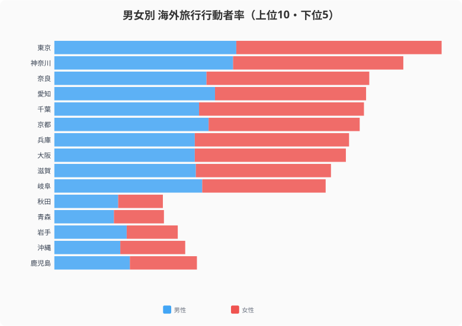
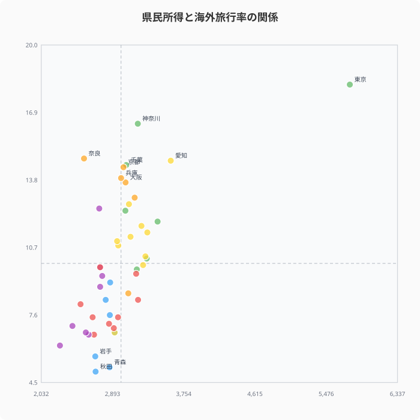

円安の逆風が続く中でも海外旅行者は回復傾向にある。しかし「海外に行く人の割合」を都道府県別に見ると、最大で約3.6倍もの格差がある。あなたの県の「外向き度」はどのくらいだろうか。社会生活基本調査のデータから、日本人の国際的な移動意欲の地域差を読み解く。

## 海外旅行行動者率ランキング──1位は東京の18.2%

2001年の社会生活基本調査による海外旅行行動者率（15歳以上人口のうち海外旅行をした人の割合）を見ると、1位は[東京都](/areas/13000)で18.2%です。2位は[神奈川県](/areas/14000)で16.4%、3位は[奈良県](/areas/29000)で14.8%、4位は愛知県で14.7%と続きます。奈良県が3位に入っているのが意外なポイントです。関西国際空港へのアクセスに優れ、外国人観光客との接点が多い環境が影響していると考えられます。

一方、下位は東北地方が並びます。最下位の[秋田県](/areas/05000)は5.0%、次いで青森県が5.2%、岩手県が5.7%です。1位の東京と最下位の秋田では約3.6倍の差があります。東北は国際空港へのアクセスが不便で、直行国際便の便数も限られるため、海外旅行のハードルが構造的に高いと考えられます。上位に神奈川・愛知が入るのは、成田・羽田・中部国際空港という主要空港への到達時間が短いことが一因という仮説が成り立ちます。ただし本記事のデータには企業属性や渡航目的の内訳は含まれておらず、産業構造との関係は推測の域を出ない点に注意してください。

> [!NOTE]
> このデータは2001年の社会生活基本調査に基づく。海外旅行行動者率の都道府県別データはこの年が最新で、以降の調査では都道府県別集計が行われていないため、現在の水準とは異なる可能性がある点に留意してください。

<source-link href="/ranking/overseas-travel-annual-participation-rate-15plus">海外旅行行動者率の47都道府県ランキング全順位を確認する</source-link>

## 全国マップで見る「外向きな県」の分布

タイルグリッドマップで全国を俯瞰すると、首都圏・中京圏・近畿圏の大都市圏で海外旅行率が高く、東北・九州南部で低い傾向が明確に見えます。地理的に空港へのアクセスが良い地域ほど率が高い傾向があります。特に[大阪府](/areas/27000)は12.6%、愛知県は14.7%と、大型国際空港を擁する府県は近隣の県の海外旅行率も押し上げている可能性があります。地図の分布は、東京・大阪・名古屋を頂点とした三大都市圏から離れるほど率が下がる同心円状に見えます。この記事のデータだけでは移動時間や交通費までは検証できませんが、拠点空港からの距離が海外旅行のしやすさに関係しているという仮説は成り立つでしょう。九州南部・四国は空港はあっても国際線の便数が限られており、乗り継ぎの手間がハードルとして残っている可能性があります。

<ad-slot></ad-slot>

## 男女差に注目──「女性の方が海外に行く」は本当か？

男女別に見ると、興味深いパターンが浮かび上がります。東京都では女性の海外旅行率が19.3%で、男性の17.1%を上回ります。千葉県でも女性が15.5%、男性が12.5%で、女性が大きく上回っています。

一方、愛知県では男性が15.1%、女性が14.3%で、男性がやや上回ります。このように県によって逆転現象も見られます。都市部では女性の方が海外旅行に積極的な傾向がありますが、それは全国共通ではありません。製造業が主要産業の県では男性の海外出張がカウントされやすく、女性との差が縮まりやすい可能性があります。専業主婦・パートタイム就労の女性が多い地方では余暇時間の使い方に制約が生まれやすく、これも男女差を縮める一因になっていると考えられます。

## 所得が高い県ほど海外旅行する？

1人当たり県民所得と海外旅行行動者率の散布図を見ると、一定の正の相関はあるものの、例外も多くあります。奈良県は所得水準が中程度でありながら海外旅行率3位に入っており、近畿圏の国際空港（関西国際空港）へのアクセスの良さが影響していると考えられます。

> [!WARNING]
> 散布図に正の相関が見えても、所得が海外旅行率を「引き上げている」と直接の因果関係を結論づけることはできません。空港からの距離・世帯構成・地域の商習慣など、所得以外の要因が両方に影響している可能性があります。相関は傾向をつかむ手がかりに留め、因果関係の断定は避けてください。

逆に、茨城県は所得水準が比較的高いにもかかわらず海外旅行率は中位にとどまっている。所得だけでなく、空港アクセス・国際線の便数・県民の海外志向といった複合的な要因が海外旅行率を左右しています。所得と行動者率の関係は傾向の参考として見るにとどめ、空港立地や地域の国際化度合いを組み合わせて解釈することが重要です。

> [!TIP]
> 県民所得は2021年度のデータで、海外旅行率（2001年）とは20年の年次差があります。同じ年のデータで再検証したい場合は、[国内旅行行動者率ランキング](/ranking/travel-participation-rate-domestic)など同一調査年の指標と組み合わせるとより精度の高い比較ができます。

<source-link href="/ranking/travel-participation-rate-domestic">国内旅行行動者率の47都道府県ランキング全順位を確認する</source-link>

<ad-slot></ad-slot>

## まとめ

海外旅行行動者率から見える日本人の「外向き度」の地域差を整理する。

海外旅行率は単なる「旅行好き度」の指標ではなく、その地域の国際的な開放度や移動環境を映し出す鏡でもあります。ただしこのデータは2001年時点のもので、23年が経過した今も同じ格差構造が続いているかは検証できていません。むしろこの間にLCC路線の拡充や地方空港の国際化が進んでおり、格差が縮小している可能性もあります。空港アクセスの改善が地方の「外向き度」をどう変えたか、最新の統計が公表された際に改めて検証する価値があるテーマです。

**データ出典:**
- [社会生活基本調査（e-Stat）](https://www.e-stat.go.jp/stat-search/files?stat_infid=000001017814)（2001年）
- [社会・人口統計体系 都道府県データ（e-Stat）](https://www.e-stat.go.jp/regional-statistics/ssdsview)（県民所得: 2021年度）

## データ出典

本記事のデータはe-Stat（政府統計の総合窓口）を基に作成しています。

本記事の対象データ: [関連カテゴリ](/category/international)
