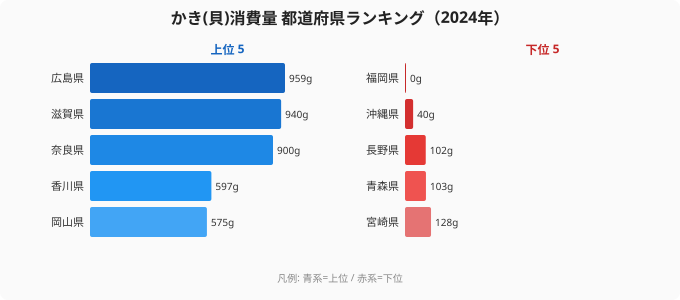

「牡蠣といえば広島」――この連想は、消費量データでも一応は正しい。2024年の家計調査(都道府県庁所在市・二人以上世帯の年間かき消費量)で、[広島県](/areas/34000)は1世帯あたり959gと、47都道府県のトップに立っている。

ところが2位を見て、多くの人が首をかしげるはずだ。**2位は、海に面していない滋賀県の940g。** 広島とはわずか19gしか違わない。さらに3位も海なし県の奈良900g。牡蠣の名産地である宮城県は17位(317g)、三重県は39位(138g)、長崎県は38位(140g)と、「産地ほど食べていない」逆転現象が起きている。

> [!NOTE]
> ここでの「かき消費量」は、各都道府県庁所在市の二人以上世帯が1年間に購入した「かき(貝)」の量(家計調査、単位g)です。生産量や水揚げ量ではなく、家庭が店で買って食べた量を指します。外食や贈答での消費は含まれません。

この記事では、産地と消費地が一致しない不思議を、2024年の47都道府県データから読み解いていく。

## かき消費量トップ10と最下位（2024年）

まずは2024年の上位と下位を見てみよう。

トップは広島の959g。これは予想どおりだ。だが、その直後に滋賀(940g)・奈良(900g)という近畿の内陸2県が並ぶ。上位の顔ぶれを眺めると、広島・岡山(5位575g)・香川(4位597g)の瀬戸内グループに、滋賀・奈良・大阪(6位490g)・京都(16位321g)という近畿圏が割って入る構図になっている。**「瀬戸内+近畿」が消費の中心であって、必ずしも「産地」ではない**ことが、すでにこの10件から見えてくる。

<source-link href="/ranking/oyster-consumption-quantity">かき(貝)消費量ランキングの全47都道府県を見る</source-link>

> [!TIP]
> 牡蠣は鮮度が落ちやすい一方、近年は産地から都市部への流通網が整い、内陸でも家庭で気軽に買えるようになりました。上位に滋賀・奈良が来るのは「食べる文化が根づいているか」という需要側の差を映している可能性があります。

## 最下位グループ──九州・南国・内陸が沈む

次に下位5県を見てみよう。

| 順位 | 都道府県 | 消費量 |
|---:|---|---:|
| 43 | 宮崎県 | 128g |
| 44 | 青森県 | 103g |
| 45 | 長野県 | 102g |
| 46 | 沖縄県 | 40g |
| 47 | 福岡県 | 0g |

最下位は[福岡県](/areas/40000)の0g。これは2024年の家計調査で福岡市の二人以上世帯のかき購入額が統計上ゼロだったことを示している。46位は沖縄の40g、45位は内陸の長野102gと続く。1位広島(959g)と46位沖縄(40g)を比べると、その差は約24倍にのぼる(最下位福岡は0gのため倍率は計算不能)。

> [!WARNING]
> 家計調査は標本調査のため、消費量の少ない品目や人口の少ない都市では年ごとの振れ幅が大きく出ます。福岡の「0g」も、福岡で牡蠣がまったく食べられていないという意味ではなく、その年の標本に購入世帯がほぼ含まれなかった結果と読むべきです。順位の絶対視は避け、傾向として捉えるのが安全です。

下位に並ぶのは、宮崎・鹿児島(42位129g)などの南九州、沖縄、そして長野・青森といった寒冷地や内陸です。気候的に鍋文化が弱い地域や、ほかの海産物・郷土食が強い地域では、かきの家庭内消費が伸びにくい構造がうかがえます。

## 発見①：産地は必ずしも消費地ではない

このランキング最大の意外性は、**牡蠣の主要産地が消費量では上位に来ていない**点だ。

- 宮城県(全国有数のかき産地)…… 17位(317g)
- 三重県(的矢かきなどで知られる)…… 39位(138g)
- 長崎県(養殖が盛ん)…… 38位(140g)

一方で、海に面していない滋賀(2位940g)・奈良(3位900g)が上位を占める。産地は「獲れたものを出荷して稼ぐ」側であり、必ずしも地元で大量に「買って食べる」わけではない――出荷と家庭内消費はまったく別の行動だということが、データにくっきり表れている。

> [!NOTE]
> 広島が1位なのは、産地であると同時に消費地でもある稀なケースと考えられます。生産量1位の地元で食文化も濃いため、消費でもトップを保っています。

## 発見②：広島の数字は年によって大きく動く

実は広島の首位は盤石に見えて、年ごとの変動が非常に大きい。同じ家計調査の過去データでは、広島が首位を逃した年も複数ある。

- 2010年：首位を栃木(2495g)に明け渡し、広島は2番手(1099g)
- 2016年：首位は宮城(985g)、広島は3番手(794g)
- 2022年：首位は香川(1179g)、広島は二桁順位(612g)まで後退

[仮説] 標本調査ゆえの単年の振れと、その年の価格・天候・贈答需要などが重なると、広島でも順位が大きく動くと考えられます。検証するには、複数年平均で見るのが妥当です。実際、2007〜2024年の18年平均で見ると広島は約1475gで他県を大きく引き離しており(岡山が約863gで2番手)、長期では広島の優位は揺るがないことが確認できます。

つまり「2024年は2位が滋賀」という逆転は単年のスナップショットであり、**長期トレンドでは広島が圧倒的だが、ある1年を切り取ると思わぬ県が上位に飛び込む**――それが家計調査の面白さでもある。

<source-link href="/ranking/oyster-consumption-quantity">年次推移グラフでかき消費量の動きを確認する</source-link>

## まとめ

- 2024年のかき(貝)消費量1位は広島県(959g)、2位は海なし滋賀県(940g)、3位も内陸の奈良県(900g)。
- 最下位は福岡県(0g)、46位は沖縄県(40g)。1位広島と46位沖縄では約24倍の差。
- 牡蠣の主要産地である宮城は17位(317g)、三重は39位、長崎は38位と、「産地=消費地」ではない逆転が明確。
- 消費の中心は「瀬戸内+近畿」。出荷で稼ぐ産地と、買って食べる消費地は別物。
- 広島の1位は単年では揺らぐが(過去には栃木・宮城・香川が首位の年も)、18年平均では約1475gで圧倒的。

## データ出典

総務省統計局「家計調査」(都道府県庁所在市・二人以上世帯、品目別年間消費量)。e-Stat 経由で整備した2007〜2024年のデータを使用し、本記事は最新年(2024年)の値を中心に分析しています。標本調査の性質上、単年の順位には振れがある点にご留意ください。

本記事の対象データ: [関連カテゴリ](/category/economy)
