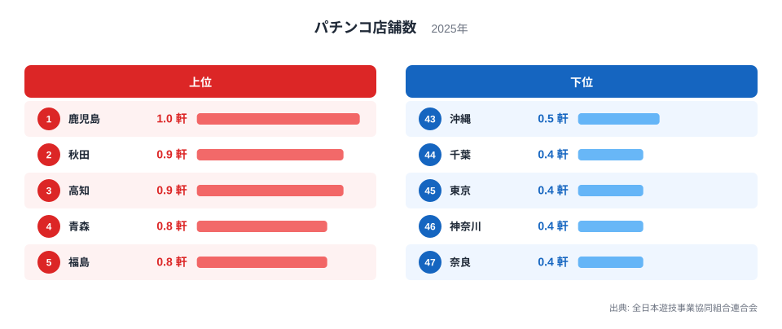
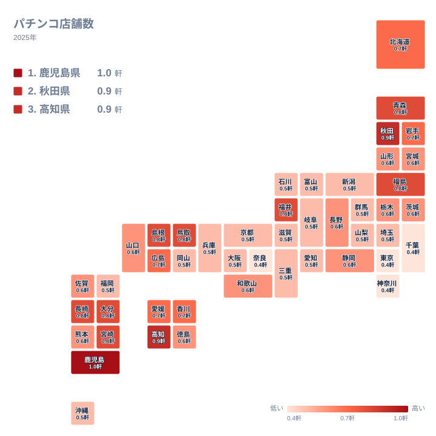
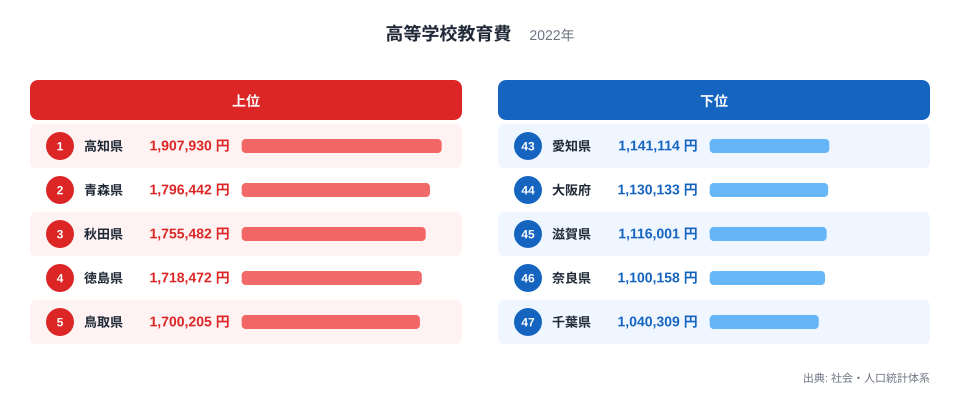
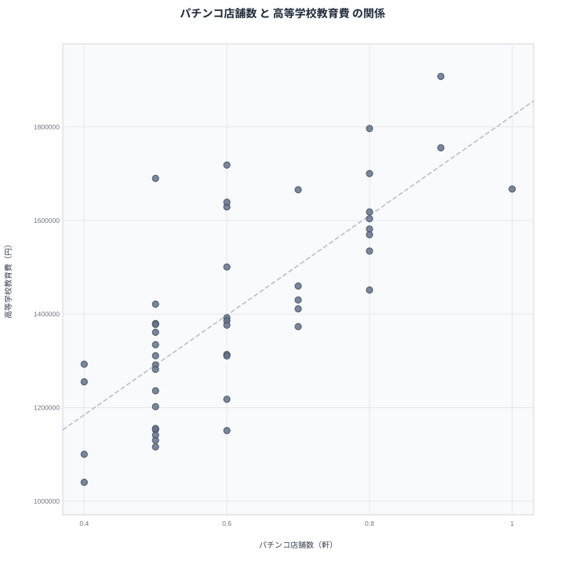

統計の世界には、思わず二度見する相関がときどき現れます。今回の主役はその代表格です。人口1万人あたりのパチンコ店舗数と、高校生1人当たりの教育費。この2つの都道府県ランキングの相関係数は0.75に達します。

「パチンコが盛んな県ほど教育にお金をかけている」──そう読みたくなりますが、もちろん違います。先に種明かしをすると、この相関の正体は人口密度です。どちらも「1人当たり」に換算した指標であるがゆえに、人口の少ない県で値が大きくなるという共通の性質を持っているのです。

なぜそうなるのか。この記事は、ランキングの数字そのものよりも「1人当たり指標をどう読むか」という統計リテラシーの話として読んでいただくのが正解です。

## パチンコ店舗密度ランキング──1位は鹿児島です

人口1万人あたりのパチンコ店舗数で、1位は鹿児島県の1.0軒です。2位は秋田県で0.9軒、3位は高知県も0.9軒、4位は青森県で0.8軒、5位は福島県で0.8軒と続きます。南九州・北東北・四国と、大都市圏から遠い県が上位に並びます。

下位はその逆です。47位は奈良県で0.4軒、46位は神奈川県で0.4軒、45位は東京都も0.4軒、44位は千葉県で0.4軒。首都圏と大阪圏のベッドタウンが最下位グループを占め、1位の鹿児島県との差は約2.5倍です。

店舗の絶対数なら人口の多い都市部が上位に来るはずです。人口1万人あたりに換算した瞬間、ランキングは反転し、「地方ほどパチンコ店が身近にある」という地図に変わります。車社会でロードサイド店が成立しやすく、娯楽の選択肢が都市部より限られる地域構造が、この密度の高さに映っています。

> [!NOTE]
> パチンコ店舗数は、ぱちんこ営業所のみを数えた値です（2025年、原典は警察庁保安課、全日本遊技事業協同組合連合会が集計・公表）。麻雀店やゲームセンターは含みません。人口1万人あたりの換算には2024年の推計人口を使っています。政府統計ではなく業界団体の公表値である点にも留意してください。

<source-link href="/ranking/pachinko-shop-density-per-10k">パチンコ店舗数ランキングをもっと見る</source-link>

## 地図で見ると「都市の逆写像」が現れます

47都道府県を地図に落とすと、濃い色は列島の外縁部に分布します。北東北、南九州、四国、山陰。いずれも大都市圏から距離のある地域です。逆に首都圏・中京圏・近畿圏の中心部は揃って淡く、地図全体が「都市化の逆写像」のような配色になります。

この分布パターンを覚えておいてください。次に見る高校教育費の地図が、これとよく似た形をしているからこそ、冒頭の奇妙な相関が生まれるのです。あわせて見る: [鹿児島県の県データ](/areas/46000) / [高知県の県データ](/areas/39000)

## 高校生1人当たりの教育費──高知が190万円で1位です

高等学校教育費は、全日制高校の生徒1人当たりに支出される学校教育費です。地方教育費調査に基づく行政側の支出であり、家庭が払う塾代や授業料のことではありません。

1位は高知県で190万7,930円です。2位は青森県で179万6,442円、3位は秋田県で175万5,482円、4位は徳島県で171万8,472円、5位は鳥取県で170万205円。パチンコ密度ランキングで見た顔ぶれと、驚くほど重なります。

下位は47位が千葉県で104万309円、46位は奈良県で110万158円、45位は滋賀県で111万6,001円、44位は大阪府で113万133円、43位は愛知県で114万1,114円です。1位の高知県と47位の千葉県の差は約1.8倍。こちらも大都市圏の県が並びます。

例外的に目を引くのが6位の京都府で168万9,982円です。大都市圏でありながら教育費上位に入るのは、公立高校への支出が手厚い京都の教育行政の特徴が出ているとみられ、後で見る散布図でも帯から上に外れる存在です。

<source-link href="/ranking/high-school-education-cost-fulltime-per-student">高等学校教育費ランキングをもっと見る</source-link>

## 散布図で見る相関係数0.75

2つの指標を散布図にすると、47都道府県が右上がりに並びます。相関係数は0.75です。右上には高知県・青森県・秋田県・鹿児島県が、左下には千葉県・奈良県・神奈川県が固まり、両ランキングの鏡写しぶりが一目で分かります。

もちろんズレもあります。福井県はパチンコ密度では6位の0.8軒と高い一方、教育費は18位の145万1,389円と中位です。京都府は先に見たとおり教育費6位なのに、パチンコ密度は下位グループに沈みます。相関係数0.75は「強いが例外もある」水準で、この例外こそが「パチンコと教育費に直接の関係はない」ことの傍証になります。

> [!WARNING]
> 相関は因果関係を意味しません。パチンコ店舗数は2025年の業界団体公表値、高等学校教育費は2022年度の地方教育費調査に基づく値で、調査年も出典の性格も異なります。「パチンコが教育費を増やす」「教育費がパチンコを増やす」といった読み方は、どちらも成り立ちません。

## 真因を考える──「1人当たり」の分母に注目してください

人口規模の影響を統計的に取り除いても、偏相関係数は0.68と強い相関が残ります。単に「人口が少ない県だから」では消えない結びつきです。鍵は、2つの指標がどちらも「1人当たり」への換算を経ていることにあります。

教育費側の仕組みはこうです。学校の運営費は教員の人件費や施設の維持費といった固定費が大部分を占めます。生徒が減っても、学校と教員をゼロにはできません。中山間地や離島を抱え、小規模校を維持せざるを得ない県ほど、固定費を少ない生徒数で割ることになり、生徒1人当たりの教育費は高くなります。高知・青森・秋田は少子化が先行してきた県であり、1位から3位という位置は「教育熱心さ」ではなく「学校規模の小ささ」の反映です。

パチンコ側も同じ構造です。人口1万人あたりの店舗数は、人口密度が低く商圏が広い地域ほど高く出ます。都市部では地価が高く、映画館から飲食店まで娯楽の競合がひしめくため、人口当たりの店舗数はむしろ少なくなります。

つまり、「生徒1人当たり教育費」と「人口1万人あたりパチンコ店舗数」は、どちらも分母の側──人口や生徒数の少なさ──に強く引っ張られる指標なのです。2つの指標は互いに関係しているのではなく、同じ「人口密度の低さ」をそれぞれの分野で測っていただけでした。

> [!TIP]
> 「1人当たり」「10万人当たり」の指標を見たら、分子の大きさではなく分母の小ささが効いていないかを最初に疑うのが統計リテラシーの基本です。教育費が高い県は教育熱心とは限らず、施設が多い県は需要が多いとは限りません。都道府県の教育データは[教育・文化のテーマページ](/themes/education-culture)で幅広く確認できます。

## データ出典

- パチンコ店舗数: 全日本遊技事業協同組合連合会公表の都道府県別ぱちんこ営業所数（2025年、原典は警察庁保安課）を人口1万人あたりに換算
- 高等学校教育費: 総務省統計局「社会・人口統計体系」（地方教育費調査報告書に基づく2022年度値・全日制・生徒1人当たり）
- 相関係数・偏相関係数（人口を統制）は上記2指標の47都道府県値から算出
