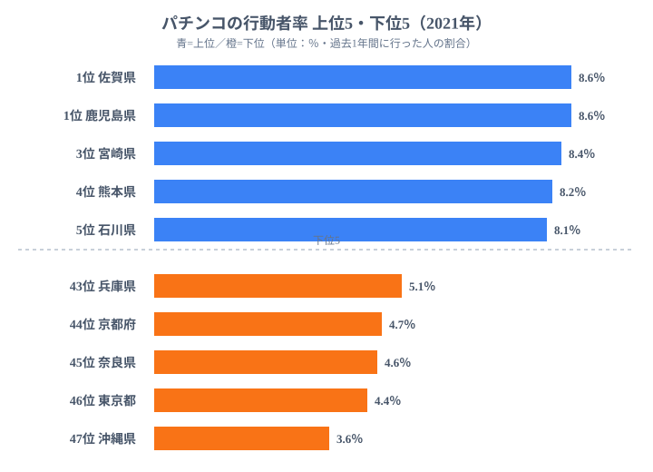

「パチンコが盛んな県」と聞いて、まずどこを思い浮かべるでしょうか。繁華街にホールがひしめく東京や大阪、あるいは雪国でレジャーの選択肢が限られる東北──そんなイメージを持つ方は多いでしょう。しかし2021年の社会生活基本調査が描いた地図は、その直感をきれいに裏切っています。

**パチンコの行動者率**とは、過去1年間にパチンコ（パチスロを含む）を行った人の割合のことです。趣味・娯楽としての「やった/やらなかった」を国が定点観測した数字です。47都道府県を並べると、1位は**佐賀県と鹿児島県がともに8.6％**、最下位は**沖縄県の3.6％**で、その差は約2.4倍にのぼります。

注目すべきは、上位を**九州勢が独占**し、人口が集中する**東京都が46位（4.4％）**という構図です。娯楽産業の中心地であるはずの大都市圏が、なぜ参加率では下位に沈むのでしょうか。この記事では、データに沿ってその「意外な地図」を読み解いていきます。

> [!NOTE]
> 「行動者率」は出店数や売上ではなく、**住民のうち実際にプレイした人の割合**を測る指標です。ホールが多い＝行動者率が高い、とは限らない点に注意が必要です。出典は総務省「社会生活基本調査（2021年）」。

## 上位・下位を一望する

まず上位5県と下位5県の分布を図で確認しましょう。

<source-link href="/ranking/hobby-participation-rate-pachinko">パチンコの行動者率ランキングをもっと見る</source-link>

上位には**佐賀県（1位・8.6％）と鹿児島県（1位・8.6％）**が同率で並び、続いて宮崎県（3位・8.4％）、熊本県（4位・8.2％）、石川県（5位・8.1％）と続きます。九州4県が上位5枠のうち4枠を占めていることが一目でわかります。一方、最下位は**沖縄県（3.6％）**で、その上には東京都（46位・4.4％）、奈良県（45位・4.6％）、京都府（44位・4.7％）と大都市圏・近畿の都市部が並んでいます。

この「上位＝九州・日本海側、下位＝大都市圏」という対比が、このランキングの最大の特徴です。単純な「ホール数が多い地域が高い」「人口が多い地域が高い」という仮説のどちらも当てはまらず、余暇の使い方そのものに地域差があることを示しています。

[佐賀県](https://stats47.jp/areas/41000)や[鹿児島県](https://stats47.jp/areas/46000)がなぜトップに立つのか──その背景を次のセクションで掘り下げます。

## 上位グループの地理パターン：九州・北陸・東北に集中

上位10県を地理的に分類すると、明確な3つのクラスターが浮かびます。

第1クラスターは**九州勢**です。佐賀（1位・8.6％）・鹿児島（1位・8.6％）・宮崎（3位・8.4％）・熊本（4位・8.2％）の4県が上位4枠を独占しています。この4県はいずれも三大都市圏から遠く、夏の猛暑や台風が多い気候の中で屋内型レジャーの需要が高い地域です。また、九州は全国に先駆けてパチンコ文化が根付いた地域との指摘もあり、文化的な定着度が行動者率に反映されている可能性があります。

> [!NOTE]
> 上位の長崎県（19位・7.3％）・大分県（17位・7.4％）まで含めると、九州9県のうち7県が20位以内に入ります。「九州全体でパチンコ参加率が高い」という傾向は、データ上は明確です。

第2クラスターは**北陸・日本海側**です。石川（5位・8.1％）・福井（8位・7.9％）・富山（29位・6.5％）と、日本海側の県が上位〜中位に集まります。北陸は冬期の積雪が多く、屋外レジャーの選択肢が季節的に制限されます。そのぶん屋内娯楽の需要が年間を通じて安定しやすい、という構造的な背景が考えられます。

第3クラスターは**東北**です。岩手（6位・8.0％）・青森（14位・7.6％）・宮城（16位・7.5％）・山形（21位・6.9％）が中上位に位置します。北陸と同様に厳冬期の外出制限が屋内レジャー需要を高める要因として考えられますが、秋田（25位・6.7％）・福島（20位・7.0％）もおおむね中位以上であり、東北全体として平均を上回る傾向があります。

> [!WARNING]
> ただし「地方＝高い」と単純化はできません。徳島（39位・5.3％）や新潟（39位・5.3％）のように下位の地方県もあり、関東でも茨城（32位・6.0％）・栃木（31位・6.2％）は中位に位置します。地域ブロックよりも、**個々の県の余暇・娯楽環境や文化的背景**が効いている可能性が高く、気候だけで全てを説明することはできません。

## 最下位グループ：大都市圏が並ぶ理由

最下位の**沖縄県（3.6％）**を除けば、下位5県は関西・首都圏の都市部で占められています。東京都（46位・4.4％）、奈良県（45位・4.6％）、京都府（44位・4.7％）、兵庫県（43位・5.1％）です。さらに41位には千葉県と神奈川県（ともに5.2％）も入っており、**東京圏・京阪神の中核県がそろって下位**というパターンが鮮明です。

[東京都](https://stats47.jp/areas/13000)が46位という事実は、一見すると意外に感じます。日本最大のパチンコホール集積地のひとつでありながら、住民のプレイ率は全国最低水準にある──この「ホール数と参加率の逆転」が、このランキングの最も重要な示唆です。

> [!TIP]
> 下位に都市部が集まる背景には、「娯楽の選択肢の多さ」が考えられます。映画・ショッピング・外食・観劇など代替レジャーが豊富な大都市では、余暇がパチンコに集中しにくいという見方です。これはデータの並びと整合する解釈ですが、本調査は理由までは尋ねていないため、あくまで構造的な仮説として読んでください。

奈良県・京都府が大阪府（6位・8.0％）と隣接しながら下位に沈む点も興味深いです。同じ近畿圏でも、大阪は上位・京都奈良は下位と、府県をまたいで参加率が大きく分かれています。奈良・京都は観光業が盛んで外国人も含む来訪者が多い一方、住民の余暇スタイルは伝統・文化志向が強い可能性があります。

沖縄の最下位（3.6％）は特殊な位置づけです。沖縄は気候が温暖で屋外レジャーの選択肢が豊富であることに加え、米軍基地の影響で独自の娯楽文化が形成されてきた背景もあります。「地方だから高い」では説明できない例外として注目されます。

## 発見：同じ大都市圏でも、大阪と東京で正反対

このランキングで最も「意外」なのは、**大阪府と東京都の逆転**です。

大阪府は6位・8.0％（上位グループ）に位置する一方、東京都は46位・4.4％（下位から2番目）と、**1.8倍以上**の開きがあります。どちらも日本を代表する大都市圏でありながら、パチンコ行動者率では対極に位置しています。「都市だから低い」という一律の説明が通用しないことを、この2つの都市が端的に示しています。

[教育・スポーツカテゴリ](https://stats47.jp/category/educationsports)の他の余暇指標と比較すると、東京は多くの娯楽活動で高い参加率を示す一方、ギャンブル系や射倖性のある娯楽では相対的に低い傾向があります。一方、大阪・名古屋（愛知8位・7.9％）・三重（8位・7.9％）の東海・近畿エリアは全般的に高めです。

[仮説] 大阪が高い背景には、繁華街文化やレジャー消費の傾向の違いがあるとも考えられますが、本調査からは断定できません。検証するには、世帯収入・通勤時間・他の余暇活動の行動者率などと突き合わせる必要があります。ここでは「**同じ大都市圏でも県民の余暇の使い方は均一ではない**」という事実の提示にとどめます。

## まとめ

- **1位は佐賀・鹿児島がともに8.6％**。九州勢（宮崎8.4％・熊本8.2％を含む）が上位を独占しました
- **最下位は沖縄の3.6％**。1位との差は約2.4倍で、気候・文化的背景が独自の参加率を形成しています
- 下位は**東京（46位・4.4％）・奈良・京都・兵庫**など大都市圏が集中しており、代替レジャーの豊富さが参加率を下げている可能性があります
- 上位は**九州＋北陸・東北**に偏る「地方で高く都市で低い」構図ですが、徳島・新潟など例外も多く一律ではありません
- 最大の意外は**大阪（6位・8.0％）と東京（46位・4.4％）の逆転**。「都市だから」では説明がつかない地域差が存在します

## データ出典

総務省統計局「社会生活基本調査（2021年）」をもとに、e-Stat（政府統計の総合窓口）経由で整備したデータを使用。行動者率は調査対象期間（過去1年間）にパチンコを行った人の割合を指します。
