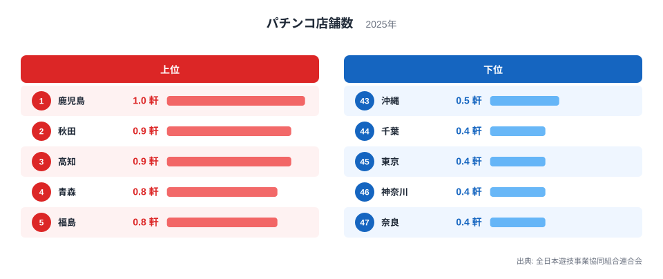
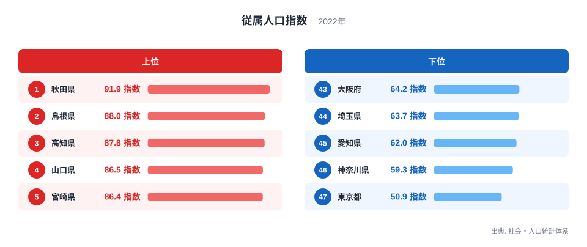
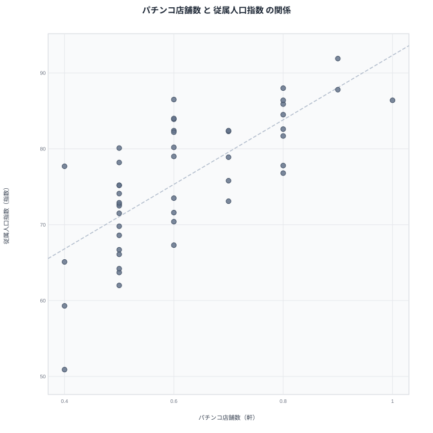

パチンコ店舗数が最も多いのは鹿児島で1軒です。同じ鹿児島は従属人口指数でも86.4指数と、全国の中で高い水準にあります。人口1万人当たりのパチンコ店舗数という娯楽施設の指標と、年少人口・老年人口の割合を示す従属人口指数という一見結びつきそうにない2つのデータが、なぜ同じような地域で高くなるのでしょうか。この記事では、都道府県別のデータをもとにその背景を見ていきます。

## パチンコ店舗数の上位と下位

<source-link href="/ranking/pachinko-shop-density-per-10k">パチンコ店舗数ランキングをもっと見る</source-link>

パチンコ店舗数は鹿児島が1軒で全国1位です。2位は秋田で0.9軒、3位は高知も0.9軒で並び、4位は青森で0.8軒、5位は福島も0.8軒となっています。人口1万人当たりの店舗数で見ると、上位には地方圏の県が多く並んでいます。

下位を見ると、奈良が0.4軒で最下位です。46位は神奈川で0.4軒、45位は東京も0.4軒、44位は千葉で0.4軒、41位から43位までは沖縄、福岡、岡山がそろって0.5軒となっています。大都市圏を抱える都県や、その周辺のベッドタウンに位置する県が下位に集まっています。

パチンコ店舗数は人口1万人当たりの密度で計算されているため、単純な店舗の絶対数とは異なります。地方圏では都市部に比べて娯楽施設の選択肢が限られる一方、人口当たりで見ると比較的多くのパチンコ店が営業を続けている地域があることが分かります。

## 従属人口指数の上位と下位

あわせて見る: [従属人口指数ランキング](/ranking/dependent-population-index)

従属人口指数は秋田県が91.9指数で全国1位です。2位は島根県で88指数、3位は高知県で87.8指数、4位は山口県で86.5指数、5位は宮崎県で86.4指数、6位は鹿児島県も86.4指数となっています。従属人口指数が高い県は、生産年齢人口に対して年少人口と老年人口の割合が高いことを示しており、上位には高齢化が進んだ地方圏の県が並んでいます。

下位に目を向けると、東京都が50.9指数で最下位です。46位は神奈川県で59.3指数、45位は愛知県で62指数、44位は埼玉県で63.7指数、43位は大阪府で64.2指数となっています。大都市圏を抱える都府県は生産年齢人口の割合が高く、従属人口指数が低くなる傾向があります。

秋田県、島根県、高知県、山口県、宮崎県、鹿児島県といった従属人口指数の上位県は、パチンコ店舗数のランキングでも上位から中位にかけて多く登場しており、両指標の重なりが見えてきます。

## 2つの指標の相関を見る

散布図では、従属人口指数が高い県ほど人口1万人当たりのパチンコ店舗数も多い傾向が確認できます。鹿児島、秋田、高知といった県は両指標でともに上位に位置し、右上方向に集まっています。一方で東京、神奈川、埼玉、大阪、愛知といった大都市圏の都府県は、従属人口指数もパチンコ店舗数も低い側に位置し、左下にまとまっています。

> [!WARNING]
> この相関は「従属人口指数が高いからパチンコ店が増える」という直接の因果関係を示すものではありません。パチンコ店舗数は人口1万人当たりの密度で計算されているため、そもそも人口が少ない地方圏では、店舗の絶対数がわずかでも密度としては高く出やすい性質があります。数値の解釈には注意が必要です。

地方圏では都市部に比べて生産年齢人口の流出が進み、高齢化率が高くなる傾向があります。その結果として従属人口指数が高くなる一方、人口減少地域では総人口が少ないため、店舗数を人口1万人当たりに換算すると相対的に高い値が出やすくなります。つまり両指標は、人口構成や人口規模という共通の背景要因を通じて連動している可能性があります。

## なぜこの相関が生まれるのか

パチンコ店舗数と従属人口指数が連動して見える背景には、地方圏における人口構造の特徴が関わっていると考えられます。生産年齢人口が都市部へ流出しやすい地方圏では、残った人口に占める年少人口と老年人口の割合が高まり、従属人口指数が上昇します。同時に、人口の絶対数が少ない地域では、店舗数を人口当たりの密度に換算したときに数値が大きくなりやすいという計算上の特性もあります。

鹿児島や秋田、高知といった県は、こうした地方圏特有の人口構造を持ちながら、パチンコという娯楽施設が地域の生活に一定の位置を占めていることがうかがえます。一方で東京や神奈川、大阪のような大都市圏は、若い生産年齢人口の割合が高く、従属人口指数が低い水準にとどまっています。

> [!TIP]
> 人口1万人当たりといった密度指標を読むときは、必ず母数となる人口規模も確認することをおすすめします。人口が少ない県では、わずかな施設数の増減でも密度の数値が大きく動くことがあるためです。

## まとめ

パチンコ店舗数と従属人口指数は、都道府県別に見ると中程度から強めの相関を示す2つの指標です。鹿児島は両指標でともに上位に位置し、パチンコ店舗数で1軒の全国1位、従属人口指数でも86.4指数と高い水準にあります。一方で東京都は従属人口指数が50.9指数で最下位、パチンコ店舗数も0.4軒と下位に位置しています。

> [!NOTE]
> パチンコ店舗数の単位は「軒」ですが、これは人口1万人当たりに換算した密度の値です。単純な店舗の絶対数を示すものではない点に注意してください。

人口構造と人口規模という共通の要因が、この2つの指標を連動させていると考えられます。娯楽施設の密度と年齢構成という異なる文脈のデータが、地方圏の人口動態というつながりを通じて重なって見えることが分かります。

より詳しいデータを確認したい場合は、[従属人口指数ランキング](/ranking/dependent-population-index)や[同じカテゴリの統計一覧](/category/commercial)もあわせてご覧ください。両指標でともに上位となった[鹿児島のデータ](/areas/46000)や[秋田のデータ](/areas/05000)では、他の統計との関係もさらに詳しく見ることができます。

## データ出典

パチンコ店舗数は全日本遊技事業協同組合連合会の2025年データ、従属人口指数は社会・人口統計体系の2022年データを使用しています。
