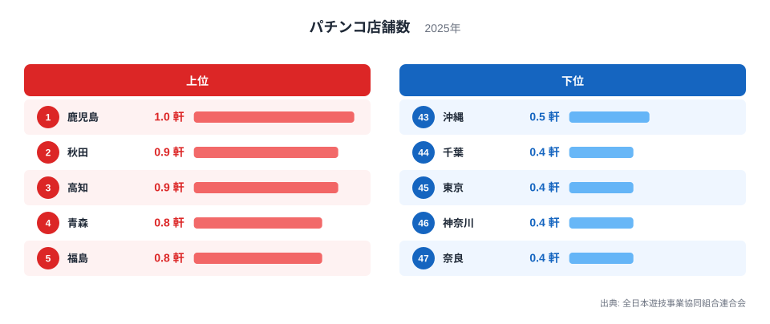
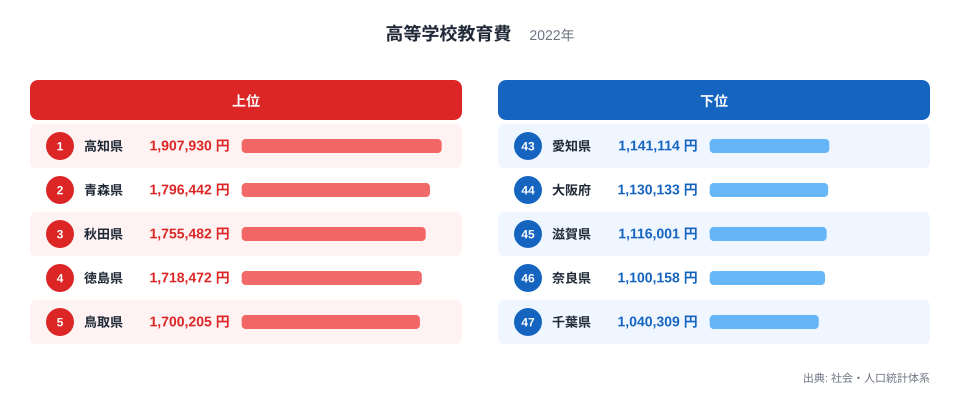
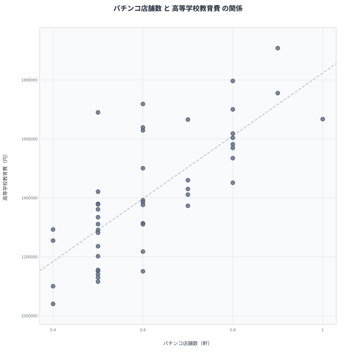

## パチンコ店舗数が多い県ほど教育費も高い

都道府県別のパチンコ店舗数を並べてみると、上位には鹿児島や秋田、高知、青森といった地方県が目立ちます。一方で高等学校教育費のランキングでも、上位には高知や青森、秋田、鹿児島が並んでいます。両方の上位常連が重なっているように見えるこの並びは、偶然でしょうか、それとも何か共通の理由があるのでしょうか。

この記事では、パチンコ店舗数と高等学校教育費という一見関係のなさそうな2つの指標を並べて確認します。結論を先に言うと、両者には見かけ上の相関がありますが、その背景にあるのは「娯楽と教育のどちらにお金をかけるか」という選択ではありません。人口密度や都市化の度合いという、もっと構造的な要因が両方の数字を同時に動かしています。

## パチンコ店舗数のランキングを見る

<source-link href="/ranking/pachinko-shop-density-per-10k">パチンコ店舗数ランキングをもっと見る</source-link>

パチンコ店舗数の1位は鹿児島県で、1軒という水準です。2位に秋田県と高知県が0.9軒で並び、以下も青森県、福島県、福井県、鳥取県、島根県、長崎県、大分県、宮崎県までが0.8軒で続きます。上位の顔ぶれは地方の県が中心で、いずれも人口あたりで見た店舗の密度が高くなっています。

下位に目を移すと、様相は一変します。千葉県と東京都、神奈川県、奈良県が0.4軒で最下位グループを形成しており、いずれも三大都市圏に含まれる県です。首都圏や近畿圏では人口が集中している分、パチンコ店1軒あたりが受け持つ人口も多く、密度としての数値は低く出る仕組みになっています。

この指標が示しているのは「パチンコ店の絶対数が少ない」ということではなく、「人口に対する店舗の割合が低い」ということです。実際には東京都や大阪府には数多くのパチンコ店が存在しますが、母数となる人口がそれ以上に大きいため、密度としては低く算出されます。地方県で密度が高くなるのは、人口が少ない分、1軒あたりの受け持ちが小さくなるためです。

## 高等学校教育費のランキングを見る

高等学校教育費の1位は高知県で、1人あたり190万7,930円です。2位は青森県で179万6,442円、3位は秋田県で175万5,482円となっており、以下も徳島県、鳥取県、京都府、鹿児島県、岩手県、山形県、宮城県までが160万円台から170万円台で続きます。地方県が上位に並ぶ傾向は、パチンコ店舗数のランキングとよく似ています。

下位のグループは千葉県が104万309円で最も低く、次いで奈良県が110万158円、滋賀県が111万6,001円、大阪府が113万133円、愛知県が114万1,114円と続きます。ここでも首都圏や近畿圏、中京圏に含まれる県が並んでいる点が特徴です。

高等学校教育費は、学校教育費や学校外活動費、通学費などを合算した1人あたりの支出額です。地方では高校までの通学距離が長くなりやすく、下宿や自宅外通学の費用がかさむケースも珍しくありません。都市部では高校が密集しているため通学の選択肢が多く、結果として1人あたりの費用が抑えられやすい構造があります。

## 散布図で相関を確かめる

散布図を見ると、パチンコ店舗数が多い県ほど高等学校教育費も高くなる、右肩上がりの傾向がうかがえます。鹿児島県や秋田県、青森県、高知県といった県は、どちらの指標でも上位に位置しており、点が右上に集まっています。逆に千葉県や東京都、奈良県、大阪府といった県はどちらの指標でも下位に位置し、点は左下に集まっています。

ここで注意したいのは、この相関が「パチンコ店が多いから教育費が高くなる」という因果関係を示すものではないという点です。パチンコで遊ぶお金と高校生の教育にかけるお金は、家計の中では別々の項目であり、直接につながる理由はありません。

見かけの相関を生んでいるのは、両方の指標が同じ第三の要因、すなわち都市化の度合いに強く影響されているためだと考えられます。パチンコ店舗数は人口に対する密度なので、人口が集中する都市部ほど数値が下がります。高等学校教育費は通学の利便性に左右されるため、高校が密集する都市部ほど費用が抑えられます。どちらも「都市部かどうか」で動く指標なので、都市化という共通の軸を通して間接的に結びついているのです。

## なぜ地方ほど両方の数値が高くなるのか

地方県で両方の数値が高くなる背景を、もう少し具体的に見てみましょう。パチンコ店舗数の分母は人口です。人口が少ない県では、店舗数自体が少なくても、人口あたりの密度としては高く出やすくなります。逆に東京都や神奈川県のように人口が数百万人を超える都市部では、店舗の絶対数は多くても密度としては低く算出されます。

高等学校教育費についても、地方特有の事情があります。地方では高校の立地が市街地に偏っている場合が多く、山間部や離島から通う生徒は自宅から通えず、下宿や寮生活を選ぶことがあります。こうした費用は学校外活動費や通学費として計上され、1人あたりの教育費を押し上げます。都市部では自宅から通える高校の選択肢が豊富にあるため、こうした追加費用が発生しにくくなっています。

つまり、パチンコ店舗数も高等学校教育費も、突き詰めれば「人口密度」と「都市機能の集積度」という共通の土台の上に成り立っている数字だということです。娯楽と教育という一見無関係な2つのテーマが、統計上は同じ方向に動いて見えるのは、この土台を共有しているからだと考えられます。

> [!NOTE]
> パチンコ店舗数は人口あたりの密度で示されており、店舗の絶対数そのものではありません。都市部で数値が低いのは店舗が少ないからではなく、分母となる人口が多いためです。

> [!WARNING]
> この記事で示した相関は、あくまで都道府県単位で見た2つの指標の並びが似ているという事実にとどまります。パチンコの利用状況と高校生の教育費支出には、家計調査上の直接的なつながりはなく、個人や世帯レベルでの因果関係を示すものではありません。

> [!TIP]
> 地方と都市部を分ける第三の要因(人口密度や通学環境など)を意識して数字を読むと、一見無関係な指標同士が同じ方向に動く理由が見えやすくなります。単純に「AがBの原因」と結び付けず、背後にある共通要因を探す視点を持つことが読み解きのコツです。

## まとめ

パチンコ店舗数と高等学校教育費のランキングを重ねると、鹿児島県や秋田県、青森県、高知県といった地方県が両方で上位に入り、千葉県や東京都、奈良県、大阪府といった都市部の県が両方で下位に入るという、はっきりした並びの一致が見られました。散布図でもこの傾向は右肩上がりの形として表れています。

ただし、この一致は「パチンコ店が多いから教育費が高くなる」という因果関係ではありません。パチンコ店舗数は人口あたりの密度で算出されるため人口の少ない地方で高くなりやすく、高等学校教育費は通学環境に左右されるため高校が少ない地方で費用がかさみやすくなります。どちらも都市化の度合いという共通の背景を通じて連動しているにすぎず、娯楽費と教育費のあいだに直接のやり取りがあるわけではない点に注意が必要です。

## データ出典

パチンコ店舗数は全日本遊技事業協同組合連合会の2025年データ、高等学校教育費は社会・人口統計体系の2022年データをもとにしています。

あわせて見る: [高等学校教育費ランキング](/ranking/high-school-education-cost-fulltime-per-student) / [同じカテゴリの統計一覧](/category/commercial) / [鹿児島のデータ](/areas/46000) / [秋田のデータ](/areas/05000)
