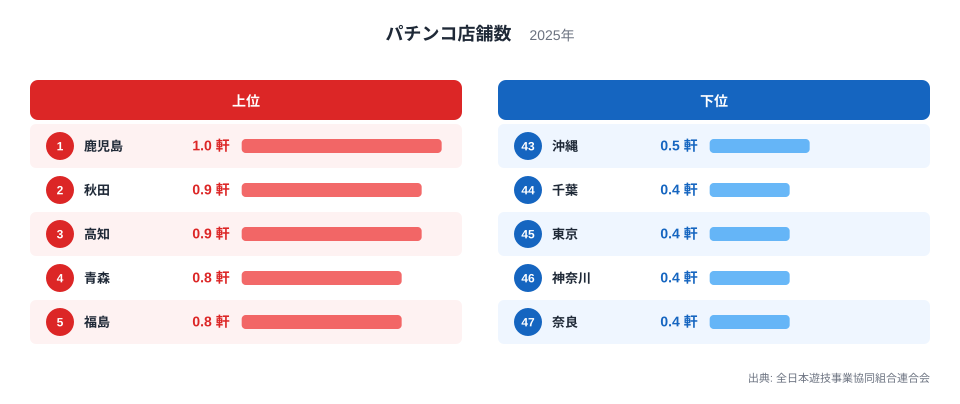
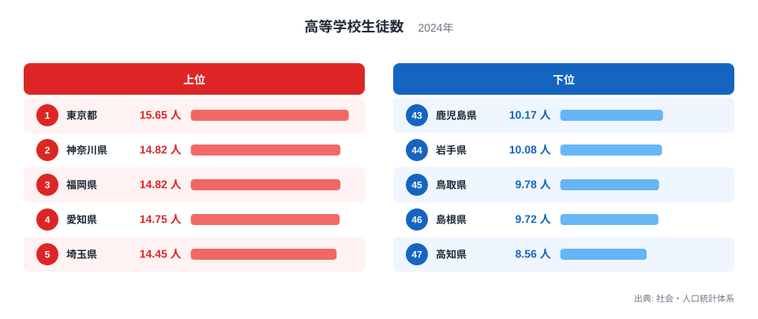
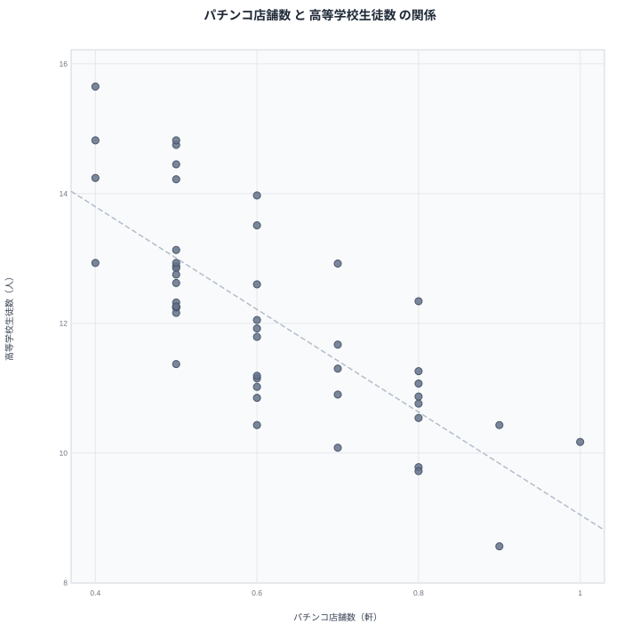

パチンコ店の人口あたりの密度が高い県ほど、高校生の人口に占める割合は低くなる傾向があります。全日本遊技事業協同組合連合会と社会・人口統計体系のデータを重ねると、密度1位の鹿児島は高校生の割合で下位に、割合1位の東京は密度で下位に位置しています。この記事では2つの指標を並べ、なぜ逆の関係になるのかを整理します。

## パチンコ店舗数の密度が高い県、低い県

<source-link href="/ranking/pachinko-shop-density-per-10k">パチンコ店舗数ランキングをもっと見る</source-link>

2025年のパチンコ店舗数を見ると、鹿児島は1軒で1位です。2位は秋田と高知がともに0.9軒で並んでいます。4位から11位までは青森・福島・福井・鳥取・島根・長崎・大分・宮崎の8県がいずれも0.8軒で並んでおり、上位には人口規模が比較的小さい地方県が集中していることがわかります。

下位を見ると、千葉、東京、神奈川、奈良が0.4軒で並び、44位から47位に位置しています。人口が多く地価の高い大都市圏では、店舗を出店するコストが密度を押し下げていると考えられます。北海道は0.7軒で12位、大阪は0.5軒で39位と、大都市圏の道府県はおおむね中位から下位にとどまっています。

中位の顔ぶれを見ると、宮城、山形、茨城、栃木、長野、静岡、和歌山、山口、徳島、佐賀、熊本の11県が0.6軒で17位から27位にまとまっており、地方の中でも人口規模が中程度の県が中位に位置しています。大都市圏と過疎地域の間に位置する県が、密度の面でも中間的な値になっている様子がうかがえます。

> [!NOTE]
> この指標は人口あたりの店舗数の密度を表しており、店舗の絶対数ではありません。人口が少ない県では、店舗数そのものが少なくても人口比では密度が高く出ることがあります。

## 高校生の人口比率が高い県、低い県

続いて、2024年の高等学校生徒数の人口比率を見てみます。東京都は15.65人で1位です。2位は神奈川県で14.82人、3位は福岡県も同じく14.82人、4位は愛知県で14.75人、5位は埼玉県で14.45人と続きます。大都市圏の都府県が上位を占めています。

下位に目を移すと、高知県は8.56人で47位です。46位は島根県で9.72人、45位は鳥取県で9.78人、44位は岩手県で10.08人、43位は鹿児島県で10.17人となっています。パチンコ店舗数で上位に入っていた鹿児島県が、この指標では下位に位置している点が対照的です。

> [!WARNING]
> この指標は生徒数そのものではなく、人口に対する高校生の比率です。若い世代の人口構成や進学率の違いによって数値が変動するため、教育環境の充実度を直接示すものではありません。

## 2つの指標の関係を散布図で見る

散布図を見ると、右下がりの傾向がうかがえます。パチンコ店舗数の密度が高い県ほど高校生の人口比率が低く、密度が低い都市部の県ほど高校生の比率が高いという逆の関係です。ただし、これは相関であって因果関係ではありません。

この逆相関の背景には、人口構成の違いがあると考えられます。都市部は若い世代の流入が続いており、進学や就職を機に転入してくる10代後半の人口が相対的に多くなります。一方、地方県は高齢化が進み、人口に占める若年層の割合が低下しています。パチンコ店の密度は主に成人人口や娯楽需要と結びついているため、若年層の比率が低い地方県では相対的に密度が高く見えやすくなります。つまり、パチンコ店が高校生を減らしているのではなく、両者はいずれも人口構成の年齢バランスという共通の要因を映していると考えるほうが自然です。

> [!TIP]
> 「密度が高い/低い」を比較するときは、その分母となる人口構成そのものが県によって違う点を意識すると読み違いを防げます。今回のケースでは若年層の人口比率がその分母にあたります。

散布図の左上には鹿児島・秋田・高知のようにパチンコ店密度が高く高校生比率が低い県が集まり、右下には東京都・神奈川県・福岡県のように密度が低く高校生比率が高い都府県が集まっています。この2つの塊の位置関係は、地方の高齢化と都市部への若年層の集中という、日本全体で進む人口動態の縮図とも言えます。

## 人口構成という共通の物差し

[高等学校生徒数ランキング](/ranking/high-school-students-per-teacher)を単独で見ると、東京都・神奈川県・福岡県・愛知県・埼玉県という大都市圏の顔ぶれが並び、若年層の人口が都市部に集まっている実態がより鮮明にわかります。[鹿児島のデータ](/areas/46000)を確認すると、人口減少と高齢化が進む一方で、成人向けの娯楽施設としてパチンコ店の需要が根強く残っている地域性がうかがえます。同様に[秋田のデータ](/areas/05000)でも、若年層の県外流出が進む中で人口あたりの店舗密度が押し上げられている構図が読み取れます。[同じカテゴリの統計一覧](/category/commercial)から関連する商業系の指標もあわせて確認すると、地域ごとの人口動態の違いがより具体的に見えてきます。

パチンコ店の密度と高校生の人口比率は、一見すると無関係な2つの指標ですが、どちらも地域の人口構成という共通のレンズを通して見ると、つながりが理解しやすくなります。単純に「多い・少ない」で比べるのではなく、その背景にある年齢構成まで踏み込むことが、この種のランキングを正しく読むコツです。

もう一つ興味深いのは、パチンコ店舗数の上位と下位の差がそれほど大きくないことです。1位の鹿児島の1軒に対し、下位の千葉・東京・神奈川・奈良は0.4軒であり、差は2.5倍程度にとどまります。一方で高校生の人口比率は1位の東京都15.65人に対し47位の高知県8.56人と、差は1.8倍程度です。どちらの指標も他の家計調査系の指標に比べると地域差が比較的小さく、全国的に一定の水準が保たれていることも読み取れます。

## データ出典

出典: 全日本遊技事業協同組合連合会、社会・人口統計体系（総務省統計局）
パチンコ店舗数: 2025年
高等学校生徒数: 2024年
