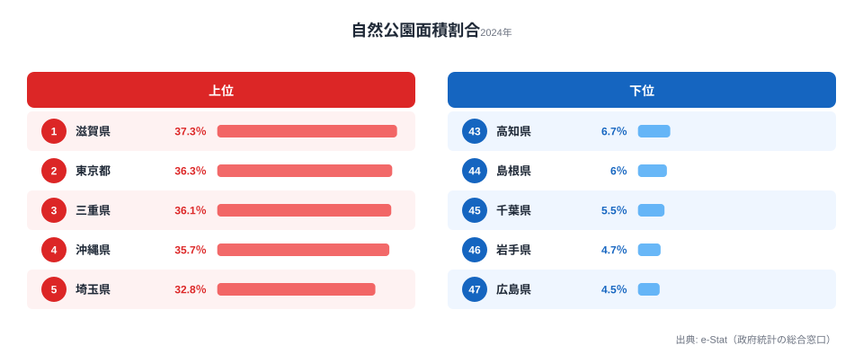
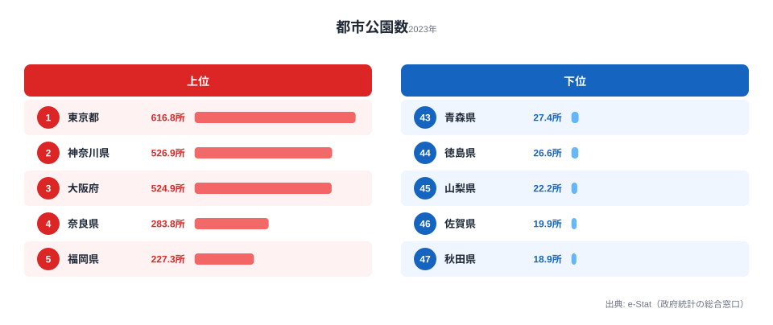
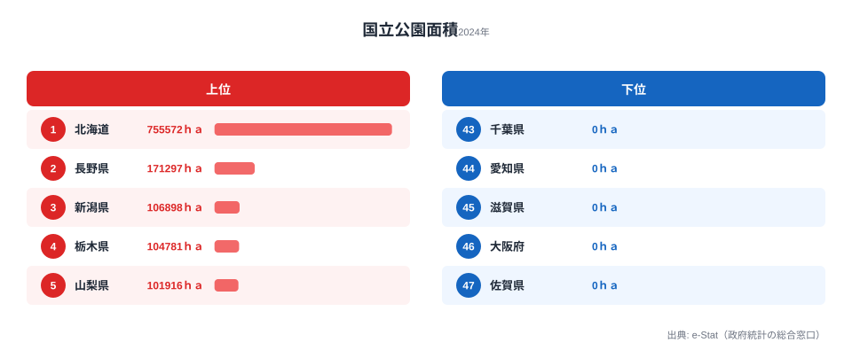
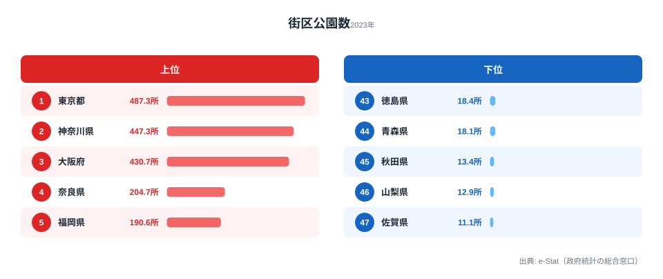
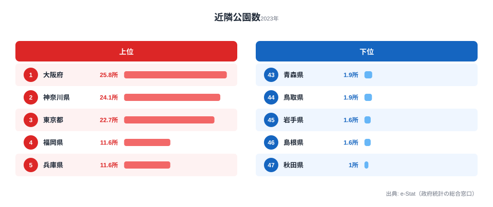

「自然が豊かな県」と「公園が多い県」は同じでしょうか──答えは「まったく違う」です。

自然公園面積割合で全国1位の滋賀県には、国立公園がありません。都市公園密度1位は、「コンクリートジャングル」として語られがちな[東京都](/areas/13000)です。「緑が多い」という直感的なイメージは、指標を変えるたびに裏切られます。

本記事では、**自然公園面積割合・都市公園密度・国立公園面積**の3指標で47都道府県の「緑」を比較し、その背後にある構造を読み解きます。指標を1つに絞った瞬間に見落とす「逆説」が、3軸を重ねると立ち上がってきます。

> [!NOTE]
> 自然公園とは国立公園・国定公園・都道府県立自然公園の総称です。自然公園面積割合は県面積に占める自然公園の割合を示します。都市公園は住宅地内の街区公園・近隣公園などを含む生活圏の公園で、指標は100km²当たりの数です。データ出典はe-Stat「社会・人口統計体系」で、自然公園・国立公園は2024年度、都市公園は2023年度の値を使っています。

## 自然公園面積割合ランキング──1位は滋賀、東京が2位

自然公園面積割合で全国1位に立つのは**滋賀県（37.3%）**です。琵琶湖国定公園をはじめ、県面積の3分の1以上が自然公園に指定されています。

2位は**東京都（36.3%）**で、これが最大の驚きです。奥多摩・秩父多摩甲斐国立公園や小笠原国立公園を抱え、都心から離れた山間部・島嶼部に広大な自然公園があります。都心の高層ビル群とはまったく別の東京の顔です。3位は三重県（36.1%）、4位は沖縄県（35.7%）と、上位は近畿・関東・南西諸島が混在し、明確な地理的クラスターを作りません。

最下位は**広島県（4.5%）**です。1位の滋賀と47位の広島では約8倍の差があります。ただしこれは「広島の自然が乏しい」のではなく、「自然公園として法的に指定されている面積が少ない」という意味です。瀬戸内海国立公園を抱えながらも、県全体に占める割合が低いという構造を表しています。

<source-link href="/ranking/nature-park-area-ratio">自然公園面積割合の全47都道府県ランキングを見る</source-link>

## 都市公園密度ランキング──東京617所、秋田18所の格差

「身近な公園」の密度は、自然公園とはまったく異なる分布を示します。

都市公園数（100km²当たり）で1位は**東京都（616.79所）**です。神奈川県（526.92所）、[大阪府](/areas/27000)（524.93所）が続きます。上位3都府県は100km²当たり500所を超える密度です。

<data-source url="https://www.e-stat.go.jp/dbview?sid=0000010208" label="e-Stat 社会・人口統計体系"></data-source>

最下位の秋田県は18.93所で、東京の30分の1以下です。都市公園は人口密度が高い地域ほど多く配置される構造なので、大都市圏と地方の格差は必然的に生まれます。下位には秋田・佐賀・山梨・徳島・青森が並び、人口が少なく可住地が分散している県ほど100km²当たりの密度が下がります。

「東京は公園がない」というイメージは、都市公園密度のデータでは完全に否定されます。自然公園で2位、都市公園で1位という両立は、東京の「緑」を語るうえで欠かせない事実です。

<source-link href="/ranking/urban-park-count-per-100km2">都市公園数の全47都道府県ランキングを見る</source-link>

<ad-slot></ad-slot>

## 国立公園面積──北海道が圧倒的1位、6府県はゼロ

国立公園は3種の自然公園の中で最も厳しい基準で保護される区域です。面積を見ると[北海道](/areas/01000)の存在感が際立ちます。

上位は北海道（755,572ha、大雪山・知床・釧路湿原・支笏洞爺）、長野県（171,297ha、中部山岳・上信越高原・南アルプス）、新潟県（106,898ha、上信越高原・中部山岳・尾瀬）、栃木県（104,781ha、日光・尾瀬）、山梨県（101,916ha、富士箱根伊豆・秩父多摩甲斐）と並びます。

北海道の755,572haは2位長野の**4.4倍**です。6つの国立公園を抱え、その総面積は東京都の県全体面積（約22万ha）の3.4倍に達します。

そして「国立公園ゼロ」の都府県が6つあります——茨城・千葉・愛知・**滋賀**・大阪・佐賀です。滋賀県が自然公園面積割合1位でありながら国立公園がゼロである事実は、「自然公園の広さ」と「国立公園の有無」がまったく別の問いに答えていることを示します。

> [!WARNING]
> 滋賀県は自然公園面積割合1位ですが、国立公園は**ゼロ**です。割合の大部分を占めるのは琵琶湖国定公園と県立自然公園で、国立公園という「最高ランクの自然保護区」は存在しません。「自然公園が広い＝国立公園がある」という思い込みは成り立ちません。国立公園の有無は、その県の自然の豊かさではなく、国が国立公園として指定したかどうかという制度上の判断を反映しています。

<source-link href="/ranking/national-park-area">国立公園面積の全47都道府県ランキングを見る</source-link>

## 街区公園と近隣公園──東京と大阪の逆転

都市公園をさらに「街区公園（小さい公園）」と「近隣公園（中規模）」に分けると、東京と大阪の順位が入れ替わります。

### 街区公園（100km²当たり、1位東京487所）

最も小さな都市公園（標準面積0.25ha）で、「近所の公園」の多さを示します。1位は東京（487.30所）、2位神奈川（447.34所）、3位大阪（430.71所）です。生活圏の細かな公園は、東京・神奈川という人口が最も集中する地域に厚く配置されています。

<source-link href="/ranking/block-park-count-per-100km2">街区公園数の全47都道府県ランキングを見る</source-link>

### 近隣公園（100km²当たり、1位大阪25.8所）

中規模公園（標準面積2ha）では**大阪府が1位（25.79所）**、2位神奈川（24.15所）、3位東京（22.68所）です。街区公園では3位だった大阪が、近隣公園では東京を抜いて首位に立ちます。

東京は小さな公園を高密度で配置し、大阪は相対的に中規模公園を充実させているという構造の違いが見えます。同じ「都市公園が多い」でも、その中身は都市ごとに設計思想が異なります。

> [!TIP]
> 「子どもの遊び場」として身近な街区公園の数を重視するなら東京・神奈川・大阪が多い地域です。一方、「広い公園でスポーツや散策をしたい」なら近隣公園の密度が高い大阪・神奈川・東京の順になります。同じ都市公園でも、街区公園か近隣公園かで順位が入れ替わるため、公園の「質」は目的によって変わると考えておくのが安全です。

<source-link href="/ranking/neighborhood-park-count-per-100km2">近隣公園数の全47都道府県ランキングを見る</source-link>

<ad-slot></ad-slot>

## 東京の「緑の多様性」──3指標すべてで上位

3指標を重ねると、東京都の特異性が浮かびます。

- 自然公園面積割合: **2位**（36.3%）
- 都市公園数（100km²当たり）: **1位**（616.79所）
- 国立公園面積: **13位**（69,432ha）

「コンクリートジャングル」のイメージとは裏腹に、東京都は奥多摩・小笠原の広大な自然と、都心の高密度な生活圏公園を両立しています。自然公園と都市公園の両方で上位に入る都道府県は東京だけで、国立公園も全国13位と中位以上を確保しています。

これは「緑の多様性」と呼べる構造で、山岳・島嶼の大自然と都市の身近な公園を1つの行政区域で抱える組み合わせは、日本の他のどの都道府県も持っていません。

## まとめ

3指標で見た47都道府県の「緑」は、単一の指標では見えない構造を持っています。

- **自然公園面積割合**: 滋賀1位・東京2位・広島最下位。「自然が豊か」のイメージとずれる県が多い
- **都市公園密度**: 東京1位・神奈川2位・大阪3位。大都市ほど「身近な公園」が多い必然的構造
- **国立公園面積**: 北海道が圧倒的1位で2位長野の4.4倍。滋賀・大阪など6府県はゼロ
- **街区公園と近隣公園**: 街区は東京1位、近隣は大阪1位と、同じ都市公園でも順位が逆転する

「どの県が緑豊かか」への答えは、何を測るかで変わります。移住を考えるなら「ハイキングが好き＝自然公園面積割合の高い県」「子どもに身近な公園を＝都市公園密度の高い都市圏」と、自分の優先軸を決めてから指標を選ぶのが有効です。緑の豊かさは1つの数字では決まらない、というのが3指標を重ねて見えてくる結論です。

## データ出典

- e-Stat「社会・人口統計体系」自然公園面積（ID: 0000010202）
- e-Stat「社会・人口統計体系」都市公園数（ID: 0000010208）
