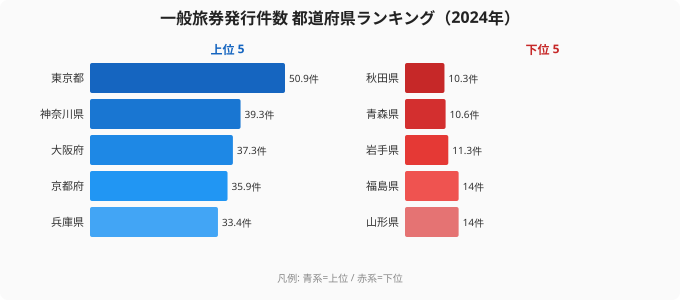

「海外へ出る人の割合は、住んでいる県でこれほど違うのか」──そう実感させるのが、一般旅券（パスポート）の発行件数です。本記事で扱うのは **人口1,000人あたりの一般旅券発行件数**（2024年度、社会・人口統計体系）です。その年に各都道府県で発行された一般旅券を、人口1,000人あたりに換算した値で、数字が大きいほど「県民が海外渡航へ動いている」度合いが高いと読めます。

2024年度のトップは **[東京都](/areas/13000)の50.9件** でした。一方で最も少ない **[秋田県](/areas/05000)はわずか10.3件** で、その差は約 **4.9倍** に開きます。同じ日本に住みながら、海外へのパスポートを手にする頻度がこれほど違うのはなぜでしょうか。

この記事では、上位を占める大都市圏と、下位に沈む東北という明確なクラスターを示しながら、「海外志向の地域差」の正体に迫ります。

> [!NOTE]
> 本指標は「人口千人あたりの一般旅券発行件数」です。1人が複数年にわたって同じ旅券を使うため、発行件数は**新規取得＋切替更新（10年・5年の有効期限切れ）**を含みます。値が高い県は「新たに海外へ向かう人」だけでなく「更新する常連層」も多いことを意味します。

## パスポート発行件数の上位5県と下位5県（2024年度）

まずは発行件数の多い県と少ない県を、上位5県・下位5県の対比で並べます。

上位を見ると、首都圏（東京・神奈川・千葉）と関西（大阪・京都・兵庫・滋賀・奈良）、そして中部の愛知・九州の福岡といった三大都市圏＋政令市圏でほぼ占められています。いずれも国際線を抱える大空港・大都市圏で、ビジネス・観光ともに海外渡航のインフラと需要が集中する地域です。トップの東京都50.9件は、2位の[神奈川県](/areas/14000)（39.3件）にも10件以上の差をつけており、突出しています。

なぜ大都市圏が上位に並ぶのでしょうか。第一に、成田・羽田・関西・中部・福岡といった国際空港へのアクセスが良く、海外渡航の物理的なハードルが低いことが挙げられます。第二に、就職・進学で若年人口が集まり、海外旅行・留学・出張に動く現役世代が厚いことです。第三に、一人あたり所得が相対的に高く、旅費という支出の壁が低いことも効いています。アクセス・若年層・所得という3つの条件が重なる地域ほど、パスポートを手にする人の比率が高くなります。上位5県の東京・神奈川・大阪・京都・兵庫は、いずれもこの条件を満たす大都市圏です。

<source-link href="/ranking/passport-issuance-count-per-thousand">一般旅券発行件数ランキングをもっと見る</source-link>

## 最下位グループ──東北が軒並み沈む

下位5県（上のチャート右側）を抜き出すと、地理的な偏りがはっきりします。山形・福島がともに14.0件（43位）、岩手11.3件（45位）、青森10.6件（46位）、そして最も少ない秋田10.3件（47位）と続き、**この5県すべてが東北** です。秋田の10.3件は、トップ東京の50.9件のおよそ5分の1にとどまります。

これらの県に共通するのは、上位とは正反対の条件です。(1) 国際空港から遠く、空港まで出るだけでも時間とコストがかかるため海外渡航の物理的ハードルが高いこと、(2) 人口減少・高齢化が進み、海外へ動く若年層そのものが薄いこと、(3) 一人あたり所得が相対的に低く、旅費の壁が高いことが重なります。とりわけ秋田・青森・岩手の北東北3県は、いずれもこの3条件が強く揃う地域で、件数も10〜11件台に密集しています。海外渡航のインフラ・人口構成・所得という土台の差が、そのまま発行件数の低さに表れていると読めます。

> [!WARNING]
> この指標は「**旅券が発行された県**」で集計されます。進学・就職で都市部へ転出した若者が転出先でパスポートを取得すれば、出身県側の件数には計上されません。東北の低さには、こうした**若年層の流出**が押し下げ要因として含まれる点に注意が必要です。純粋な「県民の海外志向の弱さ」だけを表す数字ではありません。

## 上位と下位で4.9倍──「大都市圏 vs 東北」の二極構造

東京（50.9件）と秋田（10.3件）の差は約4.9倍に達します。これは単なる個別県どうしの差ではなく、**地域ブロック単位の二極構造**として現れています。

- 三大都市圏の中核（東京・神奈川・大阪・京都・兵庫・愛知）がランキング上位を占めています
- 関西は大阪・京都・兵庫・滋賀・奈良の5府県すべてがトップ10入りし、固まって上位を形成しています
- 一方、東北の各県は宮城（17.4件、36位）を除いて軒並み下位に沈み、福島14.0件・岩手11.3件・青森10.6件・秋田10.3件と最下位グループに密集しています

国際空港へのアクセス、所得水準、若年人口の厚みという3要素が揃う大都市圏が上位を、それらが薄い東北が下位を形づくります。発行件数は「海外への扉の開きやすさ」の地域差を、ほぼそのまま映していると言えるでしょう。

## 沖縄は上位グループ、北海道は意外にも中位以下

「海外に近い」イメージのある県が、必ずしも同じ順位ではない点も見逃せません。沖縄は29.8件で全体の上位グループに食い込む一方、北海道は17.4件で36位と中位以下にとどまります。

地理的に海外との距離が近く、外国人観光客の受け入れでも知られる両道県ですが、住民自身の海外渡航頻度を表すこの指標では明暗が分かれました。沖縄は若年人口比率の高さや航空アクセスの良さが効いている可能性がある一方、北海道は広大な道内移動や国内観光の充実が海外渡航を相対的に抑えているとみられます。同じ「海外と縁が深そうな県」でも、住民が実際にパスポートを手にする頻度は対照的になります。

> [!TIP]
> パスポートは「自県民が海外へ**出る**」アウトバウンドの指標で、「外国人が**来る**」インバウンドとは別物です。観光地として海外と結びつきが強くても、住民自身の海外渡航頻度が高いとは限りません。北海道の順位は、「インバウンドの強さ」と「県民のアウトバウンド」が一致しないことを示す好例と言えます。

\[仮説] 北海道が中位どまりにとどまる背景には、所得水準や域内観光の充実（国内旅行で代替）が関わる可能性があります。ただし本データだけでは断定できず、一人あたり所得・国内旅行率との突合による検証が必要です。

## まとめ

- **トップは東京都の50.9件**（人口千人あたり、2024年度）で、全国で唯一の50件超でした
- **最も少ないのは秋田県の10.3件**、次いで青森10.6件（46位）・岩手11.3件（45位）と続きます
- トップと最下位の差は **約4.9倍** に開いています
- **上位は首都圏・関西・愛知・福岡の大都市圏が占め**、下位は**東北**に集中する二極構造になっています
- **沖縄は29.8件と上位グループ寄り、北海道は17.4件で36位** と、海外に近い県でも明暗が分かれました

## データ出典

- 出典：総務省統計局「社会・人口統計体系（社会生活統計指標）」一般旅券発行件数（人口千人あたり）。e-Stat（政府統計の総合窓口）経由で整備
- 集計年度：2024年度（fiscal year）。値は各都道府県で発行された一般旅券を人口1,000人あたりに換算したもの
