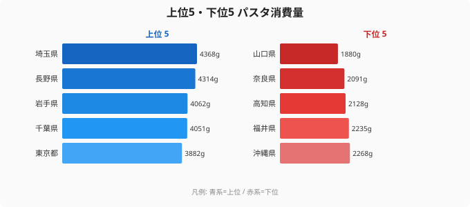

「同じ日本でも、住む県によってパスタを食べる量がこれほど違うのか」——2024年の家計調査でそんな事実が浮かび上がりました。最も多い埼玉県は年間4,368g、最も少ない山口県は1,880gと、その差は実に2.3倍にのぼります。さらに興味深いのは、上位が首都圏一色とはならず、長野県や岩手県といった内陸・東北の県が割り込んでいる点です。

パスタは今や日本の家庭食の定番と思われていますが、実態は「食べる量に地域差が色濃く残る食品」でした。この偏りの背景には、単なる好み以上の構造的な理由がありそうです。

## パスタ消費量の上位5・下位5

<source-link href="/ranking/pasta-consumption-quantity">パスタ消費量ランキングの全件データを見る</source-link>

最も多いのは埼玉県の4,368gです。続く2位は長野県（4,314g）、3位は岩手県（4,062g）、4位は千葉県（4,051g）、5位は東京都（3,882g）と並びます。首都圏の埼玉・千葉・東京が上位に入る一方で、その間に長野と岩手という内陸・東北の県が割って入っているのが、このランキングの第一の意外性です。なお首都圏でも神奈川県は6位（3,838g）、茨城県にいたっては35位（2,859g）と、関東がひとくくりに上位を占めているわけではありません。

一方の下位5県は、43位の沖縄（2,268g）、44位の福井（2,235g）、45位の高知（2,128g）、46位の奈良（2,091g）、そして最下位の山口（1,880g）です。山口の消費量は埼玉の約43%にとどまり、同じ国内とは思えない開きがあります。

> [!NOTE]
> 本データは総務省「家計調査」2024年の二人以上世帯における品目別年間消費量（g）を都道府県別に集計したものです。集計対象は各都道府県庁所在地・政令指定都市の世帯であり、県全体の平均ではない点に注意が必要です。また単身世帯は含まれないため、大学生や若年単身者が多い都市部の実態とは一致しない場合があります。

上位を見ると、首都圏という単純な括りでは説明できないことがわかります。長野が2位、岩手が3位に入っている事実は、「都市の共働き世帯が時短食として食べる」という説明だけでは足りないことを示しています。むしろ、パンや小麦由来の食文化が根づいた地域や、米以外の主食を取り入れてきた地域でパスタが受け入れられやすい、という見方のほうが実態に近いのかもしれません。

## なぜ埼玉・長野・岩手が上位に並ぶのか

上位の顔ぶれには、性質の異なる二つのグループが混在しています。

ひとつは**首都圏の郊外型世帯**です。埼玉（1位）・千葉（4位）・東京（5位）は、いずれも全国平均（およそ3,100g）を大きく上回ります。パスタは茹でるだけで主食になり、ソースを合わせても調理時間は15〜20分程度と短く済みます。共働きで帰宅時間が遅い世帯が多い首都圏では、「時短で作れる主食」としてパスタの需要が構造的に押し上げられていると考えられます。[労働・賃金カテゴリのランキング](/category/laborwage)と照らし合わせると、この傾向はより鮮明になります。埼玉が東京を上回って首位に立っているのも示唆的で、東京は単身世帯が多く「二人以上世帯」の比率が相対的に低いため、二人以上世帯に限定した家計調査では郊外型の埼玉が首位に立ちやすくなります。

もうひとつは**長野・岩手という非首都圏グループ**です。長野が2位、岩手が3位という結果は、共働き・都市型という説明だけでは捉えきれません。

> [!TIP]
> パスタ消費量と[人口密度ランキング](/ranking/population-density)や[埼玉県のエリアプロフィール](/areas/11000)を組み合わせて見ると、「都市の郊外世帯が時短食として食べる」という仮説を検証できます。ただし長野（2位）や岩手（3位）は人口密度が高いわけではないため、都市型仮説だけでは上位入りを説明できず、別の食文化要因を併せて考える必要があります。

長野や岩手が上位に来る理由については、確定的なデータを示すのは難しいものの、いくつかの仮説が考えられます。

> [!WARNING]
> 長野・岩手の上位入りの理由は本データだけからは確定できません。**[仮説]** 長野は伝統的に米作に向かない高冷地が多く小麦・そば文化が発達したこと、岩手も小麦粉文化（南部せんべい・はっと汁など）の素地があることが、パスタ受容のしやすさにつながった可能性があります。検証には、各県の小麦消費・パン消費との相関分析が必要です。

第一の郊外型仮説と第二の小麦文化仮説のどちらが主因かは、本ランキング単体では判定できません。確実に言えるのは、「首都圏が独占している」という単純な構図にとどまらず、**性質の異なる複数の経路でパスタ消費が高まっている**ということです。

## なぜ山口・奈良・西日本は消費が少ないのか

下位グループに並ぶ県には、上位とは逆の食文化要因が働いていると考えられます。

最下位の山口、そして香川（42位）、徳島（40位）といった西日本・四国の県では、うどんをはじめとする地域固有の麺料理が食文化の中心に根づいています。香川は「うどん県」を名乗るほどであり、山口の瓦そばや徳島のそば文化を含め、「麺を食べる」という需要をすでに地域の伝統食が満たしているため、外来の麺料理であるパスタが家庭の主食として割り込む余地が相対的に小さいと読み取れます。

奈良（46位）や福井（44位）の低さも目を引きます。これらの県もそうめん（奈良・三輪そうめん）やそば・うどん文化が強く、和の麺文化が日常の食卓に深く根づいている地域です。パスタという選択肢が、すでに満たされている「麺需要」に新規参入しにくい構造が共通しています。

> [!WARNING]
> 本ランキングは「家計調査」を基にしているため、外食・中食での消費は反映されていません。香川のように外食でうどんを頻繁に食べる地域では、家庭での麺類消費そのものが少なめに出る傾向もあり得ます。「家庭での消費量」だけで見た下位は、外食込みの実態とは異なる可能性がある点に留意してください。また、2024年の単年データのため、異常値や調査誤差の影響を完全には排除できません。

加えて、これらの地域では大都市圏ほど大手スーパーやコンビニチェーンの密度が高くないため、パスタソースやパスタ麺の品揃えが薄ければ購入頻度も自然と下がります。流通環境の差が消費行動に及ぼす影響も無視できません。

## パスタ消費に見える食文化の多層構造

パスタ消費量の地域差は、単に「好き嫌い」の問題にとどまらず、複数の食文化要因が重なって生まれる地域分断を映しています。

上位には、首都圏の時短調理需要というルートと、長野・岩手のような小麦・そば文化圏というルートの、性質が異なる二つの経路が共存していました。一方の下位には、うどん・そうめんといった和の麺文化が食卓を満たしている県が並びます。「パスタを食べない」というより、「すでに別の麺料理が食卓を満たしている」という読み方ができます。

この見立てに立つと、パスタ消費量マップは[農業・食料カテゴリのランキング](/category/agriculture)と重ねることで、日本の食生活の地域構造をより立体的に理解できます。米・小麦・和の麺・洋の麺がどう住み分けているかという、主食の地理が透けて見えてくるのです。

日本においてパスタは「完全に土着化した食品」というより、地域ごとに異なる食文化の隙間に入り込んだ食品として定着した段階にあると言えるでしょう。

## まとめ

- 最も多いのは埼玉県（4,368g）、最も少ないのは山口県（1,880g）で2.3倍差
- 上位5県は埼玉・長野・岩手・千葉・東京——首都圏一色ではなく長野・岩手が割り込む意外な構成
- 上位の背景は二層構造：首都圏の時短調理需要と、長野・岩手のような小麦・そば文化圏（後者は仮説段階）
- 下位は山口・奈良・福井など、うどん・そうめんといった和の麺文化が強い西日本・近畿が中心
- パスタ消費の地域差は「好み」というより、米・小麦・和の麺・洋の麺がどう住み分けているかという主食の地理を反映している

## データ出典

総務省「家計調査」2024年、二人以上世帯の品目別年間消費量（都道府県庁所在地・政令指定都市）をもとにe-Stat経由で整備。
