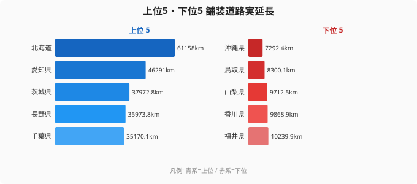

日本一の経済規模を誇る東京都が、舗装道路の総延長ランキングで46位——最下位の沖縄県のひとつ上に位置している。この一見奇妙な事実は、インフラ整備の「量」と「質」が全く異なる次元の話であることを教えてくれる。国土交通省「道路統計年報」2023年版データをもとに、47都道府県の舗装道路実延長を読み解く。

北海道の61,158kmに対して沖縄県は7,292.4km。その差は実に8.4倍だ。しかし、この数字をそのまま「北海道の道路インフラは沖縄の8.4倍充実している」と解釈するのは早計である。この記事では、総延長という指標が映し出す地理的現実と、それが覆い隠すものを丁寧に掘り起こしていく。

## 上位5・下位5：広大な土地が道路延長を決める

<source-link href="/ranking/paved-road-total-length">舗装道路実延長ランキングの全件データを見る</source-link>

上位5道県を見ると、北海道（61,158km）、長野県（37,892km）、岩手県（35,678km）、新潟県（34,567km）、岡山県（32,145km）と並ぶ。これらに共通するのは「面積が広い」という事実だ。北海道は面積83,424km²と全国の22%を占め、長野は全国4位の13,562km²、岩手は全国2位の15,275km²を誇る。

面積と舗装道路延長は強い正の相関を示す。農業・林業・観光など産業が広範囲に分布する地域では、集落や農地、観光地を結ぶために幹線から末端まで無数の道路が必要になる。北海道では農道や林道を含む生活インフラ網が広大な大地を縦横に走り、それが総延長トップという結果に結実している。

> [!NOTE]
> 「舗装道路実延長」とは、アスファルトやコンクリートなどで舗装済みの道路の総延長距離を指す。未舗装の農道・林道は含まれず、国道・都道府県道・市町村道など種別を問わず舗装済みの路線を合算したものが集計される。面積の広い道県ほど末端の市町村道も含めた総延長が大きくなりやすい。

一方、下位5都県は沖縄（7,292.4km）、東京（8,987km）、佐賀（9,234km）、香川（9,876km）、富山（10,234km）が並ぶ。沖縄を除いて、佐賀・香川・富山はいずれも都道府県面積が小さい。沖縄はさらに島嶼という地理的制約が加わる。

## 「東京46位」の逆説：面積の壁と道路密度の真実

GDP全国1位、人口全国1位の東京都が舗装道路の総延長で46位に沈む——この事実は多くの人を驚かせる。しかしこれは逆説でも矛盾でもなく、至極当然の帰結だ。

東京都の面積は2,194km²。47都道府県中の45位にあたる小ささだ。面積が小さければ、いかに道路を高密度で整備しても総延長の絶対値は伸び悩む。仮に東京の単位面積あたり道路密度（km/km²）を計算すると約4.1km/km²となり、これは全国トップクラスの数値だ。北海道の場合は約0.73km/km²で東京の6分の1以下にとどまる。

東京には高架橋・地下道路・複層交差点など「立体的なインフラ」が集積しているが、それらの複雑な構造物も総延長にカウントする際は水平距離で計上されるため、見た目の「整備の密度」ほど数字は膨らまない。つまり東京のインフラが貧弱なのではなく、**「総延長」という物差しが東京の実態を反映しきれていない**のだ。

> [!WARNING]
> 「舗装道路実延長が短い＝道路インフラが貧弱」と解釈するのは誤りである。東京のように面積が小さい都市部では、総延長は必然的に短くなる。道路整備の実態を評価するには、人口あたり・面積あたりの道路延長（道路密度）や、渋滞率・通行可能幅員などの質的指標を合わせて参照することが不可欠だ。

[東京都のエリアページ](/areas/13000)を見ると、人口密度・経済規模のデータと合わせて都市インフラの複合的な姿が浮かび上がる。また[インフラカテゴリ一覧](/category/infrastructure)では橋梁数・トンネル数など他のインフラ指標も確認でき、総延長だけでは見えない東京の道路網の密度を多角的に把握できる。

## 沖縄が最下位になる構造的理由

沖縄県の7,292.4kmという数値は、単に面積が小さいだけでなく「島嶼県」という地理的構造によるものだ。本島を中心に160余りの島々に分散する沖縄では、島をまたぐ道路は物理的に存在できない。各島の内部道路はそれぞれ完結しており、島間はフェリーや航空で結ばれる。

本島内の道路延長は都市化が進むにつれて増えているが、離島部分は小規模な環状路や集落間連絡道路が中心で延長は限定的になる。人口密度（約648人/km²、全国8位）のわりに道路延長が短いのは、この「海で分断された地形」が本質的な制約になっているからだ。

> [!TIP]
> 人口密度や経済活動の水準を考慮した「人口あたり道路延長」では、農林業が主要産業で人口希薄な広域道県（北海道・岩手・秋田など）が上位に来る傾向がある。逆に密集した都市部では人口1人あたりの道路延長は短くなる。「誰のために、どれだけの道路を整備しているか」という視点で指標を選ぶと、同じ道路データから全く異なる地域の姿が見えてくる。

[沖縄県のエリアページ](/areas/47000)では、人口・面積・産業のデータと照らし合わせることで、島嶼という地理条件がインフラ整備に与える影響をより具体的に理解できる。

## 総延長は何を教えて、何を隠すか

舗装道路実延長という指標は、その地域がどれほどの「物理的な道路ストック」を保有しているかを示す。面積が広く、農業・観光・物流が広域に展開する道県ほど必然的に延長が伸びる。その意味で上位の北海道・長野・岩手は「広大な大地を網羅する道路網を持つ地域」として正確に描写されている。

しかし同じ指標で「東京の道路整備が遅れている」「沖縄のインフラが充実していない」と読むのは誤読だ。交通インフラの「豊かさ」を論じるには総延長に加えて、面積あたり密度・人口あたり延長・道路の幅員・維持管理状態・混雑度といった複合的な指標が必要になる。

[舗装道路に関連する交通・インフラのランキング](/category/infrastructure)では、道路以外の橋梁・港湾・空港など様々なインフラ指標が参照でき、地域ごとのインフラ構造の全体像をつかむ手がかりになる。また[北海道のエリアページ](/areas/01000)では、道路延長1位という数字が農業・観光・物流といった産業構造とどう結びついているかを他の統計から読み取ることができる。

> [!NOTE]
> 国土交通省の道路統計では、道路の種別（国道・都道府県道・市町村道）別の延長も公表されている。市町村道が全体の約80%を占めるため、市町村道の整備水準が都道府県の総延長に大きく影響する。農村部では集落間を結ぶ市町村道が多数存在し、それが広域道県の延長を押し上げる主因となっている。

インフラ指標を読む際のもう一つの視点は「維持管理コスト」だ。延長が長いほど老朽化した舗装の補修や除雪・凍結防止にかかる費用も大きくなる。北海道が総延長トップである一方、冬季の道路維持コストは他地域を大幅に上回る。総延長の「量」を享受するには相応の「維持コスト」が伴うことも、地域間比較では見落とせない側面だ。

## まとめ

- 1位は北海道61,158kmで、最下位の沖縄7,292.4kmとの差は8.4倍
- 上位道県（北海道・長野・岩手・新潟・岡山）はいずれも面積が広く、農業・観光・物流インフラが広域に展開している
- 東京都は面積が全国45位と小さいため総延長46位に留まるが、面積あたり道路密度は全国最高水準
- 沖縄は島嶼地形による物理的制約が最下位の根本原因であり、道路整備の努力とは別次元の話
- 「舗装道路総延長」は面積・地形・産業構造を色濃く反映する指標であり、そのまま「インフラ品質」とは解釈できない
- 道路インフラの実態を正確に把握するには、面積あたり密度・人口あたり延長など正規化された指標との併読が不可欠

## データ出典

国土交通省「道路統計年報」2023年。各都道府県の舗装済み道路（国道・都道府県道・市町村道の合計）を集計したもの。e-Stat 経由で整備・集計。
