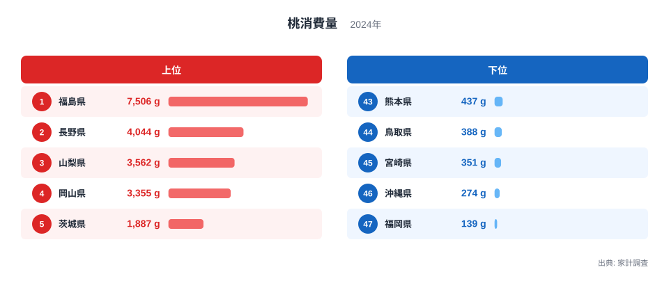
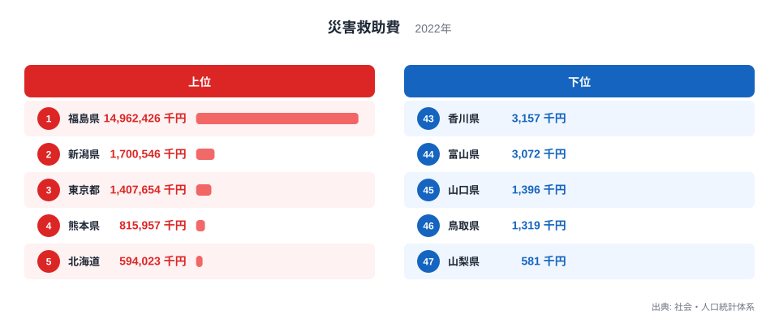
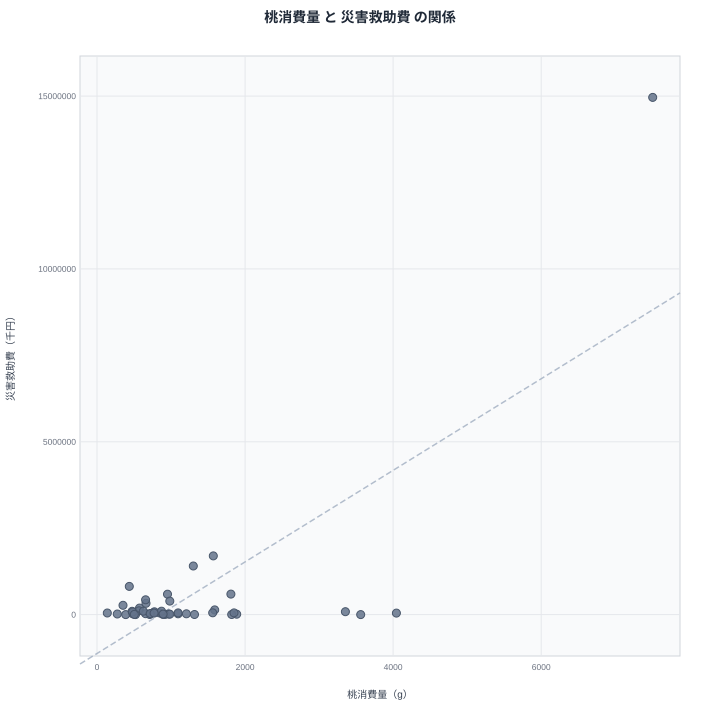

都道府県別の統計を眺めていると、まったく関係が無さそうな2つの指標が同じ県で1位になっていることに気づくことがあります。桃の消費量と、災害救助法にもとづく災害救助費がその一例です。どちらも1位は福島県で、しかもその差はわずかではありません。この一致は、桃をよく食べる県ほど災害への備えや支出も多いという何らかの関係を示しているのでしょうか。それとも、単なる偶然にすぎないのでしょうか。

この記事では、家計調査による桃消費量と、社会・人口統計体系による災害救助費という、性格の異なる2つのデータを並べて、見かけの相関の正体を確かめます。

## 桃消費量の上位と下位

<source-link href="/ranking/peach-consumption-quantity">桃消費量ランキングをもっと見る</source-link>

桃消費量のランキングでは、福島県が年間7,506グラムで1位となり、2位の長野県の4,044グラムを大きく引き離しています。3位の山梨県は3,562グラム、4位の岡山県は3,355グラム、5位の茨城県は1,887グラムと続き、上位5県のうち福島県、長野県、山梨県、岡山県はいずれも全国的に知られた桃の産地です。産地としての知名度が、そのまま家庭での消費量にも反映されている形といえます。

下位に目を移すと、福岡県が47位で139グラム、沖縄県が46位で274グラム、宮崎県が45位で351グラムという結果でした。1位の福島県と47位の福岡県を比べると、消費量には54倍近い開きがあります。桃は収穫時期が夏に限られる果物であり、産地からの流通量や地元での旬の意識が、消費量の大きな差につながっていると考えられます。

## 災害救助費の上位と下位

災害救助費のランキングでも、福島県が突出しています。福島県の支出額は14,962,426千円にのぼり、2位の新潟県の1,700,546千円、3位の東京都の1,407,654千円を大きく上回っています。4位の熊本県は815,957千円、5位の北海道は594,023千円でした。福島県の支出額は、2位の新潟県と比べても8倍を超える規模です。

下位に目を移すと、山梨県が47位で581千円、鳥取県が46位で1,319千円、山口県が45位で1,396千円という結果でした。[災害救助費ランキング](/ranking/disaster-relief-expenses-prefecture)の全県データを見ると、福島県以外の県では支出額が比較的小さい範囲に収まっており、福島県だけが突出して大きな値を示していることが分かります。

## 散布図で見る「見かけの相関」

2つの指標を散布図に並べると、右上に福島県だけが大きく飛び出した位置にあり、それ以外の46都道府県は左下の狭い範囲に集まっていることが一目で分かります。福島県という1つの県が桃消費量と災害救助費のどちらでも突出した値を持っているため、全体をならして眺めると、あたかも桃消費量が多い県ほど災害救助費も多いかのような右肩上がりの傾向があるように見えてしまいます。しかし、この見え方が本当に2つの指標のあいだの関係を表しているのかどうかは、福島県を除いた残りの県の顔ぶれを確認しなければ判断できません。

## 見かけの相関の正体、真因は何か

福島県を除いて、桃消費量の上位県だけを見ていくと、この見かけの相関がすぐに崩れることが分かります。桃消費量2位の長野県の災害救助費は44,262千円で26位、3位の山梨県は581千円で47位、つまり全県の中で最も少ない金額です。4位の岡山県は85,948千円で17位、5位の茨城県は14,131千円で37位でした。桃をよく食べる上位県のうち、災害救助費でも上位に入っている県は1つもありません。むしろ桃消費量3位の山梨県が災害救助費では最下位という、正反対の組み合わせすら見られます。

一方、災害救助費で2位の新潟県は、桃消費量では1,571グラムで10位にとどまっています。3位の東京都にいたっては1,301グラムで13位、4位の熊本県は437グラムで43位と、むしろ桃消費量が少ない部類に入ります。つまり、桃消費量と災害救助費のあいだに実際の結びつきがあるわけではなく、福島県という1つの県が両方の指標で極端な値を持っていたために、散布図全体の見た目が相関しているように映っていただけだったのです。相関関係は因果関係を意味しません。福島県が両方の指標で1位になっている真因は、桃の名産地であることと、過去に発生した大規模な災害への対応で多額の支出が生じたことという、まったく別の2つの事情が、たまたま同じ県で重なった結果と考えるのが妥当です。

## 内部リンクで他の指標も確認する

このように見かけの相関に引きずられないためには、1つの散布図だけで結論を出さず、関連する複数の指標を確認する習慣が役立ちます。[同じカテゴリの統計一覧](/category/economy)からは、桃消費量以外にもさまざまな家計調査のデータをたどることができます。福島県の突出した数値の背景をより詳しく知りたい場合は、[福島県のデータ](/areas/07000)で他の指標もあわせて確認すると、災害救助費が高い理由がより具体的に見えてきます。同様に、桃消費量2位でありながら災害救助費では中位にとどまる[長野県のデータ](/areas/20000)を見ると、産地であることと災害支出の多さが必ずしも結びつかないことが確認できます。

> [!NOTE]
> 桃消費量は総務省の家計調査による都道府県庁所在市の二人以上の世帯の年間消費量（2024年）、災害救助費は社会・人口統計体系による都道府県の財政支出額（2022年度）です。集計主体も対象年度も異なる指標であり、同じ年の家計行動を直接比べているわけではありません。

> [!WARNING]
> 47都道府県という限られた件数のデータでは、1つの県の極端な値が全体の相関の見え方を大きく変えてしまいます。今回のように片方の県が両方の指標で突出している場合、その1県を除いて確認しないと、実際には存在しない関係を見出してしまう危険があります。

> [!TIP]
> 散布図を読むときは、まず外れ値となっている点を探し、その点を除いた場合に傾向がどう変わるかを確認するとよいでしょう。桃消費量の上位県を1つずつ災害救助費のランキングと照らし合わせるように、複数の指標を組み合わせて個別に確認する読み方が、見かけの相関に惑わされない近道です。

## まとめ

- 桃消費量、災害救助費ともに1位は福島県で、両方の指標で突出した値を示しています
- 桃消費量の1位は福島県の7,506グラム、47位は福岡県の139グラムです
- 災害救助費の1位は福島県の14,962,426千円、47位は山梨県の581千円です
- 福島県を除くと、桃消費量の上位県は災害救助費で上位に入っておらず、明確な相関は見られません
- 見かけの相関は福島県という1つの県の突出した値によるもので、相関関係は因果関係を意味しません

## データ出典

桃消費量は総務省統計局「家計調査」（2024年、都道府県庁所在市の二人以上の世帯を対象とした年間消費量）、災害救助費は総務省統計局「社会・人口統計体系」（2022年度、都道府県財政）を利用しています。
