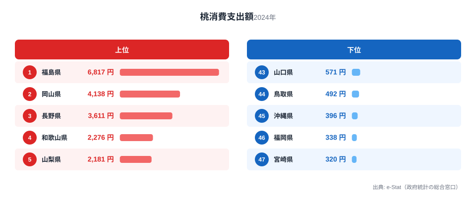

もも(桃)は夏の代表的な贈答用フルーツです。総務省家計調査による1世帯あたり年間購入額を都道府県庁所在地別に見ると、1位と2位以下の差がとりわけ目立つ結果になりました。今回のランキングでは、なぜ福島だけが突出しているのか、そして僅差で続く産地勢の顔ぶれを見ていきます。

2024年の家計調査によると、もも購入額の全国平均は1世帯あたり1,261円です。1位福島は6,817円で、これは全国平均のおよそ5.4倍にあたります。最下位の宮崎は320円で、福島との差は21.3倍に達します。同じ果物でも、住む県によってこれだけ購入額が変わるのです。

> [!NOTE]
> このランキングは総務省「家計調査」の品目別支出金額(都道府県庁所在市及び政令指定都市)を基にしています。実際にもも狩りや自家消費で入手した分は購入額に含まれないため、産地の実際の消費量とは必ずしも一致しません。

## もも購入額 上位5県と下位5県

<source-link href="/ranking/peach-consumption-expenditure">もも購入額ランキングをもっと見る</source-link>

1位は福島で6,817円。2位岡山4,138円との差だけでも2,679円あり、福島の突出ぶりが際立ちます。3位は長野3,611円、4位和歌山2,276円、5位山梨2,181円と続き、ここから先は僅差の争いになっていきます。

福島がここまで突出している理由の一つは、県内での購入機会の多さです。福島は東北有数のもも産地であり、地元スーパーや直売所での購入頻度が高いと考えられます。加えて、お盆や帰省シーズンの贈答需要も購入額を押し上げている可能性があります。[福島県の統計](/areas/07000)を見ると、農業関連の指標でも東北の中で存在感のある県であることがわかります。

2位は岡山です。岡山は「白桃」ブランドで知られる西日本有数のもも産地で、購入額4,138円は全国平均の3.3倍にあたります。3位長野3,611円も「川中島白桃」などのブランド桃を抱える有力産地です。[岡山県の統計](/areas/33000)や[長野県の統計](/areas/20000)を見ても、農業産出額の高さがうかがえます。

> [!TIP]
> 2位以下の岡山・長野・和歌山・山梨はいずれも国内有数のもも産地です。「産地=消費地」の構図が上位5県にはっきり表れていますが、福島だけが平均の5倍という水準にあり、産地であることだけでは説明しきれない突出があります。

## 下位グループの顔ぶれ

下位を見ると、九州・沖縄勢が目立ちます。最下位は宮崎320円、46位福岡338円、45位沖縄396円と、西日本の温暖な地域が並びます。

もも産地は東北・甲信越・中国地方に集中しており、九州・沖縄は流通コストの面でも入手しやすさの面でも不利な立地です。加えて、これらの地域はマンゴーやパイナップルなど地元産の果物の選択肢が豊富で、もも以外の果物への支出が優先されやすい事情もあります。[宮崎県の統計](/areas/45000)を見ると、マンゴーなど別の果物産地としての側面が強いことがわかります。

家計調査の他の果物ランキングと比べても、もも購入額の地域差は際立って大きい部類に入ります。果物消費全体の傾向は[経済カテゴリ](/category/economy)で他の家計調査データとあわせて確認できます。

> [!WARNING]
> 家計調査は都道府県庁所在市及び政令指定都市のみの調査です。県内の農村部・産地近郊での消費実態を必ずしも反映していない点に注意してください。

## 2位争いは僅差の激戦区

福島の圧倒的な1位に対して、2位岡山から5位山梨までは4,138円から2,181円の間にひしめき合っています。特に4位和歌山2,276円と5位山梨2,181円の差はわずか95円で、年によって順位が入れ替わる可能性がある水準です。

この僅差構造は、複数の有力産地が拮抗している証拠でもあります。岡山の「白桃」、山梨・長野の「あかつき」「川中島白桃」、和歌山の「あら川の桃」など、各県ともブランド桃を抱えており、地元での消費・購入需要が根強いことがうかがえます。全国平均1,261円と比べると、5位山梨でもおよそ1.7倍、4位和歌山は1.8倍の水準にあり、上位5県はいずれも平均を大きく上回っています。

一方で、6位以下になると数字は一段と落ち着きます。6位奈良1,935円、7位新潟1,868円と続き、10位滋賀は1,427円で全国平均に近づきます。中位から下位にかけては、産地の有無よりも果物全般への支出傾向や世帯構成の違いが購入額を左右していると考えられます。

## まとめ

- 1位は福島6,817円で、全国平均1,261円の5.4倍
- 最下位は宮崎320円で、福島との差は21.3倍
- 2位岡山4,138円、3位長野3,611円、4位和歌山2,276円、5位山梨2,181円と、上位はもも産地が独占
- 4位和歌山と5位山梨の差はわずか95円で、産地県同士の僅差争いが続く
- 下位は九州・沖縄勢が中心で、産地からの距離と代替果物の存在が背景にあると考えられる

## データ出典

総務省統計局「家計調査」(都道府県庁所在市及び政令指定都市、2024年)を基に作成しています。
