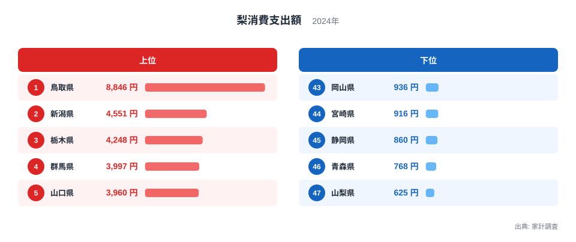
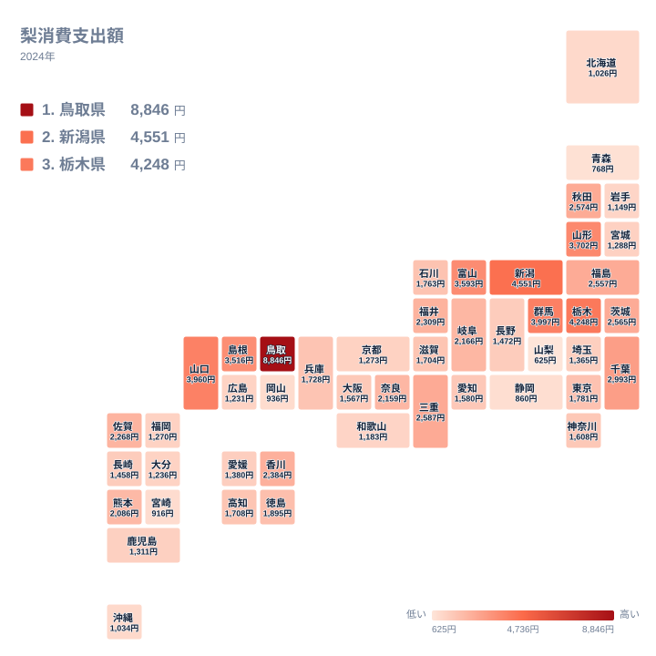

梨は夏から秋にかけて店頭に並ぶ、日本の食卓になじみ深い果物です。家計調査の2024年データを見ると、梨に使う金額は都道府県でかなりの差があることがわかります。全国で最も支出額が多いのは鳥取県で8,846円、最も少ないのは山梨県で625円でした。同じ国内でありながら、なぜここまで開きが生まれるのでしょうか。

この記事では、47都道府県の梨消費支出額を上位と下位に分けて確認したうえで、地理的な分布をタイルマップで見ていきます。そのうえで、産地や食文化との結びつきという観点から、この差が生まれる理由を考えます。

## 梨消費支出額の上位と下位

<source-link href="/ranking/pear-consumption-expenditure">梨消費支出額ランキングをもっと見る</source-link>

上位5県を見ると、1位は鳥取県で、梨に使う金額は8,846円です。2位は新潟県で4,551円、3位は栃木県で4,248円、4位は群馬県で3,997円、5位は山口県で3,960円となっています。1位の鳥取県は2位の新潟県のおよそ2倍にあたる金額で、1県だけが突出して高い水準にあることがわかります。

下位5県は、43位が岡山県で936円、44位が宮崎県で916円、45位が静岡県で860円、46位が青森県で768円、そして最下位の47位が山梨県で625円です。鳥取県の8,846円を山梨県の625円で割ると、およそ14倍という大きな差になります。同じ家計調査の枠組みで集計されているにもかかわらず、これだけの開きが生まれるのは、単なる好みの違いだけでは説明しきれません。次の章では、この差を地理的な分布として見てみます。

## 地理的にみる梨消費の分布

タイルマップで全国を見渡すと、梨消費支出額が高い県は特定の地域にかたまっているわけではなく、中国地方、関東地方、中部地方に分かれて分布していることがわかります。上位5県のうち、鳥取県と山口県は中国地方、栃木県と群馬県は関東地方、新潟県は中部地方に位置しており、隣り合う県同士が連なって高い値を示しているわけではありません。

一方で下位を見ると、青森県は東北地方、山梨県と静岡県は中部地方、岡山県は中国地方、宮崎県は九州地方と、こちらも全国に散らばっています。地図の上での隣接関係よりも、それぞれの地域で梨がどれだけ身近な果物として扱われてきたかという要因のほうが、支出額の差に強く関わっていると考えられます。この点は次の章で詳しく見ていきます。

## なぜ産地とのつながりが支出額を左右するのか

梨消費支出額の上位県には、梨の産地として知られる県が並んでいます。鳥取県は二十世紀梨の産地として広く知られており、県内で梨が身近な果物として親しまれてきた土地です。栃木県や群馬県も梨の産地として知られ、地元で栽培された梨が日常的に流通していることが、消費支出額の高さにつながっている可能性があります。[仮説] 産地に近い県では、地元産の梨が手に入りやすく、贈答用や日常の購入機会も多くなるため、支出額が高くなりやすいと考えられます。ただし、この関係を裏づけるには生産量や出荷量のデータとあわせて検証する必要があります。

一方、下位に並ぶ県には、梨以外の果物の産地として知られる県が目立ちます。青森県はりんごの一大産地として全国的に知られていますし、静岡県や山梨県はみかんやぶどう、桃といった別の果物の産地です。[仮説] こうした県では、梨以外の果物が食卓や贈答文化の中心を占めており、相対的に梨への支出が少なくなっている可能性があります。もちろん、これも仮説であり、実際の要因は気候や流通の事情、世帯構成の違いなど複数が絡み合っていると考えられます。

こうした産地とのつながりは、[鳥取県のデータ](/areas/31000)や[新潟県のデータ](/areas/15000)を見ることで、他の指標とあわせて確認できます。梨以外の農産物や消費支出のデータとつき合わせると、地域ごとの食文化の輪郭がより見えてくるはずです。

## 他の果物と比べて考える視点

梨のように季節性の強い果物は、産地との距離や地元での栽培文化によって消費支出額に差が出やすいという特徴があります。同じ家計調査の枠組みで集計されている他の果物の消費支出額と比べると、それぞれの果物が持つ産地の分布や旬の時期によって、地域差の出方が異なることが見えてきます。梨だけでなく、りんごやみかんといった他の果物のランキングとあわせて見ることで、その県がどの果物と縁が深いのかという食文化の特徴がより立体的に浮かび上がります。

こうした横断的な視点を持つことで、単に「梨をよく食べる県」という見方にとどまらず、その県全体の果物消費の傾向や、農産物としての強みを読み取ることができます。同じカテゴリに属する他の経済指標と合わせて見たい方は、[同じカテゴリの統計一覧](/category/economy)から関連する統計を確認できます。

## まとめ

梨消費支出額は、都道府県によっておよそ14倍という大きな開きがあることが2024年の家計調査からわかりました。上位には鳥取県、新潟県、栃木県、群馬県、山口県が並び、いずれも梨の産地として知られる県が目立ちます。一方、下位には青森県や静岡県、山梨県など、梨以外の果物の産地として知られる県が並んでいます。地理的にはどちらのグループも全国に分散しており、単純な地域のかたまりでは説明できない分布になっています。産地との距離や地元での栽培文化が支出額に影響している可能性はありますが、これはあくまで仮説であり、生産量などの別のデータとあわせて検証する余地が残されています。

> [!NOTE]
> 家計調査における梨消費支出額は、都道府県庁所在市および政令指定都市に住む2人以上の世帯を対象に集計された金額です。県全体の消費実態そのものではなく、代表となる都市の世帯の平均値である点に留意してください。

> [!WARNING]
> 梨は夏から秋にかけて出回る季節性の高い果物のため、年間の支出額は購入が集中する時期の価格や出回り量に左右されます。産地直売所での購入や自家消費分は家計調査の対象に含まれにくく、実際の消費量そのものを示す数値ではない点に注意が必要です。

> [!TIP]
> 梨消費支出額を読み解くときは、単に金額の大小を比べるだけでなく、その県が梨の産地に近いかどうか、また他の果物の産地としての性格を持っているかどうかとあわせて見ると、地域差の背景がより理解しやすくなります。

## データ出典

このランキングは総務省統計局「家計調査」の2024年データをもとに作成しています。
