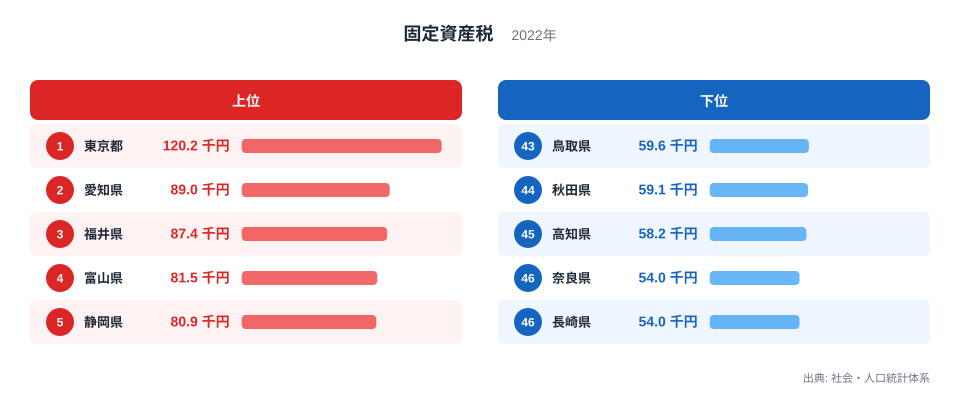
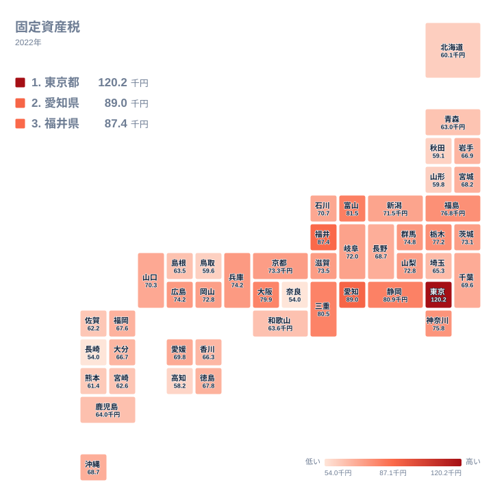

固定資産税は、土地・家屋・機械設備などの償却資産を対象に市町村（東京23区は東京都）が課す地方税です。総務省の社会・人口統計体系（2022年）をもとに都道府県別の一人当たり額を比べると、47都道府県の間には想像以上の開きがあることがわかります。

もっとも高いのは東京都で120.2千円、もっとも低いのは長崎県と奈良県の54千円です。その差はおよそ2.2倍にのぼります。同じ国内で暮らしていても、住む場所によって一人当たりの固定資産税額はここまで違うのです。この記事では、上位と下位のそれぞれにどんな県が並んでいるのか、そしてその差がどこから生まれているのかを見ていきます。

> [!NOTE]
> 固定資産税は本来、市町村が土地・家屋・償却資産に課す市町村税ですが、東京23区の分だけは例外的に東京都が課税します。ここで扱う数値は市町村の徴収分を都道府県単位で集計した一人当たり額で、住民個人が支払う税額そのものではありません。企業が保有する工場や設備などの償却資産も課税対象に含まれるため、人口が少なくても大規模な事業所が集まる地域では一人当たりの額が押し上げられる点に注意してください。

## 上位と下位の内訳

<source-link href="/ranking/per-capita-fixed-asset-tax-pref-municipal">固定資産税ランキングをもっと見る</source-link>

上位5県を見ると、1位は東京都で120.2千円、2位は愛知県で89千円、3位は福井県で87.4千円、4位は富山県で81.5千円、5位は静岡県で80.9千円となっています。1位の東京都は2位の愛知県を30千円以上も引き離しており、突出した水準です。

東京都が飛び抜けて高い背景には、全国でもっとも地価水準が高いことに加え、都心部に大規模なオフィスビルや商業施設が集中していることがあります。土地・家屋の評価額そのものが高いため、一人当たりの固定資産税額も自然に高くなると考えられます。一方、2位以下に並ぶ愛知県、静岡県は自動車産業を中心とした製造業の集積地で、福井県や富山県も繊維・眼鏡・医薬品・金属などの製造業が地域経済を支えてきた地域です。[仮説] 工場や生産設備といった償却資産が多く立地する地域ほど、人口一人当たりの固定資産税額が押し上げられやすい可能性がありますが、産業別の資産構成までは今回のデータからは確認できません。

下位を見ると、43位は鳥取県で59.6千円、44位は秋田県で59.1千円、45位は高知県で58.2千円、46位は奈良県で54千円、47位は長崎県で54千円です。46位と47位は同じ54千円ですが、統計上は奈良県が46位、長崎県が47位という順位になっています。下位に並ぶ県には、大規模な工業集積地が少なく、人口密度も比較的低いという共通点が見られます。[仮説] 大規模な事業所や商業施設が少ない地域では、住宅地中心の土地利用となり、一人当たりの資産評価額が上位県ほど高くならない可能性があります。

## 地理的分布から見える偏り

地図で全国を見渡すと、上位県は関東・中部・近畿にかけての太平洋ベルト地帯に集中していることがわかります。東京都、愛知県、静岡県、三重県、大阪府、兵庫県といった、いわゆる三大都市圏や工業地帯を含む都府県が、比較的高い水準にまとまって並んでいます。福井県や富山県のように、日本海側でも製造業の集積がある県は、周辺の県よりも高い傾向が見られます。

一方で、下位に位置する県は東北北部から山陰、四国、九州西部にかけて点在しています。秋田県、鳥取県、島根県、高知県、長崎県などがこれにあたり、いずれも大都市圏から離れ、人口規模も比較的小さい地域です。[仮説] 太平洋ベルト地帯に代表される大都市圏・工業集積地からの距離が、一人当たりの固定資産税額の地理的な偏りに関係している可能性がありますが、これは地図から読み取れる傾向であって、統計的に検証された因果関係ではありません。

> [!WARNING]
> このランキングは都道府県単位の平均値であり、同じ県の中でも都市部と郡部で一人当たりの固定資産税額には大きな差があります。たとえば同じ都道府県でも、県庁所在地の市街地と山間部の町村とでは地価も産業構造も異なるため、県平均だけを見て「その県の実態」と考えるのは早計です。市区町村単位の内訳を確認したい場合は、[同じカテゴリの統計一覧](/category/economy)から関連するランキングもあわせてご覧ください。

## なぜ上位県と下位県に分かれるのか

固定資産税額の差を生む要素は、大きく分けて2つ考えられます。1つは土地の評価額、もう1つは家屋・償却資産の集積度です。[東京都のデータ](/areas/13000)を見ると、全国でもっとも地価が高い地域であることに加え、大規模な家屋・償却資産が集中していることが、突出した一人当たり税額につながっていると考えられます。

もう1つの要素である産業集積についても見てみましょう。[愛知県のデータ](/areas/23000)からは、自動車産業をはじめとする製造業の存在感が大きいことがうかがえます。工場や生産設備といった償却資産は、住宅地の土地・家屋よりも評価額が高くなりやすいため、こうした産業が集積する地域では一人当たりの固定資産税額が上位に入りやすい構造があると考えられます。[仮説] ただし、今回のデータには産業別の内訳や事業所数は含まれていないため、この関係は仮説にとどまります。

> [!TIP]
> このランキングを読むときは、単純に「税負担が重い県」と捉えるのではなく、「その地域にどれだけの土地・家屋・事業用資産が集積しているか」を映す指標として読むと理解しやすくなります。人口一人当たりの値である以上、人口が少なくても大規模な事業所や高い地価の地域があれば、数値は高く出やすいためです。

## まとめ

- 一人当たり固定資産税額の1位は東京都で120.2千円、最下位は長崎県と奈良県の54千円で、その差はおよそ2.2倍です。
- 上位5県は東京都、愛知県、福井県、富山県、静岡県で、いずれも大都市圏または製造業の集積地です。
- 下位5県は鳥取県、秋田県、高知県、奈良県、長崎県で、大都市圏から離れた地域が中心です。
- 地図で見ると、太平洋ベルト地帯を中心とした都府県で税額が高く、東北北部・山陰・四国・九州西部で低い傾向が見られます。
- 地価の高さと、家屋・償却資産の集積度が、一人当たり固定資産税額の地域差を生む主な要因と考えられますが、産業別の詳細な検証は今回のデータの範囲を超えます。

## データ出典

出典: 総務省 社会・人口統計体系（2022年）
