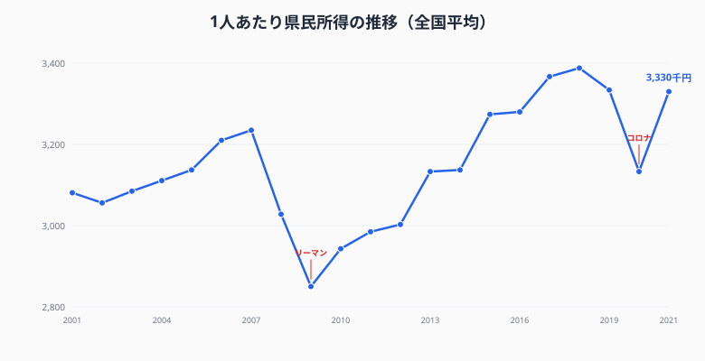
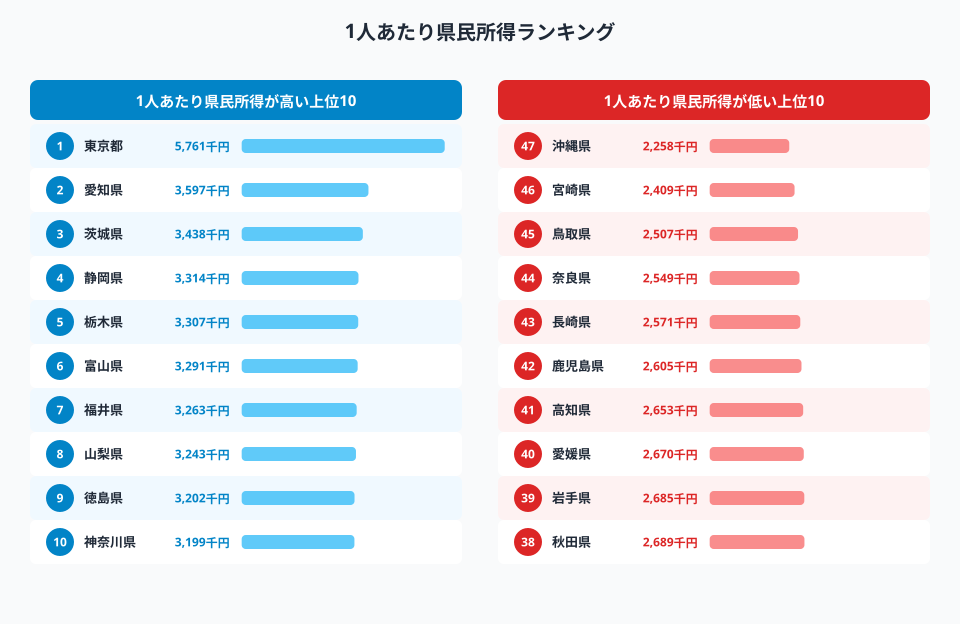
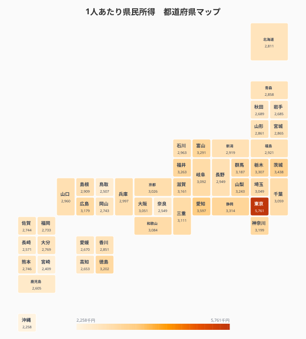
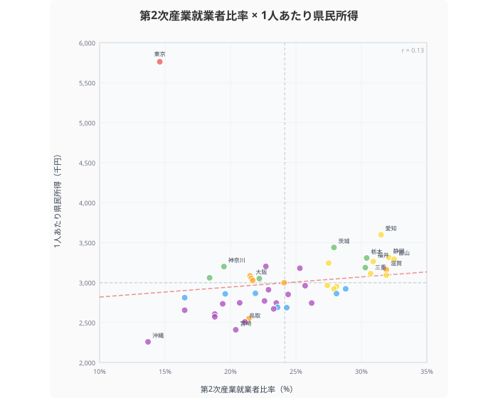
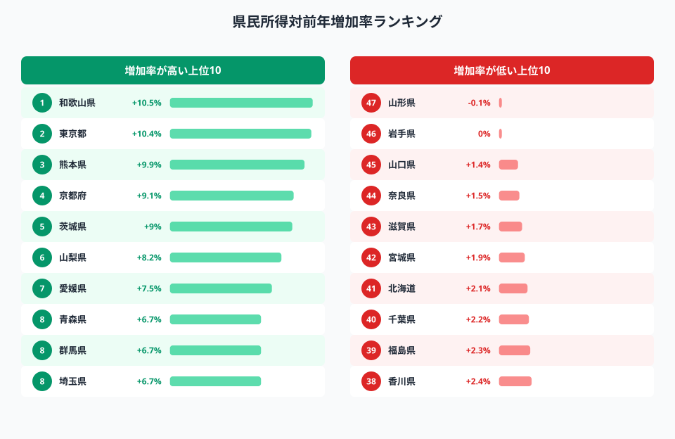

都道府県の経済力を比較するとき、よく使われるのが**1人あたり県民所得**です。ただし「県民所得＝県民の年収」ではありません。企業の利益や財産所得も含む、その県全体の「稼ぐ力」を人口で割った指標です。

> [!NOTE]
> 県民所得＝雇用者報酬 ＋ 財産所得 ＋ 企業所得。個人の年収ではなく、県全体の経済活動で生み出された所得の総額を人口で割った値です。内閣府「県民経済計算」（平成27年基準）による。

## 県民所得の推移──リーマンとコロナ、2つのショック

<data-source url="https://www.e-stat.go.jp/dbview?sid=0000010203" label="e-Stat 社会・人口統計体系"></data-source>

> [!NOTE]
> 基準年改定により、2001〜2005年は平成17年基準、2006〜2011年は平成23年基準、2012〜2021年は平成27年基準の値を使用しています。基準年により水準が若干異なるため、トレンドの把握としてご覧ください。

全国平均の推移を見ると、**2つの谷**がはっきり見えます。

**2008〜2009年のリーマンショック**では、約323万円から約285万円へ約40万円の急落。製造業を中心に企業所得が大きく落ち込みました。回復には約6年を要し、2015年にようやくリーマン前の水準を回復しています。

**2020年のコロナ禍**では約334万円から約313万円へ約20万円の下落。リーマンほどの落ち込みではなかったものの、翌2021年度には約333万円へV字回復しており、景気回復の速さが際立ちます。

2021年度の全国平均は**約333万円**。20年前の2001年（約308万円）と比較すると約8%の増加ですが、物価上昇を考慮すると実質的にはほぼ横ばいです。

## 1人あたり県民所得ランキング

<data-source url="https://www.e-stat.go.jp/dbview?sid=0000010103" label="e-Stat 社会・人口統計体系"></data-source>

**1位は[東京都](/areas/13000)の約521万円**（5,214千円）。2位の愛知県（約343万円）に約178万円の差をつけての圧勝です。東京には大企業の本社が集中し、金融・情報通信など高付加価値産業が厚いことが背景です。

注目すべきは**3位以下の顔ぶれ**。3位・福井県（318万円）、4位・栃木県（313万円）、5位・富山県（312万円）、6位・静岡県（311万円）、7位・茨城県（310万円）──いずれも大都市圏ではなく、**製造業が盛んな工業県**です。神奈川県は13位、大阪府は22位にとどまり、「大都市＝高所得」とは限らないことがわかります。愛知は大都市かつ製造業集積地で、両面の強さを持つ特殊なケースです。

一方、下位には[沖縄県](/areas/47000)（約217万円）、宮崎県（約229万円）、鳥取県（約231万円）が並びます。**1位の東京と47位の沖縄では約2.4倍の格差**があります。

### 全国マップ

<data-source url="https://www.e-stat.go.jp/dbview?sid=0000010103" label="e-Stat 社会・人口統計体系"></data-source>

マップで見ると、**東海から北関東にかけての太平洋ベルト沿い**が濃い色（高所得）で目立ちます。愛知・静岡・三重・岐阜の中京圏、茨城・栃木・群馬の北関東は、いずれも製造業の集積地です。

もうひとつ注目すべきは**北陸（富山・福井・石川）**。地方でありながら所得水準が高く、アルミ・繊維・化学など特色ある製造業が支えています。

逆に九州南部（宮崎・鹿児島・長崎）と四国南部（高知・愛媛）は色が薄く、所得水準の地域差が視覚的にも明確です。

<source-link href="/ranking/per-capita-kenmin-shotoku-h27">47都道府県の1人あたり県民所得ランキングをもっと見る</source-link>

<ad-slot></ad-slot>

## 産業構造との関係──製造業が強い県ほど所得が高い？

<data-source url="https://www.e-stat.go.jp/dbview?sid=0000010103" label="e-Stat 社会・人口統計体系"></data-source>

「製造業が強い県ほど所得が高い」──散布図で検証すると、全体の相関係数はr=0.13と弱く見えます。しかし、これは**東京都が外れ値**として引き下げているため。

東京は第2次産業就業者比率14.6%と全国最低クラスですが、所得は断トツの1位。金融・IT・コンサルティングなど高付加価値の第3次産業が集中する特殊な構造です。

**東京を除くとr=0.68**。かなり強い正の相関があり、「製造業比率が高い県ほど所得が高い」傾向が確認できます。

散布図の右上（製造業比率も所得も高い）には**愛知・静岡・富山・滋賀・三重**が集まります。いずれもトヨタ関連・化学・機械など、付加価値の高い製造業の集積地です。

左下（製造業比率も所得も低い）には**沖縄・北海道・高知**。第1次産業やサービス業が中心の地域で、製造業の薄さが所得水準にも影響しています。

<source-link href="/correlation?x=per-capita-kenmin-shotoku-h27&y=employed-people-ratio-secondary">県民所得×第2次産業就業者比率の相関をもっと見る</source-link>

## 成長率で見る──伸びている県、停滞している県

<data-source url="https://www.e-stat.go.jp/dbview?sid=0000010203" label="e-Stat 社会・人口統計体系"></data-source>

2021年度の対前年増加率を見ると、風景が一変します。

**増加率1位は和歌山県の+10.5%**。所得水準では16位の和歌山が、成長率ではトップに躍り出ました。2位は東京都の+10.4%、3位は熊本県の+9.9%と続きます。

2021年度はコロナからの反動回復の年で、47県中46県がプラス成長。**唯一のマイナスは山形県の-0.1%**でした。

注目すべきは**所得水準と成長率の関係**。所得水準で下位に位置する青森（+6.7%）、高知（+6.6%）、鹿児島（+6.6%）も高い成長率を記録しています。コロナからの回復局面では、地方経済にも回復の波が及んだことがわかります。

一方、所得水準が高い滋賀（+1.7%）、山口（+1.4%）は成長率が低く、水準の高さが必ずしも成長力につながるわけではありません。

<ad-slot></ad-slot>

## まとめ

県民所得は「年収」ではありませんが、都道府県の経済力を測る代表的な指標です。東京の約521万円に対し沖縄は約217万円と、約2.4倍の格差が存在します（2020年）。

興味深いのは、上位に「大都市」ではなく「工業県」が並ぶこと。福井・栃木・富山・静岡・茨城──製造業の強さが所得を押し上げています。東京を除けば第2次産業就業者比率と所得には強い相関（r=0.68）があり、「ものづくり県＝高所得県」の構図が浮かびます。

ただし所得が高い＝暮らしやすいとは限りません。物価や住居費を考慮した「実質的な豊かさ」は、また別の指標で見る必要があります。

## データ出典

本記事のデータはe-Stat（政府統計の総合窓口）を基に作成しています。

本記事の対象データ: [関連カテゴリ](/category/economy)
