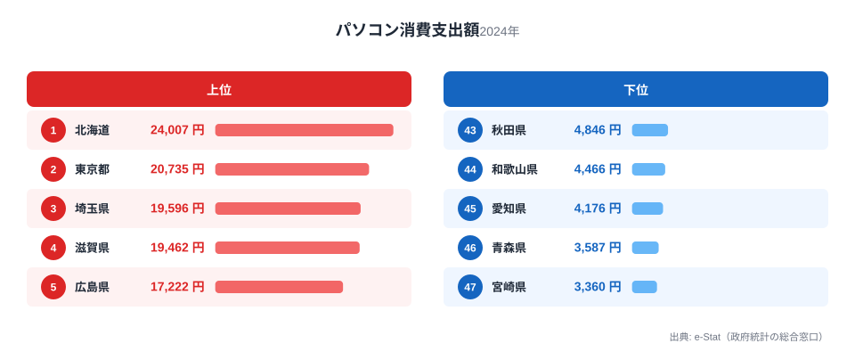
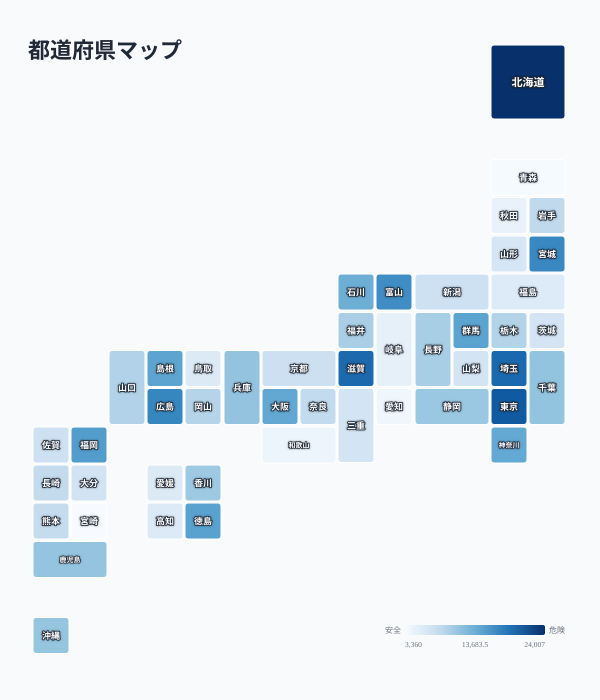

パソコンにいくら使っているかは、県によって驚くほど差があります。総務省「家計調査」による2024年のパソコン消費支出額（二人以上世帯の年間支出）を都道府県別に見ると、1位は北海道の24,007円、最下位は宮崎県の3,360円で、その差は7.1倍にのぼります。

面白いのは、この順位が「都市部が強い」という単純な図式にならないことです。東京都は2位で健闘していますが、日本最大の製造業県である愛知県は45位、京都府は30位と、いずれも下位に沈んでいます。パソコン購入は所得だけでなく、在宅ワークの浸透度や子どもの教育環境、世帯構成の違いが複雑に絡み合って決まる支出だからです。

この記事では、上位県と下位県の顔ぶれを比較しながら、「なぜ北海道が1位で、なぜ愛知が下位なのか」という一見矛盾した結果の背景を探ります。

> [!NOTE]
> この指標は総務省「家計調査」における、都道府県庁所在市の二人以上世帯の年間パソコン消費支出額（円）です。パソコンの購入・買い替え費用の実支出額を表し、保有率や利用時間とは異なる指標です。単身世帯は含まれません。

## 上位と下位

<source-link href="/ranking/personal-computer-consumption-expenditure">パソコン消費支出額ランキングをもっと見る</source-link>

上位5県の顔ぶれは、北海道（24,007円）、東京都（20,735円）、埼玉県（19,596円）、滋賀県（19,462円）、広島県（17,222円）です。東京都・埼玉県はいずれも高所得・高学歴世帯が多く、教育投資への意識が高い地域として説明がつきます。一方で北海道が最上位に立つのは意外に映るかもしれません。北海道は広域分散型の生活圏で、通信環境の整備やリモートワーク・オンライン学習の必要性が本州の都市部より切実だという事情があります。加えて冬季は屋内で過ごす時間が長く、パソコンを使った学習・娯楽・在宅業務への支出が積み増されやすい生活パターンも影響していると考えられます。

滋賀県が4位に入っているのも注目です。滋賀県は京阪神のベッドタウンとして共働き世帯が多く、県民所得の水準も全国上位です。広島県（5位）に続き、宮城県（6位）・富山県（7位）も上位に並びますが、いずれも県庁所在都市に大企業の支店や研究機関が集積し、在宅勤務にパソコンが必須のホワイトカラー層が一定数存在する地域です。

一方、最下位グループは宮崎県（3,360円）、青森県（3,587円）、愛知県（4,176円）、和歌山県（4,466円）、秋田県（4,846円）となっています。宮崎・青森・秋田・和歌山は、いずれも県民所得が全国平均を下回る地域で、家計に占める必需品以外の支出余力が限られる傾向があります。パソコンは他の家電と違い「今すぐ壊れて困る」わけではないため、家計が厳しい年は買い替えが後回しにされやすい耐久消費財です。

> [!WARNING]
> パソコン消費支出額は年ごとの変動が大きい指標です。パソコンは平均5〜7年程度で買い替えられる耐久消費財のため、たまたま調査年に買い替えが集中した県は跳ね上がり、逆に前年に買い替えが済んだ県は落ち込みます。単年の順位だけで「その県はパソコンを持っていない」と結論づけることはできません。支出額はあくまで「その年に使ったお金」であり、保有率そのものを示す指標ではない点に注意してください。

## 発見: 愛知・京都はなぜ下位なのか

<source-link href="/ranking/personal-computer-consumption-expenditure">パソコン消費支出額の全47都道府県を見る</source-link>

このマップを見ると、パソコン消費支出額は必ずしも「経済規模が大きい県」と一致しないことがはっきりします。愛知県は自動車産業を中心に日本有数の製造業県であり、県内総生産は全国トップクラスです。それにもかかわらず45位という低さは、製造業中心の就業構造では在宅勤務の必要性が本社機能の多い首都圏ほど高くないことを示唆しています。工場やライン作業が中心の職種では、業務用パソコンを個人で追加購入する動機が薄いのかもしれません。京都府も30位で、伝統産業・観光業のウエイトが高い経済構造がパソコン支出の低さに関係している可能性があります。

対照的に、上位に並ぶ北海道・埼玉県・滋賀県・宮城県は、いずれも「本州・北海道の中核都市」か「大都市圏のベッドタウン」という共通項があります。ベッドタウン型の県は共働き世帯や子育て世帯の比率が高く、子どものGIGAスクール端末とは別に家庭用パソコンを整える教育熱心な世帯が多いことが背景として考えられます。[仮説] 在宅ワーク比率や世帯あたりの就学児童数との相関を検証すれば、この地域パターンの説明力をさらに高められる可能性がありますが、本記事のデータだけでは断定できません。

> [!TIP]
> パソコン消費支出額を人口一人あたりの県民所得と比べてみると、必ずしも所得の高さと支出額が比例しない県が見えてきます。「高所得なのに支出が低い県」「所得は平均的でも支出が高い県」を探すと、教育熱や在宅勤務文化といった生活スタイルの違いが浮かび上がります。詳しくは[北海道の地域データ](/areas/01000)や[宮崎県の地域データ](/areas/45000)も合わせてご覧ください。

家計の消費支出全体をより広く見たい方は、[経済カテゴリのランキング一覧](/category/economy)や[家計・くらしをテーマにしたページ](/themes/consumer-prices)もあわせてご参照ください。

## まとめ

- 1位は北海道（24,007円）、最下位は宮崎県（3,360円）で7.1倍の格差
- 2位は東京都（20,735円）、3位は埼玉県（19,596円）と首都圏勢が続く
- 製造業県の愛知県（45位）・伝統産業の京都府（30位）は経済規模の割に支出が低い
- 上位県はベッドタウン型・在宅ワーク環境が整った地域に集中する傾向
- パソコンは買い替えサイクルが長い耐久消費財のため、単年の順位変動には注意が必要

## データ出典

総務省統計局「家計調査」（2024年、都道府県庁所在市の二人以上世帯）を基に、e-Stat（政府統計の総合窓口）経由で集計・整備しています。
