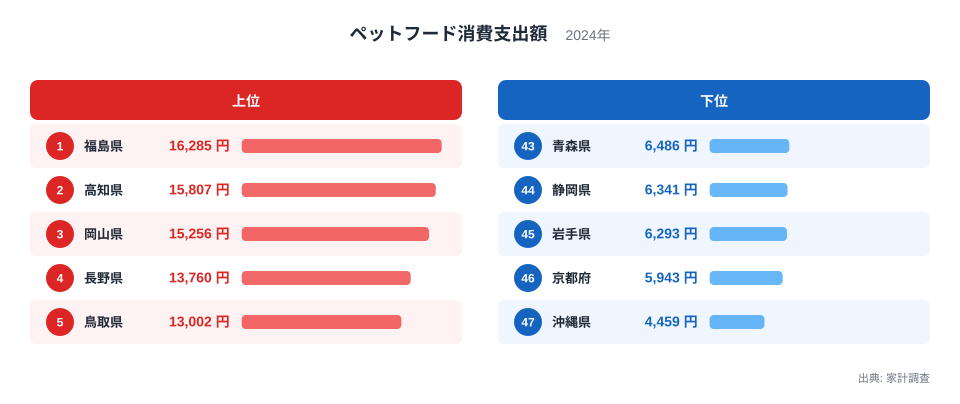
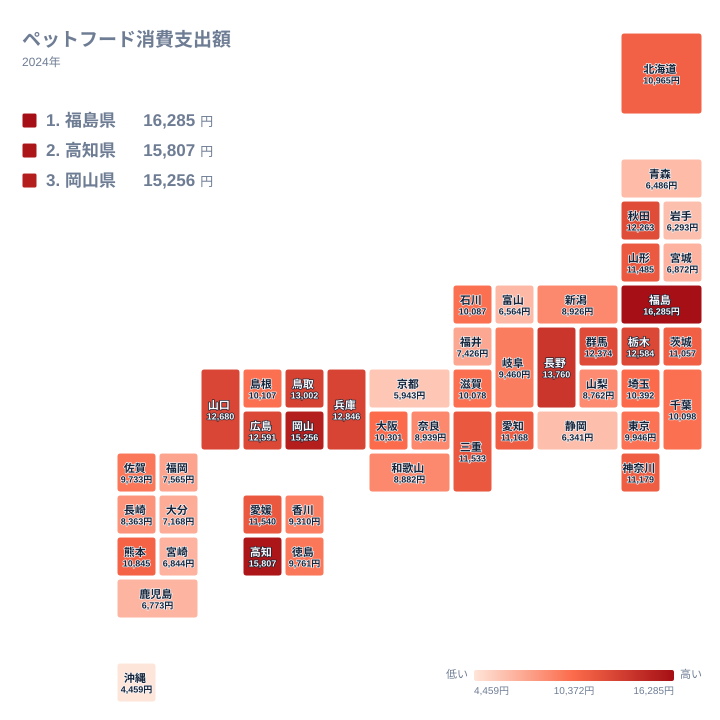

犬や猫と暮らす世帯が増え、ペットは家族の一員として扱われるようになりました。その暮らしぶりは統計にも表れます。2024年の家計調査によれば、ペットフードへの支出が最も多かったのは福島県で16,285円、最も少なかったのは沖縄県で4,459円でした。その差は3.65倍にのぼります。

同じ日本国内で、ペットに使うお金にこれほどの開きが生まれるのはなぜでしょうか。この記事では、都道府県別の支出額をたどりながら、住まいのかたちと世帯の構成という2つの条件から、その差の背景を整理します。

> [!NOTE]
> この数字はペットフードの購入に使った金額であり、ペットを飼っている世帯の割合そのものではありません。家計調査は飼っていない世帯も含めた全世帯の平均を出すため、飼育率が高い県と、飼育世帯が高価な餌を選ぶ県のどちらでも数字は上がります。

## 支出が多い県と少ない県

上位と下位を確認します。

<source-link href="/ranking/pet-food-consumption-expenditure">ペットフードの消費支出ランキングをもっと見る</source-link>

上位は福島県が16,285円、高知県が15,807円、岡山県が15,256円、長野県が13,760円、鳥取県が13,002円と並びます。地方の県が占めており、大都市を抱える都府県は入っていません。

下位は沖縄県が4,459円、京都府が5,943円、岩手県が6,293円、静岡県が6,341円、青森県が6,486円です。ここには沖縄県と京都府という性格の異なる地域が並び、東北の県も含まれています。

上位に地方の県が並ぶ一方で、下位にも地方の県が入っている点が、この指標の読み方を難しくしています。単純に都市と地方で分かれているわけではありません。

## 住まいのかたちが飼育の前提を決める

地図で分布を見ると、その複雑さがわかります。

ペットとの暮らしを最も強く制約するのは住まいの条件です。集合住宅では管理規約でペットの飼育が制限されることが多く、飼える場合も種類や大きさに条件が付きます。一戸建てで庭がある住まいなら、こうした制約を受けません。

上位に並ぶ福島県、高知県、岡山県、長野県、鳥取県は、いずれも持ち家の一戸建てが住まいの中心を占めるとされる地域です。飼育の物理的な条件が整いやすいことが、支出の多さの土台にあるとみられます。

もう一つの要因は世帯の構成です。子どもが独立した後の夫婦だけの世帯や、高齢の単身世帯では、ペットが日々の生活の中心的な存在になります。犬や猫と過ごす時間が長くなれば、餌の質にも手をかけるようになります。上位の県は高齢化が進んだ地域が多く、この条件が重なります。

沖縄県が最下位となる背景には、住まいの条件があります。沖縄県は集合住宅の割合が高いとされ、飼育に制約を受ける世帯が相対的に多くなります。集合住宅で飼える動物の種類と大きさが限られれば、餌にかかる金額も抑えられます。

> [!WARNING]
> 家計調査は世帯を抽出して集計する調査です。ペットフードのように購入する世帯が限られる品目では、抽出された世帯の中に飼育世帯がどれだけ含まれたかによって数字が動きます。単年の順位を県の特徴として固定的に読むのではなく、傾向として捉えるのが適切です。

## 餌の選び方が支出額を押し上げる

ここから先は飼育している世帯の中で起きていることです。県の平均値には、その世帯が全体の何割を占めるかも同時に効いてきます。支出額の差は、飼っている世帯の数だけでは説明しきれません。同じ1匹を飼っていても、選ぶ餌によって年間の支出は何倍にも変わります。

近年は療法食や高齢期向けの餌、原材料にこだわった製品が市場に広がり、同じ量でも価格の幅が大きくなりました。どの価格帯の製品が選ばれるかによって、年間の支出額は変わります。

飼育しているペットの種類と大きさも効きます。大型犬は小型犬より餌の量が多く、支出額を押し上げます。庭のある住まいが多い地域では大型犬を飼える条件が整っているため、この点でも上位の県が有利になります。

逆に、猫だけを飼う世帯が多い地域では、1世帯あたりの餌代は抑えられます。集合住宅で飼いやすいのは猫や小型犬であるため、都市部の支出額が伸びにくい理由の一つになっています。

> [!TIP]
> この数字を自分の飼育費用の見積もりに使うことはできません。飼っていない世帯を含む全世帯の平均であるため、1世帯あたりに実際にかかる餌代はこの金額よりも大きくなります。あくまで県ごとの水準を比べるための指標として読んでください。飼育にかかる実費を知りたい場合は、飼おうとしている種類と大きさに合わせて餌の価格を個別に調べる必要があります。

## 数字から見えること

ペットフードへの支出が県によって3.65倍も違うのは、動物好きの多い県と少ない県があるからではありません。飼える住まいがどれだけあるか、世帯の中でペットがどんな位置を占めるか、そしてどんな餌が選ばれているかという条件の重なりです。

この数字は、住宅事情と世帯構成の変化を映す鏡でもあります。一戸建てが減り単身世帯が増えれば、ペットとの暮らし方も変わり、支出の姿も変わっていきます。

家計の支出全体を見るなら[同じカテゴリの統計一覧](/category/economy)が参考になります。上位の[福島県のデータ](/areas/07000)と[高知県のデータ](/areas/39000)では、住宅事情と世帯構成の特徴が確認できます。

## データ出典

- 家計調査（2024年）ペットフードの消費支出
