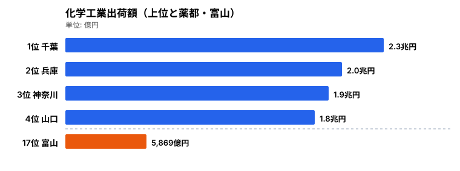
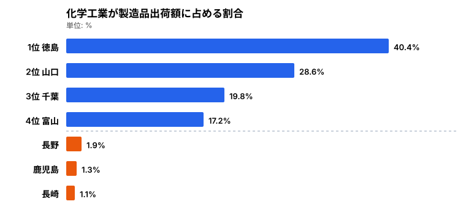
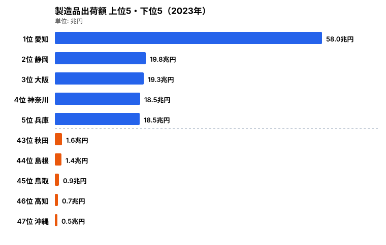
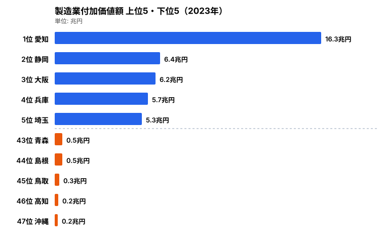

「薬の富山」──日本人なら一度は聞いたことがあるフレーズでしょう。しかし現在の化学工業出荷額を見ると、トップは千葉県で、富山県は中位にとどまります。なぜ「薬都」のブランドと出荷額の規模はこれほど食い違うのでしょうか。医薬品を含む化学工業の都道府県別データから、知られざる「製薬県」の実力図を描きます。

> [!NOTE]
> 化学工業は医薬品だけでなく、石油化学製品・化粧品・塗料・農薬などを含む広い分類です。本記事では化学工業出荷額を主な指標として分析し、医薬品産業についてはその文脈の中で読み解きます。「製薬県」と「石油化学県」が同じ化学工業に分類される点が、このデータを読み違えやすい最大のポイントです。

## 化学工業出荷額の頂点は千葉 -- 薬都・富山との差

<data-source url="https://www.e-stat.go.jp/dbview?sid=0003448099" label="e-Stat 工業統計調査"></data-source>

化学工業出荷額の1位は千葉県で約2.3兆円です。京葉工業地帯に連なる石油化学コンビナート群が生み出す規模です。2位は兵庫県（約2.0兆円）、3位は神奈川県（約1.9兆円）と続きます。

化学工業は原料の輸入と製品の出荷に港湾インフラが欠かせないため、臨海型の工業地帯に集中する傾向が強いのが特徴です。上位を占めるのはいずれも、太平洋側の臨海部に大規模なプラントを抱える県ばかりです。

注目すべきは4位の[山口県](/areas/35000)（約1.8兆円）です。製造品出荷額全体では中位ですが、化学工業だけで見ると全国4位に躍り出ます。周南・下松地区の石油化学コンビナートが県の産業構造を特徴づけているためです。

一方で「薬の富山」として知られる富山県は、化学工業出荷額では約5,869億円で17位にとどまります。配置薬の伝統で名高い県でも、出荷額の絶対規模では臨海型の巨大プラント県に大きく水をあけられているのです。なぜブランドと規模がこれほどずれるのか──その答えは「比率」を見ると見えてきます。

<source-link href="/ranking/manufacturing-shipment-amount">47都道府県の製造品出荷額ランキングをもっと見る</source-link>

## 化学工業比率マップ -- 「化学県」は意外なところに

<data-source url="https://www.e-stat.go.jp/dbview?sid=0003448099" label="e-Stat 工業統計調査"></data-source>

出荷額の絶対値だけでは見えない構造が、比率で浮かび上がります。各県の製造品出荷額のうち、化学工業がどれだけの割合を占めるかを見ると、順位は絶対額とまったく違う顔ぶれになります。

最も化学工業の比率が高いのは徳島県で40.4%です。製造品出荷額全体の規模は小さい県ですが、その4割を化学工業が占める異例の産業構造です。これは大塚製薬・大塚化学・大鵬薬品など大塚グループの本拠地が徳島県にあることが最大の要因です。1社グループの存在が県全体の産業構造を決定づけている好例といえます。

2位の山口県（28.6%）は前述のとおりコンビナート型、3位の千葉県（19.8%）も同じく臨海工業型です。臨海部に石油化学プラントが立地する県は、製造業の中で化学工業の存在感が自然に大きくなります。

そして[富山県](/areas/16000)は化学工業比率17.2%で全国4位です。江戸時代の「越中売薬」に始まる配置薬産業の伝統は、現在も富山市・高岡市を中心に製薬企業の集積として残っています。出荷額の絶対値では中位でも、県の製造業に占める化学の比重で見れば富山は全国屈指の「製薬県」なのです。これが「比率は高いが絶対額は中位」という薬都・富山の現在地です。

一方、比率が低いのは長野県（1.9%）・鹿児島県（1.3%）・長崎県（1.1%）などです。長野は精密機械、鹿児島は食料品、長崎は造船と、それぞれ別の産業に特化しているため化学工業の比率が低くなります。化学工業比率が低いことは「化学産業が弱い」のではなく、「別の産業が主役」であることを意味します。

> [!WARNING]
> 比率ランキングは規模ランキングと正反対の落とし穴があります。徳島県のように比率1位でも、製造品出荷額の絶対規模では小さい県は珍しくありません。逆に千葉県は絶対額1位なのに比率では3位です。「比率が高い＝化学産業が大きい」と読むと県の実力を取り違えます。絶対額の図と比率の図は、必ずセットで読んでください。

<source-link href="/ranking/manufacturing-industry-added-value">47都道府県の製造業付加価値額ランキングをもっと見る</source-link>

<ad-slot></ad-slot>

## 化学工業の集積を支える製造業の地力 -- 出荷額の上位と下位

<data-source url="https://www.e-stat.go.jp/dbview?sid=0003448099" label="e-Stat 工業統計調査"></data-source>

化学工業の地図を理解するには、土台となる製造業全体の地力も押さえておく必要があります。2023年の製造品出荷額を見ると、1位は愛知県で約58.0兆円と圧倒的です。トヨタ自動車を中心とした輸送用機械のサプライチェーンが、他県を大きく引き離す規模を生んでいます。

2位の静岡県（約19.8兆円）、3位の大阪府（約19.3兆円）、4位の神奈川県（約18.5兆円）、5位の兵庫県（約18.5兆円）も、いずれも臨海部に多様な産業を抱える総合工業県です。化学工業出荷額で上位に入った千葉・兵庫・神奈川がここにも顔を出すのは、製造業全体の地力があってこそ化学プラントの集積が成り立つことを示しています。

下位には秋田県・島根県・鳥取県・高知県・沖縄県が並びます。最下位の沖縄県は約5,067億円で、1位の愛知県とは製造業の規模そのものが大きく異なります。これらの県は観光・農業・水産など第三次・第一次産業の比重が高く、大規模な装置産業が立地しにくい地理的・歴史的条件を抱えています。化学工業が下位に沈むのは、化学だけが弱いのではなく製造業全体の規模が小さいことの反映なのです。

<source-link href="/ranking/manufacturing-shipment-amount">47都道府県の製造品出荷額ランキングをもっと見る</source-link>

## 付加価値で見る産業の「中身」 -- 出荷額だけでは見えないもの

<data-source url="https://www.e-stat.go.jp/dbview?sid=0003448099" label="e-Stat 工業統計調査"></data-source>

出荷額は「売上の総額」ですが、そこから原材料費などを差し引いた付加価値額を見ると、産業の「中身」がさらにはっきりします。2023年の製造業付加価値額でも1位は愛知県（約16.3兆円）で、出荷額と同じく群を抜いています。

2位以下は静岡県（約6.4兆円）・大阪府（約6.2兆円）・兵庫県（約5.7兆円）・[埼玉県](/areas/11000)（約5.3兆円）と続きます。出荷額では5位だった兵庫が付加価値でも上位に残り、埼玉が顔を出すのが特徴です。化学工業は原料を高機能な製品に転換する付加価値の高い産業であり、こうした上位県の厚みを支える一因になっています。

付加価値額の下位は青森県・島根県・鳥取県・高知県・沖縄県です。出荷額の下位とほぼ同じ顔ぶれで、最下位は沖縄県（約1,730億円）です。出荷額でも付加価値でも下位が重なるのは、これらの県の製造業が規模・中身の両面で小さいことを意味します。

> [!TIP]
> 医薬品産業に注目するなら、化学工業全体の規模だけでなく「比率の高さ」を併せて見るのが読み筋です。徳島（大塚グループ）や富山（配置薬の集積）のように、絶対額は中位でも比率が突出している県こそ、医薬品を含む化学が地域経済の柱になっています。逆に千葉・山口・神奈川の高い数字は石油化学コンビナートが主役で、医薬品の存在感とは別物だと割り切って読みましょう。

<source-link href="/ranking/manufacturing-industry-added-value">47都道府県の製造業付加価値額ランキングをもっと見る</source-link>

<ad-slot></ad-slot>

## まとめ -- 化学工業は「どこに工場があるか」で決まる

化学工業出荷額と比率のデータを並べると、都道府県の産業構造の違いがくっきりと見えてきます。

- **絶対額の頂点は千葉県（約2.3兆円）**。京葉の石油化学コンビナートが規模を生んでいます。
- **比率の頂点は徳島県（40.4%）**。大塚グループという1社グループの存在が、製造品出荷額の4割を化学に振り向けています。
- **「薬都・富山」は比率17.2%で全国4位**ですが、出荷額の絶対値は約5,869億円で17位にとどまります。ブランドと規模のギャップがそのまま現れています。
- **製造業全体の地力は愛知県（出荷額約58.0兆円）が圧倒**。化学の集積も製造業の厚みがあってこそ成り立ちます。
- **下位は沖縄・高知・鳥取など**で、化学が弱いのではなく製造業全体の規模が小さいことの反映です。

化学工業は「どこに工場があるか」で県の産業構造が大きく変わる典型的な装置産業です。1基のコンビナートが数千億円規模の出荷額を生み、1社の製薬グループが県の産業構成比を4割にまで押し上げます。「薬の富山」のブランドは健在ですが、出荷額の規模では太平洋ベルト地帯の石油化学が圧倒します。今後、バイオ医薬品やジェネリック医薬品の生産拡大、脱炭素に向けたグリーンケミストリーの進展によって、化学工業の地図がどう塗り替わるかに注目したいところです。

## データ出典

本記事のデータは e-Stat（政府統計の総合窓口）を基に作成しています。

- e-Stat 工業統計調査（化学工業出荷額・製造品出荷額・製造業付加価値額）
- 本記事の対象カテゴリ: [鉱工業](/category/miningindustry)
