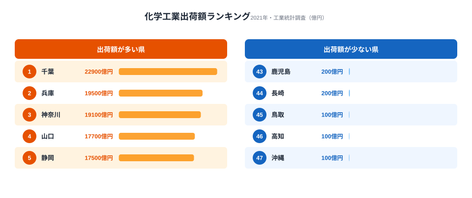
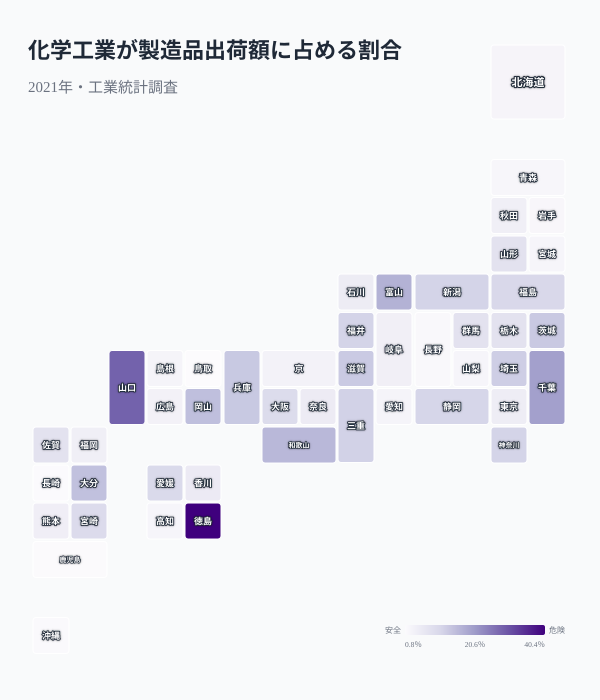
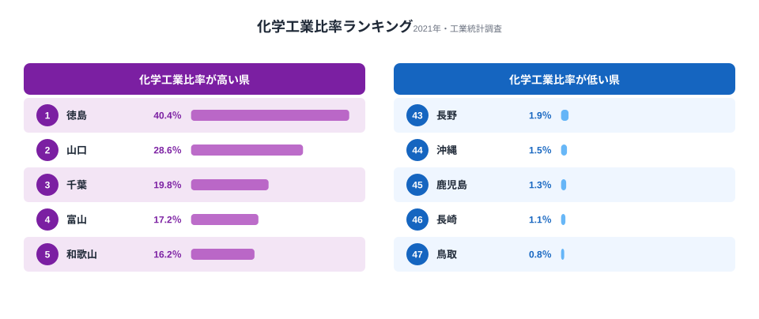
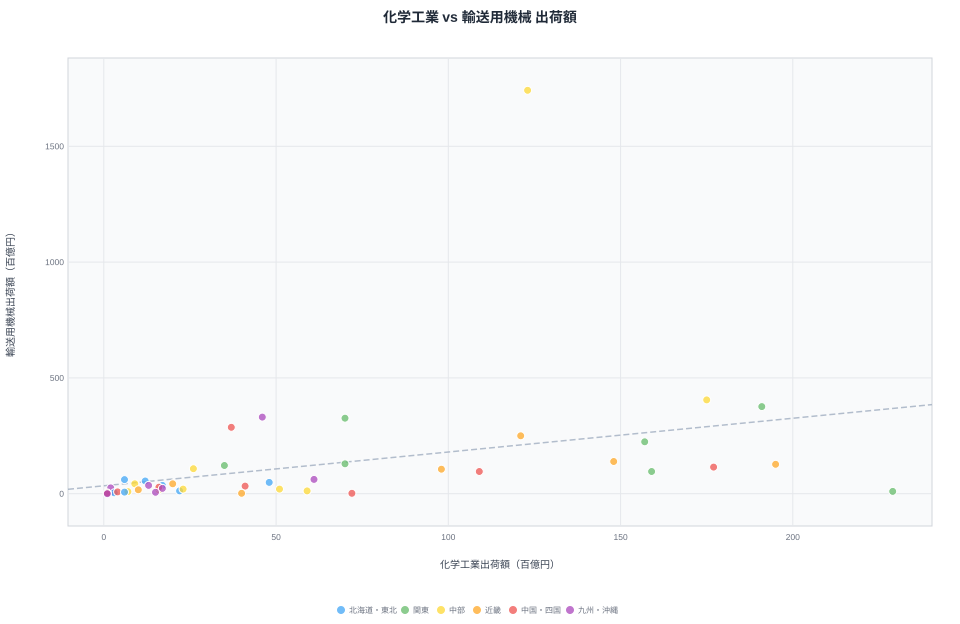
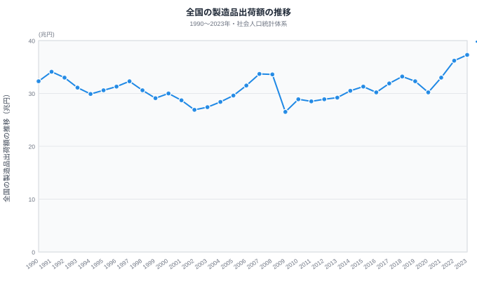
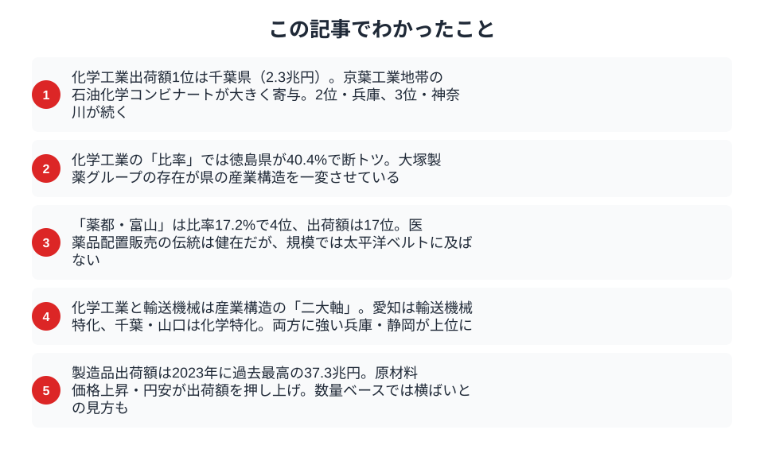

「薬の富山」──日本人なら一度は聞いたことがあるフレーズでしょう。しかし現在の化学工業出荷額ランキングを見ると、トップは千葉県です。富山県は17位にとどまります。医薬品を含む化学工業の都道府県別データから、知られざる「製薬県」の実力図を描いていきます。

> [!NOTE]
> 化学工業は医薬品のほか、石油化学製品・化粧品・塗料・農薬などを含む広い分類です。本記事では化学工業出荷額を主な指標として分析し、医薬品産業についてはその文脈の中で読み解きます。

## 化学工業出荷額ランキング -- 太平洋ベルトが独占

化学工業出荷額の1位は千葉県で約2.3兆円です。京葉工業地帯に連なる石油化学コンビナート群が生み出す規模です。2位は兵庫県（約2.0兆円）、3位は神奈川県（約1.9兆円）と続きます。

上位15県のうち12県が太平洋ベルト地帯またはその延長上に位置しています。化学工業は原料の輸入と製品の出荷に港湾インフラが欠かせないため、臨海型の工業地帯に集中する傾向が強いのです。原油やナフサを大量に受け入れ、エチレンなどの基礎化学品に分解して下流の工場に供給する──この一連のサプライチェーンが成り立つには、深い水深を持つ港と広大な臨海用地が前提になります。だからこそ化学工業の上位は、京葉・京浜・瀬戸内・北部九州といった大規模コンビナートが立地する地域に偏るのです。

注目すべきは4位の[山口県](/areas/35000)（約1.8兆円）です。製造品出荷額全体では中位ですが、化学工業だけで見ると全国4位に躍り出ます。周南・下松地区の石油化学コンビナートが県の産業構造を特徴づけており、人口規模の割に化学工業出荷額が大きい典型例です。一方で下位を見ると、鳥取・高知・沖縄といった県は化学工業出荷額が100億円台にとどまります。これらの県は大規模な臨海コンビナートを持たず、製造業の中心が食料品や別の業種にあるため、化学工業の存在感は小さくなります。

> [!TIP]
> 出荷額の「絶対額」と「比率」は別物として読むのがコツです。千葉や神奈川は規模では上位でも、県の製造業に占める化学工業の比率は2割前後にとどまります。逆に徳島や富山は規模は中位でも比率では上位に入ります。次の比率マップと合わせて見ると、産業構造の違いがはっきりします。

<source-link href="/ranking/manufacturing-shipment-amount">47都道府県の製造品出荷額ランキングをもっと見る</source-link>

## 化学工業比率マップ -- 「化学県」は意外なところに

出荷額の絶対値だけでは見えない構造が、比率マップで浮かび上がります。

**徳島県が40.4%で断トツの1位**です。製造品出荷額全体では全国でも規模は小さいほうですが、その4割を化学工業が占める異例の産業構造です。これは大塚製薬・大塚化学・大鵬薬品など大塚グループの本拠地が徳島県にあることが最大の要因です。1社グループの存在が県全体の産業構造を決定づけている好例といえます。

2位の山口県（28.6%）は前述のとおりコンビナート型、3位の千葉県（19.8%）も同じく臨海工業型です。マップを俯瞰すると、瀬戸内海沿岸（山口・岡山・徳島・和歌山）と京葉・京浜（千葉・神奈川・茨城）に濃い色が集中していることがわかります。

<ad-slot></ad-slot>

## 化学工業比率ランキング -- 上位と下位でくっきり分かれる産業構造

上位5県と下位5県の比率を並べると、産業構造の違いが鮮明になります。

上位陣は2つのタイプに分類できます。

- **コンビナート型**: [千葉](/areas/12000)・山口・大分・岡山など、臨海部に石油化学プラントが立地するケース
- **製薬特化型**: [徳島](/areas/36000)（大塚グループ）、富山（配置薬産業の集積）など、医薬品企業の存在感が大きいケース

一方、下位には長野県（1.9%）、鹿児島県（1.3%）、長崎県（1.1%）、鳥取県（0.8%）などが並びます。長野は精密機械、鹿児島は食料品、長崎は造船と、それぞれ別の産業に特化しているため化学工業の比率が低くなっています。

> [!WARNING]
> 「化学工業」には医薬品のほか石油化学製品・農薬・化粧品・塗料なども含まれます。同じ化学工業に分類されても、徳島（大塚グループ）のような製薬特化型と、千葉・山口のようなコンビナート型では産業の性格がまったく異なります。比率が高い＝製薬が盛ん、と短絡しないよう、比率マップと次の散布図を合わせて読み解いてください。

<source-link href="/ranking/manufacturing-industry-added-value">47都道府県の製造業付加価値額ランキングをもっと見る</source-link>

### 「薬都・富山」のいま

[富山県](/areas/16000)は化学工業比率17.2%で全国4位です。江戸時代の「越中売薬」に始まる配置薬産業の伝統は、現在も富山市・高岡市を中心に製薬企業の集積として残っています。

ただし出荷額の絶対値では約5,900億円で全国17位にとどまります。太平洋ベルト地帯の石油化学コンビナートや、徳島のような大手グループ立地県と比べると規模の差は大きいといえます。「比率は高いが絶対額は中位」──これが薬都・富山の現在地です。

## 化学工業 vs 輸送用機械 -- 産業構造の二大軸

横軸に化学工業、縦軸に輸送用機械の出荷額をとると、都道府県の産業タイプが4象限に分かれます。

**右上**（化学も輸送も大）: 兵庫県・静岡県は両方の産業が強い「バランス型」工業県です。兵庫は神戸製鋼・川崎重工に加え、姫路の化学プラントが寄与しています。

**左上**（輸送特化）: 愛知県は輸送用機械の突出ぶりが際立ちます。トヨタ自動車を中心としたサプライチェーンが県の製造業を支配しています。広島県（マツダ）、栃木県（日産・スバル関連）も同じ象限です。

**右下**（化学特化）: 千葉県・山口県・岡山県は石油化学コンビナートによる化学特化型です。徳島県も製薬企業の集積でこの象限に入ります。

**左下**（両方少ない）: 島根・鳥取・高知など、製造業全体の規模が小さい県が集まります。

化学と輸送が「二大軸」になるのは、どちらも巨額の設備投資を必要とする装置産業だからです。1つの大型プラントや組立工場が立地するだけで、県の出荷額構成が一気に塗り替わります。逆に言えば、これらの県の産業構造は特定の企業・施設に強く依存しているということでもあります。愛知の輸送機械はトヨタ、徳島の化学は大塚グループというように、1社の動向が県全体の出荷額を左右しかねません。化学特化型の県と輸送特化型の県がはっきり分かれるこの構図は、日本の製造業がいかに「立地と装置」で決まっているかを物語っています。

## 製造品出荷額の推移 -- 2023年に過去最高を更新

全国の製造品出荷額は2023年に約37.3兆円と過去最高を記録しました。1990年代のバブル崩壊後は長期低迷が続き、リーマンショック後の2009年に26.5兆円まで急落しています。その後は緩やかに回復し、2020年のコロナ禍で再び落ち込んだものの、2021年以降は原材料価格の上昇と円安を背景に出荷額が急伸しました。

ただし、この「過去最高」には注意が必要です。出荷額は名目値であり、物価上昇分を含んでいます。実質ベース（数量ベース）では大きく伸びているとは言い切れません。特に化学工業は原油価格に左右されるため、出荷額の増減が生産量の増減と一致しないケースが多いのです。

化学工業が全製造業に占める割合は全国平均で約12%前後と推定されます。食料品（約10%）を上回り、輸送用機械（約18%）に次ぐ主要セクターです。

## まとめ

化学工業出荷額と産業比率のデータから、都道府県の産業構造の違いを整理します。

化学工業は「どこに工場があるか」で県の産業構造が大きく変わる典型的な装置産業です。1基のコンビナートが数千億円規模の出荷額を生み、1社の製薬グループが県の産業構成比を40%にまで押し上げます。

「薬の富山」のブランドは健在ですが、出荷額の規模では太平洋ベルト地帯の石油化学が圧倒しています。医薬品産業に限れば栃木県（大手製薬の工場集積）や埼玉県も有力な生産拠点ですが、化学工業全体で見ると石油化学の存在感が際立ちます。

今後、バイオ医薬品やジェネリック医薬品の生産拡大、あるいは脱炭素に向けたグリーンケミストリーの進展によって、化学工業の地図がどう塗り替わるかに注目したいところです。

## データ出典

本記事のデータはe-Stat（政府統計の総合窓口）の工業統計調査・社会人口統計体系を基に作成しています。

本記事の対象データ: [関連カテゴリ](/category/miningindustry)
