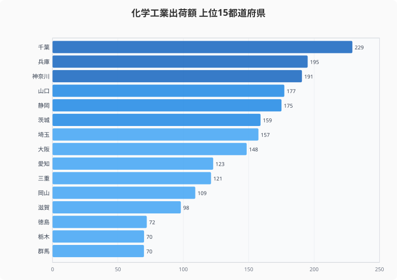
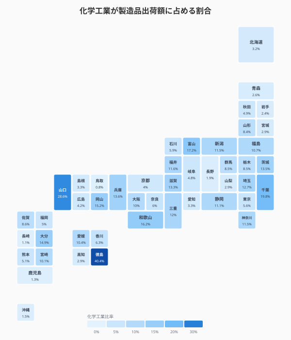
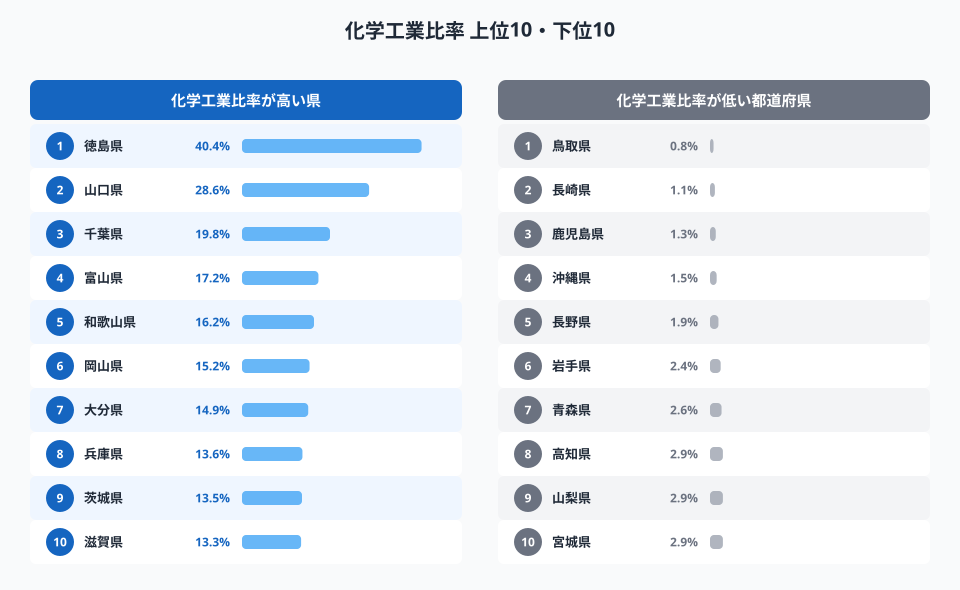
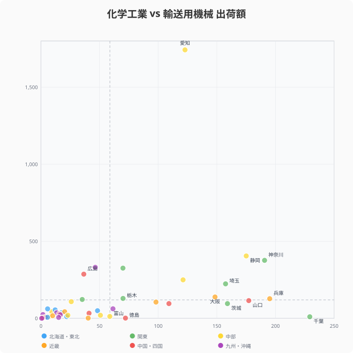
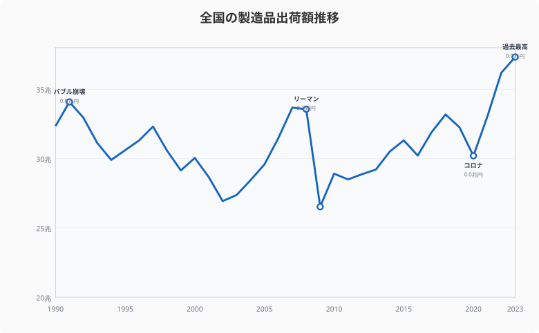
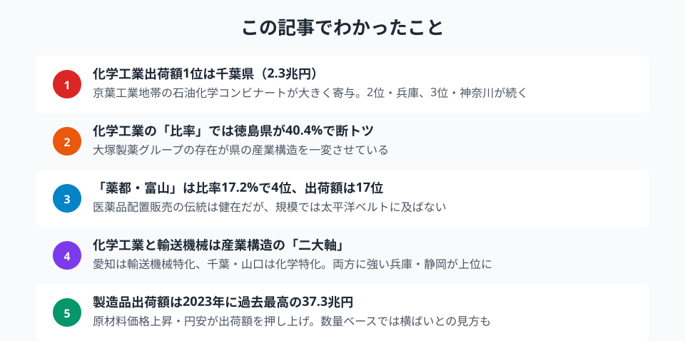

「薬の富山」──日本人なら一度は聞いたことがあるフレーズだろう。しかし現在の化学工業出荷額ランキングを見ると、トップは千葉県。富山県は17位にとどまる。医薬品を含む化学工業の都道府県別データから、知られざる「製薬県」の実力図を描く。

> [!NOTE]
> 化学工業は医薬品のほか、石油化学製品・化粧品・塗料・農薬などを含む広い分類です。本記事では化学工業出荷額を主な指標として分析し、医薬品産業についてはその文脈の中で読み解きます。

## 化学工業出荷額ランキング -- 太平洋ベルトが独占

<data-source url="https://www.e-stat.go.jp/dbview?sid=0003448099" label="e-Stat 工業統計調査"></data-source>

化学工業出荷額の1位は千葉県で約2.3兆円。京葉工業地帯に連なる石油化学コンビナート群が生み出す規模だ。2位は兵庫県（約2.0兆円）、3位は神奈川県（約1.9兆円）と続く。

上位15県のうち12県が太平洋ベルト地帯またはその延長上に位置する。化学工業は原料の輸入と製品の出荷に港湾インフラが欠かせないため、臨海型の工業地帯に集中する傾向が強い。

注目すべきは4位の[山口県](/areas/35000)（約1.8兆円）。製造品出荷額全体では17位だが、化学工業だけで見ると全国4位に躍り出る。周南・下松地区の石油化学コンビナートが県の産業構造を特徴づけている。

<source-link href="/ranking/shipment-value-manufacturing-5">47都道府県の化学工業出荷額ランキングをもっと見る</source-link>

## 化学工業比率マップ -- 「化学県」は意外なところに

<data-source url="https://www.e-stat.go.jp/dbview?sid=0003448099" label="e-Stat 工業統計調査"></data-source>

出荷額の絶対値だけでは見えない構造が、比率マップで浮かび上がる。

**徳島県が40.4%で断トツの1位**。製造品出荷額全体では全国38位と規模は小さいが、その4割を化学工業が占める異例の産業構造だ。これは大塚製薬・大塚化学・大鵬薬品など大塚グループの本拠地が徳島県にあることが最大の要因。1社グループの存在が県全体の産業構造を決定づけている好例といえる。

2位の山口県（28.6%）は前述のとおりコンビナート型、3位の千葉県（19.8%）も同じく臨海工業型だ。

<ad-slot></ad-slot>

## 化学工業比率ランキング -- 上位と下位でくっきり分かれる産業構造

<data-source url="https://www.e-stat.go.jp/dbview?sid=0003448099" label="e-Stat 工業統計調査"></data-source>

上位10県と下位10県の比率を並べると、産業構造の違いが鮮明になる。

上位陣は2つのタイプに分類できる。

- **コンビナート型**: [千葉](/areas/12000)・山口・大分・岡山など、臨海部に石油化学プラントが立地するケース
- **製薬特化型**: [徳島](/areas/36000)（大塚グループ）、富山（配置薬産業の集積）など、医薬品企業の存在感が大きいケース

一方、下位には長野県（1.9%）、鹿児島県（1.3%）、長崎県（1.1%）などが並ぶ。長野は精密機械、鹿児島は食料品、長崎は造船と、それぞれ別の産業に特化しているため化学工業の比率が低い。

> [!NOTE]
> 化学工業出荷額には医薬品のほか石油化学製品・農薬・化粧品・塗料なども含まれる。「製薬県」と「石油化学県」は同じ化学工業に分類されるが、産業の性格はまったく異なる。徳島（大塚グループ）のように製薬特化型の県と、千葉・山口のようなコンビナート型の県を比べる際は、比率マップと散布図を合わせて参照するとその違いが見えやすい。

### 「薬都・富山」のいま

[富山県](/areas/16000)は化学工業比率17.2%で全国4位。江戸時代の「越中売薬」に始まる配置薬産業の伝統は、現在も富山市・高岡市を中心に製薬企業の集積として残っている。

ただし出荷額の絶対値では約5,869億円で全国17位にとどまる。太平洋ベルト地帯の石油化学コンビナートや、徳島のような大手グループ立地県と比べると規模の差は大きい。「比率は高いが絶対額は中位」──これが薬都・富山の現在地だ。

## 化学工業 vs 輸送用機械 -- 産業構造の二大軸

<data-source url="https://www.e-stat.go.jp/dbview?sid=0003448099" label="e-Stat 工業統計調査"></data-source>

横軸に化学工業、縦軸に輸送用機械の出荷額をとると、都道府県の産業タイプが4象限に分かれる。

**右上**（化学も輸送も大）: 兵庫県・静岡県は両方の産業が強い「バランス型」工業県。兵庫は神戸製鋼・川崎重工に加え、姫路の化学プラントが寄与する。

**左上**（輸送特化）: 愛知県は輸送用機械の突出ぶりが際立つ。トヨタ自動車を中心としたサプライチェーンが県の製造業を支配している。広島県（マツダ）、栃木県（日産・スバル関連）も同じ象限だ。

**右下**（化学特化）: 千葉県・山口県・岡山県は石油化学コンビナートによる化学特化型。徳島県も製薬企業集積でこの象限に入る。

**左下**（両方少ない）: 島根・鳥取・高知など、製造業全体の規模が小さい県が集まる。

<source-link href="/ranking/manufacturing-industry-added-value">47都道府県の製造業付加価値額ランキングをもっと見る</source-link>

<ad-slot></ad-slot>

## 製造品出荷額の推移 -- 2023年に過去最高を更新

<data-source url="https://www.e-stat.go.jp/dbview?sid=0000010103" label="e-Stat 社会・人口統計体系"></data-source>

全国の製造品出荷額は2023年に約37.3兆円と過去最高を記録した。1990年代のバブル崩壊後は長期低迷が続き、2008年のリーマンショックで26.5兆円まで急落。その後は緩やかに回復し、2020年のコロナ禍で再び落ち込んだものの、2021年以降は原材料価格の上昇と円安を背景に出荷額が急伸した。

ただし、この「過去最高」には注意が必要だ。出荷額は名目値であり、物価上昇分を含んでいる。実質ベース（数量ベース）では大きく伸びているとは言い切れない。特に化学工業は原油価格に左右されるため、出荷額の増減が生産量の増減と一致しないケースが多い。

化学工業が全製造業に占める割合は全国平均で約12%前後と推定される。食料品（約10%）を上回り、輸送用機械（約18%）に次ぐ主要セクターだ。

<source-link href="/ranking/manufacturing-shipment-amount">47都道府県の製造品出荷額ランキングをもっと見る</source-link>

## まとめ

化学工業出荷額と産業比率のデータから、都道府県の産業構造の違いを整理する。

化学工業は「どこに工場があるか」で県の産業構造が大きく変わる典型的な装置産業だ。1基のコンビナートが数千億円規模の出荷額を生み、1社の製薬グループが県の産業構成比を40%にまで押し上げる。

「薬の富山」のブランドは健在だが、出荷額の規模では太平洋ベルト地帯の石油化学が圧倒する。医薬品産業に限れば栃木県（大手製薬の工場集積）や埼玉県も有力な生産拠点だが、化学工業全体で見ると石油化学の存在感が際立つ。

今後、バイオ医薬品やジェネリック医薬品の生産拡大、あるいは脱炭素に向けたグリーンケミストリーの進展によって、化学工業の地図がどう塗り替わるかに注目したい。

## データ出典

本記事のデータはe-Stat（政府統計の総合窓口）を基に作成しています。

本記事の対象データ: [関連カテゴリ](/category/miningindustry)
