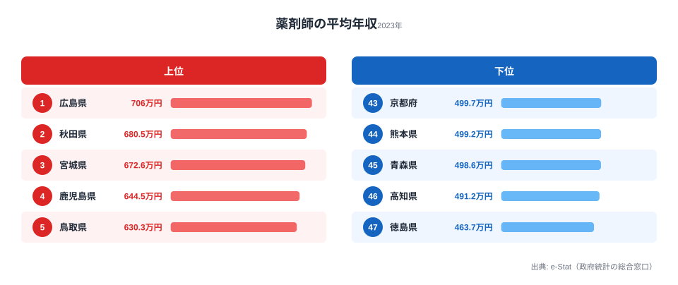

「薬剤師の年収が一番高いのは、どの都道府県だと思いますか?」──多くの人は東京や大阪といった大都市を思い浮かべるはずです。求人が多く、物価も高い大都市なら給与も高いでしょう、と。

ところが2023年の賃金構造基本統計調査（厚生労働省）をもとに薬剤師の平均年収を47都道府県で並べると、答えは**広島県の706.0万円**です。2位は秋田県680.5万円、3位は宮城県672.6万円と続き、上位は地方が占めます。最下位は徳島県の463.7万円で、1位と最下位の差は約242万円、**1.52倍**にもなります。

なぜ大都市ではなく地方が上位なのでしょうか。この記事では、薬剤師年収ランキングの全体像と、「都会ほど高い」という直感が裏切られる構造的な理由を、データから読み解きます。

> [!NOTE]
> ここでの「平均年収」は賃金構造基本統計調査の「きまって支給する現金給与額×12＋年間賞与その他特別給与額」で算出した推計値です。実際の手取り額や個人差を表すものではなく、県ごとの給与水準を横並びで比べるための指標としてご覧ください。

## 薬剤師年収の上位5県と下位5県

2023年のランキング上位5県と下位5県を、チャートで確認しましょう。

<source-link href="/ranking/pharmacist-annual-income">薬剤師の平均年収ランキングをもっと見る</source-link>

**1位の[広島県](https://stats47.jp/areas/34000)は706.0万円**で、2位の秋田県（680.5万円）を25万円以上引き離してトップに立っています。3位の宮城県（672.6万円）、4位の鹿児島県（644.5万円）、5位の鳥取県（630.3万円）と続き、上位5県はいずれも地方圏の県です。いわゆる三大都市圏（東京・大阪・名古屋）に属するのは10位の愛知県（611.6万円）だけで、東京都は23位（588.8万円）、大阪府は11位（606.7万円）にとどまります。

47都道府県の単純平均は約578万円で、上位5県はいずれもこれを大きく上回ります。特に広島県は平均より130万円近く高く、際立った存在です。地方県が軒並み上位を占める背景には、後述する薬剤師の**需給バランスの地域差**という構造的な要因があります。

**最下位は[徳島県](https://stats47.jp/areas/36000)の463.7万円**で、46位の高知県（491.2万円）、45位の青森県（498.6万円）、44位の熊本県（499.2万円）、43位の京都府（499.7万円）が続きます。注目すべき点は、43位に**京都府**が入っていることです。「大都市・観光都市＝高年収」というイメージとは異なり、京都府は下位グループに位置しています。下位5県はいずれも500万円前後で横並びになっており、広島県（706.0万円）との差は約242万円に達します。

> [!TIP]
> 上位の顔ぶれは「東北・中国・九州の地方県」に偏っています。これは偶然ではなく、薬剤師の需給バランスが地域で大きく異なることの表れです。薬学部卒業生が都市部に集中することで、地方では慢性的な薬剤師不足が生じやすく、それが給与水準を引き上げる圧力になっています。

## 最下位グループ：意外な顔ぶれ

下位グループを詳しく見ると、地方の過疎県だけでなく、京都府のような都市部も含まれているのが特徴です。

**京都府（43位・499.7万円）**は薬学部を持つ大学が複数あり（京都薬科大学、同志社女子大学薬学部など）、薬剤師の供給が相対的に豊富な地域です。薬剤師を志す学生が京都に集まりやすく、そのまま府内に定着する割合も高いため、需給が均衡しやすい構造になっています。求職者が多い分、薬局やドラッグストアが賃金を大きく引き上げなくても採用できる環境が続いていると考えられます。

**徳島県（47位・463.7万円）**の最下位は、一見すると地方の需要不足を示すように見えますが、実際には別の要因も絡み合っています。徳島県には徳島大学薬学部があり、四国地域への薬剤師供給源となっています。県内の医療機関・薬局の規模や数、そして製薬企業の立地なども年収水準に影響しており、単純な供給不足・供給過剰の図式では説明しきれません。

[社会保障・福祉カテゴリ](https://stats47.jp/category/socialsecurity)では、薬剤師以外の医療職種の年収ランキングも確認できます。職種ごとに地域差のパターンが異なるため、比較してみると興味深い発見があります。

> [!WARNING]
> [仮説] 「地方県で薬剤師が不足し、人材確保のため高給を提示している」という需給説は、本ランキングの分布と整合的ですが、本データ単独では因果まで断定できません。検証には県別の薬剤師数・人口あたり薬局数・有効求人倍率との突き合わせが必要です。

## なぜ大都市ではなく地方が高いのか

薬剤師の年収が地方で高くなる背景には、**需給バランス**という構造的な要因があります。

薬剤師の養成は薬学部のある大学に集中しており、卒業後もそのまま都市部にとどまる人が少なくありません。結果として、東京・大阪・京都などの都市部は薬剤師が相対的に充足しやすく、賃金を引き上げてまで人材を確保する必要が薄くなります。一方、薬剤師が不足しがちな地方県では、調剤薬局やドラッグストアが高い給与を提示して人材を呼び込む傾向があります。

もう一つの注意点は、賃金構造基本統計調査が**標本調査**であることです。薬剤師の母集団が小さい県では、調査対象に含まれる勤務先（病院／調剤薬局／ドラッグストア／製薬企業）の構成比によって平均値が年ごとに振れやすくなります。たとえば、製薬企業の本社や研究所が多い県では、相対的に年収の高い研究職・MRが平均を押し上げる可能性があります。逆に、中小の調剤薬局が多い県では、管理薬剤師でない一般薬剤師の割合が高くなり、平均が下がりやすくなります。単年の順位だけでなく、複数年の傾向で見ることをおすすめします。

[広島県](https://stats47.jp/areas/34000)が1位を保ちやすい理由としては、製薬・化学産業の集積（住友化学、マルハニチロなどの関連企業）と、中国地方における医療機関の拠点性が複合的に作用している可能性があります。ただし、これは複数年のデータで傾向を確認すべき仮説であり、2023年単年の数値のみで断定することは避けるべきです。

<source-link href="/ranking/pharmacist-annual-income">年次推移を含むランキング詳細を見る</source-link>

> [!NOTE]
> この調査は「事業所の所在地」をもとに集計されます。つまり年収は薬剤師の居住地ではなく**勤務先のある県**に計上されます。県境をまたいで通勤する都市圏では、隣県で働く薬剤師の給与が勤務先の県に反映される点に留意してください。

## まとめ

2023年の薬剤師の平均年収ランキングから読み取れるポイントは次の5つです。

- **1位は[広島県](https://stats47.jp/areas/34000)の706.0万円**で、東京・大阪などの大都市ではなく地方県だった
- 2位は秋田県680.5万円、3位は宮城県672.6万円と、上位は東北・中国・九州の地方県が占める
- **最下位は[徳島県](https://stats47.jp/areas/36000)の463.7万円**、43位には京都府（499.7万円）が入る
- 1位と最下位の差は約242万円、**1.52倍**の格差
- 東京都（23位・588.8万円）・大阪府（11位・606.7万円）は上位でも最下位でもなく、「大都市ほど高い」という直感は当てはまらない

「都会のほうが稼げる」という常識が、薬剤師という職種では成り立ちません。地域の需給バランスが給与を左右する好例といえます。

## データ出典

- 厚生労働省「賃金構造基本統計調査」（2023年）。e-Stat（政府統計の総合窓口）経由で取得・整備。平均年収は「きまって支給する現金給与額×12＋年間賞与その他特別給与額」で算出した推計値です。
