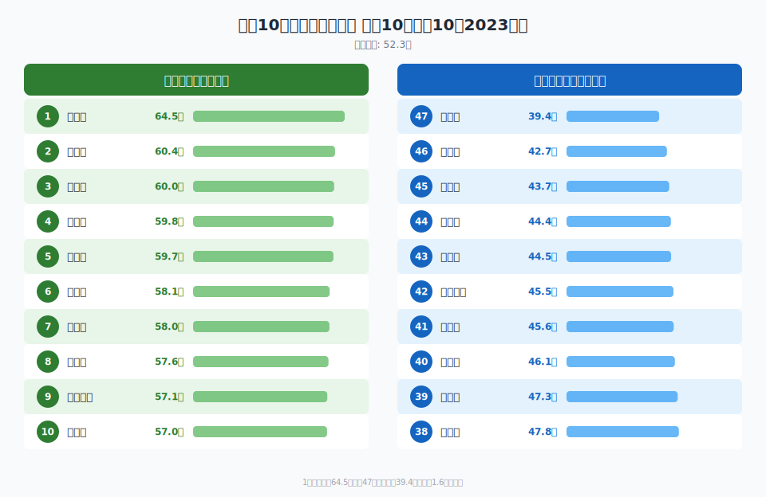
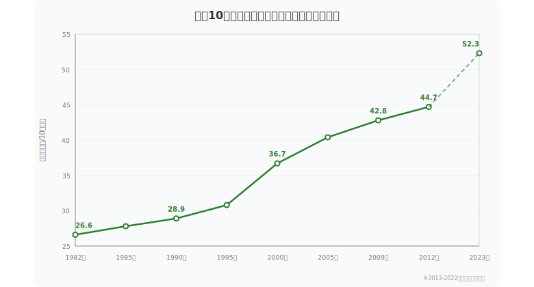

**人口10万人あたりの薬局数が最も多い都道府県は佐賀県**（64.5所）です。2位は高知県（60.4所）、3位は山形県（60.0所）。一方、最も少ないのは沖縄県（39.4所）で、1位の佐賀県とは**1.6倍の格差**があります。

この記事では、社会・人口統計体系のデータをもとに、47都道府県の薬局数ランキングと地域パターン、関連する医療指標との相関を分析します。

<ad-slot></ad-slot>

## 薬局数ランキング（2023年度・人口10万人あたり）

<data-source label="e-Stat 衛生行政報告例" year="2023年"></data-source>

### 上位10都道府県

| 順位 | 都道府県 | 薬局数（所） |
|---:|:---|---:|
| 1 | 佐賀県 | 64.5 |
| 2 | 高知県 | 60.4 |
| 3 | 山形県 | 60.0 |
| 4 | 山口県 | 59.8 |
| 5 | 山梨県 | 59.7 |
| 6 | 福岡県 | 58.1 |
| 7 | 広島県 | 58.0 |
| 8 | 香川県 | 57.6 |
| 9 | 鹿児島県 | 57.1 |
| 10 | 長崎県 | 57.0 |

### 下位10都道府県

| 順位 | 都道府県 | 薬局数（所） |
|---:|:---|---:|
| 38 | 滋賀県 | 47.8 |
| 39 | 京都府 | 47.3 |
| 40 | 北海道 | 46.1 |
| 41 | 岡山県 | 45.6 |
| 42 | 神奈川県 | 45.5 |
| 43 | 福井県 | 44.5 |
| 44 | 奈良県 | 44.4 |
| 45 | 埼玉県 | 43.7 |
| 46 | 千葉県 | 42.7 |
| 47 | 沖縄県 | 39.4 |

<data-source url="https://www.e-stat.go.jp/dbview?sid=0000010209" label="e-Stat 社会・人口統計体系"></data-source>

全国平均は**52.3所**。上位には九州・中国・四国・東北の県が並び、下位には首都圏の3県（神奈川・埼玉・千葉）が集中しています。

> [!NOTE]
> ここでの「薬局数」は調剤薬局を含む保険薬局の総数を人口10万人で割った値です。ドラッグストア（店舗販売業）は含みません。

## 地域パターン──西日本・地方が高密度

ランキングを地域ブロックごとに見ると、明確な傾向があります。

- **九州が突出して多い**──佐賀（1位）、福岡（6位）、鹿児島（9位）、長崎（10位）と4県がトップ10入り
- **中国・四国も高水準**──山口（4位）、広島（7位）、香川（8位）
- **東北は上位と下位に分かれる**──山形（3位）、秋田（12位）が高い一方、福島（30位）は低め
- **首都圏が低密度**──神奈川（42位）、埼玉（45位）、千葉（46位）。東京都は33位と首都圏では相対的に高い

この「西高東低」かつ「地方高・都市低」のパターンは、医療機関の分布や調剤の外部化（院外処方率）の地域差が影響しているとみられます。九州では門前薬局の文化が早くから根づき、院外処方率が全国平均より高い傾向があります。

## 相関分析──薬局が多い県は受診率も高い

薬局数と他の統計指標との相関を調べると、**医療受診率との正の相関**が顕著です。

| 相関指標 | 相関係数 (r) |
|:---|---:|
| 糖尿病外来受療率 | 0.66 |
| 健保・被保険者受診率 | 0.64 |
| 健保・被扶養者医療費 | 0.62 |
| 高血圧外来受療率 | 0.61 |
| 国保受診率 | 0.60 |
| 外来受療率 | 0.59 |
| 循環器系外来受療率 | 0.59 |

<data-source url="https://www.e-stat.go.jp/dbview?sid=0000010209" label="e-Stat 社会・人口統計体系"></data-source>

薬局数が多い県ほど、糖尿病・高血圧・循環器系疾患の外来受療率が高いという関係です。これは「薬局が多いから受診が増える」というより、**高齢化率が高い地域では慢性疾患の通院需要が大きく、それに対応して薬局が立地している**と解釈するのが自然です。

> [!NOTE]
> 相関係数はいずれも0.6前後の中程度の正の相関です。因果関係を示すものではなく、高齢化という共通の背景要因が両方に影響していると考えられます。

## 推移──30年間で全国的に増加

<data-source label="e-Stat 社会・人口統計体系" year="1982〜2023年"></data-source>

都道府県平均の薬局数は、**1990年の28.9所から2023年の52.3所へと約1.8倍**に増加しました。

| 年度 | 全国平均（所） | 最大値 | 最小値 |
|---:|---:|---:|---:|
| 1990 | 28.9 | 45.5 | 19.3 |
| 1995 | 30.8 | 46.6 | 21.2 |
| 2000 | 36.7 | 55.0 | 23.6 |
| 2005 | 40.4 | 58.8 | 29.5 |
| 2023 | 52.3 | 64.5 | 39.4 |

この増加は**医薬分業の進展**が最大の要因です。1990年代以降、国の政策として院外処方が推進され、病院・診療所の近くに調剤薬局が急増しました。医薬分業率は1990年の約12%から2020年代には約80%まで上昇しており、薬局数の増加と軌を一にしています。

佐賀県は2000年時点ですでに55.0所と全国トップクラスで、2023年には64.5所までさらに伸びています。一方、下位の県も底上げされており、最小値は1990年の19.3所から2023年の39.4所へと倍増しました。

## まとめ

- **1位は佐賀県**（64.5所/10万人）、最下位は沖縄県（39.4所）で1.6倍の格差
- 九州・中国・四国が高密度、首都圏が低密度という「西高東低・地方高」のパターン
- 糖尿病・高血圧などの外来受療率と正の相関（r = 0.6前後）──高齢化が共通の背景要因
- 医薬分業の進展により、30年間で全国平均は約1.8倍に増加

<source-link href="/ranking/pharmacy-count-per-100k">47都道府県の薬局数ランキングをもっと見る</source-link>
