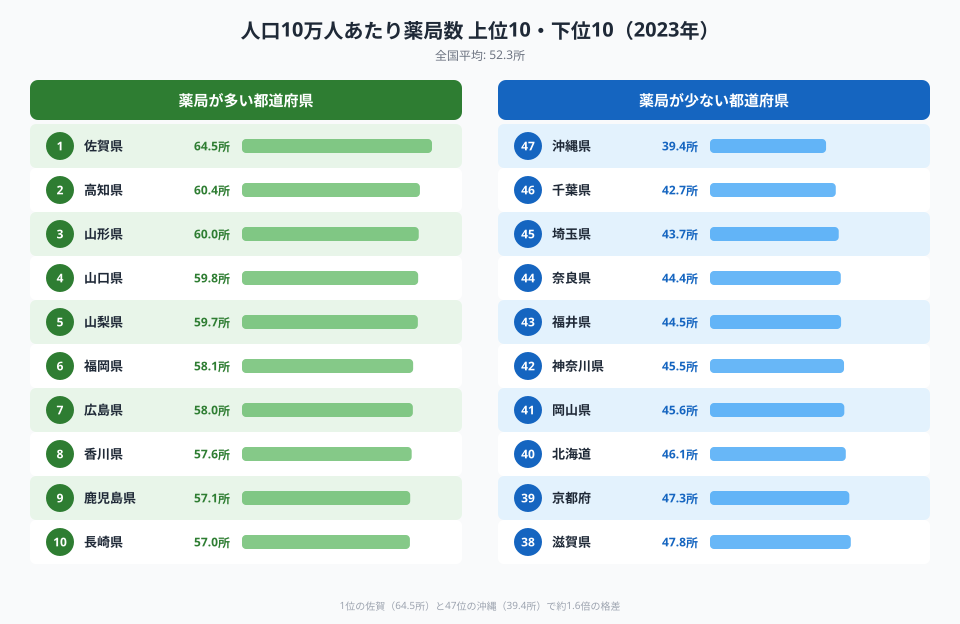
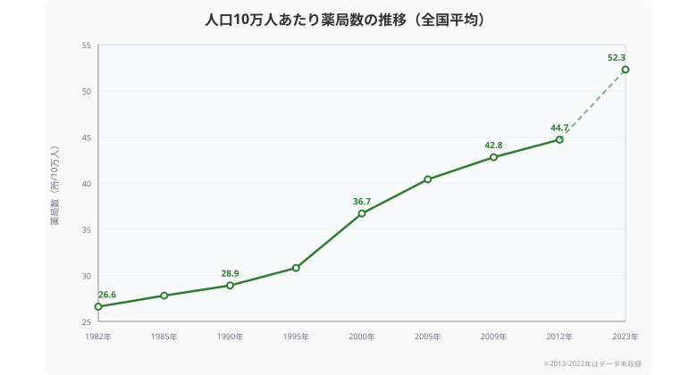

**人口10万人あたりの薬局数で最も多いのは[佐賀県](/areas/41000)**（64.5所）、最も少ないのは[沖縄県](/areas/47000)（39.4所）です。しかしこの数値を見て「沖縄は薬局が少ない県」と理解するのは誤りです。

沖縄県は1980年代に**全国最高水準（44〜46所/10万人）の薬局密度**を持っていました。当時、全国平均は26〜28所台で、沖縄は群を抜いて薬局が多い県でした。1990年代以降、本土で医薬分業が急速に進み各県の薬局数が大幅に増えるなかで、沖縄はその伸びが緩やかだったため相対的な順位が低下したのです。

沖縄は「薬局が少ない県」ではなく、**「他県に追い抜かれた県」**です。

> [!NOTE]
> 「薬局数」は薬局開設許可を受けた施設の総数を人口10万人で割った値です（社会・人口統計体系）。調剤薬局のほか調剤併設型ドラッグストアも含みます。薬局開設許可を持たない店舗販売業（OTC専業ドラッグストア）は含みません。

## 薬局数ランキング（2023年度・人口10万人あたり）

<data-source url="https://www.e-stat.go.jp/dbview?sid=0000010209" label="e-Stat 社会・人口統計体系"></data-source>

全国平均は**52.3所**。上位には九州・中国・四国・東北の県が並び、下位には首都圏3県（神奈川・埼玉・千葉）が集中しています。

## 西高東低パターンの構造的な理由

九州が突出して高密度な理由には複数の要因が重なっています。

### 要因1: 院外処方への早期移行

九州を中心とした地域では、院外処方（処方箋を病院外の薬局で受け付ける方式）への移行が1990年代から全国より早く進みました。院外処方が増えると、処方箋を受け付けるための調剤薬局が病院・診療所の周辺に急増します。佐賀県は2000年時点ですでに55.0所と全国トップクラスで、2023年に64.5所まで伸びています。

### 要因2: 高齢化率と慢性疾患の通院需要

高齢化が進んだ地域では糖尿病・高血圧・循環器系疾患の慢性通院需要が大きく、薬局の立地を経営的に支えます。これが薬局数の維持・増加につながっています。

### 要因3: 人口密度と店舗集約の差

首都圏では大規模な薬局・調剤薬局チェーンへの集約が進みやすく、人口に対する施設数は少なくなります。地方では小規模な薬局が分散して立地する傾向があるため、施設数が多くなります。

> [!TIP]
> 東京都は33位と首都圏では相対的に高い位置にあります。東京は大学病院・専門病院が集中しており、院外処方の処方箋数が多い分、周辺の薬局数も相対的に多い構造です。

<source-link href="/ranking/pharmacy-count-per-100k">47都道府県の薬局数ランキングをもっと見る</source-link>

<ad-slot></ad-slot>

## 相関分析──薬局が多い県ほど外来受療率も高い

薬局数と他の統計指標との相関を調べると、**医療受診率との正の相関**が顕著です。

| 相関指標 | 相関係数 (r) |
|:---|---:|
| 糖尿病外来受療率 | 0.66 |
| 健保・被保険者受診率 | 0.64 |
| 健保・被扶養者医療費 | 0.62 |
| 高血圧外来受療率 | 0.61 |
| 国保受診率 | 0.60 |
| 外来受療率 | 0.59 |
| 循環器系外来受療率 | 0.59 |

<data-source url="https://www.e-stat.go.jp/dbview?sid=0000010209" label="e-Stat 社会・人口統計体系"></data-source>

薬局数が多い県ほど糖尿病・高血圧・循環器系疾患の外来受療率が高いという関係です。

> [!NOTE]
> 相関係数はいずれも0.6前後の中程度の正の相関です。「薬局が多いから受診が増える」因果関係ではなく、**高齢化という共通の背景要因が薬局数と受療率の両方を押し上げている**と解釈するのが正確です。因果関係と相関関係を混同しないよう注意が必要です。

## 推移──30年間で全国的に底上げ

<data-source url="https://www.e-stat.go.jp/dbview?sid=0000010209" label="e-Stat 社会・人口統計体系"></data-source>

都道府県平均の薬局数は、**1990年の28.9所から2023年の52.3所へと約1.8倍**に増加しました。

この増加の最大の要因は**医薬分業の進展**です。1990年代以降、国の政策として院外処方が推進され、医療機関の近くに調剤薬局が急増しました。医薬分業率は1990年の約12%から2020年代には約80%まで上昇しており、薬局数の増加と軌を一にしています。

沖縄県はこの「医薬分業の波」を本土より遅く受けたため、1980年代の最高水準から相対的に順位が低下しました。最小値自体は1990年の19.3所から2023年の39.4所へと倍増しており、沖縄の薬局数が減ったわけではありません。

<ad-slot></ad-slot>

## まとめ：順位の変化が示す「追い抜かれる」構造

薬局密度の地域差から読み取れる3点を整理します。

1. **西高東低の構造は院外処方率の歴史と高齢化の複合効果**。九州は早期に医薬分業が進み、高齢化率も高い。首都圏は店舗集約と人口増加の構造で密度が低い
2. **沖縄は「少ない県」ではなく「追い抜かれた県」**。1980年代の最高水準から、本土の医薬分業急進で相対的に下位に転落した歴史的経緯がある
3. **薬局密度と受療率の相関は高齢化という共通因子**。因果ではなく、高齢化が両指標を同時に押し上げている

## データ出典

- e-Stat 社会・人口統計体系: https://www.e-stat.go.jp/dbview?sid=0000010209
- 厚生労働省 衛生行政報告例: https://www.mhlw.go.jp/toukei/list/36-19.html

本記事の対象データ: [関連カテゴリ](/category/socialsecurity)
