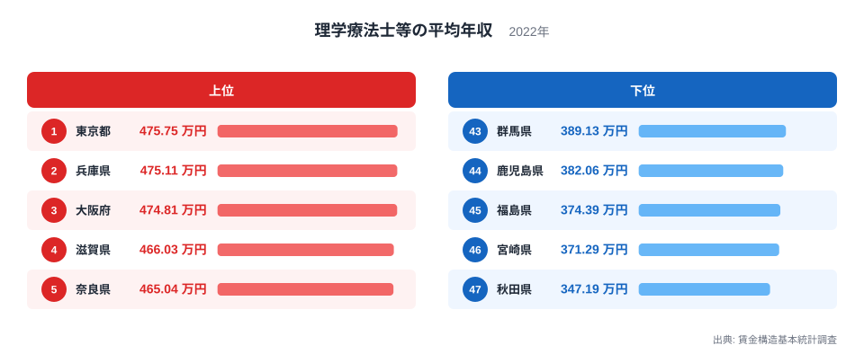
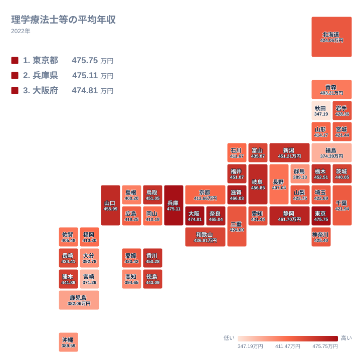

都道府県別の年収を比べると、同じ職種でも勤務地によって水準が変わることがあります。理学療法士等の平均年収を都道府県別に見ると、2022年のデータでは最も高い東京都で475.75万円、最も低い秋田県で347.19万円となっており、上位には近畿地方の県が集まっています。この記事では、賃金構造基本統計調査による2022年のデータを使い、なぜ近畿4県が上位に並ぶのか、そして地方圏で年収が伸び悩む背景を読み解いていきます。

> [!NOTE]
> 理学療法士等の平均年収は、賃金構造基本統計調査をもとに、6月のきまって支給する現金給与額を12倍し、前年1年間の賞与その他特別給与額を加えて算出した推計値です。税金や社会保険料が差し引かれる前の標本調査による平均額であり、個人ごとの実際の年収そのものではありません。

## 理学療法士等の平均年収の全国順位 - 近畿4県が上位を占める理由

2022年の理学療法士等の平均年収で全国1位となったのは東京都で、475.75万円という金額になっています。2位の兵庫県は475.11万円で、東京都の475.75万円に僅差で迫っています。3位は大阪府の474.81万円、4位は滋賀県の466.03万円、5位は奈良県の465.04万円となっており、東京都を除く上位4県のうち兵庫県、大阪府、滋賀県、奈良県の4県がいずれも近畿地方に属しています。

<source-link href="/ranking/physical-therapist-annual-income">理学療法士等の平均年収ランキングをもっと見る</source-link>

近畿地方は大阪府を中心に医療・介護施設が密集する地域であり、リハビリテーションの需要を支える病院や介護老人保健施設が数多く立地しています。理学療法士等の需要が高い地域では、施設同士の人材確保が給与水準を押し上げている可能性があります。一方で、同じ近畿地方に位置する京都府は413.66万円で32位にとどまっており、近畿地方の中でも府県によって水準に差があることが分かります。近畿4県がまとまって上位に入る一方で京都府だけが中位に位置するという構図は、単純に「近畿だから高い」とは言い切れない複雑さを示しています。東京都のほかの産業統計は[東京都のデータ](/areas/13000)で、兵庫県の統計は[兵庫県のデータ](/areas/28000)から確認できます。

上位10県にはこのほかに、静岡県が461.7万円で6位、岐阜県が456.85万円で7位、山口県が455.99万円で8位、栃木県が452.51万円で9位、新潟県が451.21万円で10位と続いています。近畿以外の県は互いに隣接していない地域から点在して入っており、都市圏へのアクセスや医療需要の規模が年収を押し上げる要因になっている県が多いことがうかがえます。

## 最下位グループは地方圏に集中 - 秋田・宮崎・福島の共通点

下位に目を向けると、47位の秋田県は347.19万円、46位の宮崎県は371.29万円、45位の福島県は374.39万円、44位の鹿児島県は382.06万円、43位の群馬県は389.13万円となっており、東北や九州、そして関東でも都市圏から離れた県が並んでいます。

地図で見ると、年収が高い県は近畿・東海地方に多く分布し、東北の日本海側や九州南部に向かうほど数値が下がる傾向がはっきりと表れています。秋田県や宮崎県のように人口減少と高齢化が進む地域では、医療機関の数自体が都市部より少なく、理学療法士等をめぐる施設間の賃金競争も相対的に穏やかであることが、年収の差につながっていると考えられます。

> [!WARNING]
> この数値はあくまで標本調査に基づく都道府県単位の平均であり、勤務先が病院か診療所か、公立か民間かといった雇用形態による違いまでは区別されていません。同じ県内でも施設によって年収に幅がある点には注意が必要です。

[仮説] 都市部と地方圏の差が需要と供給のどちらに強く起因するのかは、施設数や求人数の統計と合わせて検証する必要があります。人口が少ない県では絶対的な求人数が少なく、賃金競争が働きにくいという見方もできますが、この記事のデータだけでは因果関係までは確認できません。

## 近畿圏だけが突出する背景

東京都の475.75万円と秋田県の347.19万円を比べると、上位と下位ではっきりとした開きがあることが分かります。上位5県のうち4県が近畿地方に属しているという事実は、単なる偶然というよりも、近畿圏に医療・介護施設が集積していることや、大阪府を中心とした広域の労働市場が府県境を越えて機能していることを示唆しています。京都府が32位にとどまっている点も踏まえると、近畿地方の中でも大阪府に近い府県ほど年収が高くなる傾向があるという見方もできます。医療・福祉分野の他の指標は[同じカテゴリの統計一覧](/category/socialsecurity)から確認できます。

## まとめ

- 1位は東京都で475.75万円となっており、2位兵庫県の475.11万円が僅差で続いています
- 上位5県のうち兵庫県、大阪府、滋賀県、奈良県の4県が近畿地方に属しています
- 京都府は413.66万円で32位にとどまっており、近畿地方の中でも大きな差があります
- 最下位は秋田県の347.19万円で、宮崎県、福島県、鹿児島県、群馬県が下位グループに続いています
- 理学療法士等の平均年収は税・社会保険料控除前の標本調査による平均であり、個人の実年収ではありません

## データ出典

出典: 賃金構造基本統計調査（厚生労働省）。2022年のデータです。
