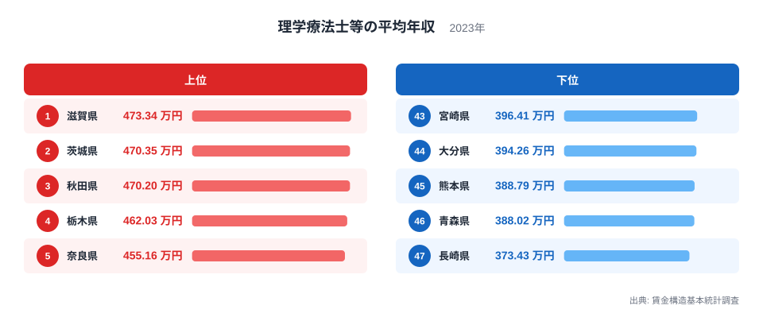
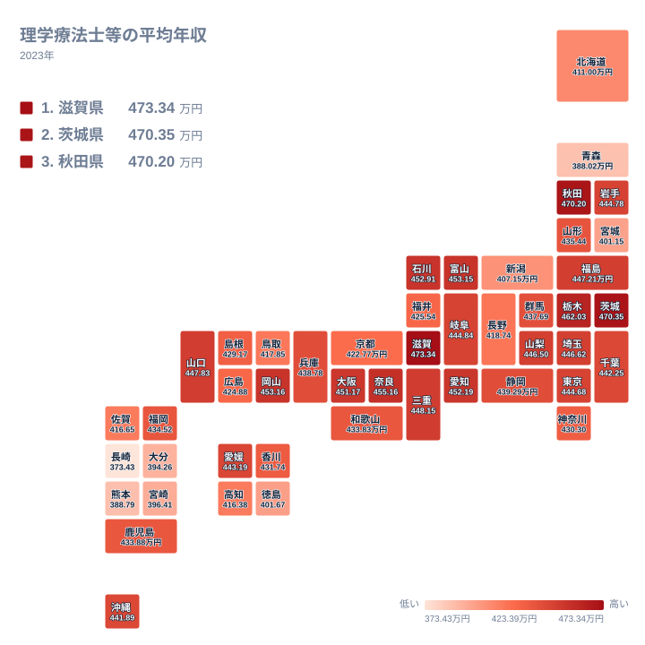

理学療法士などの年収は、働く県によってどれくらい違うのでしょうか。賃金構造基本統計調査の2023年の値で47都道府県を比べると、1位は滋賀県の473.34万円、最下位は長崎県の373.43万円で、差は約100万円、倍率にすると約1.27倍でした。

注目したいのは、東京都が444.68万円で18位にとどまる一方、秋田県が470.2万円で3位に入っていることです。東京都が上位に来ないのは、都市のイメージからすると意外に映るかもしれません。ただし、このデータは2023年の1年分です。順位を地域の差として読んでよいのかを、図と数字で確かめながら整理します。先に結論を書くと、地方でくくっても同じ地方の中で順位が大きく割れており、1年分の順位だけで地域の優劣を決めるのは難しい、という結果でした。

> [!NOTE]
> 「理学療法士等」は理学療法士だけの値ではありません。賃金構造基本統計調査（0003445758）の職種区分「理学療法士，作業療法士，言語聴覚士，視能訓練士」をまとめた値で、男女計です。平均年収は、きまって支給する現金給与額（6月の月例給与）を12倍し、年間賞与その他特別給与額を足した推計値で、所得税や社会保険料などを引く前の額です。

## 2023年の上位は滋賀県・茨城県・秋田県、東京都は18位

まず、2023年の上位5県と下位5県を並べます。

<source-link href="/ranking/physical-therapist-annual-income">理学療法士等の平均年収ランキングをもっと見る</source-link>

上位5県は、1位が滋賀県の473.34万円、2位が茨城県の470.35万円、3位が秋田県の470.2万円、4位が栃木県の462.03万円、5位が奈良県の455.16万円です。1位と3位の差は約3万円で、上位3県はほぼ横並びです。10位の大阪府は451.17万円で、1位との差は約22万円に収まります。[滋賀県のデータ](/areas/25000)や[秋田県のデータ](/areas/05000)から、ほかの統計も確認できます。

東京都は444.68万円で18位と、上位10県には入っていません。3位の秋田県との差は約25.5万円です。東京都以外でも、神奈川県は430.3万円で30位、福岡県は434.52万円で26位、京都府は422.77万円で34位と、いずれも上位10県には入っていません。一方で、愛知県は452.19万円で9位、大阪府は451.17万円で10位と上位10県に入りました。ここで挙げた東京都、神奈川県、福岡県、京都府、愛知県、大阪府の6都府県だけでも、順位は9位から34位まで分かれています。[東京都のデータ](/areas/13000)も合わせて見ると、ほかの指標での位置を比べられます。

なぜ滋賀県や茨城県、秋田県が上位に来るのかは、この統計表だけでは説明できません。同じ統計表には平均年齢と勤続年数の項目もあり、集計に含まれる労働者の年齢構成や勤続年数の違いが年収に混ざっている可能性がありますが、この記事ではそれらを使った調整をしていません。また、勤務先の種類や事業所の規模で分けた値は、この統計表にはありません。上位の理由を勤務先や地域の事情に結びつけて語るには、このデータだけでは材料が足りません。

## 下位5県のうち4県は九州、最下位は長崎県

下位は、47位が長崎県の373.43万円、46位が青森県の388.02万円、45位が熊本県の388.79万円、44位が大分県の394.26万円、43位が宮崎県の396.41万円です。下位5県のうち長崎県、熊本県、大分県、宮崎県の4県は九州の県で、青森県だけが東北の県です。

最下位の長崎県は、1位の滋賀県との差が約100万円あり、46位の青森県との差も約14.6万円あります。46位から43位までの4県は約8.4万円の幅に収まっているため、最下位の長崎県だけが下に離れた形です。

九州の7県は、福岡県、佐賀県、長崎県、熊本県、大分県、宮崎県、鹿児島県です。このうち福岡県は26位、鹿児島県は27位、佐賀県は37位で、残る4県が下位5県に入っています。九州が一律に低いわけではなく、同じ九州の中でも26位から47位まで順位が割れています。九州の県が下位に集まる理由も、このデータだけでは確かめられません。

## 地図で見ると、地方でくくっても順位はそろわない

次の図は、47都道府県を四角いタイルで日本列島に近い配置に並べたものです。赤が濃いほど平均年収が高く、薄いほど低いことを表します。

赤が濃い県を探すと、関東の茨城県と栃木県、近畿の滋賀県と奈良県、中部の富山県と石川県、東北の秋田県、中国の岡山県と、列島のあちこちに散らばっています。地方の区分は、このサイトの7区分である北海道・東北、関東、中部、近畿、中国、四国、九州・沖縄に従います。近畿には三重県を含め、三重県、滋賀県、京都府、大阪府、兵庫県、奈良県、和歌山県の2府5県としています。地方ごとに、最も順位が高い県と最も低い県を挙げると次のとおりです。

- 北海道・東北の7道県は、最も高い秋田県が3位、最も低い青森県が46位です。
- 関東の7都県は、最も高い茨城県が2位、最も低い神奈川県が30位です。
- 中部の9県は、最も高い富山県が7位、最も低い新潟県が40位です。
- 近畿の7府県は、最も高い滋賀県が1位、最も低い京都府が34位です。
- 中国の5県は、最も高い岡山県が6位、最も低い鳥取県が36位です。
- 四国の4県は、最も高い愛媛県が19位、最も低い徳島県が41位です。
- 九州・沖縄の8県は、最も高い沖縄県が21位、最も低い長崎県が47位です。

上位10県を地方別に数えると、近畿が3県（滋賀県、奈良県、大阪府）、中部が3県（富山県、石川県、愛知県）、関東が2県（茨城県、栃木県）、北海道・東北が1県（秋田県）、中国が1県（岡山県）です。四国と九州・沖縄からは1県も入っていません。下位10県は38位から47位までで、九州・沖縄が4県、北海道・東北が3県、四国が2県、中部が1県を占め、関東、近畿、中国からは1県も入っていません。

つまり、四国と九州・沖縄には上位10県に入る県がなく、九州・沖縄だけで下位10県の4県を占めています。その一方で、北海道・東北と中部は上位10県にも下位10県にも入っていて、同じ地方の中で順位が大きく割れています。2023年の結果は「近畿が高い」「東北が低い」と一言でまとめられる形ではありません。地方ごとの傾向があるのかどうかは、この1年分の値だけでは判断できません。

## この順位をどう読むか

47県の真ん中にあたる24位は、群馬県の437.69万円です。6位の岡山県は453.16万円、30位の神奈川県は430.3万円で、この間の25県の最大の差は約23万円です。順位が1つ違うごとの差は平均すると約1万円で、中位の順位は小さな金額差の積み重ねです。一方で、1位の滋賀県と最下位の長崎県の差は約100万円あります。順位の端にある県どうしの差と、中位の細かな順位の差は、分けて読む必要があります。

> [!WARNING]
> この値は標本調査にもとづく県別・職種別の平均です。集計に含まれる人数が少ない県では、少数の給与水準に平均が左右され、年によって大きく動くことがあります。この記事のデータは2023年の1年分で、県ごとの集計人数も含まれていないため、2023年の順位がどの程度安定しているかは、ここでは確かめられません。

同じ県の別の年の値は、ランキングページで年を切り替えて見比べられます。1年分の順位を県の優劣として受け取るのではなく、約100万円という幅があること、中位の県どうしの差は小さいことを目安にして、複数の年とあわせて読むのが安全です。社会保障・衛生分野のほかの指標は、[同じカテゴリの統計一覧](/category/socialsecurity)から確認できます。

## まとめ

- 2023年の理学療法士等の平均年収は、1位が滋賀県の473.34万円、最下位が長崎県の373.43万円で、差は約100万円、倍率は約1.27倍です。
- 秋田県は470.2万円で3位、東京都は444.68万円で18位と、東京都は上位10県に入りませんでした。
- 下位5県のうち長崎県、熊本県、大分県、宮崎県の4県は九州の県ですが、福岡県は26位、鹿児島県は27位と中位です。
- 7つの地方に分けても、近畿は1位から34位まで、北海道・東北の中でも秋田県が3位、青森県が46位と、同じ地方の中で順位が大きく割れています。
- 6位から30位までの25県は約23万円の幅に収まっており、標本調査の1年分の値なので、順位は目安として読む必要があります。
