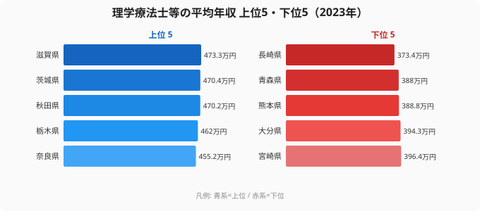
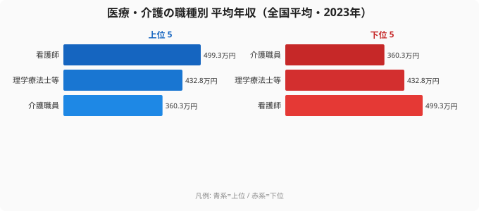

「同じ国家資格でも、働く県を変えれば年収が100万円近く変わる」──理学療法士(PT)の転職や職場選びを考えるとき、多くの人がまず気にするのが「どの県なら稼げるか」です。そして同時に、こう考えがちです。「東京や大阪など、都会で働いたほうが給料は高いはずだ」と。

ところが、2023年の理学療法士等の平均年収を都道府県別に並べると、この直感はきれいに裏切られます。1位は滋賀県の473.3万円。一方で最下位は長崎県の373.4万円で、その差は99.9万円・倍率にして1.27倍です。そして上位を占めるのは滋賀・茨城・秋田・栃木といった、いわゆる大都市圏ではない県。東京都は18位、神奈川県にいたっては30位まで沈んでいます。

この記事では、なぜ大都市が上位に来ないのか、どんな県でPTの年収が高くなりやすいのかを、47都道府県のデータと「生活実感」の両面から読み解きます。年収の額面だけでなく、その裏にある構造まで分かると、転職先を選ぶときの見え方が変わります。

> [!NOTE]
> この数値は厚生労働省「賃金構造基本統計調査」をもとに、理学療法士・作業療法士・言語聴覚士・視能訓練士などを含む職種区分の「きまって支給する現金給与額×12＋年間賞与」で算出した平均年収です。PT単独ではなくリハビリ専門職をまとめた区分のため、純粋な理学療法士だけの数値とは多少ずれる点に注意してください。

## 上位は地方県、最下位は九州に集中する

まず全体像を、上位5県と下位5県で見てみましょう。

上位5県は滋賀県(473.3万円)、茨城県(470.4万円)、秋田県(470.2万円)、栃木県(462.0万円)、奈良県(455.2万円)。一方、下位5県は宮崎県(396.4万円)、大分県(394.3万円)、熊本県(388.8万円)、青森県(388.0万円)、長崎県(373.4万円)です。

ここで目を引くのが、上位に大都市圏の名前がほとんど無いことです。滋賀・茨城・栃木は、それぞれ京都・東京・首都圏に隣接した「ベッドタウン的な性格を持つ県」。秋田・奈良も大都市ではありません。逆に下位は九州の県(宮崎・大分・熊本・長崎)が固まっており、地理的な偏りがはっきり出ています。

なぜ滋賀や茨城のような県が上位に来るのでしょうか。鍵は「需要に対して供給が追いついていない」状態です。これらの県は人口あたりの病院・リハビリ施設の整備が進む一方で、PTを養成する大学・専門学校が大都市ほど多くないため、地域内で人材を取り合う構図になりやすい。求人側が給与で人を引き寄せる必要があり、結果として平均年収が押し上げられます。秋田のように高齢化が進み、リハビリ需要そのものが大きい県でも同じ力学が働きます。

<source-link href="/ranking/physical-therapist-annual-income">理学療法士等の平均年収ランキング(47都道府県・全件)を見る</source-link>

## なぜ東京・神奈川は上位に来ないのか

「都会のほうが高いはず」という直感が裏切られる最大の理由は、PTの供給過多です。

理学療法士の養成校は、東京・大阪・神奈川といった大都市圏に集中しています。毎年大量の有資格者が都市部で生まれ、そのまま都市部で就職するため、求人1件あたりの応募者が多く、施設側が給与を引き上げる動機が弱くなります。実際、2023年の東京都は444.7万円で18位、神奈川県は430.3万円で30位、京都府は422.8万円で34位と、ネームバリューに反して中位以下に沈んでいます。

> [!WARNING]
> 順位が低い県でも「年収が安い」と単純に結論づけるのは危険です。この調査は名目の給与額であり、家賃・物価を差し引いた「手取りの実質価値」は反映していません。家賃が高い東京で444.7万円を得るのと、生活費の安い地方で同程度を得るのとでは、可処分所得の意味が大きく変わります。額面の順位は出発点として読み、生活コストとセットで判断してください。

もう一つ見落としやすいのが、神奈川県の推移です。神奈川は2020年に487.8万円と全国でも高水準でしたが、2023年には430.3万円まで下がっています。短期間で50万円以上の変動があるのは、この職種区分が比較的少人数のサンプルで構成され、年ごとの賞与や対象施設の構成で平均が振れやすいためです。単年の順位だけで「この県は稼げる/稼げない」と決めつけず、複数年の傾向で見るのが安全です。

## 最下位グループに共通する構造

下位を占める長崎・青森・熊本・大分・宮崎には、いくつかの共通点があります。

一つは、PT養成校が比較的多く、有資格者の地元供給が需要を上回りやすいこと。九州・東北の一部の県では、リハビリ職の「買い手市場」が起きやすく、給与競争が働きにくくなります。もう一つは、診療報酬に基づく病院経営の体力差です。地方の中小規模の医療機関ほど経営余力が限られ、人件費を厚くしづらい傾向があります。

最下位の長崎県は373.4万円。1位の滋賀県とは99.9万円の差で、これは月給に換算すると毎月8万円以上の違いに相当します。同じ国家資格・同じ業務内容でも、県をまたぐだけでこれだけの開きが生まれるのです。

> [!TIP]
> 同じ「年収が低めの県」でも、その理由を見極めると転職判断が変わります。供給過多が原因なら、県内でも「人材が足りていない地域・分野(訪問リハビリ、回復期病棟、介護施設など)」を狙えば平均より高い条件を引ける可能性があります。県の平均順位は「相場の目安」、実際の交渉材料は「その県の中でどこが人手不足か」です。

## 看護師・介護職と比べると見えてくるPTの立ち位置

理学療法士の年収を「高い・低い」と感じるかは、比較対象によって変わります。同じ医療・介護の現場で働く看護師・介護職員と並べてみましょう。

2023年の全国平均で見ると、看護師は499.3万円、理学療法士等は432.8万円、介護職員は360.3万円。理学療法士は看護師より約67万円低く、介護職員より約73万円高いという、ちょうど中間の位置にあります。

この立ち位置を知っておくと、転職時の期待値を現実に合わせやすくなります。看護師と同じ医療職だから同水準を、と考えると物足りなさを感じやすい一方、介護職と比べれば相対的に高い待遇です。さらに重要なのは、職種によって「稼げる県」が違うという点です。たとえば[看護師の平均年収ランキング](/ranking/nurse-annual-income)では大阪府が全国トップに立ちますが、理学療法士の大阪府は中位にとどまります。[介護職員の平均年収ランキング](/ranking/care-worker-annual-income)もまた高い県の顔ぶれが異なります。同じ県でも職種が変われば順位が大きく入れ替わるため、「リハビリ職にとって条件の良い県」は職種固有のデータで確認する意味があります。

<source-link href="/ranking/nurse-annual-income">看護師の平均年収ランキング(47都道府県)を見る</source-link>

なお、PT年収の全国平均そのものは上昇傾向にあります。2020年の418.6万円から2021年は420.6万円、2023年は432.8万円と、3年で14万円ほど伸びました。高齢化でリハビリ需要が拡大し続けているため、職種全体としては追い風が吹いている局面と言えます。

## まとめ

- 2023年の理学療法士等の平均年収は1位が滋賀県の473.3万円、最下位が長崎県の373.4万円で、差は99.9万円・1.27倍。
- 上位は滋賀・茨城・秋田・栃木・奈良といった非大都市圏の県、下位は宮崎・大分・熊本・青森・長崎と九州・東北に偏っている。
- 「都会のほうが高い」は当てはまらず、東京は18位・神奈川は30位・京都は34位。養成校が集中する大都市圏では供給過多で給与が上がりにくい。
- 額面順位は家賃・物価を反映しないため、生活コストとセットで読むこと。サンプルが小さく年ごとに振れやすい点も注意。
- 職種で比べると看護師(499.3万円)と介護職員(360.3万円)の中間。職種ごとに「稼げる県」は異なる。

理学療法士の職場選びは、年収の額面だけでなく「なぜその県が高いのか/低いのか」という構造を理解したうえで、自分の生活コストや働き方と照らし合わせて決めるのが賢明です。医療・福祉に関わる他の指標は[社会保障カテゴリ](/category/socialsecurity)にまとめてあるので、合わせて確認してみてください。

## データ出典

厚生労働省「賃金構造基本統計調査」(2023年)。理学療法士・作業療法士等を含む職種区分の平均年収を、e-Stat 経由で整備したデータをもとに算出しています。平均年収は「きまって支給する現金給与額×12＋年間賞与その他特別給与額」で計算しています。
