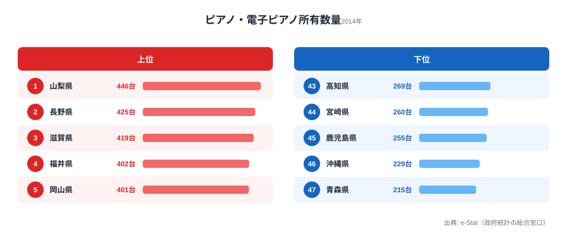

「ピアノが多いのは、所得もホールも多い大都市だろう」──そう考えると、データは見事に裏切ってくる。2014年度のピアノ・電子ピアノ所有数量で1位だったのは**[山梨県](/areas/19000)（446台）**。最下位の**[青森県](/areas/02000)（215台）**との差は約2.1倍にのぼる。

この指標は「二人以上の世帯」を対象にした、**1000世帯あたりのピアノ・電子ピアノ所有台数（台）**。つまり「その県の家庭にどれだけピアノ（電子ピアノを含む）が普及しているか」を世帯規模で正規化した値で、絶対台数の多い人口大県が有利になる仕組みではない。

驚くのは上位の顔ぶれだ。山梨・長野・滋賀といった内陸県が上位に目立つ一方、瀬戸内沿岸の岡山・愛媛・香川も上位に食い込んでいる。一方で**東京は22位（340台）、大阪は41位（279台）**と、大都市はむしろ下位に沈んだ。この記事では、なぜ内陸の教育県や瀬戸内県でピアノ普及が進み、大都市が沈むのか、データから読み解く。

> [!NOTE]
> 本データは総務省「社会・人口統計体系（社会生活統計指標）」に基づく、二人以上の世帯1000世帯あたりのピアノ・電子ピアノ所有数量（台）。1台未満を含む保有実態ではなく「1000世帯でならして何台あるか」を示すため、世帯数の多寡で順位が決まるわけではない。年度表記は会計年度（2014年度）。

## ピアノ所有数量 TOP10 と最下位（2014年度）

上位10県を眺めると、**内陸・教育県のクラスター**が浮かび上がる。1位の山梨（446台）、2位の長野（425台）はいずれも内陸の山岳県で、教育意識の高さがよく語られる地域だ。3位の滋賀（419台）、4位の福井（402台）も内陸寄りで、福井は全国学力テストでも常連の上位県として知られる。5位の岡山（401台）以下、岡山・愛媛・香川という瀬戸内エリアの県もそろって上位に食い込んだ。

> [!TIP]
> 「1000世帯あたり台数」は世帯規模で割っているため、人口の多寡ではなく**世帯あたりの普及度**を映す。だからこそ人口最大の東京（22位・340台）より、山梨（1位・446台）のほうが上に来る。「都会＝ピアノが多い」という直感を疑うのに最適な指標だ。

<source-link href="/ranking/piano-ownership-multi-person-households-per-1000">ピアノ・電子ピアノ所有数量ランキングをもっと見る</source-link>

## 最下位グループ：南九州・沖縄・青森が並ぶ

最下位5県は高知（269台）・宮崎（260台）・鹿児島（255台）・沖縄（229台）・青森（215台）。下位グループには、**南九州（宮崎44位・鹿児島45位）と沖縄（46位）、そして青森（47位）**が並んだ。最下位の青森（215台）は、1位の山梨（446台）の半分に満たない水準だ。

ここで注意したいのは、下位＝大都市ではない点だ。むしろ大阪（41位・279台）を除けば、下位を占めるのは地方の県が多い。「都会だから多い／田舎だから少ない」という単純な構図では説明できず、地域ごとの**教育文化・習い事文化の濃淡**が効いていると読むのが自然だ。

> [!WARNING]
> 所有数量が少ないことは、その県で音楽教育が乏しいことを意味しない。気候（沖縄は湿度が高くアコースティックピアノの管理が難しい）、住宅事情（防音・設置スペース）、電子ピアノへの代替など、保有を左右する要因は多岐にわたる。本ランキングはあくまで「世帯あたりの保有実態」の一断面である。

<source-link href="/ranking/piano-ownership-multi-person-households-per-1000">下位県を含む47都道府県の数値を見る</source-link>

## 発見1：大都市はむしろ沈む──東京22位・大阪41位

このランキングで最も意外なのは、大都市の低順位だ。**東京は22位（340台）、大阪は41位（279台）**。所得もピアノ教室も多そうな両都市が、47県のなかでは中位～下位にとどまった。

理由として考えられるのは、**世帯規模での正規化と住宅事情**だ。1000世帯あたりで割るため、単身・小規模世帯が多い大都市は不利に働きやすい。加えて、集合住宅中心で防音や設置スペースの制約が大きい都市部では、アコースティックピアノの保有ハードルが高い。

> [!NOTE]
> 全国47県の平均は約333台／1000世帯（47県の単純平均として算出）。山梨（446台）は平均を100台以上、東京（340台）はほぼ平均並み、大阪（279台）は平均を50台以上下回る。

<source-link href="/ranking/piano-ownership-multi-person-households-per-1000">大都市を含む全県の順位を確認する</source-link>

## 発見2：王者交代──奈良の首位陥落と山梨の台頭

この指標は1994年度から5回分（1994／1999／2004／2009／2014年度）のデータがあり、首位の座は移り変わってきた。

- **奈良県**はかつての首位常連で、1994年度・1999年度には全国トップに立っていた。だが2014年度は**9位（385台）**に後退。絶対値（台数）はむしろ増えているが、他県の伸びがそれを上回ったため相対順位が下がった形だ。
- 入れ替わるように**山梨県**が台頭し、2014年度に堂々の**1位（446台）**へ。
- 途中の年度では栃木（2004年度に全国トップ）、群馬（2009年度に全国トップ）など北関東勢が首位に立った時期もあった。

> [!TIP]
> 「1位＝固定」ではないのがこの指標の面白さだ。教育熱や習い事文化は世代とともに移ろう。経年で首位が奈良→北関東→山梨と動いてきた事実は、ピアノ保有が「その県の不変の気質」ではなく、時期ごとの世帯構成と文化の合成であることを示している。

> [!NOTE]
> 経年比較の注意：本データは調査年によって対象世帯数・集計範囲が異なる場合がある（1994年度は14県分のみ収録）。年度間の細かな増減は、調査設計の差を含む可能性があるため幅をもって解釈したい。

## まとめ

- **1位は山梨県（446台／1000世帯、2014年度）**。「都会＝ピアノが多い」という直感を覆す結果。
- **最下位は青森県（215台）**で、1位との差は約2.1倍。
- **上位には内陸・教育県が目立つ**（山梨・長野・滋賀・福井）が、瀬戸内の岡山・愛媛・香川も上位に入り内陸と沿岸が混在する。
- **大都市は沈む**：東京22位（340台）、大阪41位（279台）。世帯規模での正規化と住宅事情が効いている可能性。
- **首位は移り変わる**：奈良（1994・1999年度首位）→北関東（2004・2009年度）→山梨（2014年度）。

## データ出典

総務省「社会・人口統計体系（社会生活統計指標）」より、二人以上の世帯1000世帯あたりのピアノ・電子ピアノ所有数量（台）。e-Stat（政府統計の総合窓口）経由で整備。集計年度は2014年度（最新収録年度）。

本記事の対象データ: [関連カテゴリ](/category/economy)
