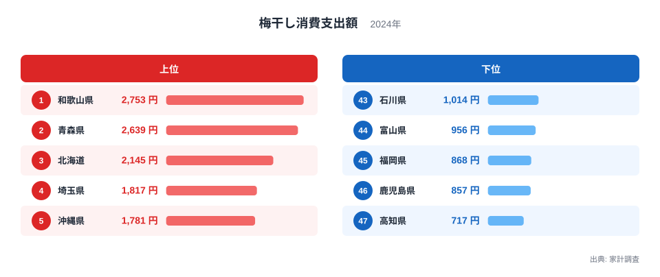
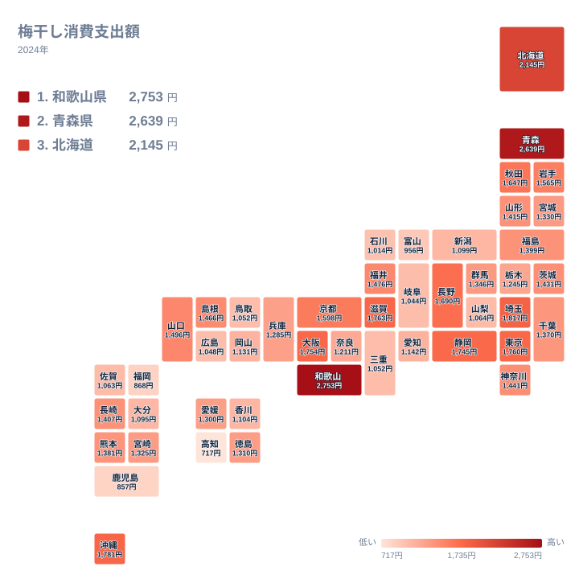

梅干しは日本の食卓に長く根付いてきた保存食です。家計調査では、1世帯あたりが1年間に梅干しへ支出した金額を都道府県別に集計しており、この数字を比べると地域ごとの食習慣の違いが浮かび上がります。

全国を見渡すと、梅の一大産地として知られる和歌山県が支出額でも首位に立っています。ところが2位につけているのは、紀州から遠く離れた青森県です。産地からの距離だけでは説明できないこの結果には、それぞれの土地に根付いた保存食文化や気候条件が関わっていると考えられます。この記事では、上位と下位の顔ぶれ、地理的な分布のパターン、そして梅干し以外の保存食との関係から、消費額の地域差がどのように生まれているのかを見ていきます。

## 梅干し消費支出額の上位と下位

<source-link href="/ranking/pickled-plum-consumption-expenditure">梅干し消費支出額ランキングをもっと見る</source-link>

最も支出額が多いのは和歌山県で、2,753円です。梅の生産量で国内シェアの大半を占める土地だけあって、家庭での消費も突出しています。これに次ぐのが青森県の2,639円で、和歌山県との差はわずか114円しかありません。3位は北海道で2,145円、4位は埼玉県で1,817円、5位は沖縄県で1,781円と続きます。上位5県の顔ぶれを見ると、産地である和歌山県を除けば、いずれも梅の主要な産地からは離れた地域です。

一方、支出額が最も少ないのは高知県で717円です。以下、46位が鹿児島県の857円、45位が福岡県の868円、44位が富山県の956円、43位が石川県の1,014円と、九州から北陸にかけての地域が下位に集まっています。1位の和歌山県と47位の高知県を比べると、支出額にはおよそ3.8倍の開きがあります。同じ日本国内でも、梅干しへの支出額はこれほど大きく異なっているのです。

上位と下位を見比べると、単純な西日本と東日本の対比では説明がつかないことが分かります。西日本の和歌山県が1位である一方、同じ西日本の高知県が最下位に位置しているためです。産地からの近さよりも、それぞれの地域で梅干しがどのような役割を担ってきたかという食文化の違いが、支出額の差に強く影響していると考えられます。

## 梅干し消費支出額の地理分布

地図で全国の分布を眺めると、支出額の高い地域が特定のブロックに固まっているわけではないことが分かります。近畿地方の和歌山県、東北地方の青森県、北海道、そして関東の埼玉県や沖縄県まで、支出額の高い県は日本列島の広い範囲に散らばっています。これは、梅干しの消費が気候帯や地方単位の傾向というより、各県ごとの個別の食習慣に左右されやすい品目であることを示しています。

支出額が低い県に目を向けると、九州南部の鹿児島県や高知県のように、他の漬物や果実を使った保存食が古くから発達してきた地域が目立ちます。梅干しに限らず、地域には梅以外の素材を使った独自の保存食文化が根付いていることが多く、それが梅干しへの支出額を相対的に押し下げている一因になっている可能性があります。

地図全体を通して見ると、支出額の高低は都道府県ごとにまだら状に分布しており、隣り合う県同士でも大きく数値が異なるケースが少なくありません。単一の地理的要因だけで説明するのではなく、各地域の食習慣や保存食の選び方といった、より個別的な事情を踏まえて読み解く必要がある指標だといえます。

## 紀州の梅と、遠く離れた消費地

和歌山県が1位である背景には、県内の紀州地域が江戸時代から梅の栽培に力を入れてきた歴史があります。梅の生産量が全国でも際立って多く、地元で梅干しに加工して食べる習慣が根付いていることが、家庭での支出額の高さに直結していると考えられます。

一方で2位の青森県は、梅の産地としては全国的に知られた土地ではありません。それでも和歌山県にわずかな差まで迫る支出額を記録しているのは興味深い点です。東北地方は冬の寒さが厳しく、古くから保存食としての漬物文化が発達してきた土地柄です。梅干しもまた、こうした保存食のひとつとして食卓に定着してきたのではないかと考えられます。ただし、これは家計調査の支出額だけから読み取れる範囲の見立てであり、地域の食習慣に関する詳しい調査結果と突き合わせたわけではない点には注意が必要です。

3位の北海道も、梅の産地とは言えない土地でありながら支出額は高い水準にあります。広い土地で農作物の保存が生活の知恵として重視されてきたことや、贈答用や来客用として梅干しを常備する習慣が根付いている可能性があります。産地との距離が近いか遠いかだけでなく、それぞれの土地でどのような保存食の文化が育まれてきたかという視点を持つことで、この指標の地域差はより理解しやすくなります。

## 塩分・保存食としての梅干しと、他の漬物・調味料との対比

梅干しは塩分を多く含む保存食であり、家庭での消費のされ方は他の漬物や調味料とも関係している可能性があります。梅干しへの支出が多い地域では、白米にのせる、お弁当に入れる、料理の隠し味に使うといった形で日常的に使われる頻度が高いことが考えられます。逆に支出額が低い地域では、梅干し以外の漬物や薬味が食卓での同じような役割を担っているのかもしれません。

これはあくまで家計調査の支出額データから導かれる一つの見方であり、実際にどの食品が梅干しの代わりを果たしているかを直接示すデータではありません。梅干し単体の支出額を見るだけでなく、他の漬物類や調味料の消費支出額と合わせて比較することで、地域ごとの保存食文化の全体像がより立体的に見えてくると考えられます。関心のある方は、[同じカテゴリの統計一覧](/category/economy)から関連する家計消費のランキングも確認してみてください。

## まとめ

- 梅干し消費支出額の1位は和歌山県で2,753円、2位は青森県で2,639円と、産地からの距離に関わらず両県が突出しています。
- 47位は高知県で717円と最も少なく、1位との差はおよそ3.8倍にのぼります。
- 上位5県は和歌山県・青森県・北海道・埼玉県・沖縄県、下位5県は高知県・鹿児島県・福岡県・富山県・石川県です。
- 地理的な分布は西日本と東日本で単純に二分されず、県ごとの食習慣の違いが強く表れています。
- 和歌山県の産地としての強みに加え、青森県や北海道のように産地でなくても支出額が高い地域があり、保存食文化の違いが背景にあると考えられます。

[和歌山県のデータ](/areas/30000)や[青森県のデータ](/areas/02000)では、それぞれの県が持つ他の統計指標も確認できます。

> [!NOTE]
> 家計調査は全国の家計を代表するサンプル世帯の平均支出額を集計したもので、都道府県庁所在市や政令指定都市を中心とした調査世帯の結果に基づいています。県内全域の実態を均一に反映しているわけではない点に注意してください。

> [!WARNING]
> この指標は「消費支出額」であり、購入した梅干しの量そのものを示す「消費量」とは異なります。高級な梅干しを少量買う地域では、消費量が少なくても支出額は高く出ることがあります。単価の違いが支出額の差にどの程度影響しているかは、このデータだけでは判別できません。

> [!TIP]
> ランキングの39位と40位はともに1,052円と同じ金額ですが、順位は39位と40位に分かれて表示されています。同一の金額でも表示上の順位は連番で振られる仕組みになっているため、僅差の順位を比較するときは金額そのものも合わせて確認することをおすすめします。

## データ出典

家計調査（2024年）のデータをもとに作成しています。
