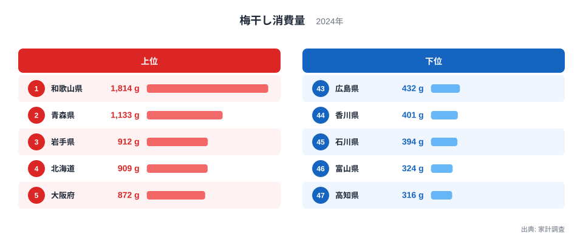
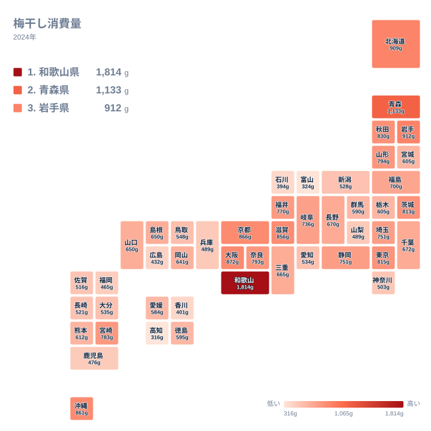

梅干しは全国どこでも食べられる保存食ですが、実際にどれだけ消費されているかは県によって大きく異なります。家計調査による2024年のデータでは、都道府県庁所在市の二人以上世帯の年間梅干し消費量は最も多い和歌山県で1,814g、最も少ない高知県で316gとなっており、生産地との結びつきが色濃く表れています。この記事では、なぜ和歌山県が突出して多いのか、そして東北や北海道のような寒冷地でも消費量が多い理由を、産地と食文化の視点から読み解いていきます。

> [!NOTE]
> このデータは、都道府県庁所在市に住む二人以上の世帯を対象にした家計調査の年間消費量です。県全体の消費量ではなく、各県の代表的な都市の家計における消費傾向を示しています。

## 梅干し消費量の全国順位 - 和歌山県が圧倒的な理由

2024年の梅干し消費量で全国1位となったのは和歌山県で、1,814gという数値は2位の青森県の1,133gを大きく上回っています。和歌山県は南高梅（なんこうめ）に代表される梅の一大産地で、みなべ町や田辺市を中心に日本有数の梅の生産量を誇る地域です。産地であることが、地元の家庭での消費習慣にも直結していると考えられます。詳しい産業統計は[和歌山県のデータ](/areas/30000)で確認できます。

<source-link href="/ranking/pickled-plum-consumption-quantity">梅干し消費量ランキングをもっと見る</source-link>

2位の青森県は1,133g、3位の岩手県は912g、4位の北海道は909gとなっており、いずれも冬が長く寒冷な地域です。寒い地域では野菜や果物を塩漬けにして保存する食文化が根付いており、梅干しもその保存食文化の一部として日常的に消費されてきたと考えられます。青森県のほかの統計は[青森県のデータ](/areas/02000)から確認できます。5位の大阪府は872g、6位の京都府は866gとなっており、和歌山県に地理的に近い近畿地方の都市でも消費量が多い傾向が見られます。これは、和歌山県産の梅干しが近畿地方の市場に流通しやすいことが背景にあると考えられます。

[仮説] 近畿地方で消費量が多いのは、産地に近く流通コストが低いことに加え、梅干しがおにぎりや弁当に欠かせない食材として食文化に定着していることも関係している可能性がありますが、この点は食文化に関する別の調査と合わせて確認する必要があります。7位の沖縄県は861gと上位に入っており、産地からも寒冷地からも離れた地域である点で意外な結果に見えますが、独自の保存食文化を持つ地域であることが影響している可能性があります。

一方で、和歌山県に隣接する近畿地方の中でも、兵庫県は489gで40位にとどまっており、産地に近いことが必ずしも高い消費量に直結するわけではありません。同じ近畿地方でも大阪府や京都府のように和歌山県からの流通が盛んな地域と、そうではない地域とで消費量に差が生じている可能性があります。10位の東京都は815gで、産地からも寒冷地からも離れているにもかかわらず上位10県に入っており、全国から人が集まる大都市では特定の産地に偏らない多様な食文化が形成されやすいことも影響していると考えられます。

## 消費量が少ない県は西日本の内陸・沿岸部 - 高知・富山・石川の共通点

下位に目を向けると、47位の高知県は316g、46位の富山県は324g、45位の石川県は394g、44位の香川県は401g、43位の広島県は432gとなっており、四国や北陸、瀬戸内海沿岸の県が並んでいます。

地図で見ると、消費量が多い地域は東北・北海道と近畿地方に分かれて分布しており、四国や北陸ではまとまって数値が低くなる傾向が見られます。高知県は柑橘類やカツオのたたきなど、梅干し以外の保存食・郷土料理が食卓に根付いている地域であり、梅干しへの依存度が相対的に低いことが消費量の少なさにつながっている可能性があります。富山県や石川県は昆布や魚介の加工品を使った独自の保存食文化を持つ地域であり、梅干しの立ち位置がほかの地域と異なることも考えられます。関連する統計は[同じカテゴリの統計一覧](/category/economy)からまとめて確認できます。

44位の香川県は401g、43位の広島県は432gとなっており、こちらも瀬戸内海沿岸の県です。瀬戸内海沿岸は温暖な気候を生かした柑橘類やオリーブなどの生産が盛んな地域であり、保存食の中心が梅干しではなく他の食材に置き換わっている可能性があります。四国・北陸・瀬戸内海沿岸という3つの地域がまとまって下位に並んでいる点は、単なる偶然ではなく、それぞれの地域に根付いた独自の食文化を反映した結果だと考えられます。

> [!WARNING]
> このデータは都道府県庁所在市に住む二人以上世帯という限られた対象の調査であり、単身世帯や庁所在市以外の地域の消費量は含まれていません。県全体の消費傾向を正確に表しているとは限らない点に注意してください。

## 産地と食文化が生む消費量の差

和歌山県の1,814gと高知県の316gを比べると、同じ日本国内でもこれほど大きな開きがあることが分かります。上位10県のうち和歌山県、大阪府、京都府、滋賀県のように近畿地方に属する県が複数入っている一方で、青森県、岩手県、北海道、秋田県のように東北・北海道の寒冷地も複数入っています。この2つのグループは地理的にはまったく異なる地域ですが、産地への近さと保存食文化という2つの異なる理由から、いずれも梅干しの消費量が多くなっていると考えられます。

> [!TIP]
> ランキングの図では上位5と下位5しか表示されませんが、中位の県の順位も含めて全件を見たい場合は、ランキングページで47都道府県すべての数値を確認できます。産地の近さと寒冷地の保存食文化のどちらが自分の県に当てはまるかを考えながら見ると、地域差の背景が読み取りやすくなります。

## まとめ

- 1位は和歌山県で1,814gとなっており、2位青森県の1,133gを大きく上回っています
- 最下位は高知県の316gで、富山県、石川県、香川県、広島県が下位グループに続いています
- 上位県は産地に近い近畿地方と、保存食文化を持つ東北・北海道の2つのグループに分かれています
- 沖縄県は7位の861gと、産地からも寒冷地からも離れた地域としては意外な結果になっています
- このデータは都道府県庁所在市の二人以上世帯を対象にしたもので、県全体の消費量ではありません

## データ出典

出典: 家計調査（総務省統計局）。2024年のデータです。
