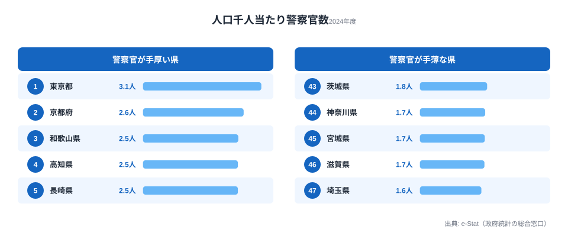
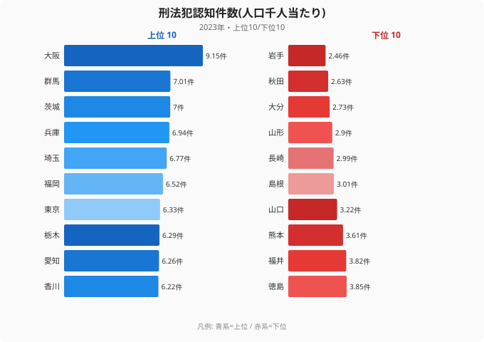
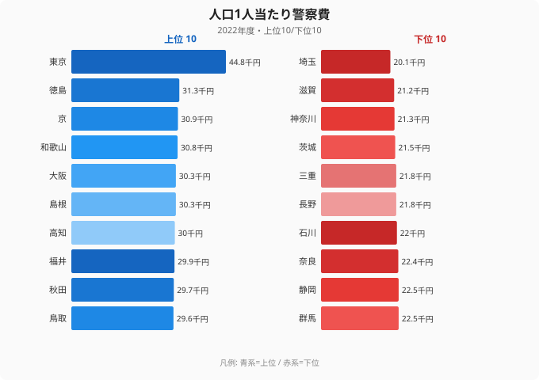

「警察官が多い県は、それだけ犯罪が多くて危ない県なのだろう」——多くの人がそう考える。だが47都道府県のデータを並べると、その直感はきれいに裏切られる。

2024年度、人口千人当たりの警察官数が最も多いのは**東京都の3.08人**。最も少ないのは**埼玉県の1.6人**で、その差は**1.93倍**ある。ところが2023年の刑法犯認知件数(人口千人当たり)を見ると、犯罪が多いのは警察官が最少の**埼玉県(5位・6.77件)**で、警察官が最多の東京都はむしろ7位にとどまる。

なぜ「守りの厚さ」と「犯罪の多さ」がこれほどズレるのか。この記事では、警察官の配置・予算・実際の犯罪発生という3つのデータを重ねて、**警察力は犯罪の多さではなく「住民登録人口と自治体予算」で決まっている**という構造を可視化する。

> [!NOTE]
> 本記事の「警察官数」は人口千人当たりの人数(単位:人)で、警察庁・総務省の統計を e-Stat 経由で整備した値(2024年度)。絶対数ではなく密度で比較するため、人口の多い県が自動的に上位にくるわけではない。犯罪率は刑法犯認知件数の人口千人当たり件数(2023年)、警察費は人口1人当たりの警察費(千円・2022年度)を用いる。指標ごとに最新年が異なる点に注意。

## 警察官密度ランキング：東京が突出、西日本の小県が続く

人口千人当たり警察官数の上位・下位は次の通り。

| 順位 | 都道府県 | 警察官数(人/千人) |
|---|---|---|
| 1 | 東京都 | 3.08 |
| 2 | 京都府 | 2.62 |
| 3 | 和歌山県 | 2.48 |
| 4 | 高知県 | 2.47 |
| 4 | 長崎県 | 2.47 |
| 6 | 山口県 | 2.46 |
| 7 | 大阪府 | 2.44 |
| 8 | 福井県 | 2.37 |
| 9 | 島根県 | 2.33 |
| 10 | 鳥取県 | 2.29 |
| … | … | … |
| 43 | 茨城県 | 1.75 |
| 44 | 神奈川県 | 1.70 |
| 45 | 宮城県 | 1.69 |
| 46 | 滋賀県 | 1.68 |
| 47 | 埼玉県 | 1.60 |

東京都の3.08人は2位の京都府(2.62人)を0.46人引き離す突出ぶりだ。皇居・国会・各国大使館・大企業本社が集中し、大規模イベントや要人警護の需要が常時あることが、住民数を超えた警察官配置を必要にしている。

注目すべきは2位以下の顔ぶれだ。京都府・和歌山県・高知県・長崎県・山口県と、**大都市圏ではなく西日本の人口の少ない県が上位を占める**。人口千人当たりで割ると、人口の少ない県ほど「最低限必要な警察署・駐在所」の固定費が密度を押し上げるためだ。離島や山間部を多く抱える長崎・島根・鳥取がその典型である。

<source-link href="/ranking/police-officer-count-per-population">警察官数(人口千人当たり)ランキングをもっと見る</source-link>

## 最下位グループの正体：東京の「通勤ベッドタウン」

下位5県は埼玉(1.60)・滋賀(1.68)・宮城(1.69)・神奈川(1.70)・茨城(1.75)。ここに**東京通勤圏のベッドタウンが集中している**のがこの記事の最初の発見だ。

| 順位 | 都道府県 | 警察官数(人/千人) | 特徴 |
|---|---|---|---|
| 47 | 埼玉県 | 1.60 | 東京通勤圏 |
| 46 | 滋賀県 | 1.68 | 京阪通勤圏 |
| 45 | 宮城県 | 1.69 | 仙台一極集中 |
| 44 | 神奈川県 | 1.70 | 東京通勤圏 |
| 43 | 茨城県 | 1.75 | 東京通勤圏 |

埼玉・神奈川・千葉(41位・1.77)・茨城は、いずれも昼間は多くの住民が東京へ通勤・通学する。警察官数は**住民登録人口を分母に計算される**ため、昼間に人口が流出する県は「分母だけが大きく、配置は薄い」という形になる。つまりこの密度の低さは、必ずしも「治安への手抜き」ではなく、**昼夜間人口の差を反映した統計上の構造**でもある。

> [!TIP]
> 警察官1人当たりが受け持つ住民数で言い換えると、東京は約325人に1人、埼玉は約625人に1人。単純比較では埼玉の警察官は東京の倍近い住民をカバーしている計算になる。ただし埼玉の住民の一部は昼間東京で活動しているため、体感の負担はこの数字ほど単純ではない。

## 発見1：犯罪が多いのは、警察官が少ない県だった

ここからが核心だ。犯罪率(刑法犯認知件数・人口千人当たり・2023年)を並べると、警察官密度とは**逆方向の地図**が浮かび上がる。

| 順位 | 都道府県 | 犯罪率(件/千人) | 警察官密度の順位 |
|---|---|---|---|
| 1 | 大阪府 | 9.15 | 7位 |
| 2 | 群馬県 | 7.01 | — |
| 3 | 茨城県 | 7.00 | 43位 |
| 4 | 兵庫県 | 6.94 | 13位 |
| 5 | 埼玉県 | 6.77 | **47位** |
| … | … | … | … |
| 45 | 大分県 | 2.73 | 29位 |
| 46 | 秋田県 | 2.63 | 12位 |
| 47 | 岩手県 | 2.46 | 33位 |

最も象徴的なのが埼玉県だ。**警察官密度は47位(最下位)なのに、犯罪率は全国5位**。同じく茨城は警察官43位・犯罪3位と、「守りが薄いところで犯罪が多い」関係がはっきり出ている。

逆に犯罪が最も少ない岩手県(47位・2.46件)・秋田県(46位・2.63件)は、警察官密度ではそれぞれ33位・12位と中位〜上位。**犯罪が少ない東北の県のほうが、人口当たりの警察官は手厚い**という逆転が起きている。

> [!WARNING]
> この「逆相関」は警察官が犯罪を増やしている、という意味ではない(因果は逆向きにも双方向にも解釈できる)。[仮説]警察の配置が「犯罪発生量」ではなく「住民登録人口・面積・歴史的経緯・自治体予算」で決まっているため、犯罪が急増した通勤圏に配置が追いついていない可能性がある。検証には県内の市区町村単位の犯罪発生地点と交番配置の突合が必要で、本記事の都道府県データだけでは断定できない。

唯一、警察官密度と犯罪率がともに上位なのが**大阪府**だ。犯罪率は全国1位(9.15件)で、警察官密度も7位(2.44人)。大都市の繁華街を多数抱え、犯罪も警察配置も同時に多いという、直感どおりの県はむしろ例外に近い。

## 発見2：警察費もまた「犯罪」ではなく「人口と税収」で決まる

警察官の配置が予算に連動しているかを確認するため、人口1人当たり警察費(2022年度)を見る。

| 順位 | 都道府県 | 1人当たり警察費(千円) |
|---|---|---|
| 1 | 東京都 | 44.8 |
| 2 | 徳島県 | 31.3 |
| 3 | 京都府 | 30.9 |
| … | … | … |
| 45 | 神奈川県 | 21.3 |
| 46 | 滋賀県 | 21.2 |
| 47 | 埼玉県 | 20.1 |

警察費の順位は、警察官密度の順位とほぼ一致する。**東京が1人当たり44.8千円で断トツの1位、埼玉が20.1千円で最下位**。警察官数1位・47位と完全に同じ顔ぶれだ。実際、公開データの相関分析では警察官数と警察費の相関係数は r=0.94 と極めて強い。

つまり構造はこうだ。**警察官の数は、犯罪の多さではなく、自治体が確保できる予算に強く規定されている**。財源の豊かな東京は手厚く配置でき、税収を東京に依存しがちな通勤圏(埼玉・神奈川)は、犯罪が多くても薄い配置にとどまる——という連鎖が見えてくる。

<source-link href="/ranking/per-capita-police-expenditure-pref-municipal">1人当たり警察費ランキングをもっと見る</source-link>

なお、自治体財政に占める警察費の「割合」で見ると神奈川県が7.89%で1位、東京6.85%が2位となり、絶対額が少ない通勤圏ほど財政負担としての比重は重い。限られた予算の中で犯罪に対応している県の事情が、ここからもうかがえる。

<source-link href="/ranking/penal-code-offenses-recognized-per-1000">刑法犯認知件数(人口千人当たり)ランキングをもっと見る</source-link>

## まとめ：守りの厚さは「犯罪マップ」と一致しない

- 人口千人当たり警察官数(2024年度)は**東京都3.08人が1位、埼玉県1.6人が最下位**で1.93倍差。
- 上位は東京に続き京都・和歌山・高知・長崎と**西日本の小規模県**。人口が少ないほど固定的な警察署・駐在所が密度を押し上げる。
- 下位5県は**東京・京阪・仙台の通勤ベッドタウン**(埼玉・滋賀・宮城・神奈川・茨城)。昼間人口の流出が住民当たりの配置を薄く見せている。
- 犯罪率(2023年)では**警察官最少の埼玉が5位**、警察官最多の東京は7位。**守りが薄い通勤圏ほど犯罪が多い**逆転が起きている(例外は犯罪・警察ともに多い大阪)。
- 警察費(2022年度)は警察官数とほぼ同順位(相関 r=0.94)。**警察力は犯罪の多さではなく「住民登録人口と自治体予算」で決まっている**のが構造的な実態。

「警察官が多い＝危ない県」という直感は、少なくとも都道府県レベルでは成り立たない。あなたの県の安全度は、警察官の数だけでなく、犯罪の発生実態とのバランスで読む必要がある。

## データ出典

- 警察官数(人口千人当たり)・刑法犯認知件数(人口千人当たり): 警察庁「警察白書」「犯罪統計」、総務省統計局の人口推計をもとに e-Stat 経由で整備。警察官数は2024年度、犯罪率は2023年の値。
- 人口1人当たり警察費・警察費割合: 総務省「地方財政状況調査(決算統計)」をもとに e-Stat 経由で整備(2022年度)。
- 相関係数(r=0.94)は当サイトの都道府県相関分析による参考値。

### 関連記事

- [窃盗犯は大阪が長崎の4倍](/blog/crime-rate-regional-gap) — 犯罪の「中身」と地域差をさらに掘り下げる
- [交通事故死者数の都道府県格差──なぜ地方ほど危険なのか](/blog/traffic-accident-deaths-regional-risk) — もう一つの「安全」指標
- [消防署密度は県で11倍違う](/blog/firefighting-capacity-gap) — 警察と並ぶ公共安全インフラの地域差

関連カテゴリ: [司法・安全・環境のランキング一覧](/category/safetyenvironment)
