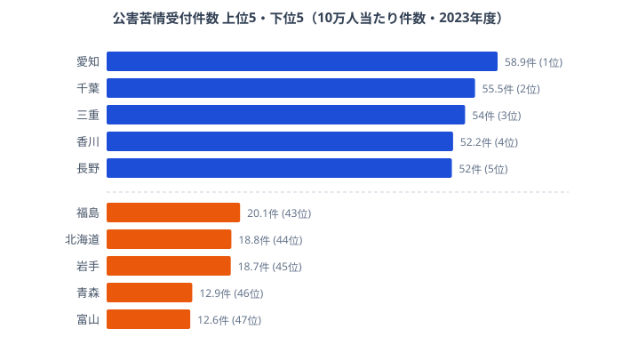

「工場が多い県ほど公害苦情が多い」──直感的にはそう思えますが、データはその反例を突きつけます。

ばい煙発生施設が全国最多（15,438件）の[北海道](/areas/01000)の公害苦情件数は、人口10万人当たり**18.8件で全国44位**です。一方、施設数が全国上位に入る[愛知県](/areas/23000)は苦情件数**58.9件で全国1位**でした。同じ「施設が多い県」でも、苦情件数は正反対の結果になっています。

公害苦情の地域差を生むのは施設数だけではありません。**人口密度×工場との距離×住民意識**の掛け算であることを、47都道府県のデータで読み解きます。

> [!NOTE]
> 公害苦情は大気汚染・水質汚濁・騒音・振動・悪臭・土壌汚染など多岐にわたります。件数が多い県が必ずしも「汚染がひどい」とは限らず、住民の意識の高さや行政窓口へのアクセスしやすさも反映します。本記事の苦情件数は人口10万人当たりに換算した値で、人口規模の差を取り除いた比較です。

## 公害苦情が多い県・少ない県（人口10万人当たり）

公害苦情が最も多いのは愛知県（58.9件/10万人）でした。2位の千葉県（55.5件）、3位の三重県（54.0件）と、中部・関東の工業県が上位を占めます。4位は香川県（52.2件）、5位は長野県（52.0件）と、意外にも四国や内陸県も上位に並びました。

一方、最も少ないのは[富山県](/areas/16000)（12.6件）です。青森県（12.9件・46位）、岩手県（18.7件・45位）、北海道（18.8件・44位）と、人口密度が低い地域が下位に連なります。トップの愛知県と最下位の富山県では**約4.7倍の差**があり、同じ日本の中で「公害苦情に触れる頻度」がこれだけ違うという事実が見えてきます。

ここで重要なのは、上位に並ぶのが必ずしも大工業地帯ではない点です。香川・長野・山梨といった、巨大コンビナートを持たない県が上位に食い込んでいます。逆に、産業の集積で知られる地域でも下位に沈む県があります。つまり、苦情件数のランキングは「工場の多さ」をそのまま映した地図ではないのです。なぜこのねじれが生まれるのかを、次に施設数のデータと突き合わせて確かめます。

<source-link href="/ranking/pollution-complaints-received-per-100k">公害苦情受付件数ランキングをもっと見る</source-link>

> [!TIP]
> 「苦情が少ない＝環境が良い」とは言い切れません。人口密度が低く居住地域と工場が離れていれば、汚染があっても苦情が届きにくくなります。逆に苦情が多い地域は「住民意識が高く、行政への申告が活発」という読み方も成り立ちます。順位を見るときは「件数」と「住民と汚染源の距離」をセットで考えるのがコツです。

<ad-slot></ad-slot>

## 汚染施設の集積──施設数では苦情の多さは説明できない

苦情の多寡を施設数で説明できるかを確かめるため、3種類の汚染施設数（ばい煙発生施設・一般粉じん発生施設・水質汚濁防止法上の特定事業場）を都道府県ごとに見ていきます。ここに、ランキングのねじれを生む構造が表れています。

- **北海道は施設数が圧倒的に多い**──ばい煙発生施設は15,438件で全国最多、一般粉じん発生施設も4,845件で全国最多です。大気系の汚染源は日本一の厚みがあります。それでも苦情は44位にとどまりました。広大な面積と低い人口密度のため、施設と住宅地が物理的に離れていることが効いています。
- **愛知県は3指標すべてが全国上位**──ばい煙4位（12,071件）・一般粉じん2位（4,790件）・水質汚濁2位（10,710件）と、大気系も水系も全方位で施設が密集します。しかも住宅地と工場が近接する住工混在の度合いが高く、施設の多さがそのまま苦情の多さに直結しました。
- **長野県は水質汚濁で全国1位**──特定事業場12,414件で日本一です。精密機械・電子部品・食品加工の工場が排水管理の対象となり、内陸県でありながら苦情5位に入った背景の一つになっています。
- **大阪府はばい煙が突出**──12,811件で全国2位ですが、一般粉じんは18位と指標によって偏りがあります。汚染源の種類が大気系に寄っているのが特徴です。

北海道と愛知県を並べると、構造の違いがはっきりします。北海道は「施設は最多だが住民から遠い」、愛知県は「施設も多く住民と近い」。施設数という同じ軸の上にいながら、住民との距離という第二の軸が苦情件数を真逆に振り分けているのです。施設の絶対数を数えるだけでは、どの県で苦情が増えるのかを言い当てられません。

<source-link href="/ranking/smoke-emission-facility-count">ばい煙発生施設数ランキングをもっと見る</source-link>

## 施設の多さ×住民との距離──逆転を生む「距離の法則」

施設数と苦情件数の関係を、4つのパターンに整理すると見通しがよくなります。横の軸を「大気汚染施設（ばい煙＋一般粉じん）の数」、縦の軸を「10万人当たり苦情件数」と考えてください。

- **施設が多く苦情も多い**──愛知・千葉・茨城。施設が多く、住民と工場が近接しているため苦情に直結します。住工混在が進んだ都市型工業県の典型です。
- **施設が多いのに苦情は少ない**──**北海道**。施設数は全国最多ですが、広い土地が緩衝材となり苦情は極めて少なくなります。逆転現象の主役です。
- **施設が少ないのに苦情が多い**──香川・山梨・沖縄。大気汚染施設が少ないのに苦情が多い県です。騒音・悪臭など、工業施設以外の公害が苦情を押し上げている可能性があります。
- **施設も苦情も少ない**──富山・青森・岩手。施設も少なく苦情も少ない「静かな県」で、下位グループを構成しています。

この整理が示す最大の発見は、**施設数の多さだけでは苦情の多寡を説明できない**という事実です。北海道が「施設は多いのに苦情は少ない」象限に位置するのは、工場と人口の距離を物語っています。人が住む場所と工場が離れていれば、施設がいくら多くても苦情は減ります。逆に、施設が少なくても住宅密集地に近ければ苦情は増えます。公害苦情の地図は、汚染源の地図ではなく「汚染源と暮らしが重なる場所」の地図なのです。

なお、同じ北陸でも福井県（45.4件）は富山県（12.6件）の約3.6倍の苦情件数でした。原子力関連を含む工場の集積度と、住民の近接度の違いが、隣り合う県の間にも差を生んでいます。

<source-link href="/ranking/water-pollution-control-law-facility-count">水質汚濁防止法特定事業場数ランキングをもっと見る</source-link>

> [!WARNING]
> 「苦情が多い＝汚染がひどい」という判断は慎重に行ってください。公害苦情には騒音・振動・悪臭なども含まれ、飲食店の臭いや建設工事の騒音など工業施設以外を発生源とする件も多数を占めます。また「施設が少ないのに苦情が多い」県の解釈はあくまで仮説であり、苦情の内訳（種類別）まで踏み込まないと断定はできません。工業の集積度だけで地域の環境水準を評価するのは適切ではありません。

<ad-slot></ad-slot>

## まとめ

公害苦情件数のランキングと汚染施設数の比較から、以下の構造が明らかになりました。

- 施設最多の北海道が苦情44位という逆転現象が起き、施設数と苦情件数は直結しませんでした
- 愛知が施設・苦情ともに全国上位なのは、住工混在（工場と居住地の距離が近い）が要因です
- 苦情の多寡は「人口密度×工場との距離×住民意識」の複合関数として理解できます
- 香川・山梨など施設が少ないのに苦情が多い県は、工業以外の騒音・悪臭が主因の可能性があります
- トップの愛知58.9件と最下位の富山12.6件で約4.7倍の差が開いています

住む場所を選ぶとき、公害リスクは治安・災害と同じく重要な判断軸です。工業地帯だけでなく、意外な県でも苦情が多いケースがある──データに基づいて、汚染源と暮らしの「距離」まで見て判断したいところです。

## データ出典

- [e-Stat 社会・人口統計体系](https://www.e-stat.go.jp/dbview?sid=0000010211) — 公害苦情受付件数・汚染施設数（2023年度）
