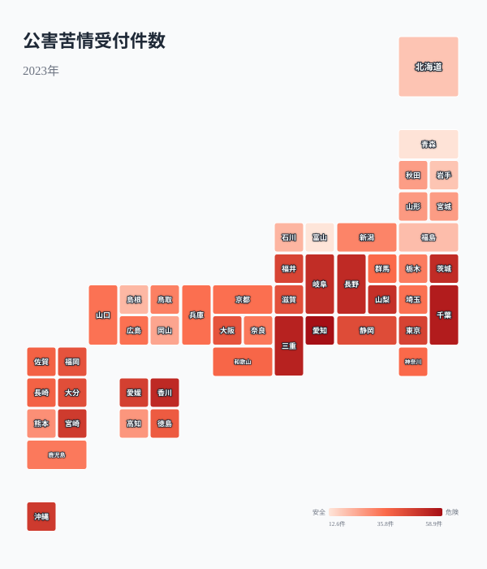
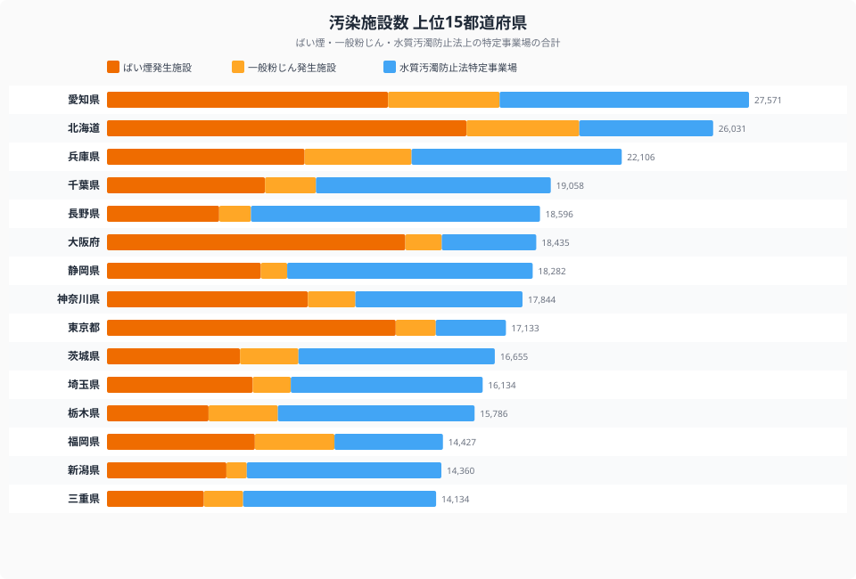
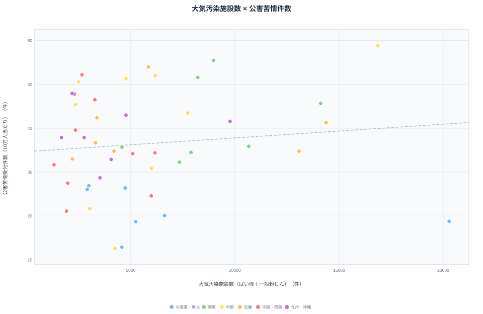

「工場が多い県ほど公害苦情が多い」──直感的にはそう思えますが、データはその反例を突きつけます。

ばい煙発生施設が全国最多（15,438件）の[北海道](/areas/01000)の公害苦情件数は、人口10万人当たり**18.8件で全国44位**。一方、施設数が3位以内に入る[愛知県](/areas/23000)は苦情件数**58.9件で全国1位**です。同じ「施設が多い県」でも、苦情件数は正反対の結果になっています。

公害苦情の地域差を生むのは施設数だけではない。**人口密度×工場との距離×住民意識**の掛け算であることを、47都道府県のデータで読み解きます。

> [!NOTE]
> 公害苦情は大気汚染・水質汚濁・騒音・振動・悪臭・土壌汚染など多岐にわたります。件数が多い県が必ずしも「汚染がひどい」とは限らず、住民の意識の高さや行政窓口へのアクセスしやすさも影響します。

## 公害苦情件数ランキング（人口10万人当たり）

<data-source url="https://www.e-stat.go.jp/dbview?sid=0000010211" label="e-Stat 社会・人口統計体系"></data-source>

**公害苦情が最も多いのは愛知県**（58.9件/10万人）。2位の千葉県（55.5件）、3位の三重県（54.0件）と、中部・関東の工業県が上位を占めます。4位は香川県（52.2件）、5位は長野県（52.0件）と、意外にも四国や内陸県もランクインしています。

一方、**最も少ないのは[富山県](/areas/16000)**（12.6件）。青森県（12.9件）、岩手県（18.7件）、北海道（18.8件）と、人口密度が低い地域が下位に並びます。1位の愛知県と47位の富山県では**約4.7倍の差**があります。

## 都道府県マップ──苦情の「地域パターン」

<data-source url="https://www.e-stat.go.jp/dbview?sid=0000010211" label="e-Stat 社会・人口統計体系"></data-source>

マップから3つのパターンが読み取れます。

- **中部・東海の濃い帯**──愛知・三重・岐阜・長野・山梨・静岡が軒並み濃色。中京工業地帯と内陸の精密機械産業が集積する一帯で苦情が多い
- **関東の千葉・茨城**──京葉工業地域と鹿島臨海工業地帯を抱える2県が突出して濃い
- **北海道・東北・北陸が薄い**──富山・青森・岩手・北海道が全国で最も低水準。人口密度の低さと工場との距離が苦情を抑えている

同じ北陸でも福井県（45.4件）は富山県（12.6件）の3.6倍。原子力関連施設を含む工場の集積度が地域差を生んでいます。

> [!TIP]
> 「苦情が少ない＝環境が良い」とは言い切れません。人口密度が低く居住地域と工場が離れていれば、汚染があっても苦情が届きにくくなります。逆に苦情が多い地域は「住民意識が高く、行政への申告が活発」という解釈も成り立ちます。

<ad-slot></ad-slot>

## 汚染施設の集積──ばい煙・粉じん・水質汚濁の比較

<data-source url="https://www.e-stat.go.jp/dbview?sid=0000010211" label="e-Stat 社会・人口統計体系"></data-source>

3種類の汚染施設数（ばい煙発生施設・一般粉じん発生施設・水質汚濁防止法上の特定事業場）を合計すると、都道府県の「汚染源の厚み」が見えてきます。

- **北海道が施設数トップ**──ばい煙15,438件＋粉じん4,845件で大気系が圧倒的に多い。しかし広大な面積と低い人口密度のため苦情は44位
- **愛知県は3指標すべてが上位**──ばい煙4位（12,071件）・粉じん2位（4,790件）・水質汚濁2位（10,710件）と、全方位で施設が密集
- **長野県は水質汚濁で全国1位**──12,414事業場。精密機械・電子部品・食品加工の工場が排水管理の対象に
- **大阪府はばい煙が突出**──12,811件で全国2位だが、粉じんは18位と偏りがある

## 大気汚染施設数 × 苦情件数──散布図で見る「距離の法則」

<data-source url="https://www.e-stat.go.jp/dbview?sid=0000010211" label="e-Stat 社会・人口統計体系"></data-source>

横軸にばい煙＋粉じんの大気汚染施設数、縦軸に10万人当たり苦情件数をとると、4象限の分布が見えてきます。

- **右上（施設多×苦情多）**: 愛知・千葉・茨城──施設が多く、住民と工場が近接しているため苦情に直結
- **右下（施設多×苦情少）**: **北海道**──施設数は全国最多だが、広い土地が緩衝材となり苦情は極めて少ない
- **左上（施設少×苦情多）**: 香川・山梨・沖縄──施設数が少ないのに苦情が多い。騒音・悪臭など施設以外の公害が影響
- **左下（施設少×苦情少）**: 富山・青森・岩手──施設も少なく苦情も少ない「静かな県」

この散布図の最大の発見は、**施設数の多さだけでは苦情の多寡を説明できない**という事実です。北海道が「右下」に位置するのは、工場と人口の距離を物語っています。人が住む場所と工場が離れていれば、施設がいくら多くても苦情は減ります。

> [!WARNING]
> 「苦情が多い＝汚染がひどい」という判断は慎重に。公害苦情には騒音・振動・悪臭なども含まれ、工業施設以外（飲食店の臭い・建設工事の騒音など）も多数を占めます。工業の集積度だけで地域の環境水準を評価することは適切ではありません。

<ad-slot></ad-slot>

## まとめ

公害苦情件数のランキング・汚染施設数との比較・大気汚染施設数と苦情件数の相関から、以下の構造が明らかになりました。

- **施設最多の北海道が苦情44位**という逆転現象──施設数と苦情件数は直結しない
- **愛知が施設・苦情ともに上位**なのは住工混在（工場と居住地の距離が近い）が要因
- 苦情の多寡は「**人口密度×工場との距離×住民意識**」の複合関数
- 香川・山梨など施設が少ないのに苦情が多い県は、工業以外の騒音・悪臭が主因の可能性

住む場所を選ぶとき、公害リスクは治安・災害と同じく重要な判断軸です。工業地帯だけでなく、意外な県でも苦情が多いケースがある──データに基づく判断が求められます。

## データ出典

- [e-Stat 社会・人口統計体系](https://www.e-stat.go.jp/dbview?sid=0000010211) — 公害苦情受付件数・汚染施設数（2023年度）

<source-link href="/ranking/pollution-complaints-received-per-100k">公害苦情受付件数ランキングをもっと見る</source-link>

<source-link href="/ranking/smoke-emission-facility-count">ばい煙発生施設数ランキングをもっと見る</source-link>

<source-link href="/ranking/general-dust-emission-facility-count">一般粉じん発生施設数ランキングをもっと見る</source-link>

<source-link href="/ranking/water-pollution-control-law-facility-count">水質汚濁防止法特定事業場数ランキングをもっと見る</source-link>

