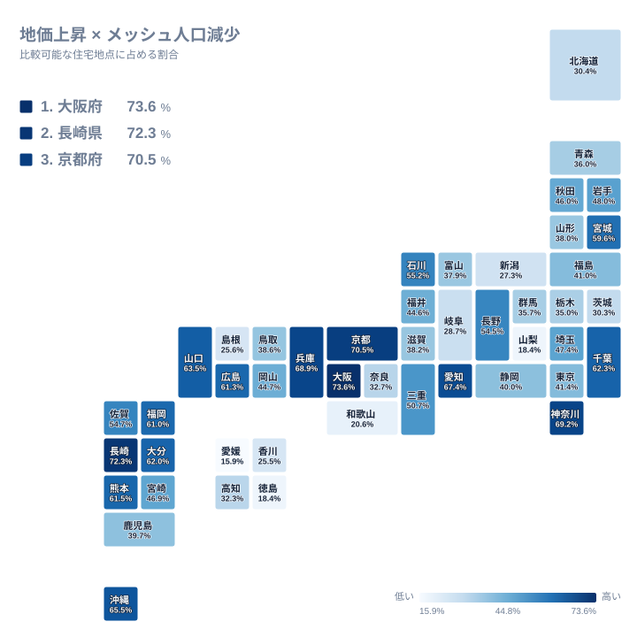
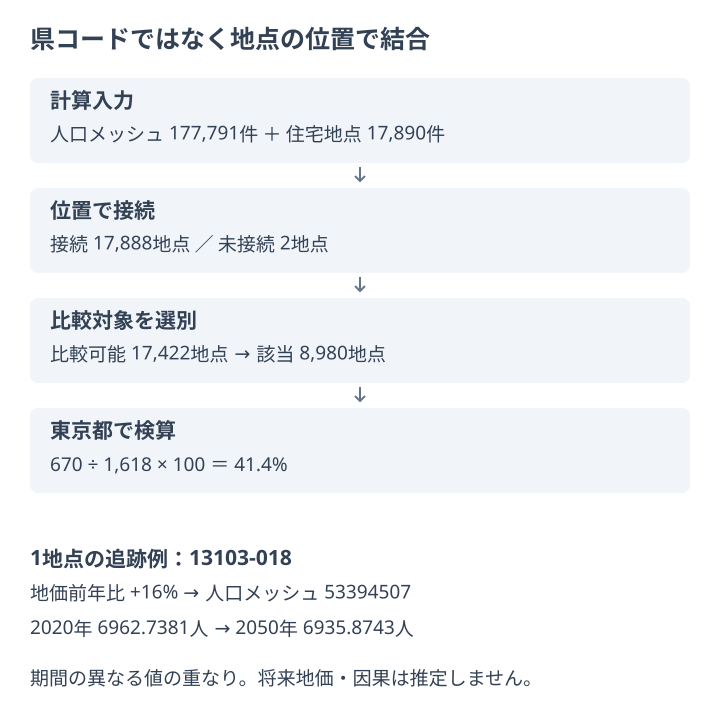

県全体の人口が増えるなら、その県の住宅地周辺も人口が増えるのでしょうか。東京都の人口メッシュを合計すると、2020年から2050年への増減率は+2.5%です。しかし、住宅地の標準地点を所在メッシュへ一つずつ結ぶと、足元の地価上昇と将来人口の減少推計が重なる地点は670件あります。比較可能な1,618地点の41.4%に当たります。

大切なのは「人口減少でも地価が上がる」という予測ではありません。県の合計で見た方向と、その地点が位置する約1km四方の人口変化は一致しない、という集計単位の違いです。この記事では県別中央値の併置をやめ、地価地点の座標と人口メッシュの境界を実際に照合した結果を読みます。

改稿では、従来の県別分類から地点の包含結合へ分析方法を変更しました。以前の県単位の結果と今回の地点割合は、同じ指標の更新値として比較できません。

## 全国の51.5%は「人口」ではなく比較可能地点の割合

<source-link href="/geo/population-land-price">人口メッシュと住宅地価地点を地図で重ねて確認する</source-link>

全国の比較可能な住宅地点は17,422件で、このうち8,980件が「2025年から2026年に地価が上昇し、所在メッシュの2050年人口が2020年を下回る」という条件に該当します。8,980÷17,422×100を小数第1位に丸めると51.5%です。これは県別割合の単純平均ではなく、全国の地点数を分子・分母にした値です。

たとえば沖縄県は119地点中78地点で65.5%、長崎県は159地点中115地点で72.3%です。比率の違いを見つけた後は、地図上でどの地点が該当するかを確認します。県内で一様に起きているのか、限られた市街地の地点へ偏っているのかでは、次に調べる範囲が変わるためです。県別図はその入口であり、県内の分布そのものは表示していません。

この分母を土地面積や居住人口へ置き換えてはいけません。標準地は住宅地の全区画を数えたものではなく、同じ人口メッシュに複数の地点が入ることもあります。その場合、各標準地をそれぞれ1地点として数えますが、メッシュ人口を地点数だけ重複加算する処理は行いません。地価調査の地点配置が異なれば、同じような人口分布でも地点割合は変わり得ます。

> [!NOTE]
> 51.5%は「住宅地の半分」や「人口の半分」を意味しません。地価公示の住宅標準地のうち、人口メッシュへ接続でき、前年比と基準年人口の条件を満たした地点が分母です。

## 座標を人口メッシュへ接続してから集計する

人口側の入力は国土交通省の1kmメッシュ別将来推計人口で、2020年人口と2050年推計人口を持つ177,791メッシュです。地価側は2026年地価公示から用途区分000の住宅地点17,890件を抽出しています。二つの県別集計を最後に結び付けるのではなく、まず住宅地点が同じ県のどの人口メッシュに入るかを位置で判定します。

境界の扱いも固定しています。配信用の小数6桁の座標で、西端と南端を含み、東端と北端を含まない範囲に地点を接続します。県コードは探索範囲を同じ県に限定するために使い、接続の根拠は地点座標とメッシュ境界です。対応するメッシュIDは元地点と同じ順番で保存し、接続できない地点は空値のまま残します。近いメッシュへ自動的に寄せる補完はしていません。

接続後、地価の前年比があり、所在メッシュの2020年人口が正である地点だけを比較します。ここから地価前年比が正、かつ2050年人口が2020年人口より小さい地点を数えます。判定は人口減少の大小を評価するものではないため、ごく小さな減少でも条件を満たします。割合だけで縮小の深刻さを比較せず、地図でメッシュごとの値に戻る必要があります。

背景地図は場所を理解するための補助表示で、今回の包含判定や割合の計算には使いません。利用者が道路や地形を見ながら位置を確かめることと、それらを説明変数として計算へ組み込むことは別です。[Geo分析の方法](/geo/method)では入力、空間演算、集計、検算を区別しています。

## 東京都の1地点から670地点の集計へ戻る

代表例として、東京都の住宅地点ID「13103-018」を追います。この地点の地価前年比は+16%で、対応する人口メッシュIDは「53394507」です。メッシュ人口は2020年が6,962.7381人、2050年が6,935.8743人なので、定義上は人口減少の条件を満たします。小数値はメッシュデータの配分・推計値であり、標準地の住人を実測した人数ではありません。

この地点は該当条件を満たす仕組みを確かめるための例です。価格が上がった理由を示す例でも、東京全体を代表する典型例でもありません。ここで確認できるのは、地点の前年比、接続先、接続先の人口変化という三つの根拠がそろい、同じ判定を再実行できることです。

東京都全体では1,663地点が接続され、未接続は0地点です。そのうち比較可能な1,618地点を分母にし、該当670地点を割ると41.4%になります。残る45地点を「非該当」として分母へ混ぜていません。県全体の人口増加だけを見てこの県を対象から外すと、こうした県内の組み合わせを見落とします。[東京都の途中データ](/geo/data/population-land-price/13)では、地点とメッシュの対応、件数、検算値へ戻れます。

> [!TIP]
> 自分の地域を見るときは、先に人口と地価の重ね合わせを確認し、その後に割合の分母を見てください。同じ割合でも、少数地点に基づく県と多数地点に基づく県では、調査地点の配置から受ける影響が異なります。

## 未接続と比較不能を隠さず残す

全国の17,890地点は、接続17,888地点と未接続2地点に分かれます。接続した地点のうち前年比欠測の466地点を除くと、比較可能17,422地点になります。今回の接続済み・前年比ありの地点では、2020年人口が0のため追加で除外される地点は0件でした。ただし、基準年人口0を除外する規則自体は保持しています。将来の更新で該当地点が現れても、比較可能と誤認しないためです。

新設標準地などの前年比欠測を0%に置き換えると、「値がない」が「上昇していない」に変わってしまいます。同様に、未接続地点を近隣メッシュへ無断で割り当てると、入力にはなかった対応関係を作ってしまいます。除外の数と理由を残すことは、見栄えのよい完全な表を作ることよりも、分析範囲を正確に示すために重要です。

県別途中データは47県分あり、各県の地点数、接続数、比較可能数、該当数と割合を全国集計へ照合しています。入力と出力のSHA-256も保存し、どの版で計算したかを追跡します。ただし、件数一致だけで位置判定の正しさを保証できるわけではありません。地点と境界の照合、元データの定義、適用条件の確認も必要です。

> [!WARNING]
> 地価は2025→2026年の変動、人口は2020→2050年の推計です。同じ期間の変化ではなく、人口減少が地価上昇を引き起こしたという因果関係も、2050年まで地価が上がり続けるという予測も示していません。

## この分析で分かること、追加で調べること

今回分かるのは、住宅標準地の足元の価格変化と、所在メッシュの長期人口推計がどう重なるかです。県単位の平均的な方向だけでは見えない地点集合を、次の調査範囲として絞り込めます。一方で、上昇理由、将来価格、個別住宅の居住人数、駅までの徒歩時間、生活利便性は測っていません。

理由を調べる場合には、標準地の継続性、住宅取引、用途地域、交通条件などを別に確認する必要があります。そうした追加情報をまだ使っていない段階で、観光需要や再開発を上昇理由として断定しません。また、地価公示はすべての不動産取引を表すものではないため、この地点割合を住宅購入・投資・移住先の推奨へ読み替えることもできません。

結論の割合だけでなく、元の地点、接続先メッシュ、比較不能の内訳まで確認できることが空間分析の価値です。全国の値を一つの順位へ縮めず、必要な地域の根拠へ戻って読むための入口として利用してください。

## データ出典

国土交通省[「1kmメッシュ別将来推計人口（R6国政局推計）」](https://nlftp.mlit.go.jp/ksj/gml/datalist/KsjTmplt-mesh1000r6.html) version 24、および[「地価公示（2026年）」](https://nlftp.mlit.go.jp/ksj/gml/datalist/KsjTmplt-L01-2026.html) version 26を使用し、stats47が住宅地点の抽出、包含結合、県別集計を行いました。入力の利用条件はCC BY 4.0です。e-Stat経由のランキング値は今回の計算に使用していません。

記事用データは2026年9月5日に生成されたGeo bundleのitem.json、manifest.json、47県のprefデータから同日に抽出しました。取得・抽出時刻、入力と県別ファイルのSHA-256、集計式は各図のsource.jsonに記録しています。人口推計と標準地選定の限界は上記のとおりです。
