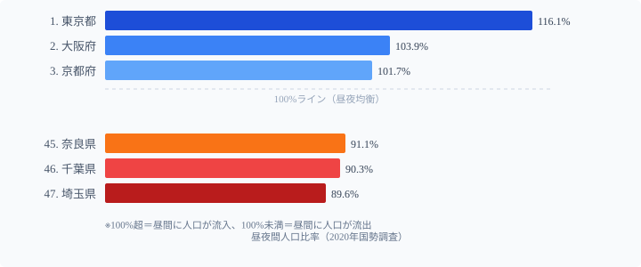

人口密度の話になると、必ず「東京が1位」で話が終わる。だが**本当に面白い発見は東京ではなく埼玉にある**。

可住地面積当たり人口密度で全国4位（2,816人/km²）の[埼玉県](/areas/11000)が、昼夜間人口比率では**89.6%で全国最下位**。これは毎日、埼玉の住民の約10%が昼間に[東京都](/areas/13000)方面へ流出することを意味します。「高密度に人が住んでいるが、昼間は誰もいない」という逆説が埼玉の実態です。

この記事では、可住地密度・総面積密度・DID人口比率・昼夜間人口比率の4指標を重ね合わせて、単純な「東京1位」では語れない日本の人口密度と都市構造の多様性を読み解きます。[人口・人口動態の都道府県統計一覧](/category/population)も合わせてご覧ください。

## 可住地面積当たり人口密度ランキング

**1位は東京都**（9,860人/km²）。2位大阪府（6,569人）を約1.5倍引き離し、3位神奈川県（6,261人）、4位埼玉県（2,816人）と続きます。上位3都府県が突出しており、4位以下との間に大きな断層があります。

**最も低いのは[北海道](/areas/01000)**（224人）。秋田県（283人）、岩手県（310人）と続きます。東京と北海道の差は**約44倍**ですが、この数字より埼玉の逆説のほうが人口密度の本質を見せてくれます。

> [!NOTE]
> 可住地面積とは、総面積から林野面積と湖沼面積を差し引いた面積です。山林が多い県では可住地が狭くなるため、総面積当たりの密度より高い値が出ます。東京と北海道の約44倍という開きは、可住地密度での比較です。

<source-link href="/ranking/population-density-habitable">可住地面積人口密度ランキング全47県</source-link>

## 総面積密度と可住地密度──順位が最大18位変わる県

「人口密度」には「総面積当たり」と「可住地面積当たり」の2種類があります。山林面積の比率が県によって大きく異なるため、**どちらを使うかで順位が最大18位入れ替わる**ケースがあります。

最も大きく「上昇」するのが**岐阜県**（総面積密度30位→可住地密度16位、+14）。県土の約8割が山林を占め、人口が可住地（岐阜盆地・濃尾平野西部）に集約されているため、可住地ベースで見ると密度が大きく跳ね上がります。同様に**山梨県**（31位→19位、+12）も甲府盆地に人口が集中しており、山地が多いほど可住地密度が押し上げられる構造です。

逆に最も「下降」するのが**[佐賀県](/areas/41000)**（16位→34位、-18）。佐賀平野が広く人口が分散するため、可住地ベースでは密度が希釈されます。**茨城県**（12位→26位、-14）も関東平野の広い可住地が密度を分散させる典型例です。[奈良県](/areas/29000)（総面積15位→可住地10位）や[京都府](/areas/26000)（10位→6位）も、可住地の少なさが密度を押し上げる例として挙げられます。

「山が多い県ほど可住地密度が高くなり、平地が広い県ほど可住地密度が下がる」──この構造を知らずに「人口密度が高い（低い）」と議論すると、同じデータを使っていても全く異なる結論になります。

## DID人口比率──「北海道が9位」という意外な発見

人口集中地区（DID）人口比率は、「人口密度4,000人/km²以上の地区が連たんし合計5,000人以上のエリア」に住む人の割合です。この指標が高いほど、人口が都市的な地域に集中していることを意味します。

東京（98.6%）・大阪（95.9%）・神奈川（94.7%）は住民のほぼ全員がDID内に居住する「超都市型」です。そして特筆すべきは**北海道が9位（76.0%）**という意外な事実。可住地密度は47位（224人/km²）で最下位なのに、DID比率は上位9位に入ります。広大な原野に人はおらず、札幌圏に人口が極端に集中している「集約型」の構造を示しています。

一方、**島根県は最下位（25.6%）**で、人口の4分の3が非DID地域に居住する「分散型」。注目は**茨城県（40.8%、35位）**で、可住地面積が広く人口密度は中位（726人/km²）ですが、DID比率は全国下位です。つくば研究学園都市のような拠点はあるものの、県全体では住宅が広く分散しており「密度は中程度だが都市集中度は低い」独自の構造を持っています。

> [!NOTE]
> DID（Densely Inhabited District：人口集中地区）は国勢調査で設定される統計上の地区です。2020年国勢調査では、全国のDID人口は約8,344万人で総人口の66.3%を占めます。

<source-link href="/ranking/densely-inhabited-district-population-density">人口集中地区人口密度ランキング</source-link>

## 埼玉が昼夜人口比率89.6%で全国最下位の理由

**埼玉県の昼夜間人口比率89.6%は全国最下位**です。可住地人口密度は全国4位（2,816人）と極めて高密度にもかかわらず、昼間には約10%の住民が東京方面へ流出します。千葉県（90.3%、46位）、奈良県（91.1%、45位）も同様で、「住む場所」と「働く場所」が分離した衛星都市の典型です。

対照的に**東京都の116.1%は全国唯一の110%超え**。夜間人口約1,400万人に対し昼間は約1,625万人と、毎日200万人以上が流入する圧倒的な「昼間都市」です。大阪（103.9%）・京都（101.7%）は100%をわずかに超え、周辺から昼間人口を引き付ける「準昼間都市」として機能しています。

なぜ埼玉が最下位になるのか。可住地密度4位の高密度な居住エリアにもかかわらず、大企業・商業施設・高次サービスが東京に集中しているため、毎朝住民が東京へ向かう構造が固定化されています。「人が住むだけの場所」として発展した埼玉は、高い住居密度と低い昼間人口比率という逆説を抱えています。これは埼玉だけでなく、東京の吸引力が強い関東圏のベッドタウン全体に共通する構造です。

> [!WARNING]
> 昼夜間人口比率の低さが「その地域の価値が低い」ことを意味するわけではありません。埼玉は子育て環境・住宅コスト・緑地面積で東京より優れた指標を持つ場合もあります。昼夜間人口比率は「就業地との距離」という1つの側面を示す指標にすぎません。

<source-link href="/ranking/day-time-population-ratio">昼夜間人口比率ランキング全47県</source-link>

## 4指標で分類する日本の都市構造5タイプ

4つの指標を組み合わせると、都道府県の都市構造は5タイプに分類できます。

**メガシティ型（東京・大阪）** は、可住地密度・DID比率・昼夜間比率のすべてが高く、昼間にさらに人口が流入してあらゆる都市機能が集中するタイプです。

**ベッドタウン型（埼玉・千葉・神奈川・奈良）** は、可住地密度・DID比率は高いが昼夜間比率は低い。住居としての密度は高いが、経済活動の中心はメガシティに依存します。埼玉は昼夜比率89.6%で最下位という典型例です。

**集約型（北海道・京都・福岡）** は、可住地密度は全体として低い（または中位）が、DID比率は高い。限られた都市エリアに人口が集約され、それ以外の地域は低密度のままです。

**分散型（茨城・佐賀・富山）** は、可住地密度が中程度でDID比率が低い。平地が広く住宅が分散しており、明確な都市中心部への集中が弱いタイプです。

**過疎型（島根・秋田・岩手）** は、すべての指標が低く、人口減少と高齢化が進み都市的集積が形成されにくい構造です。

> [!TIP]
> 移住先を検討する場合、人口密度だけでなく昼夜間人口比率を確認することで「日中の活気がある地域か」「ベッドタウン化した地域か」が分かります。昼夜比率が100%を超える地域は、昼間も活動が活発な「仕事・商業の中心地」に近い傾向があります。

## 「人口密度が高い」だけでは見えないもの

単純な人口密度ランキングは「東京が1位」という当たり前の事実を教えてくれるだけです。しかし4指標を重ねると、まったく異なる都市の姿が浮かび上がります。

- **埼玉**: 高密度に人が住むが昼間は誰もいない（可住地密度4位・昼夜比率47位）
- **北海道**: 人口密度最下位だが都市集中度は9位（分散と集約の逆説）
- **茨城**: 中程度の密度だがDID比率が低い（平地が広く都市集中度が薄い）
- **岐阜**: 総面積密度では30位なのに可住地密度では16位（山地が多く人が谷に集まる）

同じ「人口密度」という言葉でも、どの指標で測るかで全く異なる地域の姿が現れます。「人口密度が高い（低い）」という単純な評価は、地域理解の出発点にすぎません。複数の密度指標を重ね合わせることで初めて、各地域が「なぜそのような構造になっているのか」という構造的な問いに答えられます。

## データ出典

- 総務省統計局「国勢調査」(2020年)
- [e-Stat 政府統計の総合窓口](https://www.e-stat.go.jp/)（統計コード: 0000010201）
- 指標：可住地人口密度・DID人口比率・昼夜間人口比率・総面積人口密度
