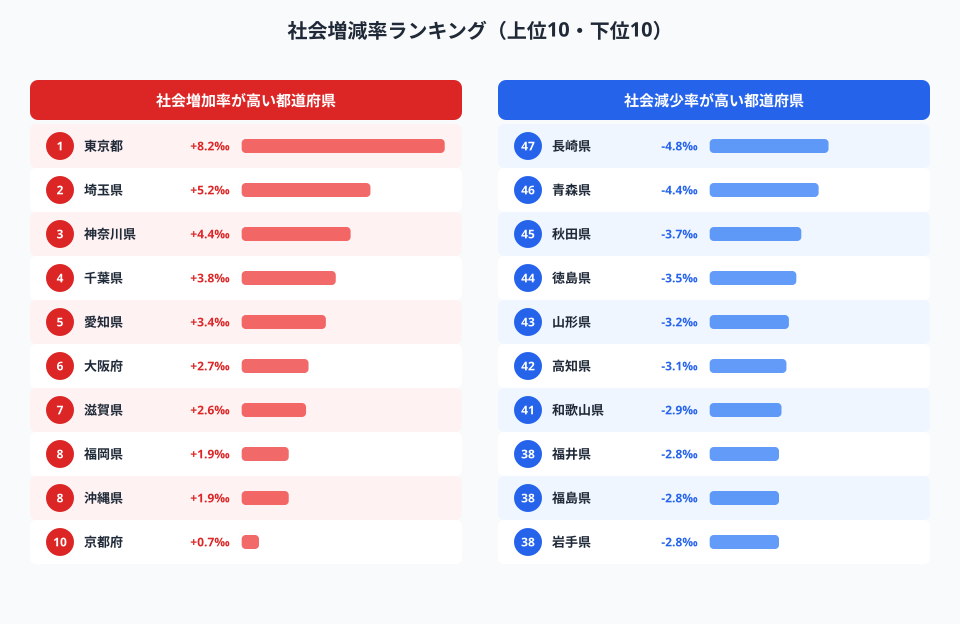
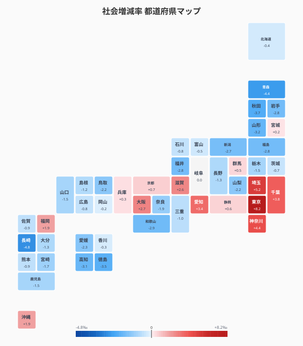
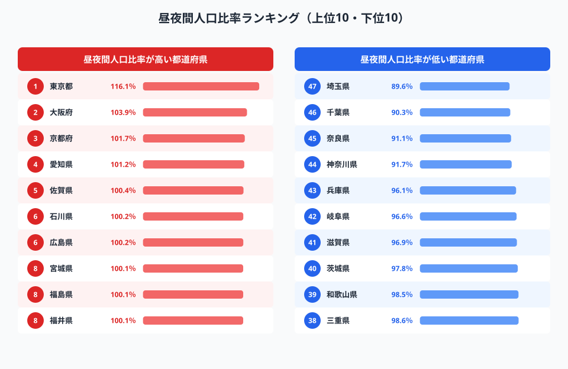
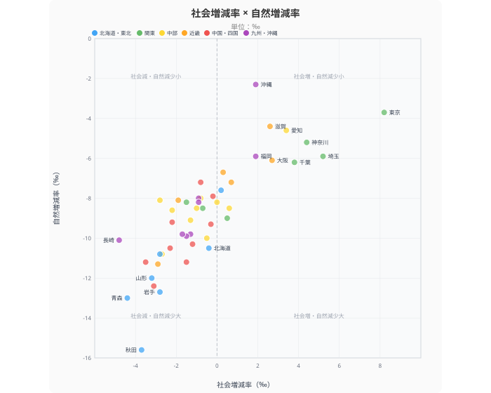

「地方から東京に人が集まりすぎている」──この問題を数字で正面から見ると、もっと複雑な構造が見えてきます。

転入超過率で全国2位（+0.34%）の[埼玉県](/areas/11000)は、昼夜間人口比率では**全国47位（89.6%）**。全国から人口を集めながら、自県の住民を毎日東京に送り出しているのです。「地方→首都圏3県→東京」という多段階の吸引構造が、東京一極集中の実態です。

そして見落とされがちな事実がもう1つ。**沖縄県を除く全都道府県が自然減（死亡超過）に転じています**。人口問題は「東京が奪う」だけではなく、日本全体が出生数で縮んでいる問題でもあります。

> [!NOTE]
> **社会増減率**は転入・転出の差を人口千人あたりで表した指標（‰）。プラスなら人口流入、マイナスなら人口流出を意味します。**自然増減率**は出生数と死亡数の差。人口変動は「社会増減＋自然増減」で決まります。

## 社会増減率ランキング──プラスはわずか14都府県

<data-source url="https://www.e-stat.go.jp/dbview?sid=0000010101" label="e-Stat 社会生活統計指標（人口・世帯）"></data-source>

**1位は[東京都](/areas/13000)の+8.2‰**。人口千人あたり8.2人が純増している計算です。+5.2‰の埼玉県を大きく引き離し、東京への人口集中が際立ちます。

上位には首都圏4都県（東京・埼玉・神奈川・千葉）が揃い踏み。愛知・大阪・福岡と三大都市圏＋福岡が続きますが、東京都の突出ぶりは別格です。

一方、**最も人口流出が激しいのは長崎県の-4.8‰**。青森県-4.4‰、[秋田県](/areas/05000)-3.7‰と東北・九州の県が下位に集中しています。

### 全国マップ

<data-source url="https://www.e-stat.go.jp/dbview?sid=0000010101" label="e-Stat 社会生活統計指標（人口・世帯）"></data-source>

マップで見ると、**赤く染まるのは太平洋ベルト上の大都市圏のみ**。日本列島の大部分が青色（人口流出）に覆われています。特に東北から日本海側、四国、九州にかけて濃い青が広がり、地方の空洞化が視覚的にも明らかです。

<source-link href="/ranking/social-increase-rate">47都道府県の社会増減率ランキングをもっと見る</source-link>

## 転入超過率で見る「勝ち組」と「負け組」

社会増減率と似た指標に**転入超過率**（転入者数 - 転出者数を人口比で算出、単位：％）があります。2023年のデータでは、転入超過（プラス）の都道府県は**わずか6つ**しかありません。

2023年の転入超過率でプラスは**東京・神奈川・埼玉・千葉・大阪・福岡の6都府県のみ**。**滋賀県はちょうど±0%の分水嶺**に立っています。残る40道府県はすべて人口が流出しており、東京一極集中の集約ぶりが際立ちます。

> [!WARNING]
> 社会増減率（2019年）と転入超過率（2023年）は指標の定義・年度・対象者範囲（外国人含否）が異なります。両者は同一時点での直接比較はできず、「14→6に減少」という因果的な解釈は不正確です。それぞれ独立した時点のデータとして読む必要があります。

> [!TIP]
> 社会増減率（‰、千人あたり）と転入超過率（%、百人あたり）はスケールが異なりますが、どちらも「転入 - 転出」を人口比で表す指標です。年度と対象者の範囲（日本人のみ or 外国人含む）が異なるため、単純比較には注意が必要です。

<source-link href="/ranking/moving-in-excess-rate">47都道府県の転入超過率ランキングをもっと見る</source-link>

<ad-slot></ad-slot>

## 昼夜間人口比率──「転入超過なのに昼間人口最下位」の矛盾

**転入超過率では2～4位の埼玉・神奈川・千葉が、昼夜間人口比率では最下位3県を占めます**。これが首都圏3県の「ベッドタウン矛盾」の実体です。転入超過率と昼夜間人口比率を並べると、その対照がよくわかります。

- **埼玉県**：転入超過率 +0.34%（2位）／ 昼夜間人口比率 89.6%（47位）
- **千葉県**：転入超過率 +0.08%（6位）／ 昼夜間人口比率 90.3%（46位）
- **神奈川県**：転入超過率 +0.31%（3位）／ 昼夜間人口比率 91.7%（44位）

首都圏3県は全国から人口を吸い上げながら、自県の住民を毎日東京に送り出しています。地方からの移住者を受け入れる「ベッドタウン」として機能し、最終的な労働力は東京に集約される構造です。

**東京都は116.1%で圧倒的1位**。常住人口の16%にあたる約220万人が、毎日他県から流入している計算です。103.9%の大阪府も同じ構造ですが、東京の突出度は段違いです。

<source-link href="/ranking/day-time-population-ratio">47都道府県の昼夜間人口比率ランキングをもっと見る</source-link>

## 社会増減率 × 自然増減率──「二重苦」の県はどこか

人口減少は「社会減（転出超過）」と「自然減（死亡超過）」の合計で決まります。この2つを散布図で重ねると、各県が直面する人口問題の深刻度が一目でわかります。

<data-source url="https://www.e-stat.go.jp/" label="e-Stat 社会生活統計指標"></data-source>

**秋田県は社会増減率-3.7‰ × 自然増減率-15.6‰という最悪の組み合わせ**。青森県も社会-4.4‰・自然-13.0‰、岩手県は社会-2.8‰・自然-12.7‰と深刻です。若者の流出が出生率をさらに押し下げ、人口減少が加速する負のスパイラルに陥っています。

注目すべきは、**沖縄県を除く全都道府県が自然減に転じている**点です。もはや「自然増」の県は事実上存在しません。社会増で人口を集めている東京都でさえ、自然増減率はマイナスです。

> [!WARNING]
> 社会増減率は2019年度、自然増減率は2024年のデータです。時点が異なるため厳密な比較には注意が必要ですが、構造的な傾向を把握する目的では有効です。

<source-link href="/ranking/population-growth-rate">47都道府県の人口増減率ランキングをもっと見る</source-link>

<ad-slot></ad-slot>

## まとめ

人口移動データから見えてきた東京一極集中の複層構造を整理します。

- **転入超過なのに昼夜間人口最下位の首都圏3県**──人口を集めながら毎日東京に送り出す「ベッドタウン矛盾」
- **転入超過はわずか6都府県、40道府県が人口流出中**（2023年）
- **全都道府県（沖縄除く）が自然減**──社会移動だけでなく、出生数の構造問題も深刻
- **秋田・青森・岩手などは社会減×自然減の「二重苦」**で人口減少が加速

東京一極集中は「東京が地方から人を奪う」という単純な構図ではありません。地方創生の処方箋は「東京からの分散」だけでは不十分で、各地域の産業基盤の強化、若者の定着策、出生率向上の三位一体で取り組む必要があります。

## データ出典

- [e-Stat 社会生活統計指標（人口・世帯）](https://www.e-stat.go.jp/dbview?sid=0000010101) — 社会増減率（2019年）、転入超過率（2023年）、昼夜間人口比率
