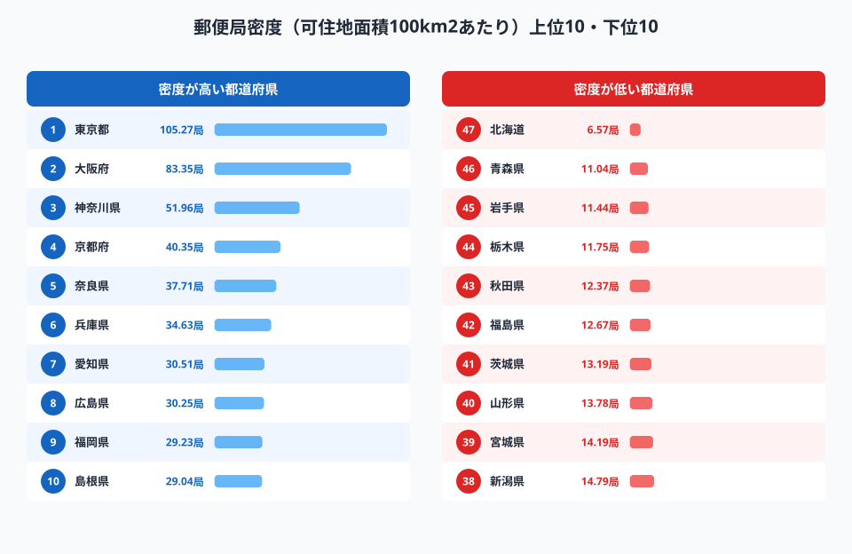
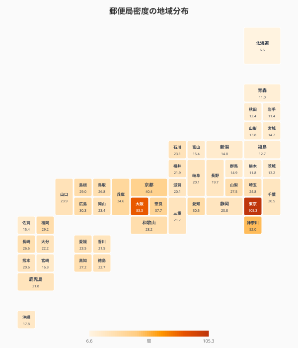
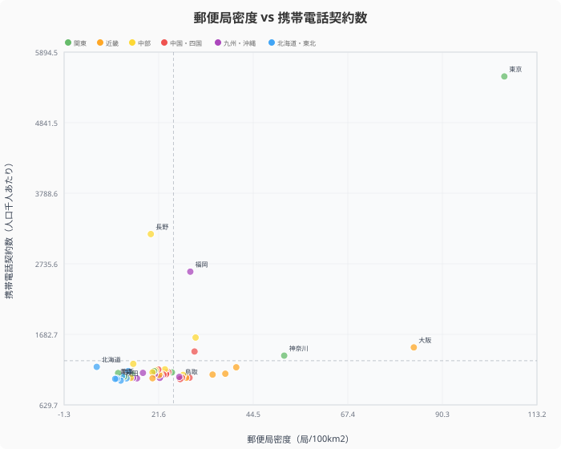

全国に約2万4千局ある郵便局は、コンビニエンスストア（約5万6千店）に次ぐ規模の公共的ネットワークです。しかし、その「密度」は都道府県によって大きく異なります。

可住地面積100km²あたりの郵便局数は、[東京都](/areas/13000)が **105.3局** で最高。対して[北海道](/areas/01000)は **6.6局** ──広大な可住地に郵便局が点在する構造です。しかしこの数値には注意が必要です。視点を変えると、見えてくる格差の姿は大きく変わります。

> [!NOTE]
> 「可住地面積」とは総面積から林野面積と湖沼面積を除いた面積で、人が住める土地の広さを示します。北海道は可住地面積でも全国最大であるため、面積あたり指標では不利になります。一方「人口あたり」に換算すると、過疎地域ほど人口が少なく分母が小さくなるため、郵便局数は相対的に高く出ます。

## 面積あたりランキング──大都市圏に集中する密度

<data-source url="https://www.e-stat.go.jp/dbview?sid=0000010208" label="e-Stat 社会・人口統計体系"></data-source>

面積あたりの郵便局密度上位は人口密度が高い大都市圏が独占しています。東京都（105.3局）、[大阪府](/areas/27000)（83.4局）、神奈川県（52.0局）の3都府県が突出し、京都府（40.4局）、奈良県（37.7局）と続きます。

下位は北海道（6.6局）、青森県（11.0局）、岩手県（11.4局）と、可住地面積が広いか人口密度が低い県が並びます。

### 面積→人口に換算すると逆転が起きる

面積あたりでは最下位近くの北海道や東北の県も、「人口1万人あたり郵便局数」に換算すると上位に並びます。過疎地域でも一定数の郵便局が維持されているため、人口が少ない分だけ人口比では高く出るのです。

これは郵便局が「ユニバーサルサービス」として採算性に関わらず設置を維持している公共インフラであることの表れです。都市の人から見れば「近くに何軒もある」郵便局が、地方では「町に1軒だけの重要な拠点」として機能しています。

<source-link href="/ranking/post-office-count-per-100km2">47都道府県の郵便局密度ランキングをもっと見る</source-link>

## 地域分布マップ──都市部に濃く、地方は薄い

<data-source url="https://www.e-stat.go.jp/dbview?sid=0000010208" label="e-Stat 社会・人口統計体系"></data-source>

マップでは三大都市圏（東京・大阪・名古屋周辺）が濃い色、北海道・東北・北関東が薄い色という明確なコントラストが浮かびます。四国や九州は中間的な密度を示しており、面積の割には郵便局が維持されていることがわかります。

<ad-slot></ad-slot>

## 郵便局 × 携帯インフラ──「二重不足」の地域

<data-source url="https://www.e-stat.go.jp/dbview?sid=0000010208" label="e-Stat 社会・人口統計体系"></data-source>

散布図では、郵便局密度と携帯電話契約数の相関は **都市部に限定的** です。東京都・大阪府・神奈川県では両指標が高いが、北海道（郵便局密度47位・携帯契約数9位）のように携帯は高密度でも郵便局が疎な県が存在し、全体の相関は弱い。散布図の第3象限（携帯契約数が少なく郵便局密度も低い）には青森県・鳥取県・島根県などが位置し、一部の地方県でアナログ・デジタル双方のインフラが薄いパターンが見て取れる。

この傾向が示すのは「大都市圏ではデジタル・アナログ双方のインフラが集積する」という都市集積の原理ですが、地方ではこの連動が崩れるケースがあります。

> [!WARNING]
> 散布図の第3象限に位置する一部の地方県では、郵便局密度と携帯契約数が共に低く、アナログとデジタルの両面でインフラが薄い状態が見られます。ただし相関全体は弱く、「二重不足」が全地方に当てはまるわけではありません。高齢者が多い過疎地ほど、この二重の不利益を受けやすい構造に注意が必要です。

<source-link href="/ranking/mobile-phone-contract-count-per-1000">47都道府県の携帯電話契約数ランキングをもっと見る</source-link>
<source-link href="/ranking/transport-communication-expenditure-ratio-multi-person-households">47都道府県の交通・通信費割合ランキングをもっと見る</source-link>

## 過疎地の「最後のインフラ」として担う役割

郵便局密度が低い地域では、郵便局が金融・行政・コミュニティの三機能を同時に担う。

**金融窓口**：メガバンクATMすら採算が合わない中山間地域では、ゆうちょ銀行の窓口ATMが唯一の出入金手段となる。例として岩手県西和賀町では、2019年に民間銀行の最後の支店が撤退後、町内で現金を引き出せる場所が郵便局のみとなった（地元紙報道）。郵便局密度が下位10県（北海道・岩手・青森など）に集中するのはこうした地理的事情による。

**行政サービス代行**：住民票交付やマイナンバーカード関連手続きなど、窓口機能を担う局が増えている。高齢者にとってデジタル手続きの代替として機能する。

**地域見守り**：全戸訪問する配達員が孤独死・安否確認の一線として機能する。行政支所の統廃合が進む過疎地ほど、この役割は大きくなっている。

> [!TIP]
> 郵便局の役割を考えるとき、「局数が多いか少ないか」だけでなく「その地域において代替できる施設が他にあるか」という視点が重要です。東京では郵便局がなくてもコンビニのATMや行政窓口が代替できますが、過疎地では郵便局が消えると文字通り「何も残らない」地域があります。

<ad-slot></ad-slot>

## まとめ：「密度」の裏に「機能」がある

郵便局の数は、単なる施設密度の統計ではありません。

- **面積あたり**では大都市が高密度（東京105.3局）、地方が低密度（北海道6.6局）
- **人口あたり**に換算すると地方が逆転──過疎地で1局が担う人口は少ない
- **散布図から**、一部の地方県でアナログ・デジタル双方のインフラが薄いパターンが見られる
- 金融・行政・コミュニティという3つの機能を担う「最後の窓口」としての役割

郵政民営化以降、不採算局の統廃合が議論されてきましたが、ユニバーサルサービス義務がある限り安易な閉局は困難です。デジタル化が進む時代でも、「物理的な通信・金融拠点」としての郵便局の役割はすぐには消えません。むしろインフラが複合的に薄い地域ほど、郵便局の存在意義は高まっています。

## データ出典

- e-Stat 社会・人口統計体系（ICT関連）: https://www.e-stat.go.jp/dbview?sid=0000010208
